# RAG v2 System Flow

Source-verified: 2026-06-02 from GitNexus repo `GR`, `src/RAG_v2/ARCHITECTURE.md`, and all `src/RAG_v2/*/MODULE.md` files.

## Scope

This file describes the complete runtime and ingestion flow for `D:\GR\src\RAG_v2`.

Main collections:

- `ctdt`: curriculum, majors, courses, credits, prerequisites.
- `quydinh`: regulations, scholarships, graduation, foreign-language rules.
- `kehoach`: plans, notices, schedules, deadlines.
- `stsv`: student support handbook, forms, procedures.
- `test`: upload/dev collection.

## 1. Whole-System Runtime Flow

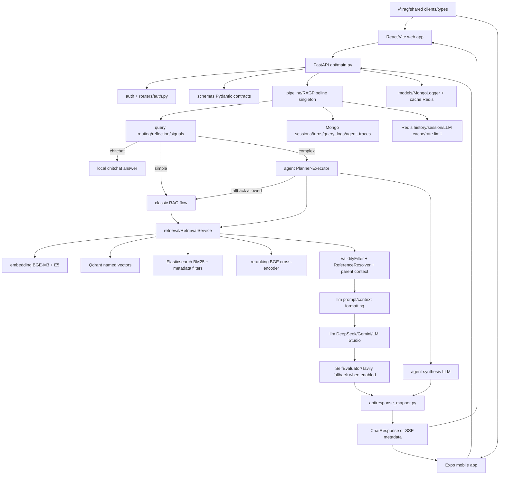

## 2. FastAPI Startup Flow

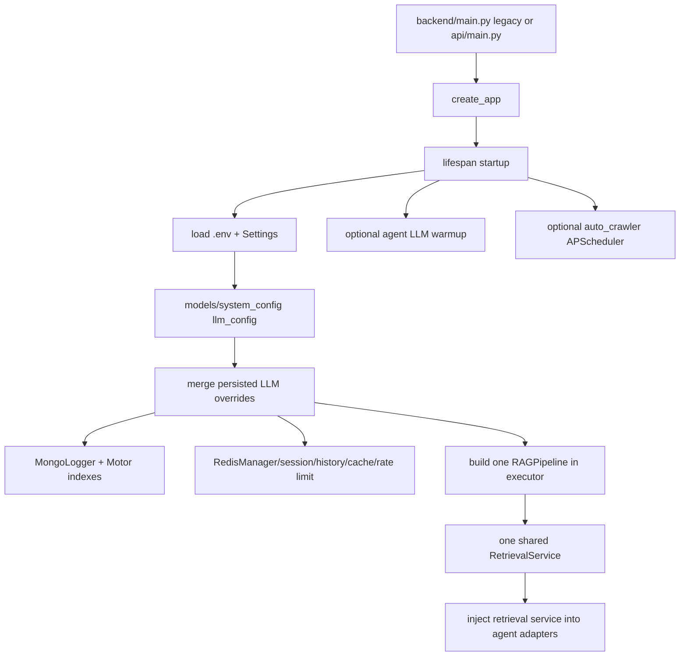

Important boundary: `RAGPipeline` owns one `RetrievalService`; agent adapters should use that same shared runtime. Current source stores it as `_retrieval_service`, while some diagnostic routes still look for `service`/`retrieval_service`.

## 3. Chat Request Flow

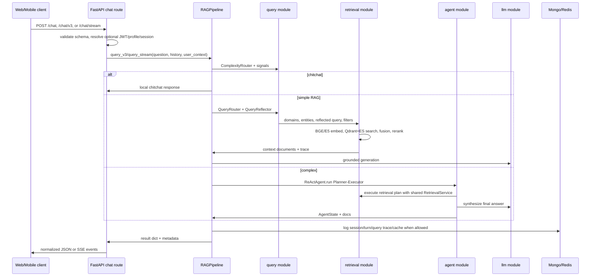

## 4. Classic RAG Flow

```mermaid
flowchart TD
  Question["question + history + profile"] --> CacheRead["query-only cache when safe"]
  CacheRead --> Route["QueryRouter domain route"]
  Route --> Select["CollectionSelector target collections"]
  Select --> Reflect["QueryReflector rewrite/entities"]
  Reflect --> Filters["metadata filters: major/cohort/date/freshness"]
  Filters --> Variants["query variants/comparison subqueries"]
  Variants --> Embed["BGE + E5 query embeddings"]
  Embed --> Search["MultiCollectionSearch"]
  Search --> Retry["relaxed retry when empty"]
  Retry --> Siblings["optional sibling expansion before rerank"]
  Siblings --> Rerank["BGE reranker with fallback to raw fusion"]
  Rerank --> HyDE["HyDE fallback when recall is poor"]
  HyDE --> Validity["ValidityFilter"]
  Validity --> References["ReferenceResolver"]
  References --> Parent["parent context expansion"]
  Parent --> WebPre["optional pre-generation Tavily enrichment"]
  WebPre --> Context["context formatting + profile note"]
  Context --> Generate["LLM generate"]
  Generate --> SelfEval["optional self-eval"]
  SelfEval --> WebPost["optional Tavily regeneration"]
  WebPost --> CacheWrite["write cache only for stable local answers"]
  CacheWrite --> Result["answer + sources + trace metadata"]
```

## 5. Agent Flow

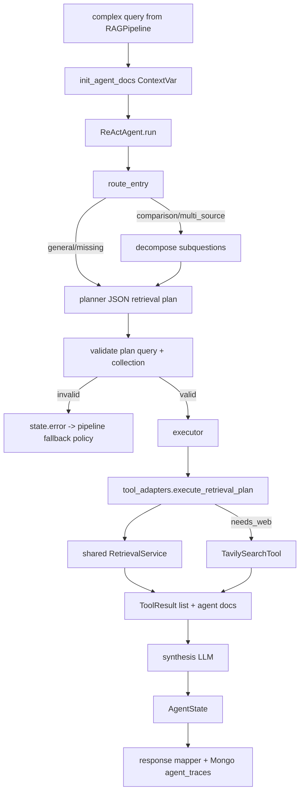

## 6. Retrieval Flow

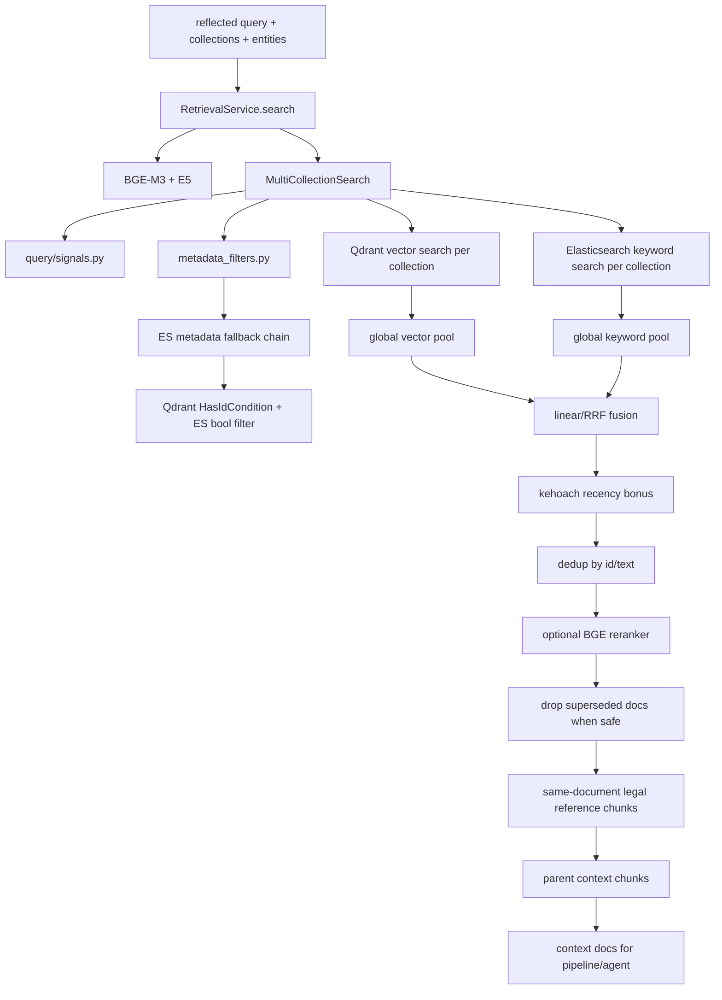

## 7. Admin Document Upload Flow

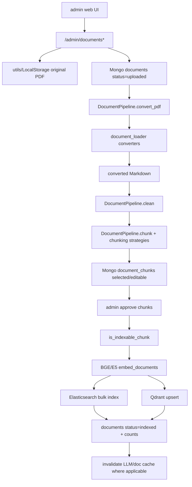

Status lifecycle:

```text
uploaded -> converting -> converted -> cleaning -> cleaned
-> chunking -> chunked -> embedding -> indexed
```

## 8. Crawler Review/Index Flow

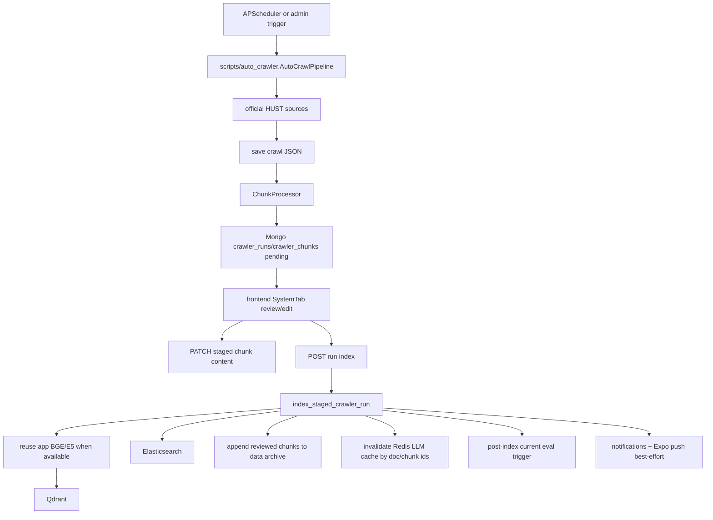

Current supported crawler targets include `kehoach` and `quydinh`.

## 9. Auth And Session Flow

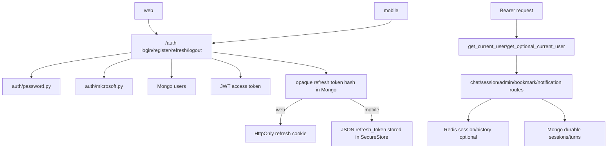

## 10. Client Flow

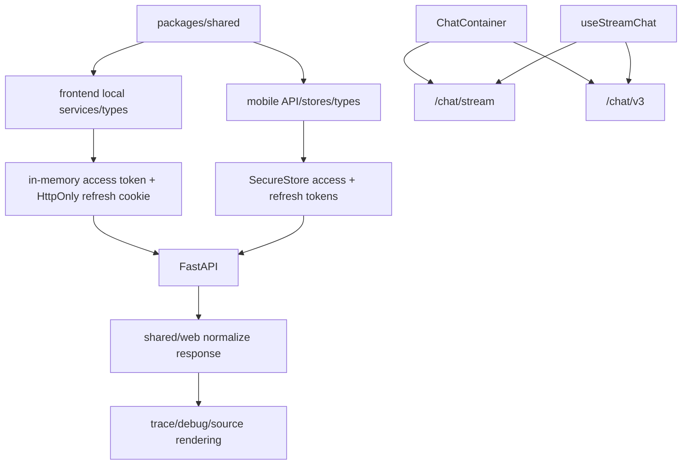

## 11. Evaluation Flow

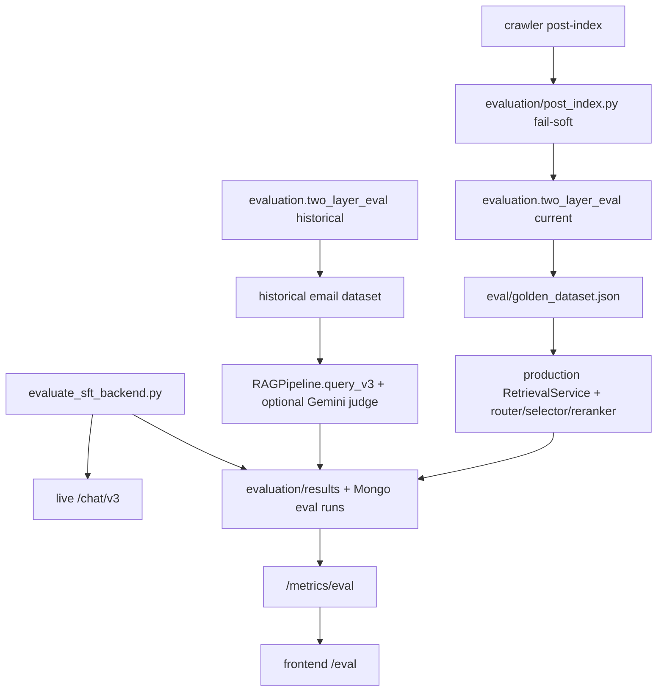

## 12. Module Boundary Summary

| Module | Owns | Talks to |
| --- | --- | --- |
| `api` | FastAPI app, routes, response mapping, middleware | `auth`, `pipeline`, `models`, `cache`, `schemas`, clients |
| `auth` + `routers` | JWT, refresh tokens, OAuth, RBAC, auth routes | `models`, `schemas`, web/mobile |
| `pipeline` | chat RAG orchestration and admin document pipeline | `query`, `retrieval`, `agent`, `llm`, `models`, `cache` |
| `query` | complexity/domain routing, reflection, entities, structured query | `pipeline`, `retrieval`, `evaluation` |
| `retrieval` | Qdrant/ES search, fusion, filters, validity/reference/parent context | `embedding`, `reranking`, `data`, `pipeline`, `agent` |
| `agent` | Planner-Executor graph for complex questions | `pipeline`, `retrieval`, `tools`, `llm`, `api` |
| `llm` | provider wrappers, prompt messages, self-eval | `pipeline`, `agent`, `config` |
| `tools` | Tavily adapter | `retrieval` runtime wiring, `pipeline`, `agent` |
| `models` | Mongo persistence models/logging/config | `api`, `auth`, `pipeline`, `scripts` |
| `cache` | optional Redis session/history/LLM cache/rate limit | `api`, `pipeline`, `models`, `scripts` |
| `chunking` + `document_loader` | conversion/chunking/metadata production | `pipeline`, `scripts`, `retrieval`, `data` |
| `scripts` | crawler/indexing/maintenance CLIs | `data`, `embedding`, `retrieval`, `models`, `cache`, `evaluation` |
| `frontend` | web UX and admin/trace views | `api`, `schemas`, `packages/shared` |
| `mobile` | Expo/native UX and mobile auth/storage | `api`, `packages/shared` |
| `packages` | shared TS API clients/types/normalizers | web, mobile, backend route/schema contracts |
| `evaluation` + `eval` | regression/eval runners and artifacts | runtime stack, API metrics, frontend eval dashboard |

## 13. Known Flow Cautions

1. `/retrieval/search` currently looks for `pipeline.service`, while `RAGPipeline` stores `_retrieval_service`.
2. `api/main.py` auto-crawler reuse checks may also expect a public retrieval-service property.
3. `/sessions` and `/sessions/me` are produced by router prefix/path composition in `api/routes/session.py`; keep contract tests around this.
4. Streaming chat runs retrieval before streaming tokens and intentionally skips post-generation self-eval/Tavily fallback.
5. Redis is fail-soft and should never be the only durable store.
6. Agent class name is `ReActAgent`, but runtime behavior is Planner-Executor.
