# HUST Academic Chatbot — System Architecture

> Hệ thống chatbot học vụ Đại học Bách khoa Hà Nội, sử dụng RAG, Hybrid Search và LangGraph Agent.

## 1. Tổng Quan Hệ Thống

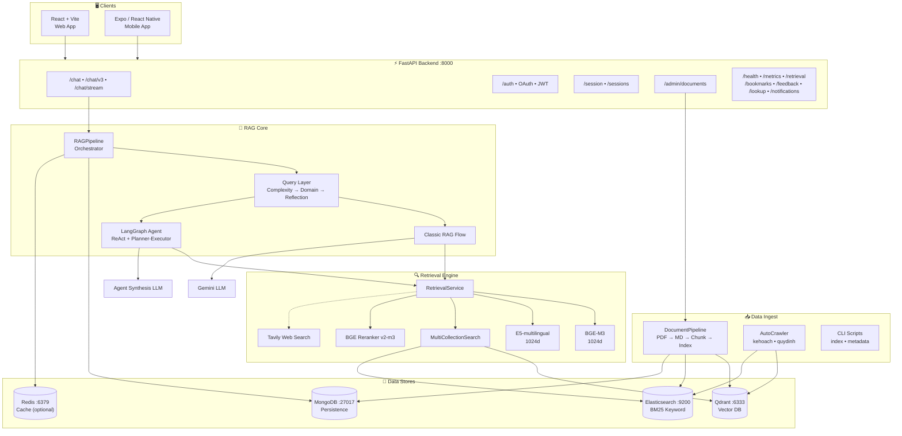

---

## 2. Cấu Trúc Thư Mục

```text
GR/
└── src/RAG_v2/
    ├── api/                    # FastAPI app, routes, middleware, response mapper
    ├── auth/                   # JWT, Microsoft OAuth, password, RBAC
    ├── pipeline/               # RAGPipeline, flows.py, DocumentPipeline
    ├── query/                  # ComplexityRouter, DomainClassifier, Reflector, Decomposer
    ├── retrieval/              # Qdrant, Elasticsearch, hybrid search, filters, resolver
    ├── embedding/              # BGE-M3, E5, ensemble embedders
    ├── reranking/              # BGE cross-encoder reranker
    ├── llm/                    # Gemini, LM Studio, prompts, self-eval
    ├── agent/                  # LangGraph ReAct + planner-executor
    ├── models/                 # MongoDB models, MongoLogger
    ├── schemas/                # Pydantic API contracts
    ├── cache/                  # Redis session, history, LLM cache, rate limiter
    ├── tools/                  # Tavily web search adapter
    ├── config/                 # Settings (load from .env)
    ├── chunking/               # Legal, curriculum, STSV, kehoach chunkers
    ├── document_loader/        # PDF/Docx → Markdown
    ├── scripts/                # Crawlers, indexers, metadata tools
    ├── data/                   # Domain datasets (ctdt, quydinh, kehoach, stsv)
    ├── frontend/chat-companion/# React web app
    ├── mobile/                 # Expo mobile app
    ├── packages/shared/        # Shared TS types, API clients, Zustand stores
    ├── eval/, evaluation/      # Golden datasets, evaluation runners
    └── docker-compose.yml      # Local infra
```

---

## 3. Flow 1: Backend Startup

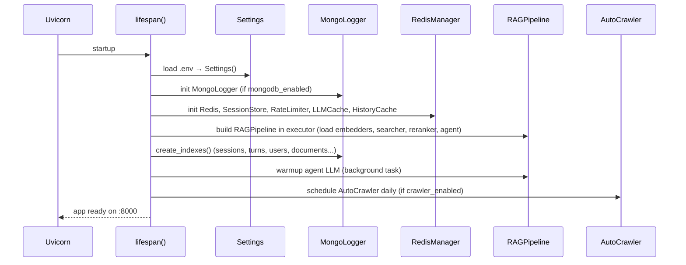

---

## 4. Flow 2: Chat Request Processing (Tổng Quan)

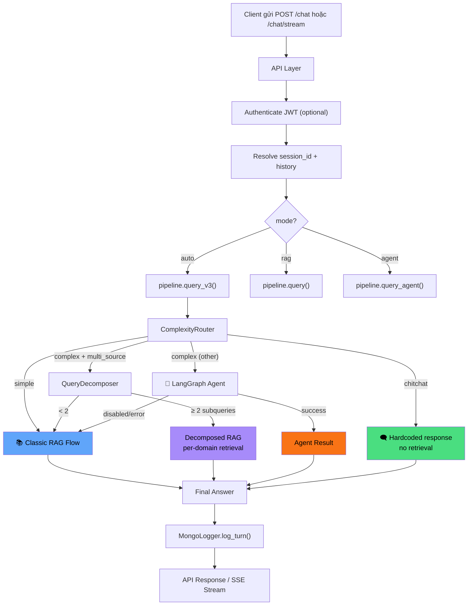

---

## 5. Flow 3: Query Processing Layer (Chi Tiết)

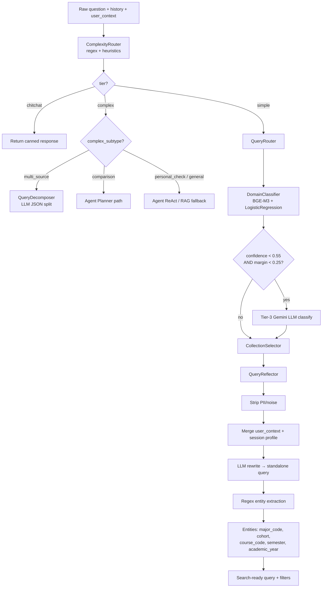

---

## 6. Flow 4: Classic RAG Flow (Chi Tiết)

```mermaid
flowchart TD
    Q["Question + history"] --> TRIM["Trim history theo limit"]
    TRIM --> ROUTE["QueryRouter + domain routing"]
    ROUTE --> P0{"P0 query-only<br/>cache hit?"}
    P0 -->|"hit"| RET_CACHE["Return cached answer"]
    P0 -->|"miss"| REFLECT["QueryReflector.reflect()"]

    REFLECT --> ENTITY["Entity fallback extraction"]
    ENTITY --> SELECT["CollectionSelector<br/>chọn collections đích"]
    SELECT --> NORM["Normalize query<br/>expand comparison subqueries"]

    NORM --> EMBED["Embed: BGE-M3 + E5"]
    EMBED --> SEARCH["MultiCollectionSearch"]

    subgraph HybridSearch["Hybrid Search Engine"]
        SEARCH --> META["ES metadata pre-filter<br/>fallback chain"]
        META --> PAR["ThreadPoolExecutor<br/>per collection"]
        PAR --> QD["Qdrant vector search<br/>(BGE + E5 weighted)"]
        PAR --> KW["ES BM25 keyword search"]
        QD --> FUSE["Min-max score fusion<br/>vector 0.8 + keyword 0.2"]
        KW --> FUSE
    end

    FUSE --> EMPTY{"Kết quả rỗng?"}
    EMPTY -->|"yes"| RETRY["Retry chain:<br/>1. decomposed query<br/>2. disable quydinh filter<br/>3. all collections<br/>4. relaxed comparison"]
    EMPTY -->|"no"| DEDUP["Dedup by id/text"]
    RETRY --> DEDUP

    DEDUP --> RERANK["BGE Reranker<br/>cross-encoder scoring"]
    RERANK --> THRESH["Filter by threshold<br/>before top-k cut"]
    THRESH --> VALID["ValidityFilter<br/>drop superseded docs"]
    VALID --> REFS["ReferenceResolver<br/>insert Điều/khoản refs"]

    REFS --> P2{"P2 doc-aware<br/>cache hit?"}
    P2 -->|"hit"| RET_CACHE
    P2 -->|"miss"| CTX["Format context<br/>budget: 12k/24k chars"]

    CTX --> GEN["Gemini LLM generate"]
    GEN --> WRITE["Write P2 + P0 cache"]
    WRITE --> EVAL{"Self-eval enabled<br/>AND top_score < 0.72?"}
    EVAL -->|"fail"| TAV["Tavily web search<br/>+ regenerate"]
    EVAL -->|"skip/pass"| FINAL["✅ Final answer"]
    TAV --> FINAL
```

---

## 7. Flow 5: Hybrid Retrieval (Chi Tiết)

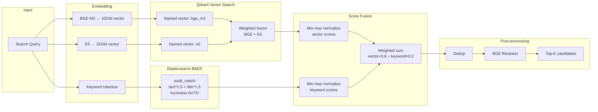

**Metadata Pre-filter theo Collection:**

| Collection | Filter | Fallback |
|---|---|---|
| `ctdt` | `major_code`, fuzzy `major_name` | generic/null |
| `quydinh` | `applicable_cohort`, `applicable_major` | no filter |
| `kehoach` | `date_str` month/year wildcard | no filter |
| `stsv` | Không pre-filter | — |

---

## 8. Flow 6: LangGraph Agent

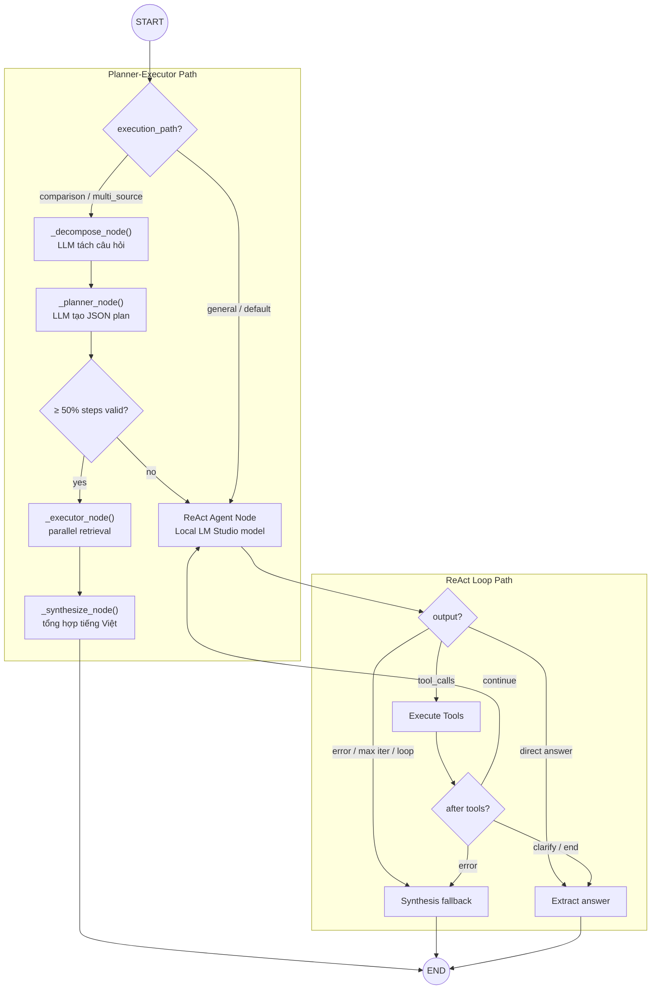

**Agent Tools:**

| Tool | Mô tả |
|---|---|
| `rag_search` | Tìm kiếm 1 collection nội bộ |
| `web_search` | Tavily fallback cho dữ liệu thiếu/mới |
| `clarify_question` | Hỏi lại user khi query mơ hồ |

---

## 9. Flow 7: SSE Streaming

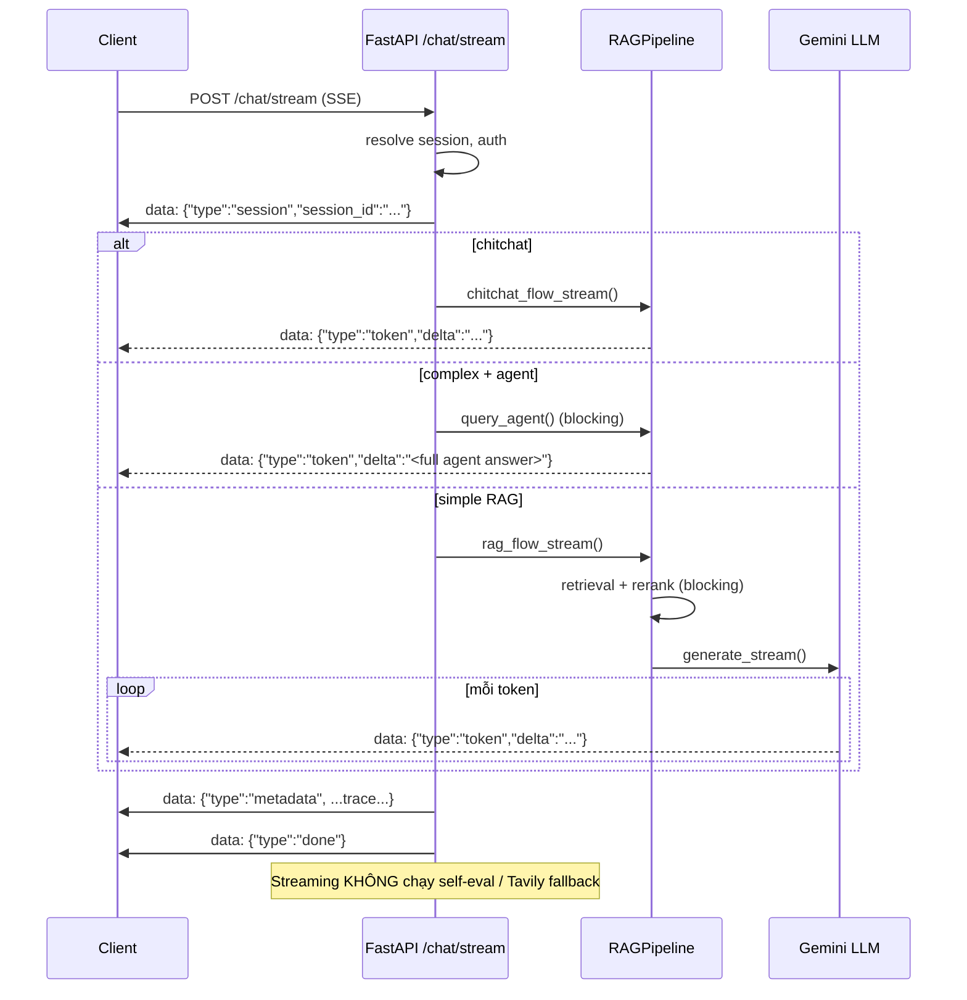

---

## 10. Flow 8: Authentication

```mermaid
flowchart TD
    subgraph MSAuth["Microsoft OAuth Flow"]
        A1["Client → GET /auth/login"] --> A2["Redirect → Microsoft"]
        A2 --> A3["User đăng nhập @sis.hust.edu.vn"]
        A3 --> A4["GET /auth/callback"]
        A4 --> A5["Exchange code → validate email"]
        A5 --> A6["Parse HUST metadata<br/>(student_id, cohort, major)"]
        A6 --> A7["Upsert MongoDB user"]
        A7 --> A8["Issue JWT → redirect frontend"]
    end

    subgraph Manual["Manual Auth"]
        B1["POST /auth/register"] --> B2["Create user + hash password"]
        B3["POST /auth/login"] --> B4["Verify → Issue JWT"]
    end

    subgraph Protected["Protected Routes"]
        C1["Bearer JWT in header"]
        C1 --> C2["Decode → get user_id, role"]
        C2 --> C3{"role?"}
        C3 -->|"student"| C4["Normal access"]
        C3 -->|"admin"| C5["Admin routes enabled"]
    end
```

---

## 11. Flow 9: Admin Document Upload

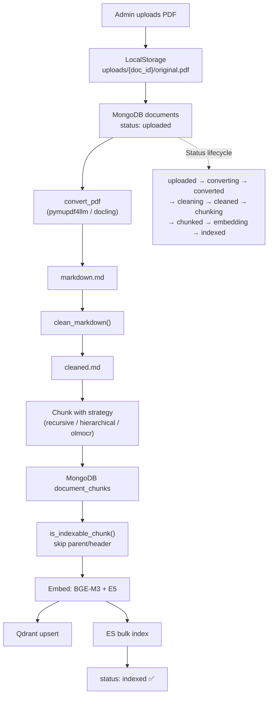

---

## 12. Flow 10: Auto Crawler

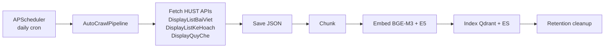

---

## 13. Persistence & Cache

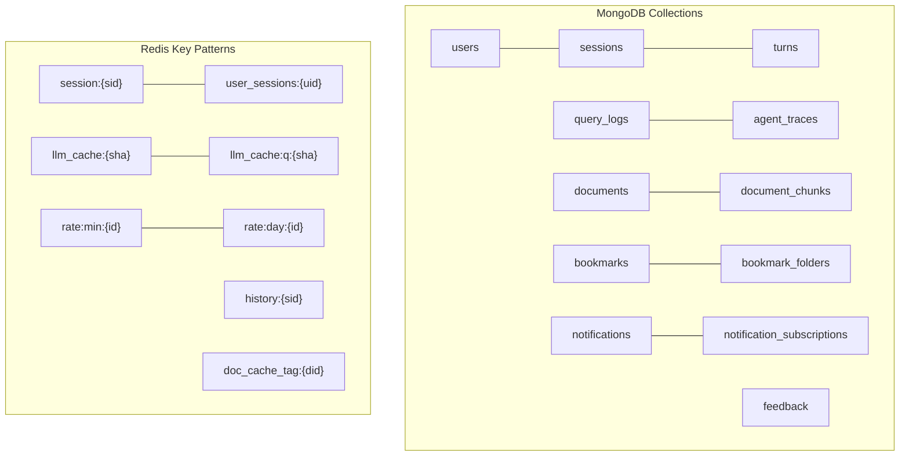

---

## 14. Technology Stack

| Layer | Công nghệ |
|---|---|
| **API** | FastAPI + SSE, Uvicorn |
| **Orchestration** | `pipeline/rag_pipeline.py`, `pipeline/flows.py` |
| **Agent** | LangGraph StateGraph, LangChain tools |
| **Vector Search** | Qdrant (named vectors: `bge_m3` + `e5`, 1024d, cosine) |
| **Keyword Search** | Elasticsearch BM25, ICU analyzer |
| **Embedding** | `BAAI/bge-m3` + `intfloat/multilingual-e5-large` |
| **Reranking** | `BAAI/bge-reranker-v2-m3` cross-encoder |
| **Main LLM** | Gemini (OpenAI-compatible endpoint) |
| **Agent Tool LLM** | LM Studio local (qwen2.5-7b-instruct) |
| **Persistence** | MongoDB (Motor async + MongoLogger sync) |
| **Cache** | Redis (optional: session, history, LLM cache, rate limit) |
| **Web Frontend** | React + Vite + TanStack Query + shadcn/Radix UI |
| **Mobile** | Expo/React Native + `@rag/shared` + SecureStore + MMKV |
| **Infra** | Docker Compose (Qdrant, ES, MongoDB, Redis) |

---

## 15. Data Sources

| Collection | Nội dung | Filter chính |
|---|---|---|
| `ctdt` | Chương trình đào tạo, môn học, tín chỉ | `major_code`, `major_name` |
| `quydinh` | Quy chế, quy định học vụ, học bổng | `applicable_cohort`, `applicable_major` |
| `kehoach` | Kế hoạch học kỳ, lịch, thông báo | `date_str` |
| `stsv` | Sổ tay sinh viên, thủ tục, biểu mẫu | Không pre-filter |

---

## 16. Local Development

```bash
cd src/RAG_v2

# Start infrastructure
docker compose up -d qdrant elasticsearch mongodb redis

# Start backend
make backend  # hoặc: .venv/bin/python backend/main.py

# Start web frontend
cd frontend/chat-companion && npm run dev
```

| Service | Port |
|---|---|
| Backend API | `8000` |
| Qdrant | `6333` |
| Elasticsearch | `9200` |
| MongoDB | `27017` |
| Redis | `6379` |
| Web Frontend | `5173` |

---

## 17. Module Documentation

Xem chi tiết từng module tại `MODULE.md` tương ứng và [ARCHITECTURE.md](src/RAG_v2/ARCHITECTURE.md).
