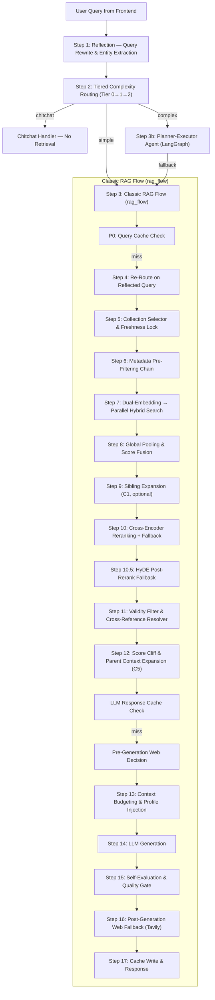
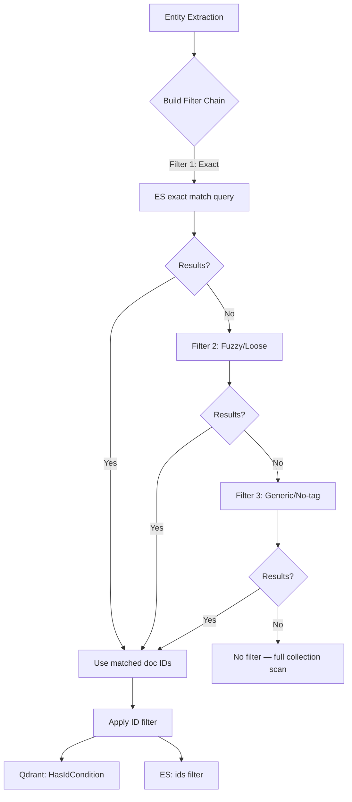

# KIẾN TRÚC LUỒNG TRUY XUẤT THÔNG TIN (QUERY RETRIEVAL FLOW) — RAG V2

Tài liệu này mô tả chi tiết, đầy đủ và chính xác toàn bộ hành trình xử lý của một truy vấn (query) từ khi người dùng nhập vào hệ thống (Frontend) cho tới khi LLM sinh câu trả lời và trả về cho người dùng qua SSE streaming.

> **Lưu ý:** Tài liệu này phản ánh chính xác code hiện tại tại thời điểm cập nhật. Mọi tham số, hàm, điều kiện rẽ nhánh đều trích từ source code thực tế.

---

## 0. TỔNG QUAN KIẾN TRÚC FRONTEND → BACKEND

### Frontend (React/Vite)
- **Stack**: React + Vite + TypeScript, giao tiếp qua `VITE_API_URL` (mặc định `http://localhost:8000`).
- **Primary Endpoint**: `POST /chat/stream` — SSE streaming (dùng cho giao diện chat chính).
- **Fallback Endpoint**: `POST /chat/v3` — non-streaming (dùng cho `sendMessageV3`).
- **Request Schema** (`ChatRequest`):
  ```json
  {
    "question": "string (1-4096 chars)",
    "mode": "auto | rag | agent",
    "top_k": 7,
    "history": [{"role": "user|assistant", "content": "..."}],
    "session_id": "optional",
    "user_context": {"student_id", "cohort", "major", "major_code", "full_name"},
    "user_id": "optional"
  }
  ```
- **SSE Event Types**: `session` → `status` → `token` (streaming) → `metadata` → `done`.
- **Identity Resolution**: Frontend tự động resolve `userContext` từ JWT localStorage fallback nếu không truyền explicit.

### Backend (FastAPI)
- **Entrypoint**: `api/routes/chat.py` → `RAGPipeline.query_stream()` (streaming) hoặc `RAGPipeline.query_v3()` (non-streaming).
- **Mode Routing** tại API layer:
  - `mode=auto` (mặc định) → `pipeline.query_v3()` / `pipeline.query_stream()` (smart routing).
  - `mode=rag` → `pipeline.query()` (force classic RAG).
  - `mode=agent` → `pipeline.query_agent()` (force LangGraph agent).

---

## 1. TỔNG QUAN LUỒNG ĐI CỦA TRUY VẤN (END-TO-END PIPELINE FLOW)

Khi `mode=auto` (mặc định từ frontend), hệ thống chạy pipeline `query_v3` / `query_stream` với kiến trúc **Reflection-First** — viết lại query TRƯỚC routing:



---

## 2. CHI TIẾT CÁC BƯỚC XỬ LÝ

### BƯỚC 1: PHẢN CHIẾU TRUY VẤN VÀ TRÍCH XUẤT THỰC THỂ (REFLECTION)
*File nguồn: [reflection.py](file:///d:/GR/src/RAG_v2/query/reflection.py), [rag_pipeline.py](file:///d:/GR/src/RAG_v2/pipeline/rag_pipeline.py)*

> **Quan trọng**: Trong kiến trúc hiện tại, Reflection chạy **TRƯỚC** routing (khác với tài liệu cũ mô tả routing trước). Mục đích: routing nhận đầu vào là câu hỏi đã được viết lại thành dạng standalone, tránh conversation bleed.

- **Model**: `gemini-3.1-flash-lite` (provider: Gemini), temperature `0.0`, max tokens `1024`.
- **Chức năng**:
  1. **Viết lại câu hỏi (Rewriting)**: Chuyển câu hỏi khẩu ngữ thành văn phong hành chính/pháp lý. Bake conversation context vào câu hỏi standalone (ví dụ: *"Còn điều kiện gì?"* → *"Điều kiện tiên quyết môn mạng máy tính IT3080 là gì?"*).
  2. **Trích xuất thực thể (Entity Extraction)**: Trích `major_code`, `major_name`, `cohort`, `user_major_code`, `target_major_code` từ query + user_context + history.
  3. **Deterministic Fallback**: Nếu LLM Reflection lỗi, hàm `_extract_entities` chạy regex cục bộ để nhận diện mã ngành HUST và khóa sinh viên.
- **Đầu ra**: `{rewritten, prompt, entities: {major_code, cohort, user_major_code, target_major_code}}`.

---

### BƯỚC 2: PHÂN LOẠI ĐỘ PHỨC TẠP 3 TẦNG (TIERED COMPLEXITY ROUTING)
*File nguồn: [rag_pipeline.py](file:///d:/GR/src/RAG_v2/pipeline/rag_pipeline.py) → `_decide_complexity()`, [router.py](file:///d:/GR/src/RAG_v2/query/router.py), [domain_classifier.py](file:///d:/GR/src/RAG_v2/query/domain_classifier.py)*

Quyết định rẽ nhánh `chitchat` / `simple` / `complex` qua 3 tầng:

#### Tier 0 — Deterministic Patterns (`ComplexityRouter`)
- Regex nhận diện: chitchat (chào hỏi, cảm ơn), single-fact lookup, pronoun-based eligibility, explicit comparison.
- Nếu kết quả rõ ràng → return ngay. Nếu `"unknown"` → tiếp Tier 1.

#### Tier 1 — ML Domain Classifier (Two-Stage Embedding-Based)
- **Stage 1**: `CalibratedClassifierCV(LogisticRegression)` trên BGE-M3 embeddings → phân loại intent: `{chitchat, rag, tool_search}`.
- **Stage 2**: `OneVsRestClassifier(LogisticRegression)` → phân loại RAG domain: `{ctdt, quydinh, kehoach, stsv}`.
- **Multi-label threshold**: `0.35`. Nếu < 2 active collections → `simple`.
- **Low-confidence ceiling**: `0.55` → trigger LLM fallback (Tier 2).
- Latency: ~10-50ms (chi phí bằng 0, không gọi LLM).

#### Tier 2 — LLM Judge (Borderline Cases)
- Chỉ chạy khi ≥2 collections active HOẶC có `multi_domain` signal.
- LLM judge quyết định `simple` vs `complex` + `subtype` (comparison, multi_source, …).

#### Kết quả rẽ nhánh:
- **`chitchat`** → trả lời canned response ngay (không retrieval).
- **`simple`** → vào **Classic RAG Flow** (`rag_flow`).
- **`complex`** → vào **Planner-Executor Agent** (LangGraph). Nếu agent disabled/lỗi → fallback về RAG.

---

### BƯỚC 3: CLASSIC RAG FLOW (`rag_flow`)
*File nguồn: [flows.py](file:///d:/GR/src/RAG_v2/pipeline/flows.py) → `rag_flow()`*

Toàn bộ pipeline dưới đây chạy khi route = `simple` hoặc `mode=rag`:

#### 3.0 Pre-Retrieval Query Cache (P0)
- Nếu `LLMResponseCache` có `get_by_query()` → kiểm tra cache bằng `(question, model, profile)`.
- **Profile scope**: `major|cohort` để tránh cross-student data leak.
- Cache hit → trả kết quả ngay, tiết kiệm toàn bộ ~13-25s pipeline.
- Cache skip nếu: dynamic/freshness query, hoặc cached answer chứa "no_info" signal.

#### 3.1 Re-Route trên Reflected Query
- Gọi `_reroute_reflected(search_query, routing_result)`: chạy lại classifier trên câu hỏi đã viết lại (không có history) → routing bleed-free.
- Chạy TRƯỚC collection selection.

#### 3.2 Effective Major for Retrieval
- Module `query.profile_dependency` quyết định: giữ hay bỏ major filter cho retrieval.
- Các topic universal (ví dụ: "học bổng") → bỏ major filter để không thu hẹp sai.
- Các topic major-dependent (ví dụ: "chương trình đào tạo") → giữ major filter.

---

### BƯỚC 4: LỰA CHỌN COLLECTION & FRESHNESS LOCK
*File nguồn: [collection_selector.py](file:///d:/GR/src/RAG_v2/retrieval/collection_selector.py)*

4 collections chính:
| Collection | Nội dung |
|:-----------|:---------|
| `ctdt` | Chương trình đào tạo, khung môn học |
| `quydinh` | Quy chế, quy định học vụ |
| `kehoach` | Kế hoạch, thông báo hành chính, lịch trình |
| `stsv` | Hỗ trợ sinh viên, thủ tục, học bổng |

**Ánh xạ domain → collections**:
```python
DOMAIN_TO_COLLECTIONS = {
    "ctdt":    ["ctdt"],
    "quydinh": ["quydinh", "stsv"],
    "kehoach": ["kehoach"],
    "stsv":    ["stsv", "quydinh"],
}
```

**Xử lý confidence**:
- Confidence ≥ `0.55` → chỉ search collections được ánh xạ.
- Confidence < `0.55` → mở rộng sang `MULTI_DOMAIN_FALLBACK = ["quydinh", "stsv", "ctdt"]`.
- `find_all=True` → bypass routing, search tất cả collections.

**KeHoach Freshness Route Lock**: Nếu query chứa từ khóa thời gian/kế hoạch (ví dụ: "lịch đăng ký", "thông báo mới") → khóa cứng `target_collections = ["kehoach"]`.

---

### BƯỚC 5: COMPARISON DECOMPOSITION & MAJOR STRIPPING
*File nguồn: [flows.py](file:///d:/GR/src/RAG_v2/pipeline/flows.py)*

- **Major Comparison**: Nhận diện *"IT-E7 và IT-E6"* → tạo `[(subquery_1, major_1), (subquery_2, major_2)]`, mỗi sub-query search riêng với major filter riêng.
- **Cohort Comparison**: Nhận diện *"K64 và K65"* → tách thành sub-queries per cohort.
- **Major Stripping**: Lược bỏ tên/mã ngành khỏi retrieval query khi đã có metadata filter, giúp BM25 focus vào nội dung chủ đề.
- **Rerank query**: Dùng bản stripped (không chứa scaffold so sánh) để reranker đánh giá công bằng.

---

### BƯỚC 6: CHUỖI BỘ LỌC SIÊU DỮ LIỆU (METADATA PRE-FILTERING CHAIN)
*File nguồn: [metadata_filters.py](file:///d:/GR/src/RAG_v2/retrieval/metadata_filters.py), [elasticsearch_store.py](file:///d:/GR/src/RAG_v2/retrieval/elasticsearch_store.py)*

Trước khi hybrid search, hệ thống xây dựng **ES Fallback Filter Chain** để thu hẹp không gian tìm kiếm:



**Per-collection filter chains**:
1. **`ctdt`**: Exact major_code → Fuzzy major_name → Generic (no major tag) → No filter.
2. **`quydinh`**: Exact applicable_cohort OR generic (no cohort tag) → No filter.
3. **`kehoach`**:
   - Explicit date: `{wildcard: {date_str: "*/3/2026"}}`.
   - Freshness intent: `get_latest_chunk_ids_by_date(max_n=200)` → Hard ID filter.
4. **`stsv`**: Không áp dụng pre-filter.

---

### BƯỚC 7: TÌM KIẾM SONG SONG ĐA COLLECTION — DUAL EMBEDDING HYBRID SEARCH
*File nguồn: [multi_collection_search.py](file:///d:/GR/src/RAG_v2/retrieval/multi_collection_search.py), [qdrant_store.py](file:///d:/GR/src/RAG_v2/retrieval/qdrant_store.py), [elasticsearch_store.py](file:///d:/GR/src/RAG_v2/retrieval/elasticsearch_store.py)*

Song song hóa bằng `ThreadPoolExecutor(max_workers=4)`:

#### A. Qdrant Dual-Vector Search
1. **BGE-M3** (`BAAI/bge-m3`, FlagEmbedding) → dense vector 1024D.
2. **E5** (`intfloat/multilingual-e5-large`, sentence-transformers) → dense vector 1024D.
3. **Batch request**: `client.query_batch_points()` — gộp 2 vector queries trong 1 gRPC call, giảm ~30% latency.
4. **Over-fetching**: `per_vector_k = min(top_k * 2, 100)`.
5. **Dual-vector fusion**:
   $$\text{Score}_{vector} = 0.5 \times \text{Norm}_{BGE} + 0.5 \times \text{Norm}_{E5}$$

#### B. Elasticsearch BM25 Two-Pass Search
1. **Vietnamese Analyzer**: `icu_tokenizer` + `icu_folding` (fallback: `asciifolding`).
2. **Pass 1 — Exact Phrase**: `match_phrase` trên `text^2.0`, `title^1.8`, `section_h2^1.3`. Boost `has_table=2.5` nếu query yêu cầu bảng.
3. **Pass 2 — Fuzzy Fallback**: `fuzziness: "AUTO"` nếu Pass 1 ít kết quả.
4. **Merge**: Dedup + merge kết quả 2 passes.

#### C. Structured Exclusion Filter
*File: [structured_query.py](file:///d:/GR/src/RAG_v2/query/structured_query.py)*
- Dấu gạch ngang phủ định: *"học bổng -tín chỉ"* → `must_not` trong ES + post-filter Qdrant.

---

### BƯỚC 8: GLOBAL POOLING & SCORE FUSION
*File nguồn: [multi_collection_search.py](file:///d:/GR/src/RAG_v2/retrieval/multi_collection_search.py)*

#### A. Global Pooling
- **Vector Pool**: Top `vector_pool_k=40` (deduped, sorted by cosine score).
- **Keyword Pool**: Top `keyword_pool_k=40` (deduped, sorted by BM25 score).
- **Keyword Hits Pinning**: Docs với `_keyword_exact_phrase_hit` hoặc `_keyword_table_lookup_hit` được ghim cứng.

#### B. Adaptive Weight Adjustment
| Loại query | `vector_weight` | `keyword_weight` |
|:-----------|:---------------|:----------------|
| Thông thường | `0.80` | `0.20` |
| Course-like (mã môn, "tín chỉ", "tiên quyết"…) | `0.40` | `0.60` |
| Exact policy mode (bảng biểu) | `0.45` | `0.55` |

#### C. Fusion Modes
**Chế độ `"rrf"` (mặc định hiện tại, `fusion_mode=rrf`, `fusion_rrf_k=10`)**:
$$\text{Score}_{RRF} = \left(w_v \times \frac{1}{k + r_v}\right) + \left(w_k \times \frac{1}{k + r_k}\right) + \text{recency\_bonus}$$

**Chế độ `"linear"`**:
$$\text{Score}_{linear} = (w_v \times \text{Norm}_v) + (w_k \times \text{Norm}_k) + \text{recency\_bonus}$$

#### D. KeHoach Recency Bonus
$$\text{Bonus} = \max\left(0, 1 - \frac{\text{age\_days}}{365}\right) \times 0.05$$

---

### BƯỚC 9: SIBLING EXPANSION (C1, optional) → RERANKING
*File nguồn: [flows.py](file:///d:/GR/src/RAG_v2/pipeline/flows.py)*

#### A. Sibling Chunk Expansion (khi `sibling_expansion_enabled=True`)
- Top `expand_top_n=3` docs → tìm chunks liền trước/sau (`window=1`, `max_expansion=6`).
- Chạy **TRƯỚC** reranking để reranker đánh giá trên context đầy đủ hơn.

#### B. Cross-Encoder Reranking
- **Model**: `BAAI/bge-reranker-v2-m3` (BGE Reranker).
- **Reranker params**:
  - `top_k = 7` (hoặc scaled cho list queries).
  - `score_threshold = 0.0` (regular docs).
  - `table_score_threshold = -1.0` (table docs — relaxed).
  - `min_top_k = 3` (luôn giữ ít nhất 3 docs dù score thấp).
- **Reranker Fallback Chain**:
  1. Nếu reranked empty hoặc best score < 0 → retry rerank với `question` gốc (không phải reflected).
  2. Nếu vẫn thất bại → dùng raw top-k by fusion score (last resort).

#### C. HyDE Post-Rerank Fallback (khi `hyde_enabled=True`)
- **Trigger**: Reranked empty, HOẶC best score < 0, HOẶC reranked < `hyde_min_results=3`.
- **Flow**: LLM sinh hypothetical answer → embed bằng BGE-M3 → search lại → merge + dedup → re-rerank.
- Mục đích: Cải thiện recall cho các query khó mà retrieval ban đầu miss.

---

### BƯỚC 10: VALIDITY FILTERING & CROSS-REFERENCE RESOLUTION
*File nguồn: [validity_filter.py](file:///d:/GR/src/RAG_v2/retrieval/validity_filter.py), [reference_resolver.py](file:///d:/GR/src/RAG_v2/retrieval/reference_resolver.py)*

#### A. Document Validity Filtering
- Tải `data/document_lineage.json` — registry theo dõi supersession giữa các quy chế.
- Loại bỏ docs có status `"superseded"` (đã bị thay thế bởi văn bản mới).
- **Safety guard**: Giữ tối thiểu `min_results=2` để tránh context trống.

#### B. Cross-Reference Resolution
- Regex quét dẫn chiếu: *"khoản 1 Điều 5"*, *"Điều 5 khoản 2"*.
- **Fast Scroll Lookup (~5ms)**: Truy vấn Qdrant bằng `document_id` + quét tiêu đề `"Điều {N}"`.
- **Semantic Fallback**: Nếu scroll thất bại → hybrid search `"Điều {N} {filename}"`.
- Insert đoạn tham chiếu ngay sau đoạn gốc với tag `_cross_reference=True`.

---

### BƯỚC 11: SCORE CLIFF & PARENT CONTEXT EXPANSION (C5)
*File nguồn: [flows.py](file:///d:/GR/src/RAG_v2/pipeline/flows.py)*

#### A. Per-collection Score Cliff (B1, khi `score_cliff_enabled=True`)
- Tính độ dốc giảm score trong cùng collection → cắt bỏ docs rơi thẳng đứng.

#### B. Parent Context Expansion (C5, mặc định `parent_context_enabled=True`)
- Sau rerank, fetch parent chunk content cho mỗi doc có `parent_id`.
- `parent_max_chars = 1500` (RAG), `parent_max_chars_agent = 500` (Agent).
- Mục đích: Cung cấp context bao quanh rộng hơn cho LLM mà không cần sibling expansion.

---

### BƯỚC 12: LLM RESPONSE CACHE CHECK (Phase 2)
- Key: `(question, doc_ids, model, profile)`.
- Cache hit → trả kết quả ngay (skip generation hoàn toàn).
- Skip nếu: `dynamic_web_query`, `pre_web_fallback_reasons` có.
- Cache ignore nếu cached answer chứa "no_info" signal.

---

### BƯỚC 13: PRE-GENERATION WEB DECISION & CONTEXT BUDGETING
*File nguồn: [flows.py](file:///d:/GR/src/RAG_v2/pipeline/flows.py) → `_build_pre_generation_web_decision()`*

#### A. Pre-Generation Web Decision
Quyết định có cần tìm kiếm web **TRƯỚC** generation hay không:
- **Triggers**: `no_sources`, `freshness_query` (không có local kehoach evidence mới < 90 ngày), `dynamic_query` (không có high local confidence), `low_retrieval_confidence`.
- **Suppression**: Nếu local rerank score ≥ `web_bypass_min_local_score=0.5` → suppress dynamic_query trigger.
- Nếu triggered & `tavily_fallback_enabled=True` → gọi Tavily, merge web docs vào context.

#### B. Context Budgeting (`_resolve_context_budget`)
| Param | Giá trị mặc định |
|:------|:-----------------|
| `context_doc_char_limit` | `2000` chars/doc |
| `context_total_char_budget` | `12000` chars |
| `context_list_total_char_budget` | `24000` chars (list queries) |
| `context_total_char_budget_with_expansion` | `16000` chars (khi sibling enabled) |
| `sibling_per_doc_limit` | `800` chars/sibling |

#### C. Profile Injection
- Module `query.profile_dependency` quyết định: khi nào inject profile note vào context.
- Inject khi: topic major-dependent + user có profile, hoặc self-referential query (*"ngành của tôi"*).
- **KHÔNG** inject khi: topic universal (*"học bổng"*) — tránh bias.
- Format: `"Thông tin sinh viên: ngành CNTT [IT-E10] | Khóa: K68."`.

---

### BƯỚC 14: LLM GENERATION
*File nguồn: [flows.py](file:///d:/GR/src/RAG_v2/pipeline/flows.py)*

- **Model mặc định**: `deepseek-v4-flash` (provider: DeepSeek), temperature `0.0`, max tokens `1500`.
- **Mode**: `"rag"` → system prompt chuyên biệt cho trả lời dựa trên context.
- **Context-length error recovery**:
  1. Nếu context quá dài → retry với `reranked[:2]`, `per_doc_limit=600`, `total_budget=1500`, `history_limit=3`.
  2. Nếu vẫn lỗi → raise error yêu cầu user bắt đầu session mới.

---

### BƯỚC 15: SELF-EVALUATION & ANSWER QUALITY GATE
*File nguồn: [flows.py](file:///d:/GR/src/RAG_v2/pipeline/flows.py)*

#### A. Self-Evaluation (khi `self_eval_enabled=True`, mặc định `False`)
- Chỉ chạy khi `top_score < self_eval_min_top_score` (mặc định `100.0` — effectively always skip do BGE raw logits).
- LLM judge đánh giá: relevance, faithfulness, completeness.

#### B. Answer Quality Gate (`_build_answer_quality_gate`)
- Quét `no_info` patterns trong answer text.
- Kết hợp tín hiệu: `dynamic_query`, `freshness_query`, `no_sources`, self-eval result.
- Quyết định: `answer_status` ∈ {`answered`, `insufficient`, `stale_risk`} + `should_web_search`.

#### C. Local Evidence Retry
- Nếu quality gate yêu cầu web search BUT local evidence strong (best score ≥ `0.5`) → retry generate với local context trước khi fallback web.
- Mục đích: Tránh gọi Tavily không cần thiết khi local docs đã tốt.

---

### BƯỚC 16: POST-GENERATION WEB FALLBACK (TAVILY)
*File nguồn: [flows.py](file:///d:/GR/src/RAG_v2/pipeline/flows.py)*

Nếu quality gate vẫn yêu cầu web search AND `tavily_fallback_enabled=True`:
- **Tavily Search API**: Web search với domain whitelists (HUST official: `hust.edu.vn`, `ctt.hust.edu.vn`, …).
- **Params**: `max_results=5`, `search_depth="basic"`, `web_result_count=3`, `content_char_limit=1500`.
- **Rate limiting**: 1 req/sec, 3 retries exponential backoff.
- **TTL cache**: 200 entries, 1 hour.
- Kết quả web → re-generate answer với combined (local + web) context.
- Web sources prepend vào `reranked` list (primary evidence cho new answer).

---

### BƯỚC 17: CACHE WRITE & RESPONSE

- Cache final answer nếu: không phải no_info, không phải web fallback dynamic, quality OK.
- **Dual cache**: `llm_cache.put()` (doc_id-based) + `llm_cache.put_by_query()` (query-only, cho P0 cache).
- Return dict chứa: `answer`, `sources`, `timings_ms`, `rerank_trace`, `context_trace`, `answer_quality_gate`, `fusion_weights`, `collection_scores`, …

---

## 3. LUỒNG AGENT (COMPLEX QUERIES)

*File nguồn: [react_agent.py](file:///d:/GR/src/RAG_v2/agent/react_agent.py), [planning.py](file:///d:/GR/src/RAG_v2/agent/planning.py), [tool_adapters.py](file:///d:/GR/src/RAG_v2/agent/tool_adapters.py)*

Khi `_decide_complexity() → "complex"`, hệ thống sử dụng LangGraph StateGraph:

```text
START → Planner → Executor → Synthesize → END
```

### Agent Components
| Component | Model | Mô tả |
|:----------|:------|:------|
| **Planner** | `qwen2.5-7b-instruct` (local LM Studio) | Tool selection, retrieval plan generation (JSON) |
| **Executor** | — | Thực thi plan steps song song, retry-with-relaxation |
| **Synthesizer** | `gemini-3.1-flash-lite` (Gemini) | Final answer generation (quality-critical) |

### Agent Tools
| Tool | Mô tả |
|:-----|:------|
| `rag_search` | Single-collection vector search + reranking |
| `multi_rag_search` | Multi-collection batch search |
| `compare_cohorts` | So sánh 2 khóa sinh viên (K65 vs K70) |
| `compare_programs` | So sánh 2 chương trình đào tạo (IT-E6 vs IT-E7) |
| `web_search` | Tavily web search (wrapped) |
| `exam_schedule_search` | Structured ES query cho lịch thi |

### Agent Params
- `max_iterations = 3`, `agent_temperature = 0.0`, `agent_max_tokens = 1200`.
- `agent_tool_result_limit = 5000` chars/ToolMessage.
- `agent_synthesis_max_tokens = 2500`.
- Fallback: nếu agent fail → chạy classic RAG flow.

---

## 4. BẢNG TỔNG HỢP THAM SỐ HỆ THỐNG

### Retrieval Parameters
| Tham số | Giá trị | File |
|:--------|:--------|:-----|
| `top_k` | `7` | `settings.py` |
| `vector_top_k` | `50` | `settings.py` |
| `keyword_top_k` | `50` | `settings.py` |
| `vector_pool_k` | `40` | `settings.py` |
| `keyword_pool_k` | `40` | `settings.py` |
| `vector_weight` | `0.80` | `settings.py` |
| `keyword_weight` | `0.20` | `settings.py` |
| `fusion_mode` | `"rrf"` | `settings.py` |
| `fusion_rrf_k` | `10` | `settings.py` |
| `vector_bge_weight` | `0.50` | `settings.py` |
| `vector_e5_weight` | `0.50` | `settings.py` |
| `raw_candidate_multiplier` | `4.0` | `settings.py` |
| `raw_candidate_min` | `20` | `settings.py` |

### Reranker Parameters
| Tham số | Giá trị | File |
|:--------|:--------|:-----|
| `reranker_model` | `BAAI/bge-reranker-v2-m3` | `settings.py` |
| `reranker_top_k` | `7` | `settings.py` |
| `reranker_score_threshold` | `0.0` | `settings.py` |
| `reranker_table_score_threshold` | `-1.0` | `settings.py` |
| `reranker_min_top_k` | `3` | `settings.py` |

### LLM Models
| Vai trò | Provider | Model | Temperature | Max Tokens |
|:--------|:---------|:------|:------------|:-----------|
| **Answer Generation** | DeepSeek | `deepseek-v4-flash` | `0.0` | `1500` |
| **Reflection** | Gemini | `gemini-3.1-flash-lite` | `0.0` | `1024` |
| **Agent Planning** | LM Studio (local) | `qwen2.5-7b-instruct` | `0.0` | `1200` |
| **Agent Synthesis** | Gemini | `gemini-3.1-flash-lite` | `0.2` | `2500` |

### Routing Thresholds
| Tham số | Giá trị | File |
|:--------|:--------|:-----|
| `domain_confidence_threshold` | `0.65` | `settings.py` |
| `CONFIDENCE_THRESHOLD` (collection selector) | `0.55` | `collection_selector.py` |
| `MULTI_LABEL_THRESHOLD` (classifier) | `0.35` | `domain_classifier.py` |
| `LOW_CONFIDENCE_CEILING` | `0.55` | `domain_classifier.py` |

### Feature Flags
| Flag | Mặc định | Mô tả |
|:-----|:---------|:------|
| `reflection_enabled` | `True` | Query rewriting |
| `domain_routing_enabled` | `True` | Collection-aware routing |
| `hyde_enabled` | `True` | HyDE post-rerank fallback |
| `parent_context_enabled` | `True` | Parent chunk expansion |
| `agent_enabled` | `True` | LangGraph agent path |
| `sibling_expansion_enabled` | `False` | Sibling chunk expansion |
| `score_cliff_enabled` | `False` | Per-collection score cliff |
| `self_eval_enabled` | `False` | LLM self-evaluation |
| `tavily_fallback_enabled` | `False` | Tavily web fallback |
| `web_fallback_on_dynamic` | `False` | Web fallback on dynamic queries |
| `web_fallback_on_no_info` | `False` | Web fallback on no-info |

---

## 5. EMBEDDING MODELS

| Model | Class | Dimension | Library | LRU Cache |
|:------|:------|:----------|:--------|:----------|
| `BAAI/bge-m3` | `BGEm3Embedder` | 1024 | FlagEmbedding (`BGEM3FlagModel`) | 512 entries |
| `intfloat/multilingual-e5-large` | `E5MultilingualEmbedder` | 1024 | sentence-transformers | 512 entries |
| Ensemble (default) | `EnsembleEmbedder` | 1024 | Weighted average + L2 norm | — |

- Device auto-detection: CUDA → MPS → CPU.
- BGE-M3 hỗ trợ sparse embeddings cho hybrid search.
- E5 tự thêm prefix `"query: "` / `"passage: "`.

---

## 6. TÓM TẮT ĐƯỜNG ĐI CÁC THÀNH PHẦN

### Full Pipeline Path (mode=auto, route=simple)
```text
Frontend (POST /chat/stream)
  └─ Backend: query_stream()
       ├─ 1. Reflection (Gemini flash-lite) → rewritten query + entities
       ├─ 2. Complexity Routing (Tier 0→1→2) → "simple"
       ├─ 3. Re-route on reflected query (classifier, no history)
       ├─ 4. Collection selection + freshness lock
       ├─ 5. Metadata pre-filtering (ES fallback chain)
       ├─ 6. Dual-embed (BGE + E5) → Parallel hybrid search per collection
       ├─ 7. Global pooling → RRF fusion (k=10)
       ├─ 8. [Optional] Sibling expansion
       ├─ 9. Reranking (BGE-reranker-v2-m3) + fallback chain
       ├─ 10. [Optional] HyDE second-pass retrieval
       ├─ 11. Validity filter + cross-reference resolution
       ├─ 12. [Optional] Score cliff + parent context expansion
       ├─ 13. LLM cache check
       ├─ 14. Pre-generation web decision
       ├─ 15. Context budgeting + profile injection
       ├─ 16. LLM generation (DeepSeek v4-flash, streaming)
       ├─ 17. Quality gate + [optional] web fallback
       └─ 18. Cache write → SSE stream to frontend
```

### Hybrid Search Detail
```text
[BGE-M3 Embedding + E5 Embedding] ──→ [Qdrant Dual-Vector Batch Search] ──┐
                                                                           ├──→ [RRF / Linear Fusion]
[Reflected Query + Metadata Filters] ──→ [ES BM25 Two-Pass Search] ───────┘
```

### BM25 Search Detail
```text
[Retrieval Query]
    ├─ Negation exclusion (must_not)
    ├─ Pass 1: match_phrase (exact) + table boost
    ├─ [if sparse] Pass 2: fuzzy fallback (AUTO)
    └─ Merge + dedup → Keyword Pool
```
