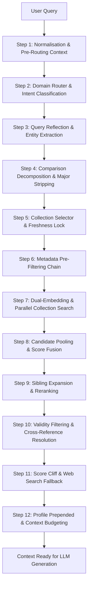
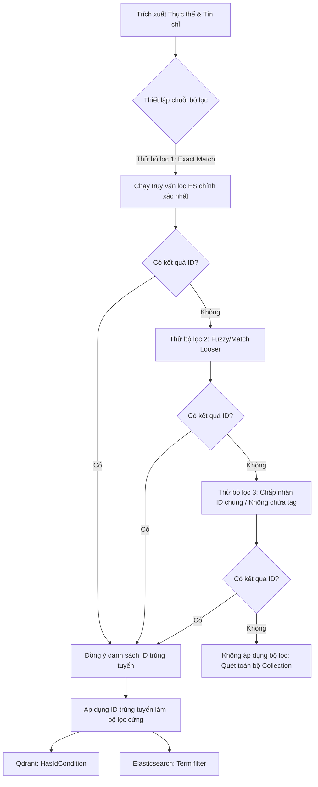

# KIẾN TRÚC LUỒNG TRUY XUẤT THÔNG TIN (QUERY RETRIEVAL FLOW) - RAG V2

Tài liệu này mô tả chi tiết, đầy đủ và trực quan nhất toàn bộ hành trình xử lý của một truy vấn (query) từ khi người dùng nhập vào hệ thống cho tới khi kết xuất dữ liệu ngữ cảnh (Context) hoàn chỉnh để đưa vào mô hình ngôn ngữ lớn (LLM) sinh câu trả lời.

---

## 1. TỔNG QUAN LUỒNG ĐI CỦA TRUY VẤN (END-TO-END RAG FLOW)

Khi người dùng gửi một câu hỏi, hệ thống sẽ đưa nó qua một chuỗi các bước xử lý nối tiếp được phân chia làm 4 giai đoạn lớn: **Tiền xử lý & Định tuyến**, **Lập bộ lọc & Tìm kiếm song song (Vector + BM25)**, **Hợp nhất điểm số (Fusion)**, và **Hậu xử lý & Tối ưu ngữ cảnh**.

Dưới đây là sơ đồ tổng quát toàn bộ luồng đi của truy vấn:



---

## 2. CHI TIẾT CÁC BƯỚC XỬ LÝ TRONG LUỒNG RETRIEVAL

### BƯỚC 1: TIỀN XỬ LÝ VÀ CHUẨN HÓA TRUY VẤN (NORMALISATION)
Ngay khi nhận được truy vấn từ người dùng, hệ thống áp dụng các phép chuẩn hóa:
- **Unicode NFC Normalisation**: Chuyển đổi toàn bộ văn bản về dạng tổ hợp Unicode NFC chuẩn hóa. Điều này khắc phục triệt để lỗi gõ dấu tiếng Việt (ví dụ: chữ ký gõ tổ hợp hoặc dựng sẵn đều được quy về một dạng duy nhất).
- **Whitespace Stripping**: Loại bỏ các khoảng trắng thừa ở đầu, cuối và giữa câu.

---

### BƯỚC 2: PHÂN LOẠI Ý ĐỊNH VÀ ĐỊNH TUYẾN MIỀN (QUERY ROUTER)
*File nguồn tham chiếu: [router.py](file:///d:/GR/src/RAG_v2/query/router.py), [domain_classifier.py](file:///d:/GR/src/RAG_v2/query/domain_classifier.py)*

Định tuyến giúp xác định xem câu hỏi thuộc nhóm hội thoại thông thường (**Chitchat**), tra cứu tri thức (**RAG**), hay cần tìm kiếm web ngoại tuyến (**Tool Search**). GR RAG v2 hỗ trợ hai chế độ định tuyến:
- Chế độ **LLM**: Dùng GPT-4o-mini với prompt Few-Shot.
- Chế độ **Classifier**: Dùng bộ phân loại học máy nhẹ dạng SVM (`DomainClassifier`) huấn luyện trên các vector nhúng của BGE-M3. Chế độ này có chi phí bằng 0 và độ trễ cực thấp (~10-50 ms).

#### Cơ chế Định tuyến hai bước (Two-Pass Routing)
Để xử lý hoàn hảo các câu hỏi ngắn hoặc câu hỏi tiếp nối ở các lượt chat sau (ví dụ: *"Còn điều kiện tiên quyết là gì?"* sau khi hỏi về môn học ở lượt trước):
1. **Pass 1 (Raw Query Search)**: Định tuyến câu hỏi gốc mà không có lịch sử chat để tránh hiện tượng "nhiễu lịch sử" với các câu hỏi tự thân rõ ràng.
2. **Pass 2 (Context Prepend Fallback)**: Nếu điểm tin cậy (Confidence) của Pass 1 thấp hơn ngưỡng `_TWO_PASS_CONFIDENCE_THRESHOLD = 0.65` **VÀ** câu hỏi ngắn hơn 6 từ:
   - Hệ thống quét lịch sử hội thoại gần nhất (`_CONTEXT_WINDOW = 5` lượt chat).
   - Nối các tin nhắn trước thành chuỗi định dạng: `[CTX: {history}] {query}`.
   - Định tuyến lại câu hỏi đã ghép ngữ cảnh. Giữ kết quả của Pass nào có điểm tin cậy cao hơn.

Kết quả đầu ra của bộ Router gồm: `intent` (ý định), `domain` (chủ đề chính), `domains` (danh sách chủ đề liên quan), và điểm tin cậy `confidence`.

---

### BƯỚC 3: PHẢN CHIẾU TRUY VẤN VÀ TRÍCH XUẤT THỰC THỂ (REFLECTION)
*File nguồn tham chiếu: [reflection.py](file:///d:/GR/src/RAG_v2/query/reflection.py)*

Nếu ý định là `rag`, câu hỏi sẽ được đưa qua mô hình phản chiếu `QueryReflector`:
- **Viết lại câu hỏi (Rewriting)**: Chuyển đổi câu hỏi khẩu ngữ tự nhiên của sinh viên thành câu văn phong hành chính/pháp lý học thuật phù hợp nhất với cấu trúc tài liệu lưu trữ (như Điều/Khoản trong quy chế).
- **Trích xuất thực thể (Entity Extraction)**: Trích xuất các thực thể học vụ như mã ngành/tên ngành (`major_code`, `major_name`) và khóa học/khóa sinh viên (`cohort`, ví dụ: `K64`, `K65`).
- **Hạ cấp suy luận thực thể (Deterministic Fallback)**: Nếu mô hình LLM Reflection lỗi hoặc không trích xuất được thực thể, hệ thống kích hoạt hàm `_extract_entities` chạy cục bộ bằng các biểu thức chính quy (Regex) và phân tích lịch sử hội thoại để nhận diện mã ngành HUST và khóa học sinh viên một cách chính xác tuyệt đối.

---

### BƯỚC 4: TẤN CÔNG SO SÁNH VÀ CHUẨN HÓA MÃ NGÀNH (COMPARISON DECOMPOSITION & STRIPPING)
*File nguồn tham chiếu: [metadata_filters.py](file:///d:/GR/src/RAG_v2/retrieval/metadata_filters.py)*

Đối với các truy vấn chứa ý định so sánh giữa nhiều đối tượng hoặc giới hạn chặt ngành học:
- **Cohort Comparison Decomposition**: Nhận diện các mẫu so sánh như *"quy định của K64 và K65"*. Tách truy vấn thành các truy vấn con tương ứng với từng khóa (`K64`, `K65`) để tìm kiếm riêng biệt rồi ghép lại, tăng cường độ phủ thông tin (Recall).
- **Major Comparison Decomposition**: Nhận diện so sánh mã ngành, ví dụ: *"môn mạng máy tính của IT-E7 và IT-E6"*. Hệ thống lập kế hoạch truy xuất chia nhỏ thành các tiểu truy vấn riêng biệt cho từng mã ngành học.
- **Major Stripping**: Khi đã xác định được mã ngành cụ thể và đã lên kế hoạch lọc theo siêu dữ liệu (Metadata), hệ thống sẽ chủ động lược bỏ tên ngành/mã ngành học ra khỏi chuỗi truy vấn từ khóa gửi đi (`strip_major_from_query_for_retrieval`). Việc này giúp công cụ tìm kiếm từ khóa (Elasticsearch BM25) tập trung hoàn toàn vào nội dung chủ đề cốt lõi (ví dụ: *"mạng máy tính"*) mà không bị nhiễu bởi các ký tự mã ngành.

---

### BƯỚC 5: LỰA CHỌN CƠ SỞ DỮ LIỆU VÀ KHÓA ĐƯỜNG DẪN KẾ HOẠCH (COLLECTION SELECTOR)
*File nguồn tham chiếu: [collection_selector.py](file:///d:/GR/src/RAG_v2/retrieval/collection_selector.py)*

Hệ thống GR lưu trữ tài liệu trong 4 cơ sở dữ liệu (Collection) tương ứng với các miền nghiệp vụ khác nhau:
1. `ctdt`: Chương trình đào tạo / Khung chương trình môn học.
2. `quydinh`: Quy chế, quy định học vụ chính thức.
3. `kehoach`: Kế hoạch học tập, thời khóa biểu, thông báo hành chính định kỳ.
4. `stsv`: Hỗ trợ sinh viên, thủ tục hành chính một cửa, học bổng.

Bộ `CollectionSelector` ánh xạ kết quả định tuyến miền từ Router sang các Collection đích:
```python
DOMAIN_TO_COLLECTIONS = {
    "ctdt":    ["ctdt"],
    "quydinh": ["quydinh", "stsv"],
    "kehoach": ["kehoach"],
    "stsv":    ["stsv", "quydinh"],
}
```

#### Cơ chế xử lý điểm tin cậy thấp và Khóa đường dẫn (Freshness Lock)
- Nếu độ tin cậy định tuyến $\geq 0.55$: Chỉ truy xuất trên các cơ sở dữ liệu được ánh xạ.
- Nếu độ tin cậy định tuyến $< 0.55$: Mở rộng không gian tìm kiếm sang các Collection dự phòng thông qua `MULTI_DOMAIN_FALLBACK = ["quydinh", "stsv", "ctdt"]`.
- **KeHoach Freshness Route Lock**: Nếu trong câu hỏi chứa các từ khóa chỉ thị thời gian hoặc kế hoạch học tập thực tế (ví dụ: *"lịch đăng ký lớp học kỳ mới"*, *"thông báo đóng học phí"*), hệ thống kích hoạt hàm `_should_lock_kehoach_route` để **khóa cứng** bộ lọc tìm kiếm chỉ trỏ về Collection `kehoach`, ngăn chặn kết quả bị loãng bởi tài liệu quy chế tĩnh của `quydinh`.

---

### BƯỚC 6: CHUỖI BỘ LỌC SIÊU DỮ LIỆU TRƯỚC TRUY XUẤT (METADATA PRE-FILTERING CHAIN)
*File nguồn tham chiếu: [metadata_filters.py](file:///d:/GR/src/RAG_v2/retrieval/metadata_filters.py), [elasticsearch_store.py](file:///d:/GR/src/RAG_v2/retrieval/elasticsearch_store.py)*

Đây là một trong những cơ chế tinh vi nhất của GR RAG v2 giúp tối ưu hóa hiệu suất tìm kiếm lai (Hybrid Search). Trước khi thực hiện tìm kiếm Vector trên Qdrant hay BM25 trên Elasticsearch, hệ thống xây dựng một **Chuỗi các truy vấn lọc Elasticsearch (ES Fallback Filter Chain)** để trích xuất danh sách ID tài liệu hợp lệ trước.



#### Thiết lập chuỗi bộ lọc cho từng Collection
Hệ thống định nghĩa chuỗi fallback ưu tiên cho từng Collection như sau:

1. **Đối với miền đào tạo (`ctdt`)**:
   - *Ưu tiên 1 (Exact Code)*: Lọc chính xác theo mã ngành (ví dụ: `{term: {major_code: "IT-E10"}}`).
   - *Ưu tiên 2 (Fuzzy Name)*: Tìm khớp mờ theo tên ngành (ví dụ: `{match: {major_name: "Công nghệ thông tin"}}`).
   - *Ưu tiên 3 (Generic Fallback)*: Tìm các tài liệu quy định chung không gắn nhãn mã ngành hoặc đúng mã ngành được chỉ định.
   - *Ưu tiên 4 (No Filter)*: Tìm trên toàn bộ kho nếu tất cả các bước trên trả về 0 kết quả.

2. **Đối với miền quy định (`quydinh`)**:
   - *Ưu tiên 1*: Khớp chính xác khóa học sinh viên (`applicable_cohort`) hoặc tài liệu áp dụng chung (không chứa khóa học cụ thể).
   - *Ưu tiên 2 (No Filter)*: Không lọc nếu không phát hiện tín hiệu khóa tuyển sinh.

3. **Đối với miền thông báo kế hoạch (`kehoach`)**:
   - *Lọc mốc thời gian rõ ràng*: Nếu người dùng hỏi tháng/năm cụ thể (ví dụ: *"lịch đăng ký tháng 3 năm 2026"*), hệ thống tạo truy vấn wildcard Elasticsearch trên trường `date_str` kiểu từ khóa: `{wildcard: {date_str: "*/3/2026"}}`.
   - *Đường dẫn tươi mới (Freshness Path)*: Nếu phát hiện ý định hỏi tin tức gần đây (như *"mới nhất"*, *"gần đây"*, *"học kỳ mới"*) nhưng không chỉ định ngày cụ thể:
     1. Gọi hàm cục bộ `get_latest_chunk_ids_by_date(max_n=200)` để thu thập 200 ID tài liệu mới nhất dựa trên thời gian đăng tin (phân tích chuỗi `"D/M/YYYY"` và sắp xếp ở phía Python).
     2. Gán 200 ID này thành một bộ lọc ID cứng (`HasIdCondition` trên Qdrant và bộ lọc `ids` trên Elasticsearch) nhằm đảm bảo thông tin cũ của các năm trước không thể "cướp điểm" của tin mới qua điểm số từ khóa thuần túy.

4. **Đối với miền hỗ trợ sinh viên (`stsv`)**:
   - Không áp dụng bộ lọc siêu dữ liệu trước truy xuất (tận dụng tìm kiếm lai toàn diện).

---

### BƯỚC 7: TÌM KIẾM SONG SONG ĐA THƯ VIỆN VÀ TÌM KIẾM LAI HỖ TRỢ BỞI DUAL-EMBEDDING
*File nguồn tham chiếu: [multi_collection_search.py](file:///d:/GR/src/RAG_v2/retrieval/multi_collection_search.py), [qdrant_store.py](file:///d:/GR/src/RAG_v2/retrieval/qdrant_store.py), [elasticsearch_store.py](file:///d:/GR/src/RAG_v2/retrieval/elasticsearch_store.py)*

Sau khi thiết lập các bộ lọc ID tài liệu hợp lệ cho từng Collection đích, hệ thống khởi chạy tìm kiếm song song đa luồng bằng `ThreadPoolExecutor` với tối đa `max_workers = 4`. Đối với mỗi cơ sở dữ liệu, một quy trình Tìm kiếm Lai (Hybrid Search) đồng thời được thực thi:

#### A. Tìm kiếm Vector Song song hóa (Qdrant Dual-Vector Search)
1. **Truy vấn Dual-Embedding**: Nhúng câu hỏi thông qua cả hai mô hình nhúng tiên tiến:
   - `BGEm3Embedder` tạo vector dense 1024 chiều.
   - `E5MultilingualEmbedder` tạo vector dense 1024 chiều.
2. **Batching Request**: Thay vì gọi tuần tự làm tăng độ trễ, GR RAG v2 thực hiện gộp hai yêu cầu tìm kiếm vector vào một gói tin mạng duy nhất qua `client.query_batch_points()`, giúp **giảm thiểu độ trễ gRPC/REST xuống ~30%**.
3. **Over-fetching**: Tìm kiếm với số lượng ứng viên dự phòng mở rộng `per_vector_k = min(top_k * 2, 100)` nhằm tránh bỏ sót kết quả chất lượng cao trước khi hợp nhất.
4. **Hợp nhất Dual-Vector**: Chuẩn hóa điểm số cosine của cả hai mô hình nhúng về miền $[0,1]$ độc lập và hợp nhất theo công thức tuyến tính:
   $$\text{Fused Score (Qdrant)} = 0.5 \times \text{Norm BGE} + 0.5 \times \text{Norm E5}$$

#### B. Tìm kiếm Từ khóa Tối ưu hóa (Elasticsearch BM25 Keyword Search)
1. **Phân tích từ vựng Tiếng Việt**: Trình phân tích `vietnamese_analyzer` sử dụng `icu_tokenizer` tích hợp bộ lọc `icu_folding` (hỗ trợ phân tách âm tiết tiếng Việt chuẩn xác, chuyển sang chữ thường và loại bỏ dấu tiếng Việt một cách thông minh). Nếu thiếu thư viện ICU, hệ thống tự động hạ cấp xuống trình phân tích chuẩn sử dụng bộ lọc `asciifolding` thay thế.
2. **Cơ chế tìm kiếm từ khóa Hai bước (Two-Pass BM25 Search)**:
   - **Pass 1 (Exact Phrase Match)**: Sử dụng các mệnh đề tìm kiếm cụm từ khớp chính xác `match_phrase` trên nhiều trường với các trọng số boost khác nhau nhằm ưu tiên tuyệt đối văn bản chứa chính xác cụm từ tìm kiếm (ví dụ: `text^2.0`, `title^1.8`, `section_h2^1.3`). Nếu câu hỏi có yêu cầu tìm bảng biểu (được trích xuất từ tín hiệu truy vấn), thêm điểm thưởng boost cho trường `has_table` (`boost = 2.5`).
   - **Pass 2 (Fuzzy Fallback Search)**: Nếu bộ lọc khớp cụm từ chính xác ở Pass 1 trả về quá ít kết quả, hệ thống kích hoạt tìm kiếm mờ hỗ trợ sửa lỗi gõ sai chữ bằng cấu hình `"fuzziness": "AUTO"`.
   - **Hợp nhất kết quả từ khóa**: Ghép kết quả của hai Pass và loại bỏ tài liệu trùng lặp qua hàm `_merge_keyword_results`.

#### C. Lọc từ loại trừ (Structured Exclusion Filter)
*File nguồn tham chiếu: [structured_query.py](file:///d:/GR/src/RAG_v2/query/structured_query.py)*

Nếu người dùng đưa vào câu hỏi từ khóa phủ định bằng ký hiệu gạch ngang (ví dụ: *"học bổng khuyến khích -tín chỉ"*), hệ thống tự động:
- Cấu hình mệnh đề `must_not` trong Elasticsearch để loại trừ các tài liệu chứa từ này ngay từ tầng tìm kiếm từ khóa.
- Thực hiện hậu lọc (Post-filtering) lọc bỏ mọi kết quả từ Qdrant chứa từ phủ định trong các trường văn bản, tiêu đề, hoặc mã môn học.

---

### BƯỚC 8: TẬP TRUNG ỨNG VIÊN TOÀN CỤC VÀ HỢP NHẤT ĐIỂM SỐ CHUYỂN ĐỔI THÍCH ỨNG (SCORE FUSION)
*File nguồn tham chiếu: [multi_collection_search.py](file:///d:/GR/src/RAG_v2/retrieval/multi_collection_search.py)*

Sau khi nhận kết quả ứng viên từ tất cả các Collection song song, hệ thống thực hiện hai bước xử lý lớn tiếp theo:

#### A. Gom cụm và Bảo tồn ứng viên Keyword (Global Pooling)
- **Vector Pool**: Gộp tất cả kết quả tìm kiếm vector từ các Collection, sắp xếp giảm dần theo điểm số cosine thô, loại bỏ trùng lặp ID tài liệu, chỉ giữ lại top `vector_pool_k` (mặc định = 40).
- **Keyword Pool**: Gộp tất cả kết quả tìm kiếm từ khóa, sắp xếp giảm dần theo điểm BM25 thô, loại bỏ trùng lặp ID tài liệu, giữ lại top `keyword_pool_k` (mặc định = 40).
- **Keyword Hits Pinning**: Các tài liệu chứa bảng biểu khớp chính xác hay cụm từ khóa khớp cứng có trường thuộc tính đặc biệt `_keyword_exact_phrase_hit` hoặc `_keyword_table_lookup_hit` sẽ được **ghim cứng (Pinning)** để chắc chắn sống sót qua bộ lọc phân nhóm từ khóa, bất chấp việc điểm số BM25 thô của chúng có thể bị thấp do tài liệu ngắn.

#### B. Điều chỉnh Trọng số Thích ứng (Adaptive Weight Adjustment)
Để đảm bảo hệ thống phản hồi cực tốt cho các câu hỏi chuyên biệt về mã môn học hoặc thông tin khóa đào tạo (vốn cần tìm từ khóa khớp chính xác cao):
- **Nhận diện môn học**: Sử dụng Regex nhận diện mã môn học Bách khoa (ví dụ: `IT3080`, `EE2020`) hoặc kiểm tra xem câu hỏi có chứa các từ khóa định vị môn học tiếng Việt (nhas: *"môn"*, *"môn học"*, *"tín chỉ"*, *"học phần"*, *"tiên quyết"*, *"song hành"*, *"khối lượng"*).
- **Thay đổi trọng số (Weight Shift)**:
  - Ở câu hỏi thông thường: Ưu tiên tìm kiếm ngữ nghĩa sâu bằng cách gán trọng số Vector $0.8$ và trọng số Keyword $0.2$.
  - Khi phát hiện ý định hỏi môn học (Course-like Query): Giảm trọng số Vector xuống $0.4$ và đẩy trọng số Keyword lên $0.6$.
  - Khi phát hiện tìm kiếm bảng biểu chính xác (`exact_policy_mode`): Đặt trọng số Vector thành $0.45$ và Keyword thành $0.55$.

#### C. Công thức Hợp nhất điểm số Lai (Linear / RRF Fusion)
GR RAG v2 hỗ trợ hai chế độ trộn kết quả lai toàn cục:
1. **Chế độ `"linear"` (Mặc định)**:
   Chuẩn hóa Min-Max điểm số trong Vector Pool và Keyword Pool về miền $[0,1]$ độc lập để cân bằng phổ điểm, tránh trường hợp điểm BM25 cực lớn lấn át hoàn toàn điểm Cosine bé. Điểm số hợp nhất cuối cùng tính theo công thức:
   $$\text{Final Score} = (\text{vector\_weight} \times \text{Norm Vector Score}) + (\text{keyword\_weight} \times \text{Norm Keyword Score}) + \text{kehoach\_recency\_bonus}$$
2. **Chế độ `"rrf"` (Reciprocal Rank Fusion)**:
   Không quan tâm đến điểm số thô mà chỉ phụ thuộc vào thứ hạng (Rank) của tài liệu trong từng danh sách pool:
   $$\text{Score RRF} = \left(\text{vector\_weight} \times \frac{1}{60 + \text{vector\_rank}}\right) + \left(\text{keyword\_weight} \times \frac{1}{60 + \text{keyword\_rank}}\right) + \text{kehoach\_recency\_bonus}$$

#### D. Điểm thưởng độ tươi mới cho Kế hoạch (`kehoach` Recency Bonus)
Để khuyến khích hiển thị các thông báo thời sự đăng tải gần đây nhất trong miền thông tin `kehoach`, hệ thống cộng điểm thưởng suy biến tuyến tính theo thời gian thực (áp dụng cho cả hai chế độ trộn điểm):
- Công thức tính điểm thưởng:
  $$\text{Bonus} = \max\left(0, 1 - \frac{\text{age\_days}}{365}\right) \times 0.05$$
- Tài liệu đăng tải hôm nay được nhận điểm thưởng tối đa $+0.05$.
- Tài liệu đăng tải cách đây nửa năm được cộng $+0.025$.
- Tài liệu đăng cũ hơn 1 năm (365 ngày) không nhận được điểm thưởng ($+0.0$).
- Các tài liệu không thuộc nhóm `kehoach` nhận điểm thưởng cố định bằng $0.0$.

---

### BƯỚC 9: MỞ RỘNG LÂN CẬN VÀ TÁI SẮP XẾP BỞI MÔ HÌNH HỌC SÂU (SIBLING EXPANSION & RERANKING)
*File nguồn tham chiếu: [flows.py](file:///d:/GR/src/RAG_v2/pipeline/flows.py), [query_expander.py](file:///d:/GR/src/RAG_v2/retrieval/query_expander.py)*

Sau khi hợp nhất điểm số lai, danh sách tài liệu trải qua quy trình cải tiến ngữ cảnh chất lượng cao:

#### A. Mở rộng tài liệu liền kề trước tái sắp xếp (Sibling Chunk Expansion - C1)
- Đối với các tài liệu trúng tuyển hàng đầu (`expand_top_n = 3`), hệ thống chủ động tìm kiếm các đoạn văn bản liền trước và liền sau của nó trong cùng một văn bản gốc (`window = 1`).
- Các đoạn lân cận này được ghép nối trực tiếp vào đoạn văn hiện tại để đảm bảo cung cấp đầy đủ ngữ cảnh bao quanh khi gửi tới bộ tái sắp xếp, loại bỏ tình trạng cắt đoạn thô bạo làm đứt mạch thông tin ở tầng Chunking.

#### B. Tái sắp xếp ngữ nghĩa chuyên sâu (Cross-Encoder Reranking)
Hệ thống sử dụng mô hình tái sắp xếp Cross-Encoder để chấm điểm tương đồng ngữ nghĩa trực tiếp giữa câu hỏi (đã chuẩn hóa/khôi phục tên ngành đầy đủ) và đoạn văn bản ngữ cảnh ứng viên:
1. **Reranker Quality Gate**: Đánh giá và sắp xếp lại các ứng viên, lọc bỏ các tài liệu có điểm tương đồng âm cực thấp.
2. **Cơ chế chống trôi phản chiếu (Reranker Fallback)**:
   - Nếu bộ lọc của Cross-Encoder loại bỏ sạch các ứng viên (hoặc toàn bộ điểm số đều âm) do câu hỏi phản chiếu (Reflection) chứa các từ mô phỏng sai lệch với văn bản gốc:
   - Hệ thống tự động kích hoạt **truy xuất tái sắp xếp khẩn cấp bằng câu hỏi gốc của người dùng** (`question`), bảo đảm không xảy ra tình huống mất trắng dữ liệu ngữ cảnh do dịch dịch sai nghĩa.
   - Nếu vẫn không có tài liệu nào vượt qua vòng tuyển chọn của mô hình học sâu, hệ thống sử dụng danh sách ứng viên thô sắp xếp theo điểm số lai Fusion làm giải pháp cứu cánh cuối cùng.

---

### BƯỚC 10: KIỂM TRA HIỆU LỰC TÀI LIỆU VÀ GIẢI QUYẾT LIÊN KẾT ĐIỀU KHOẢN (VALIDITY & CROSS-REFERENCE)
*File nguồn tham chiếu: [validity_filter.py](file:///d:/GR/src/RAG_v2/retrieval/validity_filter.py), [reference_resolver.py](file:///d:/GR/src/RAG_v2/retrieval/reference_resolver.py)*

Đây là bước hậu xử lý nghiệp vụ nghiệp ngặt bảo đảm tính pháp lý và đầy đủ của ngữ cảnh:

#### A. Lọc tài liệu hết hiệu lực (Validity Filtering)
- Tải tệp thông tin phả hệ văn bản học vụ `data/document_lineage.json`.
- Quét và loại bỏ tất cả các đoạn trích đến từ các tài liệu có thuộc tính trạng thái `"superseded"` (đã bị thay thế bởi văn bản quy chế mới ban hành sau này).
- **Safety guard**: Nếu việc lọc làm mất đi quá nhiều tài liệu, hệ thống tự động giữ lại tối thiểu `min_results = 2` tài liệu cũ để đảm bảo mô hình vẫn có dữ liệu nền phản hồi thay vì trả về ngữ cảnh trống rỗng.

#### B. Tự động giải quyết liên kết điều khoản (Cross-Reference Resolution)
Trong các văn bản quy chế học vụ thường chứa các cụm từ dẫn chiếu pháp lý, ví dụ: *"được thực hiện theo quy định tại khoản 1 và khoản 2 Điều 5 quy chế này"*. Để giúp LLM hiểu được nội dung tham chiếu mà không cần người dùng hỏi trực tiếp Điều 5:
1. **Nhận diện liên kết**: Sử dụng Regex quét nội dung đoạn trích để tìm các cấu trúc dẫn chiếu dạng tiếng Việt: `"khoản ... Điều ..."` hoặc `"Điều ... khoản ..."`.
2. **Tìm kiếm tham chiếu siêu tốc (Fast Scroll Lookup ~5ms)**:
   - Truy vấn trực tiếp bằng mã tài liệu `document_id` và Collection gốc trong Qdrant.
   - Quét qua phân đoạn văn bản và tiêu đề phụ chứa tiêu đề `"Điều {article}"`.
   - Ưu tiên chọn các đoạn trích chứa đúng số hiệu khoản dẫn chiếu cụ thể.
3. **Tìm kiếm ngữ nghĩa dự phòng (Semantic Fallback Search)**: Nếu tìm cục bộ thất bại, khởi chạy một luồng tìm kiếm lai nội bộ với từ khóa dạng `"Điều {article} {filename}"` để định vị chính xác phân đoạn cần tìm.
4. **Chèn dữ liệu liên kết**: Chèn đoạn văn bản chứa nội dung điều khoản tham chiếu được tìm thấy trực tiếp ngay phía sau đoạn văn bản gốc có dẫn chiếu với thẻ đánh dấu đặc biệt `_cross_reference=True` để LLM nắm bắt được cấu trúc quan hệ.

---

### BƯỚC 11: LỌC RƠI ĐIỂM SỐ VÀ TỰ ĐỘNG TÌM KIẾM WEB NGOẠI TUYẾN (SCORE CLIFF & WEB FALLBACK)
*File nguồn tham chiếu: [flows.py](file:///d:/GR/src/RAG_v2/pipeline/flows.py)*

#### A. Mức rơi điểm số theo Collection (Per-collection Score Cliff - B1)
Để loại bỏ các đoạn văn bản có độ liên quan kém vượt trội so với các đoạn văn bản dẫn đầu:
- Hệ thống tính toán độ dốc giảm điểm số trong cùng một Collection.
- Nếu điểm số của đoạn văn bản phía sau rơi thẳng đứng vượt quá ngưỡng tỷ lệ chiết khấu so với đoạn đầu bảng, hệ thống chủ động cắt bỏ toàn bộ phân khúc tài liệu kém chất lượng phía sau để giữ độ sạch tuyệt đối cho ngữ cảnh đầu vào của LLM.

#### B. Quyết định tìm kiếm web (Tavily Fallback Search)
Trước khi đưa văn bản vào sinh câu trả lời, hệ thống chạy một hàm đánh giá chất lượng `_build_pre_generation_web_decision` để kiểm tra xem có cần tìm kiếm Web ngoại tuyến (qua Tavily Search API) hay không.
- **Điều kiện kích hoạt**:
  - Không tìm thấy tài liệu cục bộ nào sau tất cả các bước truy xuất.
  - Hoặc Router dự đoán độ tin cậy kết quả nội bộ cực thấp.
  - Hoặc câu hỏi chứa ý định hỏi về các sự kiện thời sự/năm học mới phát sinh vượt ngoài dữ liệu tĩnh của hệ thống.
- **Hợp nhất dữ liệu Web**: Dữ liệu tìm kiếm web trả về được dán nhãn `collection = "web"`, chuẩn hóa cấu trúc và trộn trực tiếp vào kho ngữ cảnh cục bộ để bổ khuyết thông tin.

---

### BƯỚC 12: ĐÓNG GÓI NGỮ CẢNH VÀ QUẢN LÝ TÀI NGUYÊN (CONTEXT BUDGETING & PROFILE INJECTION)
*File nguồn tham chiếu: [flows.py](file:///d:/GR/src/RAG_v2/pipeline/flows.py)*

Bước cuối cùng chuẩn bị dữ liệu đầu vào hoàn thiện cho LLM:
1. **Thiết lập hạn ngạch từ (Context Budgeting)**:
   - Dựa trên kiểu truy vấn, hệ thống phân bổ mức giới hạn ký tự và số lượng tài liệu (`_resolve_context_budget`).
   - Ví dụ, các câu hỏi liệt kê hoặc so sánh sẽ được cấp hạn ngạch ký tự văn bản rộng hơn hẳn để tránh hiện tượng cắt nửa chừng tài liệu.
2. **Bơm thông tin hồ sơ sinh viên (Student Profile Injection)**:
   - Quét thông tin tài khoản người dùng đăng nhập (`user_context`) hoặc phân tích lịch sử hội thoại để trích xuất các thuộc tính: mã ngành, khóa tuyển sinh, điểm học tập CPA hiện tại.
   - Đóng gói thành một dòng tóm tắt hồ sơ ngắn đầu trang ngữ cảnh:
     `"Thông tin sinh viên: ngành CNTT-Việt Nhật, năm 3, khóa K65, CPA=3.2."`
   - Điều này cho phép LLM trả lời xuất sắc các câu hỏi cá nhân hóa sâu sắc (như *"Với CPA của tôi thì có đủ điều kiện nhận học bổng không?"*) bằng cách kết nối trực tiếp dữ liệu hồ sơ cá nhân với các quy chế học bổng học tập có trong tài liệu quy định trích xuất được.

---

## 3. BẢNG TỔNG HỢP CÁC THAM SỐ TRUY XUẤT HỆ THỐNG

Các tham số cấu hình chính điều phối hành trình xử lý truy vấn:

| Tham số | Giá trị mặc định | File định nghĩa | Mô tả |
| :--- | :--- | :--- | :--- |
| `CONFIDENCE_THRESHOLD` | `0.55` | `collection_selector.py` | Ngưỡng tin cậy tối thiểu để sử dụng trực tiếp miền định tuyến. |
| `_TWO_PASS_CONFIDENCE_THRESHOLD` | `0.65` | `router.py` | Ngưỡng tin cậy của ý định để kích hoạt ghép lịch sử hội thoại. |
| `vector_weight` (Linear) | `0.80` | `config/settings.py` | Trọng số ưu tiên tìm kiếm vector/ngữ nghĩa trong điều kiện thường. |
| `keyword_weight` (Linear) | `0.20` | `config/settings.py` | Trọng số tìm kiếm từ khóa BM25 trong điều kiện thường. |
| `vector_weight` (Course) | `0.40` | `multi_collection_search.py` | Trọng số vector khi phát hiện ý định hỏi mã môn học/ngành. |
| `keyword_weight` (Course) | `0.60` | `multi_collection_search.py` | Trọng số từ khóa khi phát hiện ý định hỏi mã môn học/ngành. |
| `rrf_k` | `60` | `hybrid_search.py` | Hằng số làm mượt thứ hạng trong công thức RRF Fusion. |
| `max_workers` | `4` | `multi_collection_search.py` | Số luồng tìm kiếm song song các cơ sở dữ liệu đích. |
| `vector_top_k` | `50` | `config/settings.py` | Số lượng tài liệu tối đa lấy ra từ Qdrant cho mỗi Collection. |
| `keyword_top_k` | `50` | `config/settings.py` | Số lượng tài liệu tối đa lấy ra từ ES cho mỗi Collection. |
| `vector_pool_k` | `40` | `config/settings.py` | Số lượng tài liệu tối đa giữ lại trong Vector Pool toàn cục. |
| `keyword_pool_k` | `40` | `config/settings.py` | Số lượng tài liệu tối đa giữ lại trong Keyword Pool toàn cục. |
| `top_k` | `5` | `config/settings.py` | Số lượng tài liệu tối đa đưa vào bước Reranking cuối cùng. |
| `KEHOACH_RECENCY_BONUS_MAX` | `0.05` | `metadata_filters.py` | Điểm cộng tối đa cho tài liệu kế hoạch đăng mới trong ngày. |

---

## 4. TÓM TẮT ĐƯỜNG ĐI CỦA TỪNG THÀNH PHẦN CHÍNH (RETRIEVAL PATHWAY)

### Luồng đi của Hybrid Search (Tìm kiếm lai)
```text
[BGE Embedding & E5 Embedding] ────────> [Qdrant Dual-Vector Search (BGE + E5)] ──┐
                                                                                  ├──> [RRF / Linear Fusion]
[User Query / Structured Query] ───────> [ES BM25 Keyword Search (Exact/Fuzzy)] ──┘
```

### Luồng xử lý Query (Query Processing)
```text
[Raw Query Input]
       │
       ▼ (Unicode NFC chuẩn hóa & Dọn dẹp khoảng trắng)
[Normalized Query]
       │
       ▼ (Định tuyến ý định: RAG / Chitchat / Tool)
[Intent & Domain Classified]
       │
       ▼ (Viết lại văn phong học thuật & Trích thực thể ngành/khóa)
[Reflected & Entity Extracted]
       │
       ▼ (Tách nhỏ nếu hỏi so sánh hoặc bóc tách từ khóa gây loãng)
[Comparison Decomposed / Stripped Query] ─────> (Sẵn sàng đi vào tìm kiếm lai)
```

### Luồng xử lý BM25 Search (Tìm kiếm từ khóa)
```text
[Stripped Search Query]
       │
       ▼ (Quét từ loại trừ & Thiết lập must_not)
[Negation Exclusion Handled]
       │
       ▼ (Pass 1: Match cụm từ chính xác cao + Tín chỉ/Bảng biểu Boost)
[Exact Phrase Matches]
       │
       ▼ (Kiểm tra số lượng: Nếu ít ứng viên -> kích hoạt Pass 2)
[Fuzzy Fallback Matching (fuzziness: AUTO)]
       │
       ▼ (Gộp và Sắp xếp kết quả thô BM25)
[Merged Keyword Results]
```
