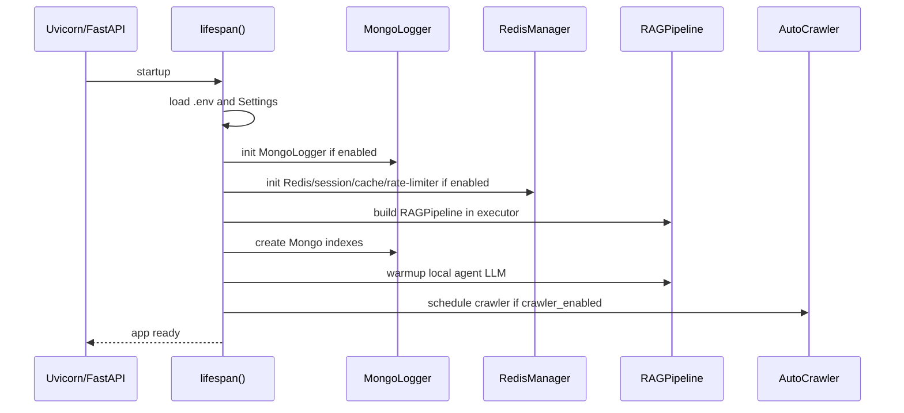
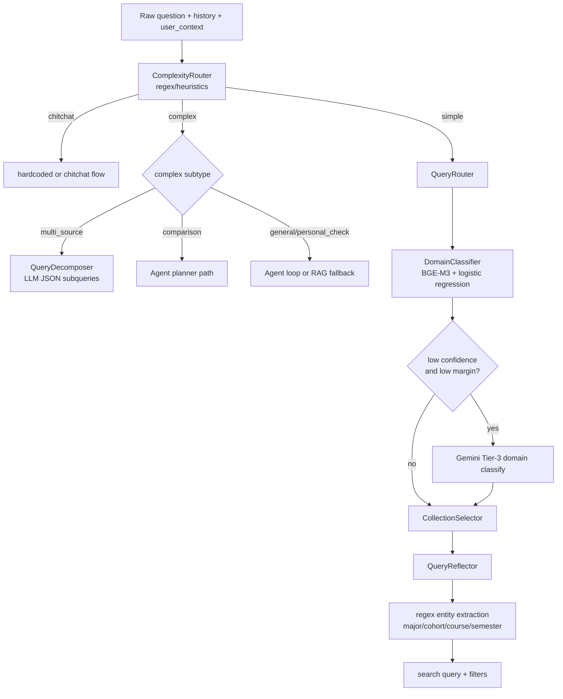
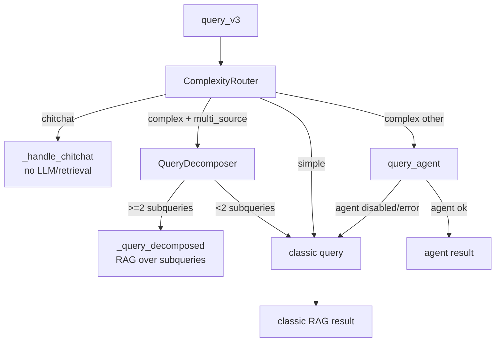
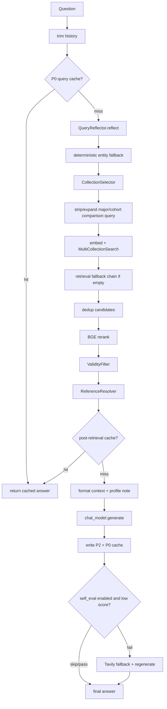
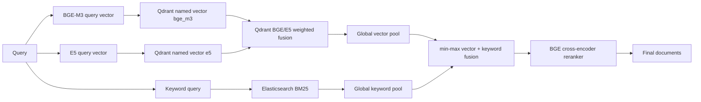
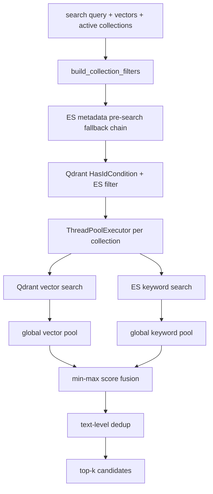
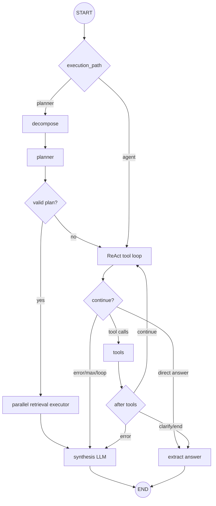

# RAG v2 System Architecture

> Tai lieu nay tong hop kien truc hien tai cua `src/RAG_v2` sau khi doi chieu `PROJECT_MEMORY.md`, cac `MODULE.md`, va cac entrypoint/runtime files chinh.  
> Pham vi: backend RAG/agent, retrieval stores, ingest/admin pipeline, persistence/cache, web/mobile clients, evaluation va infra local.

---

## 1. Muc Tieu He Thong

`RAG_v2` la he thong chatbot hoc vu cho Dai hoc Bach khoa Ha Noi. He thong tra loi cau hoi dua tren cac nguon noi bo:

- `ctdt`: chuong trinh dao tao, mon hoc, tin chi, hoc ky, dieu kien hoc phan.
- `quydinh`: quy che, quy dinh hoc vu, hoc bong, tot nghiep, ngoai ngu.
- `kehoach`: ke hoach hoc ky, lich dang ky, thong bao, deadline.
- `stsv`: so tay sinh vien, thu tuc, bieu mau, ho tro sinh vien.
- `test`: collection hop le cho upload/dev.

Kien truc tong the gom:

- FastAPI backend cho chat, streaming, auth, session, retrieval debug, admin upload.
- RAG pipeline co routing, reflection, retrieval, reranking, answer generation.
- LangGraph agent cho cau hoi phuc tap, so sanh, multi-source.
- Qdrant dual-vector + Elasticsearch keyword hybrid retrieval.
- MongoDB cho users, sessions, turns, logs, document records.
- Redis tuy chon cho session cache, history cache, LLM cache, rate limiting.
- React web app, Expo mobile app, va package TypeScript dung chung.
- Data pipeline rieng cho crawl/chunk/index va admin upload.

---

## 2. Ban Do Thu Muc Cap Cao

```text
RAG_v2/
├── api/                    # FastAPI app, routes, response mapping, middleware
├── auth/                   # JWT, Microsoft OAuth, password, RBAC
├── routers/auth.py         # /auth endpoints
├── pipeline/               # RAGPipeline, RAG flows, admin DocumentPipeline
├── query/                  # ComplexityRouter, domain router, reflection, decomposer
├── retrieval/              # Qdrant, Elasticsearch, hybrid search, filters, resolver
├── embedding/              # BGE-M3, E5, ensemble embedders
├── reranking/              # BGE cross-encoder reranker
├── llm/                    # Gemini/LM Studio generation and self-eval
├── agent/                  # LangGraph ReAct + planner-executor agent
├── models/                 # MongoDB models, Motor client, MongoLogger
├── schemas/                # Pydantic API contracts
├── cache/                  # Redis session/history/cache/rate-limit infrastructure
├── chunking/               # Chunkers for legal/curriculum/STSV/kehoach data
├── document_loader/        # PDF/Docx -> Markdown conversion and cleaning
├── scripts/                # CLI crawlers, indexers, metadata update tools
├── data/                   # Raw, cleaned, chunked domain datasets
├── eval/, evaluation/      # Golden datasets and evaluation runners
├── frontend/chat-companion/# React + Vite web app
├── mobile/                 # Expo/React Native app
├── packages/shared/        # Shared TS API/types/stores/utils
├── tools/                  # Tavily web search adapter
├── utils/                  # Storage, tracing, chunk indexing policy, helpers
├── docker-compose.yml      # Qdrant, ES, MongoDB, Redis local infra
└── PROJECT_MEMORY.md       # Project-level memory/source of truth
```

---

## 3. Runtime Stack

| Layer | Main technology / file |
| --- | --- |
| API | FastAPI app factory/lifespan in `api/main.py` |
| Chat API | `api/routes/chat.py`, `schemas/chat.py`, `api/response_mapper.py` |
| Orchestration | `pipeline/rag_pipeline.py`, `pipeline/flows.py` |
| Agent | LangGraph `StateGraph`, LangChain tools in `agent/` |
| Vector store | Qdrant collections with named vectors `bge_m3` + `e5` |
| Keyword store | Elasticsearch indexes with same names as collections |
| Embedding | `BAAI/bge-m3` + `intfloat/multilingual-e5-large` |
| Reranker | `BAAI/bge-reranker-v2-m3` cross-encoder |
| Main LLM | Gemini via OpenAI-compatible endpoint |
| Agent tool LLM | LM Studio local `ChatOpenAI` compatible endpoint |
| Agent synthesis | Gemini/Ollama/LM Studio depending on settings |
| Persistence | MongoDB through `models/mongo_logger.py` and Motor dependency |
| Cache/rate-limit | Redis optional, controlled by `redis_enabled` flags |
| Web | React + Vite + TanStack Query + shadcn/Radix UI |
| Mobile | Expo/React Native + `@rag/shared` + native SSE |
| Local infra | Qdrant `6333`, ES `9200`, MongoDB `27017`, Redis `6379` |

---

## 4. High-Level Architecture

```mermaid
flowchart TD
    User[User / Web / Mobile] --> API[FastAPI api/main.py]
    API --> ChatRoutes[chat routes<br/>/chat, /chat/v3, /chat/stream]
    API --> AuthRoutes[/auth routes]
    API --> AdminRoutes[/admin document routes]
    API --> SessionRoutes[/session, /sessions]

    ChatRoutes --> Pipeline[RAGPipeline]

    Pipeline --> QueryLayer[query layer<br/>complexity, router, reflection, decomposer]
    Pipeline --> ClassicRAG[classic RAG flow]
    Pipeline --> Agent[LangGraph agent]

    ClassicRAG --> Retrieval[RetrievalService + MultiCollectionSearch]
    Agent --> Retrieval

    Retrieval --> BGE[BGE-M3 embedder]
    Retrieval --> E5[E5 embedder]
    Retrieval --> Qdrant[(Qdrant)]
    Retrieval --> ES[(Elasticsearch)]
    Retrieval --> Reranker[BGE reranker]

    ClassicRAG --> LLM[Gemini / configured chat LLM]
    Agent --> SynthLLM[Agent synthesis LLM]

    Pipeline --> Mongo[(MongoDB sessions/turns/logs)]
    Pipeline --> Redis[(Redis optional cache/history/rate-limit)]

    AdminRoutes --> DocPipeline[DocumentPipeline]
    DocPipeline --> Loader[PDF -> Markdown -> Clean]
    DocPipeline --> Chunkers[Chunkers]
    DocPipeline --> Qdrant
    DocPipeline --> ES
    DocPipeline --> Mongo
```

Rule quan trong: `RAGPipeline.__init__()` tao mot `RetrievalService.from_settings(settings)` duy nhat, giu cac alias `_bge`, `_e5`, `_searcher`, `_reranker`, `_tavily`, roi inject service nay vao `agent.tool_adapters.inject_from_retrieval_service()`. Muc tieu la tranh load lai embedder/searcher/reranker trong agent.

---

## 5. Backend API Architecture

### 5.1 App lifecycle

Entrypoint chinh:

- `api/main.py:create_app()`
- `api/main.py:lifespan()`
- compatibility entrypoint: `backend/main.py` re-export `api.main.app`

Startup flow:



Shutdown:

- stop APScheduler crawler if running.
- close Redis manager if initialized.

### 5.2 Public HTTP surface

| Route | File | Purpose |
| --- | --- | --- |
| `POST /chat` | `api/routes/chat.py` | Main non-streaming endpoint, maps result to `ChatResponse` |
| `POST /chat/v3` | `api/routes/chat.py` | Smart routing endpoint for UI debug shape |
| `POST /api/chat/v3` | `api/routes/chat.py` | Alias of `/chat/v3` |
| `POST /chat/stream` | `api/routes/chat.py` | SSE streaming endpoint |
| `GET /chat/suggest` | `api/routes/chat.py` | Mobile suggested questions |
| `GET /health` | `api/routes/health.py` | Pipeline/Mongo/Redis health |
| `POST /api/admin/reload-validity` | `api/routes/health.py` | Hot reload `ValidityFilter` registry |
| `POST /retrieval/search` | `api/routes/retrieval.py` | Retrieval diagnostic endpoint |
| `POST /session` | `api/routes/session.py` | Create chat session |
| `GET /session/{id}` | `api/routes/session.py` | Session metadata + turns |
| `GET /sessions?user_id=...` | `api/routes/session.py` | List sessions for user |
| `GET /sessions/me` | `api/routes/session.py` | List sessions for authenticated user |
| `GET /metrics/usage` | `api/routes/metrics.py` | Usage metrics from Mongo logs |
| `GET /metrics/eval` | `api/routes/metrics.py` | Placeholder for eval metrics |
| `/auth/*` | `routers/auth.py` | OAuth/manual auth/profile/admin account |
| `/bookmarks*`, `/bookmark-folders*` | `api/routes/bookmark.py` | Mobile saved answers |
| `POST /feedback` | `api/routes/feedback.py` | Mobile answer rating |
| `/lookup/*` | `api/routes/lookup.py` | Mobile quick lookup over retrieval stores |
| `/notifications*` | `api/routes/notification.py` | Mobile notification inbox/subscriptions |
| `/admin/documents*` | `api/routes/upload.py` | Admin upload/review/chunk/index pipeline |

### 5.3 Chat request/response contract

`schemas/chat.py:ChatRequest`:

```python
question: str
mode: "auto" | "rag" | "agent" = "auto"
top_k: int = 5
history: list[HistoryMessage] | None
session_id: str | None
user_context: UserContext | None
user_id: str | None
```

When a valid Bearer JWT is present, chat/session routes derive `user_id` and
`user_context` from the authenticated DB user and ignore body-supplied identity
fields. Body identity remains for legacy unauthenticated web/dev clients.

`ChatResponse` includes:

- answer and retrieved documents.
- `session_id` and `turn_id` when a turn was persisted.
- mode/route/intent.
- target collections and collection scores.
- reflected question.
- timings.
- routing probabilities.
- filter trace and collection result counts.
- agent trace, tool calls, tools used, iterations.

`api/response_mapper.py` normalizes heterogeneous pipeline outputs into a stable shape for `/chat` and `/chat/v3`.

### 5.4 Streaming contract

`POST /chat/stream` emits SSE `data:` JSON events:

```text
{"type":"session","session_id":"..."}
{"type":"token","delta":"..."}
{"type":"metadata", ...trace payload...}
{"type":"done"}
```

The pipeline writes metadata to `self.last_*` fields after `query_stream()` completes. The API route emits a final metadata event before `done`.
Streaming metadata includes `turn_id` after MongoDB logging, enabling mobile
bookmark/feedback actions for the freshly streamed answer.

---

## 6. Query Processing Architecture

`query/` converts raw user text into route/domain/search-ready query state.



### 6.1 Tier-0 complexity routing

`query/complexity_router.py` returns:

```python
{
    "tier": "chitchat" | "simple" | "complex",
    "reason": str,
    "confidence": "high" | "medium",
    "complex_subtype": str  # only for complex
}
```

Complex subtypes include:

- `comparison`
- `multi_source`
- `personal_check`
- `general`

### 6.2 Domain routing

`QueryRouter` wraps `DomainClassifier`:

- Stage 1: intent classification: `chitchat | rag | tool_search`.
- Stage 2: multi-label RAG domain: `ctdt | quydinh | kehoach | stsv`.
- Two-pass routing only prepends history for short, low-confidence follow-ups.
- Tier-3 Gemini fallback in `RAGPipeline._llm_domain_classify()` triggers only when confidence `< 0.55` and top-vs-second margin `< 0.25`.

### 6.3 Reflection and entity extraction

`QueryReflector` does:

- strip PII/noise.
- merge `user_context` and session profile.
- rewrite to standalone query with LLM.
- guard against unresolved personal references.
- guard against hallucinated major injection.
- regex extract entities:
  - `major_code`, `major_name`
  - `cohort`
  - `year_of_study`
  - `course_code`
  - `semester`
  - `academic_year`

---

## 7. RAG Pipeline Architecture

Primary orchestrator: `pipeline/rag_pipeline.py:RAGPipeline`.  
Flow implementation: `pipeline/flows.py`.

### 7.1 Smart entrypoint `query_v3()`



Modes returned:

- `chitchat`
- `rag_v2`
- `rag_v2_decomposed`
- `agent`
- `rag_v2_fallback`

### 7.2 Classic RAG flow

`rag_flow()` does:



Key behavior:

- List/enumeration queries increase `top_k` up to 12.
- Comparison queries can split into per-major or per-cohort retrieval subqueries.
- If no candidates:
  - retry decomposed/reflected query.
  - retry with `quydinh` metadata filter disabled.
  - retry all collections.
  - retry relaxed comparison topic.
- Context budgets come from settings:
  - `context_doc_char_limit`
  - `context_total_char_budget`
  - `context_list_total_char_budget`
- Context-length failures trigger a reduced-context retry.

### 7.3 Streaming RAG

`query_stream()` routes first, then:

- chitchat: streams directly from `chitchat_flow_stream()`.
- complex + agent enabled: runs `query_agent()` and emits final answer as one chunk.
- simple/RAG: runs retrieval/rerank first via `rag_flow_stream()`, then streams `chat_model.generate_stream()`.

Streaming intentionally skips self-eval/Tavily fallback to preserve streaming semantics.

---

## 8. Retrieval Architecture

Runtime wrapper: `retrieval/service.py:RetrievalService`  
Multi-collection search: `retrieval/multi_collection_search.py`

### 8.1 RetrievalService

`RetrievalService.from_settings(settings)` creates:

- `BGEm3Embedder`
- `E5MultilingualEmbedder`
- `MultiCollectionSearch`
- optional BGE reranker
- optional Tavily search tool

The same service is reused by:

- classic RAG flow through `RAGPipeline` aliases.
- agent tools through runtime injection.
- auto-crawler can reuse embedders from the pipeline at startup.

### 8.2 Store model



Qdrant:

- One collection per domain.
- Named vectors:
  - `bge_m3`, 1024 dim, cosine.
  - `e5`, 1024 dim, cosine.
- Payload includes `{**metadata, "text": chunk_text}`.

Elasticsearch:

- Index name matches collection name.
- Text fields use ICU analyzer when available, otherwise fallback analyzer.
- Keyword search uses `multi_match` over `text^1.0`, `title^1.5`, fuzziness `AUTO`.
- Metadata filter-only search resolves matching ES IDs to Qdrant point IDs.

### 8.3 MultiCollectionSearch flow



Filter rules:

| Collection | Filter source |
| --- | --- |
| `ctdt` | `major_code`, fuzzy `major_name`, fallback generic/null |
| `quydinh` | `applicable_cohort`, `applicable_major`, fallback no filter |
| `kehoach` | `date_str` month/year wildcard, fallback no filter |
| `stsv` | no metadata pre-filter |

Adaptive fusion:

- Default weights come from settings, currently `vector_weight=0.8`, `keyword_weight=0.2`.
- Course-like queries force more keyword weight: at least `keyword=0.6`, at most `vector=0.4`.
- `kehoach` gets small recency bonus based on `date_str`.

### 8.4 Reranking and post-retrieval filters

Reranker:

- `BGEReranker` computes cross-encoder score for `(query, doc)` pairs.
- Thresholds:
  - default `reranker_score_threshold`
  - relaxed `reranker_table_score_threshold` for table chunks.
- Threshold filtering happens before top-k truncation.

Post-retrieval:

- `ValidityFilter` drops superseded documents using `data/document_lineage.json`.
- Safety: if too few results remain, it keeps original results.
- `ReferenceResolver` detects references like `Điều 5`, `khoản 1 Điều 5`, and inserts same-document referenced chunks after the source chunk.

---

## 9. Agent Architecture

Module: `agent/`  
Main class: `agent/react_agent.py:ReActAgent`

The agent is used for complex questions when `settings.agent_enabled=True`.



### 9.1 Planner-executor path

Triggered when `complexity_subtype` is:

- `comparison`
- `multi_source`

Steps:

1. `_decompose_node()` asks synthesis LLM to split question.
2. `_planner_node()` asks synthesis LLM for JSON retrieval plan.
3. `_validate_plan()` requires at least 50% valid steps.
4. `_executor_node()` runs retrieval steps in parallel via `execute_retrieval_plan()`.
5. `_synthesize_node()` produces final Vietnamese answer.

This path avoids letting the local tool-calling model hallucinate multi-source plans.

### 9.2 ReAct loop path

Default for general complex queries:

- Local LM Studio model chooses tools.
- Tools are LangChain `StructuredTool`s from `agent/lc_tools.py`.
- Duplicate tool-call signatures are blocked.
- Tool errors force early synthesis.
- Clarification output is returned directly after stripping `[CLARIFY]`.

### 9.3 Tool system

LLM-bound tools:

| Tool | Use |
| --- | --- |
| `rag_search` | Search one internal collection |
| `web_search` | Tavily fallback for missing/fresh data |
| `clarify_question` | Ask user to clarify ambiguous query |

Adapter-only legacy tools:

- `multi_rag_search`
- `compare_cohorts`
- `compare_programs`

These are still implemented in `tool_adapters.py` but not schema-bound to the ReAct LLM. Comparisons and multi-source questions are intended to go through planner-executor.

Agent collection aliases:

| Agent name | Internal collection |
| --- | --- |
| `quy_dinh` | `quydinh` |
| `chuong_trinh` | `ctdt` |
| `ke_hoach` | `kehoach` |
| `ho_tro_sv` | `stsv` |

### 9.4 Thread safety

`agent/tool_adapters.py` uses:

- `ContextVar` for per-request retrieved docs (`init_agent_docs()`, `get_agent_docs()`).
- `_RAG_CACHE` with lock for tool search cache.
- `_RERANKER_LOCK` because the BGE reranker tokenizer is not thread-safe.

---

## 10. Persistence, Cache, And Observability

### 10.1 MongoDB

MongoDB has two access patterns:

- async Motor client in `models/database.py` for FastAPI dependencies and admin/auth routes.
- sync `MongoLogger` in `models/mongo_logger.py` for logging sessions, turns, query logs, agent traces.

Main collections:

| Collection | Purpose |
| --- | --- |
| `users` | auth profiles, role, student metadata |
| `sessions` | session metadata |
| `turns` | one document per chat turn |
| `query_logs` | flat analytics log per turn |
| `agent_traces` | LangGraph execution traces |
| `documents` | admin uploaded document records |
| `document_chunks` | chunk review/pipeline records |
| `bookmarks` | mobile saved answer snapshots |
| `bookmark_folders` | explicit mobile bookmark folders |
| `feedback` | answer ratings/comments |
| `notifications` | per-user mobile notification inbox |
| `notification_subscriptions` | Expo push token/topic subscriptions |

### 10.2 Redis

Redis is optional and controlled by:

- `redis_enabled`
- `use_redis_session`
- `use_redis_cache`
- `use_redis_history`
- `rate_limit_enabled`

Main Redis structures:

| Key pattern | Type | Purpose |
| --- | --- | --- |
| `session:{sid}` | Hash | Session metadata |
| `user_sessions:{uid}` | ZSet | User session list |
| `history:{sid}` | List | Recent conversation messages |
| `llm_cache:{sha}` | Hash | Post-retrieval answer cache |
| `llm_cache:q:{sha}` | Hash | Pre-retrieval query-only cache |
| `doc_cache_tag:{did}` | Set | Reverse index for cache invalidation |
| `rate:min:{id}` | ZSet | RPM sliding window |
| `rate:day:{id}` | ZSet | RPD sliding window |

`RedisSessionStore.sync_from_mongo(session_id)` refreshes session metadata after
MongoLogger writes turns, so Redis-backed mobile session lists stay aligned with
MongoDB `title`, `turn_count`, and `updated_at`.

### 10.3 Request tracing

`utils/tracing.py:RequestTrace` records timing stages and metadata. Pipeline outputs include:

- `timings_ms`
- `request_trace`
- `correlation_id`
- retrieval trace:
  - `applied_filters`
  - `collection_results`
  - `fusion_weights`
  - `context_trace`
  - `rerank_trace`

---

## 11. Data And Ingest Architecture

There are two ingest paths:

1. Offline/CLI scripts for existing datasets and crawler.
2. Admin upload pipeline through FastAPI.

### 11.1 Data source layout

```text
data/
├── stsv/       # crawled student handbook/support JSON + chunks
├── kehoach/    # crawled plans/articles + chunks
├── quydinh/    # regulations, OCR/cleaned/chunked legal docs
├── ctdt/       # curriculum docs by institute/major
└── document_lineage.json
```

Chunking strategies:

- STSV/kehoach: semantic or article-based chunking from crawled HTML/JSON.
- CTDT/quydinh: recursive parent-child or legal article chunking from Markdown.
- Admin PDF upload: `recursive`, `hierarchical`, `olmocr`; `kehoach/stsv` strategies fallback to recursive for PDF text.

### 11.2 Admin upload pipeline

Files:

- API: `api/routes/upload.py`
- Pipeline: `pipeline/document_pipeline.py`
- Storage: `utils/storage.py`
- Models: `models/document.py`, `models/document_chunk.py`

Flow:

```mermaid
flowchart TD
    Upload[Admin uploads PDF] --> Store[LocalStorage uploads/{doc_id}/original.pdf]
    Store --> DocRecord[Mongo documents: status=uploaded]
    DocRecord --> Convert[convert_pdf<br/>pymupdf4llm or docling]
    Convert --> Markdown[markdown.md]
    Markdown --> Clean[clean_markdown]
    Clean --> Cleaned[cleaned.md]
    Cleaned --> Chunk[chunk with selected strategy]
    Chunk --> Chunks[Mongo document_chunks]
    Chunks --> Policy[is_indexable_chunk<br/>skip parent/header]
    Policy --> Embed[BGE-M3 + E5 embed]
    Embed --> Qdrant[Qdrant upsert]
    Embed --> ES[Elasticsearch bulk index]
    ES --> Indexed[Mongo documents: status=indexed]
```

Status lifecycle:

```text
uploaded -> converting -> converted -> cleaning -> cleaned
-> chunking -> chunked -> embedding -> indexed
```

Failure state:

```text
failed
```

Rollback supports stepping back from `indexed`, `chunked`, `cleaned`, `converted`, and some `failed` cases.

Important indexing policy:

- `utils/chunk_indexing.py:is_indexable_chunk()` skips chunks where `metadata.level` is `parent` or `header`.
- Parent/header chunks can remain in Mongo for review but do not consume retrieval slots.

### 11.3 Auto crawler

`scripts/auto_crawler.py` handles:

```text
crawl -> save JSON -> chunk -> embed -> index Qdrant + ES -> retention
```

Supported pipelines:

- `kehoach`: `DisplayListBaiViet` + `DisplayListKeHoach`.
- `quydinh`: `DisplayQuyChe`.

FastAPI lifespan can schedule this daily through APScheduler when `crawler_enabled=True`.

---

## 12. Auth And Authorization Architecture

Auth modules:

- `routers/auth.py`
- `auth/jwt_handler.py`
- `auth/microsoft.py`
- `auth/password.py`
- `auth/rbac.py`
- `models/user.py`
- `schemas/user.py`

Supported flows:

1. Microsoft OAuth:
   - `/auth/login` returns Microsoft authorization URL.
   - `/auth/callback` exchanges code, validates `@sis.hust.edu.vn`, parses HUST student metadata, upserts Mongo user, issues JWT, redirects to frontend.
2. Manual username/password:
   - `/auth/register`
   - `/auth/login`
3. Profile:
   - `GET /auth/me`
   - `PATCH /auth/me`
4. Admin:
   - `/auth/admin/create` creates admin account for superadmin IDs.
   - `/admin/*` routes require `require_admin`.

Roles:

- `student`
- `admin`
- superadmin overlay via `SUPERADMIN_USER_IDS`.

JWT payload includes:

- `sub`: MongoDB user ObjectId.
- `email`: informational.
- `role`.
- `iat`, `exp`.

---

## 13. Frontend, Mobile, And Shared TS Architecture

### 13.1 Web app

Path: `frontend/chat-companion/`

Stack:

- React + Vite.
- React Router.
- TanStack Query.
- shadcn/Radix UI components.
- Axios for non-streaming API.
- `fetch` + `ReadableStream` parser for SSE.

Main routes in `frontend/chat-companion/src/App.tsx`:

| Route | Page |
| --- | --- |
| `/` | `LandingPage` |
| `/chat`, `/chat/:sessionId` | main chat UI |
| `/login`, `/register`, `/complete-profile` | auth/profile |
| `/trace` | trace/debug UI |
| `/retrieval` | retrieval diagnostic UI |
| `/admin` | admin document list/upload |
| `/admin/documents/:id` | document review |

`frontend/chat-companion/src/services/chatApi.ts`:

- resolves `user_context` and `user_id` from explicit args or `localStorage`.
- calls `/chat/v3` for non-streaming auto/rag/agent.
- calls `/chat/stream` and parses SSE events for streaming.
- normalizes response shape for UI.

### 13.2 Mobile app

Path: `mobile/`

Stack:

- Expo/React Native.
- React Navigation.
- Zustand stores from `@rag/shared`.
- SecureStore for auth tokens.
- MMKV for non-sensitive offline cache.
- `react-native-sse` for streaming.

Mobile API:

- `mobile/src/services/api.ts` creates shared Axios client with token provider.
- Response interceptor clears SecureStore/Zustand auth on `401`; mobile uses a single access token because backend has no refresh-token endpoint.
- `mobile/src/hooks/useStreamChat.ts` streams `/chat/stream` and falls back to `/chat/v3` if SSE fails before the first token.
- Main tabs: Chat, Lookup, Bookmarks, Notifications, Profile.

### 13.3 Shared package

Path: `packages/shared/`

Contains:

- TS API clients.
- Types mirroring backend chat/auth/session/mobile feature contracts.
- Zustand stores.
- Normalize/sanitize helpers.

Shared API helpers include chat, auth, session, bookmark, feedback, lookup, and notification clients. `UserPublic` is normalized with canonical `id` from backend `_id`.

The mobile app imports this package as `@rag/shared`. The web app currently has its own local service/types in addition to shared equivalents.

---

## 14. Evaluation And Testing Architecture

### 14.1 Test structure

Pytest config:

- `pytest.ini` test path: `tests`
- markers:
  - `integration`
  - `e2e`

Important tests:

- `tests/test_agent_langgraph.py`
- `tests/test_adapters.py`
- `tests/test_chat_route_mode.py`
- `tests/test_document_pipeline.py`
- `tests/test_upload_api.py`
- `tests/test_reranker_thresholds.py`
- `tests/test_reference_resolver.py`
- `tests/test_phase*_redis.py`
- `tests/test_e2e.py`

There are also module-level/legacy tests at root and inside modules.

### 14.2 Evaluation runners

| File | Purpose |
| --- | --- |
| `evaluation/evaluate_current_pipeline.py` | Measures production retrieval stack against golden dataset |
| `evaluation/evaluate_retrieval.py` | Compares isolated BGE/E5/ES/hybrid retrieval methods |
| `eval/evaluator.py` | Routing/retrieval/agent evaluation against `eval/golden_dataset.json` |
| `eval/RAG/*` | RAGAS-style QA generation/evaluation tooling |
| `eval/agent/evaluate.py` | Agent-focused evaluation |

`evaluate_current_pipeline.py` uses:

```text
Settings -> RetrievalService -> QueryRouter -> CollectionSelector
-> MultiCollectionSearch -> configured reranker
```

Metrics include:

- collection accuracy.
- keyword hit rate.
- recall@k.
- MRR@k.
- nDCG@k.
- latency percentiles.

---

## 15. Configuration Architecture

Central settings file: `config/settings.py`.

Important groups:

- Providers:
  - `llm_provider`
  - `embedding_provider`
  - `reranker_provider`
- API keys:
  - `google_api_key`
  - `openai_api_key`
  - `tavily_api_key`
- Agent:
  - `agent_enabled`
  - `agent_model`
  - `agent_synthesis_provider`
  - `agent_synthesis_model`
  - `agent_max_iterations`
- Stores:
  - `qdrant_host`, `qdrant_port`
  - `elasticsearch_host`, `elasticsearch_port`
  - `mongodb_uri`, `mongodb_database`
  - `redis_url`
- Retrieval:
  - `collections`
  - `top_k`
  - `vector_top_k`, `keyword_top_k`
  - `vector_pool_k`, `keyword_pool_k`
  - `vector_weight`, `keyword_weight`
  - context budgets
- Reranker:
  - `reranker_model`
  - `reranker_score_threshold`
  - `reranker_table_score_threshold`
- Reflection:
  - `reflection_enabled`
  - `reflection_provider`
  - `reflection_model`
- Crawler:
  - `crawler_enabled`
  - schedule hour/minute
- Admin upload:
  - `upload_dir`
  - `max_upload_size_mb`
  - `max_upload_batch`

Settings load from `src/RAG_v2/.env` and environment variables.

---

## 16. Local Infra Architecture

`docker-compose.yml` defines infrastructure services only by default:

| Service | Port | Volume |
| --- | --- | --- |
| Qdrant | `6333` | `./volumes/qdrant` |
| Elasticsearch | `9200` | `./volumes/elasticsearch` |
| MongoDB | `27017` | `./volumes/mongodb` |
| Redis | `6379` | `./volumes/redis` |

Backend/frontend Docker services are present but commented out.

Common runtime:

```bash
cd src/RAG_v2
docker compose up -d
.venv/bin/python backend/main.py
cd frontend/chat-companion && npm run dev
```

Monorepo JS workspace:

```text
packages/*
frontend/chat-companion
mobile
```

Root scripts:

- `npm run dev:web`
- `npm run dev:mobile`
- `npm run build`
- `npm run lint`
- `npm run typecheck`

---

## 17. Key Cross-Module Contracts

### 17.1 Runtime retrieval contract

`RetrievalService` owns:

```python
bge_embedder
e5_embedder
searcher
reranker
tavily_tool
```

`RAGPipeline` passes these to `rag_flow()` and injects the same objects into agent tools. Any change to retrieval initialization should preserve this single-load contract.

### 17.2 Collection contract

Internal collection names:

```text
ctdt, quydinh, kehoach, stsv, test
```

Agent-facing names:

```text
chuong_trinh -> ctdt
quy_dinh     -> quydinh
ke_hoach     -> kehoach
ho_tro_sv    -> stsv
```

### 17.3 Source document shape

Pipeline/retrieval documents are dict-like:

```python
{
    "id": str,
    "text": str,
    "metadata": dict,
    "collection": str,
    "score": float,
    "vector_score": float | None,
    "keyword_score": float | None,
    "rerank_score": float | None,
}
```

API maps these into `RetrievedDocument`:

```python
{
    "rank": int,
    "content": str,
    "score": float,
    "hybrid_score": float | None,
    "rerank_score": float | None,
    "vector_score": float | None,
    "keyword_score": float | None,
    "collection": str | None,
    "metadata": dict,
}
```

### 17.4 User context contract

`UserContext` fields:

```python
student_id
cohort
major
major_code
full_name
```

This context is used by:

- `QueryReflector`
- entity fallback in `flows.py`
- agent planner/decomposer hints
- frontend/mobile identity resolution

---

## 18. Maintenance Notes And Current Cautions

1. Read module docs before editing. `AGENTS.md` requires reading affected `MODULE.md` files and updating them after behavioral changes.

2. `PROJECT_MEMORY.md` is the project-level source of truth for architecture and cross-module behavior. Update it only for architecture/API/schema/data-flow/runtime changes.

3. The retrieval diagnostic endpoint currently tries `getattr(pipeline, "service", None)`, while `RAGPipeline` stores the shared retrieval service as `_retrieval_service`. If no `service` property exists, `/retrieval/search` will build a new `RetrievalService`, which can reload heavy models. Prefer exposing a read-only `service`/`retrieval_service` property or using `_retrieval_service` intentionally.

4. `Makefile` crawler targets reference `pipeline.auto_crawler`, but current crawler module is documented and present under `scripts.auto_crawler`. Treat those Makefile targets as possibly stale unless verified.

5. `README.md` is older than the current architecture in some details. Prefer `PROJECT_MEMORY.md`, `MODULE.md`, and this file for current behavior.

6. Agent tool schemas intentionally expose only `rag_search`, `web_search`, and `clarify_question` to the local ReAct LLM. Do not re-add comparison tools to `LANGGRAPH_TOOLS` unless the planner-executor strategy changes.

7. Reranker calls are serialized in agent tool adapters because tokenizer/runtime can fail under concurrent calls. Preserve `_RERANKER_LOCK` unless the reranker implementation is proven thread-safe.

8. Admin `DocumentPipeline.chunk()` currently dumps debug chunks to `data/quydinh/admin_upload`. If this becomes production-sensitive, convert it to a configurable debug output.

---

## 19. Short Mental Model

```text
Client asks question
  -> API resolves session/user_context
  -> RAGPipeline smart-routes
     -> chitchat: direct canned/LLM answer
     -> simple: classic RAG
     -> multi-source: decomposed RAG
     -> complex: LangGraph agent, fallback to RAG
  -> RetrievalService searches Qdrant + ES
  -> BGE reranker chooses final chunks
  -> Gemini/agent synthesis writes grounded answer
  -> Mongo/Redis persist history/cache/telemetry
  -> API maps result to web/mobile trace-friendly response
```
