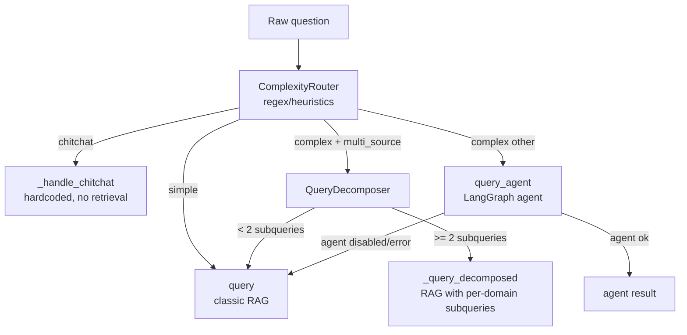
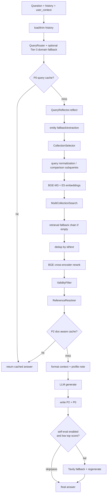
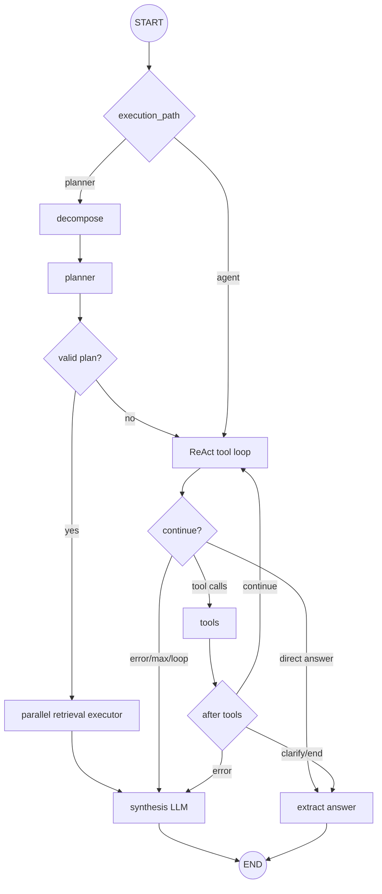

# RAG_v2 — Chatbot học vụ ĐHBK Hà Nội

`RAG_v2` là hệ thống chatbot học vụ cho Đại học Bách khoa Hà Nội. Hệ thống dùng RAG, hybrid search và LangGraph agent để trả lời câu hỏi dựa trên các nguồn dữ liệu nội bộ:

- `ctdt`: chương trình đào tạo, môn học, tín chỉ, học kỳ, điều kiện học phần.
- `quydinh`: quy chế, quy định học vụ, học bổng, tốt nghiệp, ngoại ngữ.
- `kehoach`: kế hoạch học kỳ, lịch đăng ký, thông báo, deadline.
- `stsv`: sổ tay sinh viên, thủ tục, biểu mẫu, hỗ trợ sinh viên.
- `test`: collection hợp lệ cho upload/dev.

Tài liệu tổng quan chi tiết nằm ở [ARCHITECTURE.md](ARCHITECTURE.md). Tài liệu từng module nằm trong các file `MODULE.md` tương ứng.

---

## Stack chính

| Layer | Công nghệ / file chính |
| --- | --- |
| API | FastAPI + SSE, `api/main.py`, `api/routes/chat.py` |
| Orchestration | `pipeline/rag_pipeline.py`, `pipeline/flows.py` |
| Agent | LangGraph `StateGraph`, `agent/react_agent.py` |
| Vector search | Qdrant, named vectors `bge_m3` + `e5` |
| Keyword search | Elasticsearch BM25 |
| Embedding | `BAAI/bge-m3` + `intfloat/multilingual-e5-large` |
| Reranking | `BAAI/bge-reranker-v2-m3` cross-encoder |
| Main LLM | DeepSeek `deepseek-v4-flash` qua OpenAI-compatible endpoint |
| Agent tool LLM | LM Studio local, mặc định `qwen2.5-7b-instruct` |
| Agent synthesis | Gemini/Ollama/LM Studio theo settings |
| Persistence | MongoDB qua Motor và `MongoLogger` |
| Cache/rate limit | Redis tùy chọn |
| Web | React + Vite + TanStack Query + shadcn/Radix |
| Mobile | Expo/React Native + `@rag/shared` |

---

## Cấu trúc thư mục

```text
RAG_v2/
├── api/                    # FastAPI app, routes, response mapper, middleware
├── auth/                   # JWT, Microsoft OAuth, password, RBAC
├── routers/auth.py         # /auth endpoints
├── pipeline/               # RAGPipeline, RAG flows, DocumentPipeline
├── query/                  # ComplexityRouter, domain router, reflection, decomposer
├── retrieval/              # Qdrant, Elasticsearch, hybrid search, filters, resolver
├── embedding/              # BGE-M3, E5, ensemble embedders
├── reranking/              # BGE cross-encoder reranker
├── llm/                    # DeepSeek/Gemini/LM Studio providers, prompts, self-eval
├── agent/                  # LangGraph ReAct + planner-executor agent
├── models/                 # MongoDB models, Motor client, MongoLogger
├── schemas/                # Pydantic API contracts
├── cache/                  # Redis session/history/cache/rate-limit
├── chunking/               # Chunkers cho legal/curriculum/STSV/kehoach data
├── document_loader/        # PDF/Docx -> Markdown conversion and cleaning
├── scripts/                # CLI crawlers, indexers, metadata update tools
├── data/                   # Raw, cleaned, chunked domain datasets
├── eval/, evaluation/      # Golden datasets and evaluation runners
├── frontend/chat-companion/# React web app
├── mobile/                 # Expo mobile app
├── packages/shared/        # Shared TypeScript API/types/stores/utils
├── tools/                  # Tavily web search adapter
├── utils/                  # Storage, tracing, chunk indexing policy, helpers
└── docker-compose.yml      # Qdrant, ES, MongoDB, Redis local infra
```

---

## Kiến trúc runtime

```mermaid
flowchart TD
    User[User / Web / Mobile] --> API[FastAPI api/main.py]
    API --> ChatRoutes[Chat routes<br/>/chat, /chat/v3, /chat/stream]
    API --> AuthRoutes[/auth routes]
    API --> AdminRoutes[/admin document routes]
    API --> SessionRoutes[/session, /sessions]

    ChatRoutes --> Pipeline[RAGPipeline]
    Pipeline --> QueryLayer[query/<br/>complexity, domain, reflection, decomposer]
    Pipeline --> ClassicRAG[classic RAG flow]
    Pipeline --> Agent[LangGraph agent]

    ClassicRAG --> Retrieval[RetrievalService + MultiCollectionSearch]
    Agent --> Retrieval

    Retrieval --> BGE[BGE-M3 embedder]
    Retrieval --> E5[E5 embedder]
    Retrieval --> Qdrant[(Qdrant)]
    Retrieval --> ES[(Elasticsearch)]
    Retrieval --> Reranker[BGE reranker]

    ClassicRAG --> LLM[DeepSeek / configured chat LLM]
    Agent --> SynthLLM[Agent synthesis LLM]

    Pipeline --> Mongo[(MongoDB)]
    Pipeline --> Redis[(Redis optional)]

    AdminRoutes --> DocPipeline[DocumentPipeline]
    DocPipeline --> Loader[PDF -> Markdown -> Clean]
    DocPipeline --> Chunkers[Chunkers]
    DocPipeline --> Qdrant
    DocPipeline --> ES
    DocPipeline --> Mongo
```

Điểm quan trọng: `RAGPipeline.__init__()` tạo một `RetrievalService.from_settings(settings)` duy nhất, giữ các alias `_bge`, `_e5`, `_searcher`, `_reranker`, `_tavily`, rồi inject service này vào `agent.tool_adapters.inject_from_retrieval_service()`. Agent và classic RAG dùng chung embedder/searcher/reranker đã load sẵn, tránh cold-start lại model.

---

## Startup backend

FastAPI được tạo trong `api/main.py:create_app()` và chạy lifespan startup:

1. Load `.env` và `Settings`.
2. Khởi tạo `MongoLogger` nếu MongoDB enabled.
3. Khởi tạo Redis/session/cache/rate-limiter nếu enabled.
4. Build `RAGPipeline` trong executor để không block event loop.
5. Tạo MongoDB indexes cho sessions, turns, users, documents, mobile features.
6. Warmup local agent LLM nếu agent enabled.
7. Schedule auto crawler nếu `crawler_enabled=True`.

Khi shutdown, scheduler và Redis manager được đóng an toàn.

---

## Luồng xử lý sau khi user gửi query

### 1. API nhận request

Các endpoint chính:

| Endpoint | Luồng |
| --- | --- |
| `POST /chat` | Non-streaming, trả `ChatResponse` Pydantic |
| `POST /chat/v3`, `POST /api/chat/v3` | Non-streaming, shape debug ổn định cho UI |
| `POST /chat/stream` | SSE streaming |
| `GET /chat/suggest` | Suggested questions cho web/mobile |

`ChatRequest` gồm:

```python
question: str
mode: "auto" | "rag" | "agent" = "auto"
top_k: int = 5
history: list[HistoryMessage] | None
session_id: str | None
user_context: UserContext | None
user_id: str | None
```

Nếu có Bearer JWT hợp lệ, route lấy `user_id` và `user_context` từ user trong DB, rồi ghi đè identity gửi trong body. Body identity vẫn tồn tại cho web/dev client legacy chưa authenticated.

### 2. API resolve session và history

`api/dependencies.py` xử lý:

- Tạo mới hoặc khôi phục `session_id`.
- Ưu tiên Redis session nếu bật, fallback MongoDB.
- Parse `history` từ Pydantic sang dict.
- Sau khi pipeline ghi turn, sync Redis session metadata từ MongoDB để mobile session list có `title`, `turn_count`, `updated_at` mới nhất.

### 3. API chọn mode

```text
mode=auto   -> pipeline.query_v3()
mode=rag    -> pipeline.query()       # classic query pipeline, vẫn route intent/domain
mode=agent  -> pipeline.query_agent()
```

Các call pipeline nặng được chạy bằng `anyio.to_thread.run_sync` để tránh nghẽn event loop FastAPI.

---

## `query_v3()` smart routing

`query_v3()` là entrypoint auto chính cho `/chat` và `/chat/v3`.



`ComplexityRouter` trả:

```python
{
    "tier": "chitchat" | "simple" | "complex",
    "reason": str,
    "confidence": "high" | "medium",
    "complex_subtype": "comparison" | "multi_source" | "personal_check" | "general",
}
```

Các mode kết quả thường gặp:

| Mode | Ý nghĩa |
| --- | --- |
| `chitchat` | Câu xã giao, trả lời hardcoded trong `query_v3()` |
| `rag_v2` | Classic RAG |
| `rag_v2_decomposed` | Multi-source non-streaming đã tách sub-query |
| `agent` | LangGraph agent thành công |
| `rag_v2_fallback` | Agent bị tắt/lỗi, fallback về classic RAG |

Lưu ý streaming: `query_stream()` route `complex` vào agent nếu agent enabled và phát answer agent như một chunk cuối; streaming không dùng self-eval/Tavily fallback để giữ semantics token stream.

---

## Classic RAG flow

Classic RAG bắt đầu ở `RAGPipeline.query()`, sau đó đi vào `pipeline/flows.py:rag_flow()`.



Các bước chính:

1. `RAGPipeline.query()` auto-load history từ MongoDB nếu có `session_id` và request không gửi history.
2. `QueryRouter` dùng BGE-M3 + LogisticRegression để route intent/domain. Nếu confidence `< 0.55` và margin domain `< 0.25`, pipeline gọi Tier-3 Gemini domain classifier.
3. `rag_flow()` trim history theo giới hạn trong `flows.py`.
4. Kiểm tra P0 query-only cache nếu Redis LLM cache được inject.
5. `QueryReflector` strip PII, merge profile, rewrite câu hỏi thành standalone query, rồi extract `major_code`, `cohort`, `course_code`, `semester`, `academic_year`.
6. `CollectionSelector` chọn collection đích từ routing result. Ví dụ `quydinh` mở rộng sang `stsv`, `stsv` mở rộng sang `quydinh`.
7. Query so sánh ngành/khóa có thể được tách thành per-major/per-cohort retrieval subqueries.
8. Embed query bằng BGE-M3 và E5.
9. `MultiCollectionSearch` chạy Qdrant vector search và Elasticsearch BM25 song song trên các collection.
10. Metadata pre-filter dùng ES filter fallback chain:
   - `ctdt`: `major_code`, `major_name`, generic/null fallback.
   - `quydinh`: `applicable_cohort`/scope fallback.
   - `kehoach`: `date_str` theo tháng/năm.
   - `stsv`: không pre-filter.
11. Global fusion mặc định dùng min-max normalized vector/keyword weighted sum. Defaults hiện tại trong `Settings`: `vector_weight=0.8`, `keyword_weight=0.2`; query giống mã môn/học phần bias sang keyword ít nhất `0.6`.
12. Dedup candidate, rerank bằng BGE reranker, lọc theo threshold trước khi cắt top-k.
13. `ValidityFilter` bỏ tài liệu superseded theo `data/document_lineage.json`, nhưng giữ kết quả gốc nếu sau lọc còn quá ít.
14. `ReferenceResolver` phát hiện tham chiếu kiểu `Điều 5`, `khoản 1 Điều 5` và insert chunk được tham chiếu cùng tài liệu.
15. Kiểm tra P2 cache theo `(question, doc_ids, model)`.
16. Format context theo settings hiện tại: `context_doc_char_limit=2000`, `context_total_char_budget=12000`, `context_list_total_char_budget=24000`.
17. DeepSeek hoặc provider chat configured sinh câu trả lời.
18. Ghi P2 + P0 cache nếu có Redis LLM cache.
19. Nếu `self_eval_enabled=True`, top reranker score thấp hơn `self_eval_min_top_score=0.72`, và judge fail, pipeline có thể dùng Tavily fallback nếu `tavily_fallback_enabled=True`.
20. Nếu có `session_id`, `MongoLogger.log_turn()` ghi turn vào MongoDB và trả `turn_id`.

---

## Retrieval internals

`RetrievalService` là wrapper runtime cho:

- `bge_embedder`
- `e5_embedder`
- `searcher` (`MultiCollectionSearch`)
- `reranker`
- `tavily_tool`

Qdrant dùng một collection cho mỗi domain, mỗi point có hai named vectors:

```text
bge_m3: 1024 dim, cosine
e5:     1024 dim, cosine
```

Elasticsearch index có cùng tên collection và giữ text + metadata để BM25 search và metadata pre-search.

Output document nội bộ có shape chung:

```python
{
    "id": str,
    "text": str,
    "metadata": dict,
    "collection": str,
    "score": float,
    "vector_score": float | None,
    "keyword_score": float | None,
    "rerank_score": float | None,
}
```

API map shape này thành `RetrievedDocument` trong `schemas/chat.py`.

---

## Luồng xử lý của agent

Agent nằm trong `agent/react_agent.py:ReActAgent`, được gọi qua `RAGPipeline.query_agent()`.

### Agent entrypoint

```text
RAGPipeline.query_agent()
  -> init_agent_docs() ContextVar cho request hiện tại
  -> ReActAgent.run(question, history, user_context, complexity_subtype)
  -> AgentState.to_log_dict()
  -> MongoLogger.log_agent_trace()
  -> return answer + tools_used + tool_calls + sources
  -> nếu lỗi và require_agent=False: fallback classic RAG
```

### LangGraph topology



### Planner-executor path

`ReActAgent.run()` đặt `execution_path="planner"` khi `complexity_subtype` là `comparison` hoặc `multi_source`.

Các bước:

1. `_decompose_node()` dùng synthesis LLM để tách câu hỏi.
2. `_planner_node()` dùng synthesis LLM tạo JSON retrieval plan.
3. `_validate_plan()` chấp nhận plan khi ít nhất 50% step có `query` không rỗng và `collection` hợp lệ.
4. `_executor_node()` chạy các retrieval step song song qua `execute_retrieval_plan()`, có thể gọi `web_search_for_executor()` nếu step cần web.
5. `_synthesize_node()` tổng hợp câu trả lời tiếng Việt từ các tool outputs.

Mục tiêu của nhánh này là xử lý so sánh/multi-source bằng plan có kiểm soát, thay vì để local tool-calling model tự bịa kế hoạch nhiều nguồn.

### ReAct loop path

Nhánh mặc định cho `general` hoặc khi planner không tạo được plan đủ tốt:

1. Local LM Studio model chọn tool từ `LANGGRAPH_TOOLS`.
2. `_tools_node()` gọi adapter tương ứng trong `agent/tool_adapters.py`.
3. Agent lặp lại cho tới khi có direct answer, cần hỏi lại, lỗi tool, lặp tool trùng, hoặc đạt `agent_max_iterations`.
4. Nếu tool lỗi hoặc đạt giới hạn, agent chuyển sang synthesis để trả lời từ context đã có.
5. Nếu tool `clarify_question` được gọi, output `[CLARIFY]` được strip và trả thẳng cho user.

`LANGGRAPH_TOOLS` hiện chỉ expose 3 tool cho local ReAct LLM:

| Tool | Dùng khi |
| --- | --- |
| `rag_search` | Tìm một collection nội bộ |
| `web_search` | Tavily fallback khi DB thiếu hoặc cần thông tin mới |
| `clarify_question` | Hỏi lại khi query quá mơ hồ |

Các adapter legacy `multi_rag_search`, `compare_cohorts`, `compare_programs` vẫn còn trong `execute_tool()` để backward compatibility và tests, nhưng không còn schema-bound cho ReAct LLM. So sánh/multi-source ưu tiên đi qua planner-executor.

Agent-facing collection aliases:

| Agent name | Collection thật |
| --- | --- |
| `quy_dinh` | `quydinh` |
| `chuong_trinh` | `ctdt` |
| `ke_hoach` | `kehoach` |
| `ho_tro_sv` | `stsv` |

### Tool runtime và thread safety

Agent tools dùng runtime được inject từ `RetrievalService`, nên dùng chung model/searcher với classic RAG. `tool_adapters.py` có:

- `ContextVar` cho docs theo từng request: `init_agent_docs()`, `get_agent_docs()`.
- FIFO `_RAG_CACHE` 256 entries cho tool search.
- Serialize reranker calls bằng lock instance `self._lock` bên trong `BGEReranker.rerank` (mọi call path đều được bảo vệ) vì tokenizer BGE reranker không thread-safe.
- PII stripping trước embedding.
- Extract major/cohort từ query để truyền metadata hints vào retrieval.

---

## Streaming flow

`POST /chat/stream` trả SSE:

```text
data: {"type":"session","session_id":"..."}
data: {"type":"token","delta":"..."}
data: {"type":"metadata", ...}
data: {"type":"done"}
```

`query_stream()` route như sau:

- `chitchat`: stream trực tiếp qua `chitchat_flow_stream()`.
- `complex` + agent enabled: reflect query nếu cần, chạy `query_agent()`, rồi emit answer agent thành một chunk.
- `simple` hoặc agent disabled: chạy `rag_flow_stream()`, retrieval/rerank trước, sau đó stream token từ `chat_model.generate_stream()`.

Metadata cuối stream lấy từ `pipeline.last_*`, gồm `retrieved_documents`, `timings_ms`, `reflected_question`, `target_collections`, `collection_scores`, `routing_probabilities`, `applied_filters`, `collection_results`, `agent_trace`, `tools_used`, `iterations`, `turn_id`.

Streaming không chạy self-eval/Tavily fallback.

---

## Persistence, cache và observability

MongoDB:

| Collection | Mục đích |
| --- | --- |
| `users` | auth profiles, role, student metadata |
| `sessions` | session metadata |
| `turns` | một document cho mỗi lượt chat |
| `query_logs` | analytics log theo turn |
| `agent_traces` | LangGraph execution traces |
| `documents` | admin uploaded document records |
| `document_chunks` | chunk review/pipeline records |
| `bookmarks`, `bookmark_folders` | mobile saved answers |
| `feedback` | rating/comment |
| `notifications`, `notification_subscriptions` | mobile notification inbox/subscriptions |

Redis là optional và được điều khiển bởi `redis_enabled`, `use_redis_session`, `use_redis_cache`, `use_redis_history`, `rate_limit_enabled`.

Các key chính:

| Key pattern | Mục đích |
| --- | --- |
| `session:{sid}` | Session metadata |
| `user_sessions:{uid}` | Danh sách session của user |
| `history:{sid}` | Recent conversation messages |
| `llm_cache:{sha}` | Post-retrieval answer cache |
| `llm_cache:q:{sha}` | Pre-retrieval query-only cache |
| `doc_cache_tag:{did}` | Reverse index để invalidation theo document |
| `rate:min:{id}`, `rate:day:{id}` | Sliding-window rate limit |

Tracing nằm ở `utils/tracing.py:RequestTrace`; response có `timings_ms`, `request_trace`, `correlation_id`, filter trace, collection counts và agent trace.

---

## Data ingest

Có hai đường ingest:

### Offline/CLI scripts

```text
crawl -> save JSON -> chunk -> embed -> index Qdrant + ES -> retention
```

Các script chính nằm trong `scripts/`:

- `scripts.auto_crawler`: crawl `kehoach` và `quydinh`.
- `scripts.index_kehoach`, `scripts.index_quydinh`, `scripts.index_stsv`: index Qdrant theo collection.
- `scripts.index_to_es`: index Elasticsearch.
- `scripts.update_metadata`: migration/cập nhật metadata.

### Admin upload pipeline

Admin upload nằm ở `api/routes/upload.py` và `pipeline/document_pipeline.py`.

```mermaid
flowchart TD
    Upload[Admin uploads PDF] --> Store[LocalStorage uploads/{doc_id}/original.pdf]
    Store --> DocRecord[Mongo documents: uploaded]
    DocRecord --> Convert[convert_pdf<br/>pymupdf4llm or docling]
    Convert --> Markdown[markdown.md]
    Markdown --> Clean[clean_markdown]
    Clean --> Cleaned[cleaned.md]
    Cleaned --> Chunk[chunk selected strategy]
    Chunk --> Chunks[Mongo document_chunks]
    Chunks --> Policy[is_indexable_chunk]
    Policy --> Embed[BGE-M3 + E5]
    Embed --> Qdrant[Qdrant upsert]
    Embed --> ES[Elasticsearch bulk index]
    ES --> Indexed[Mongo documents: indexed]
```

Status lifecycle:

```text
uploaded -> converting -> converted -> cleaning -> cleaned
-> chunking -> chunked -> embedding -> indexed
```

Failure state: `failed`.

`utils/chunk_indexing.py:is_indexable_chunk()` bỏ qua chunks có `metadata.level` là `parent` hoặc `header`. Parent/header chunks vẫn có thể nằm trong Mongo để review, nhưng không chiếm retrieval slots.

---

## Evaluation

Hai nhóm đánh giá chính:

- `evaluation/`: offline two-layer eval, current policy eval, historical email eval, search strategy benchmark, dashboard artifacts.
- `eval/`: golden dataset legacy, RAGAS tooling, agent eval.

Entrypoints thường dùng:

```bash
python -m evaluation.two_layer_eval current --persist
python evaluation/evaluate_current_pipeline.py --golden eval/golden_dataset.json --labels evaluation/search_strategy_labels.jsonl --k 10
python eval/RAG/ragass_evaluator.py --mode full_rag
```

Dashboard eval đọc qua:

```http
GET /metrics/eval?suite=current_policy&limit=10
GET /metrics/eval?suite=historical_email&limit=10
```

---

## Local development

Từ thư mục `src/RAG_v2`:

```bash
# Infra local
docker compose up -d qdrant elasticsearch mongodb redis

# Backend
make backend
# tương đương:
# .venv/bin/python backend/main.py

# Web frontend
cd frontend/chat-companion
npm run dev
```

Hoặc từ root `src/RAG_v2` cho workspace frontend:

```bash
npm run dev:web
```

Ports mặc định:

| Service | Port |
| --- | --- |
| Backend API | `8000` |
| Qdrant | `6333` |
| Elasticsearch | `9200` |
| MongoDB | `27017` |
| Redis | `6379` |
| Frontend | `5173` |

Settings load từ `src/RAG_v2/.env` và environment variables qua `config/settings.py`.

---

## Module docs

| Module | Tài liệu | Nội dung chính |
| --- | --- | --- |
| `api/` | [api/MODULE.md](api/MODULE.md) | FastAPI routes, lifespan, streaming, response mapper |
| `pipeline/` | [pipeline/MODULE.md](pipeline/MODULE.md) | `RAGPipeline`, `rag_flow`, `DocumentPipeline`, routing |
| `query/` | [query/MODULE.md](query/MODULE.md) | ComplexityRouter, DomainClassifier, Decomposer, Reflector |
| `retrieval/` | [retrieval/MODULE.md](retrieval/MODULE.md) | `RetrievalService`, hybrid search, metadata filters, resolver |
| `embedding/` | [embedding/MODULE.md](embedding/MODULE.md) | BGE-M3, E5, ensemble |
| `reranking/` | [reranking/MODULE.md](reranking/MODULE.md) | BGE reranker, thresholds, table handling |
| `llm/` | [llm/MODULE.md](llm/MODULE.md) | DeepSeek, Gemini, LM Studio, prompts, self-eval |
| `agent/` | [agent/MODULE.md](agent/MODULE.md) | LangGraph topology, planner-executor, ReAct tools |
| `cache/` | [cache/MODULE.md](cache/MODULE.md) | Redis LLM cache, session, history, rate limiter |
| `models/` | [models/MODULE.md](models/MODULE.md) | MongoDB models, indexes, MongoLogger |
| `data/` | [data/MODULE.md](data/MODULE.md) | Data sources, chunk schema, lineage |
| `scripts/` | [scripts/MODULE.md](scripts/MODULE.md) | Crawlers, indexers, metadata scripts |
| `evaluation/` | [evaluation/MODULE.md](evaluation/MODULE.md) | Offline eval, artifacts, dashboard |
| `chunking/` | [chunking/README.md](chunking/README.md) | Chunking pipeline details |

---

## Short mental model

```text
Client gửi câu hỏi
  -> FastAPI xác thực, resolve session, parse history/user_context
  -> RAGPipeline smart-routes
     -> chitchat: trả lời nhẹ, không retrieval
     -> simple: classic RAG
     -> multi-source: decomposed RAG trong non-streaming auto
     -> complex: LangGraph agent, fallback classic RAG nếu cần
  -> RetrievalService tìm Qdrant + Elasticsearch
  -> BGE reranker chọn chunks cuối
  -> DeepSeek/agent synthesis tạo câu trả lời grounded
  -> Mongo/Redis lưu history, cache, telemetry
  -> API map response cho web/mobile
```
