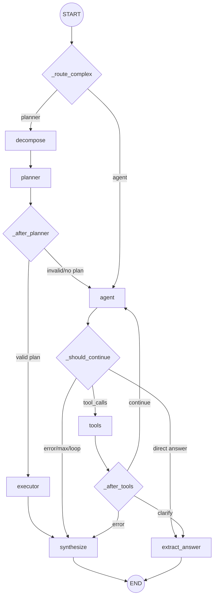

# Module: `agent` — LangGraph Agentic RAG & Planner-Executor Layer

## 1. Tổng quan

Module `agent` là tầng xử lý câu hỏi phức tạp của RAG v2. Nó dùng **LangGraph** để chọn giữa hai luồng:

- **Planner-Executor path**: dành cho `complexity_subtype in ("comparison", "multi_source")`. Luồng này dùng synthesis LLM để tách câu hỏi, lập retrieval plan JSON, chạy các bước retrieval song song, rồi tổng hợp câu trả lời.
- **ReAct Agent loop path**: dành cho `general` hoặc khi planner không tạo được plan đủ tốt. Luồng này dùng local/tool-calling LLM để gọi tool từng bước, có loop defense và graceful synthesis fallback.

Module này không tự expose HTTP API. Nó được gọi từ `pipeline.RAGPipeline.query_agent()` và trả về `AgentState` để pipeline map sang response, MongoDB trace và UI debug metadata.

---

## 2. Cấu trúc module hiện tại

```text
agent/
├── __init__.py          # Public exports của module agent
├── graph_state.py       # AgentGraphState TypedDict cho LangGraph runtime
├── lc_tools.py          # LangChain StructuredTool schemas + TOOL_MAP
├── prompts.py           # Agent, synthesis, decompose, planner prompts
├── react_agent.py       # ReActAgent, LangGraph nodes, routing, state conversion
├── state.py             # AgentState + ToolResult dataclasses cho persistence/logging
├── tool_adapters.py     # Tool dispatcher, retrieval/web adapters, cache, ContextVar docs
└── MODULE.md            # Tài liệu module này
```

Không có `complexity_router.py` trong module này. Complexity routing nằm ngoài module `agent` và truyền `complexity_subtype` vào `ReActAgent.run()`.

---

## 3. Public API và exports

`agent/__init__.py` export các symbol chính:

- State: `AgentState`, `ToolResult`, `AgentGraphState`
- Tool registry: `LANGGRAPH_TOOLS`, `TOOL_MAP`
- Execution helpers: `execute_tool`, `execute_retrieval_plan`, `cache_clear`, `set_runtime`, `web_search_for_executor`
- Per-request docs: `init_agent_docs`, `get_agent_docs`
- Agent runtime: `ReActAgent`
- Prompts: `AGENT_SYSTEM_PROMPT`, `SYNTHESIS_PROMPT`, `DECOMPOSE_SYSTEM_PROMPT`, `PLANNER_SYSTEM_PROMPT`

`tool_adapters.inject_from_retrieval_service()` cũng là API quan trọng nhưng hiện không nằm trong `__all__`. `RAGPipeline.__init__` import trực tiếp function này để inject shared `RetrievalService`.

---

## 4. LangGraph topology



### Entry routing

`ReActAgent.run()` sets `execution_path`:

- `"planner"` when `complexity_subtype` is `"comparison"` or `"multi_source"`.
- `"agent"` otherwise.

`_route_complex()` reads `execution_path` and starts at `decompose` or `agent`.

### Planner path

1. `_decompose_node()` calls `_synthesis_llm` with `DECOMPOSE_SYSTEM_PROMPT`.
2. `_planner_node()` calls `_synthesis_llm` with `PLANNER_SYSTEM_PROMPT`.
3. `_validate_plan()` accepts the plan only when at least 50% of steps have a non-empty `query` and valid `collection`.
4. `_executor_node()` calls `execute_retrieval_plan()` and optional `web_search_for_executor()` if `needs_web=true`.
5. `_synthesize_node()` writes the final Vietnamese answer from collected `ToolMessage` contents.

### ReAct loop path

1. `_agent_node()` calls local/tool-calling LLM bound to `LANGGRAPH_TOOLS`.
2. `_should_continue()` routes to `tools`, `extract_answer`, or `synthesize`.
3. `_tools_node()` invokes tools from `TOOL_MAP`.
4. `_after_tools()` stops immediately for `clarify_question`, synthesizes on `[Loi...]`, otherwise loops back.

---

## 5. Tool system

### Tools available to the LangGraph ReAct loop

`LANGGRAPH_TOOLS` currently contains exactly 3 StructuredTools:

| Tool | Input schema | Khi dùng |
|---|---|---|
| `rag_search` | `RagSearchInput(query, collection)` | Tìm trong một collection nội bộ |
| `web_search` | `WebSearchInput(query)` | Tavily fallback khi DB không đủ hoặc cần thông tin rất mới |
| `clarify_question` | `ClarifyInput(message, options)` | Hỏi lại khi câu hỏi quá mơ hồ |

Các collection agent-facing hợp lệ:

| Agent name | Real collection | Nội dung |
|---|---|---|
| `quy_dinh` | `quydinh` | Quy định học vụ, học bổng, tốt nghiệp, kỷ luật, ngoại ngữ |
| `chuong_trinh` | `ctdt` | Môn học, tín chỉ, chương trình đào tạo, tiên quyết |
| `ke_hoach` | `kehoach` | Lịch đăng ký học phần, lịch thi, deadline, kế hoạch học kỳ |
| `ho_tro_sv` | `stsv` | Biểu mẫu, giấy tờ, thủ tục, hỗ trợ sinh viên |

### Adapter-only tools

`execute_tool()` vẫn hỗ trợ `multi_rag_search`, `compare_cohorts`, và `compare_programs` để backward compatibility, tests và các caller trực tiếp. Tuy nhiên các tool này **không còn nằm trong `LANGGRAPH_TOOLS`**, nên local ReAct LLM không được schema-bind trực tiếp với chúng. So sánh/multi-source hiện được ưu tiên xử lý bằng Planner-Executor path.

### Clarification sentinel

`_clarify_question()` trả về chuỗi bắt đầu bằng `CLARIFY_SENTINEL` (`"[CLARIFY]"`). `ReActAgent._relay_last_clarify_output()` strip sentinel trước khi trả final answer, giúp API/UI nhận nội dung hỏi lại sạch.

---

## 6. Runtime, retrieval và thread safety

### Runtime injection

`tool_adapters` có `_AdapterRuntime` gồm:

- `settings`
- `bge_embedder`
- `e5_embedder`
- `searcher`
- `reranker`
- `tavily_tool`

Pipeline nên gọi `inject_from_retrieval_service(retrieval_service)` để chia sẻ model/searcher đã load sẵn từ `RetrievalService`, tránh cold-start lại BGE-M3, E5 và reranker. `set_runtime(runtime_or_none)` dùng chủ yếu cho tests hoặc reset về lazy-init.

### Per-request retrieved docs

`_agent_docs_ctx` là `ContextVar[list[dict] | None]` để gom tài liệu cho UI/debug theo từng request:

1. Pipeline gọi `init_agent_docs()` trong worker thread trước `agent.run()`.
2. `_rag_search()` và `_format_web_results()` gọi `_append_agent_docs(...)`.
3. Pipeline gọi `get_agent_docs()` sau run để đưa vào `sources`.

Không append vào global list khi thêm logic retrieval mới.

### RAG cache và reranker lock

- `_RAG_CACHE`: FIFO in-memory cache 256 entries, key theo `(retrieval_query, collection, top_k, cohort, major)`.
- `_CACHE_LOCK`: bảo vệ cache.
- `_RERANKER_LOCK`: serialize reranker calls vì tokenizer của BGE reranker không thread-safe.
- `cache_clear()` dùng cho tests hoặc sau data update.

### Query sanitization và metadata hints

`strip_personal_identifiers()` loại mã sinh viên 8 chữ số và prefix kiểu `mã sv`, `mssv` khỏi query trước embedding. `_rag_search()` tự extract:

- major code từ query nếu chỉ có một mã ngành.
- cohort `Kxx` từ query hoặc `resolved_cohort`.

Khi có `resolved_major`, vector query được strip major scaffold để giảm nhiễu nhưng ES keyword vẫn dùng `raw_query` để giữ tín hiệu exact phrase.

---

## 7. State model

### `AgentGraphState`

`AgentGraphState` là `TypedDict` dùng trong LangGraph runtime. Các field quan trọng:

- `messages`: reducer `add_messages`, chứa system/user/AI/tool history.
- `tool_call_history`: tên tool đã chạy.
- `tool_call_signatures`: signature `toolname:arghash` để detect exact duplicate.
- `iteration`, `max_iterations`, `final_answer`, `error`.
- Planner fields: `execution_path`, `sub_questions`, `retrieval_plan`, `user_context`, `empty_result_count`.

### `AgentState`

`AgentState` là dataclass persistence/logging, được tạo ở `_to_agent_state()` sau graph run:

- `tool_results`: kết quả tool gần nhất dùng cho context, giới hạn bởi `_CONTEXT_WINDOW_TOOL_LIMIT = 3` khi dùng `add_tool_result()`.
- `_log_tool_results`: full log không cắt, dùng bởi `to_log_dict()` và MongoDB.
- `tool_call_history`, `iteration`, `final_answer`, `route`, `error`.

`_to_agent_state()` rebuild `ToolResult` từ `ToolMessage` trong graph history để log đầy đủ tool output thực tế.

---

## 8. LLM roles và cấu hình

`ReActAgent` dùng `ChatOpenAI` compatible endpoints:

| Role | Source setting | Mặc định hiện tại | Mục đích |
|---|---|---|---|
| Tool-calling agent | `agent_model`, `lm_studio_url/base_url` | `qwen2.5-7b-instruct` | Chọn và gọi `LANGGRAPH_TOOLS` |
| Synthesis/planner/decomposer | `agent_synthesis_provider`, `agent_synthesis_model` | `gemini`, `gemini-2.5-flash` | Decompose, plan, synthesize final answer |

Supported synthesis providers trong code: `gemini`, `ollama`, hoặc default LM Studio endpoint khi provider rỗng/khác.

Các knobs chính trong `Settings`:

- `agent_enabled`
- `agent_max_iterations`
- `agent_temperature`
- `agent_max_tokens`
- `agent_tool_result_limit`
- `agent_synthesis_provider`
- `agent_synthesis_model`
- `agent_synthesis_temperature`
- `agent_synthesis_max_tokens`

Lưu ý: `agent_context_token_budget` được đọc bằng `getattr(settings, ..., 3200)` trong `ReActAgent`, nhưng chưa khai báo explicit trong `Settings`.

---

## 9. Safety và fallback behavior

- `_trim_messages_for_context()` giữ system message và human query cuối; truncate `ToolMessage` xuống 600 chars nếu vượt budget; sau đó drop block tool cũ nếu vẫn quá dài.
- `_make_call_sig()` dùng MD5 8-char từ args JSON để chặn exact duplicate tool call.
- `_should_continue()` cho phép lặp `rag_search` và `clarify_question` với args khác, nhưng synthesize nếu tool khác bị gọi lại.
- `_agent_node()` có retry hint khi tool trả `[Khong tim thay...]`; sau 2 empty results sẽ set `error` để ép synthesize.
- `_after_tools()` synthesize sớm khi tool trả `[Loi...]`.
- `_synthesize_node()` relay trực tiếp clarify output, nếu không có tool content thì trả fallback message khuyên liên hệ Phòng Đào tạo.
- `execute_tool()` không ném exception ra graph; lỗi tool được convert thành string `[Loi...]`.

---

## 10. Test/check liên quan

Các checks nhanh cho module:

```bash
./.venv/bin/python -m py_compile agent/*.py
./.venv/bin/python -m pytest tests/test_adapters.py tests/test_constants.py -q -m "not integration"
```

Các test có integration hoặc phụ thuộc LLM/service:

- `tests/test_agent_langgraph.py`: mock LangGraph/LLM behavior, có một số scenario legacy tool-call.
- `tests/test_adapters.py -m integration`: cần Qdrant/Elasticsearch/local models/Tavily tùy case.
- `tests/test_chat_route_mode.py`: kiểm tra API route mapping và legacy agent trace behavior.

---

## 11. Quy tắc maintenance

1. Trước khi sửa code trong `agent/`, đọc file này và `AGENTS.md`.
2. Khi thêm tool cho ReAct loop, cập nhật đồng thời schema trong `lc_tools.py`, adapter trong `tool_adapters.py`, `LANGGRAPH_TOOLS`, `TOOL_MAP`, prompts và tài liệu này.
3. Khi chỉ thêm adapter callable cho caller trực tiếp, cập nhật `execute_tool()` dispatch và ghi rõ adapter đó có nằm trong `LANGGRAPH_TOOLS` hay không.
4. Khi sửa graph node/edge trong `react_agent.py`, cập nhật Mermaid topology và phần routing.
5. Khi thêm retrieval/web result phục vụ UI, dùng `_append_agent_docs()` qua ContextVar, không dùng global mutable list.
6. Khi thay đổi planner JSON contract, cập nhật `PLANNER_SYSTEM_PROMPT`, `_validate_plan()`, `execute_retrieval_plan()` và test tương ứng.
7. Nếu thay đổi behavior cấp pipeline/API hoặc public contract agent trace, cập nhật cả `PROJECT_MEMORY.md`.

---
