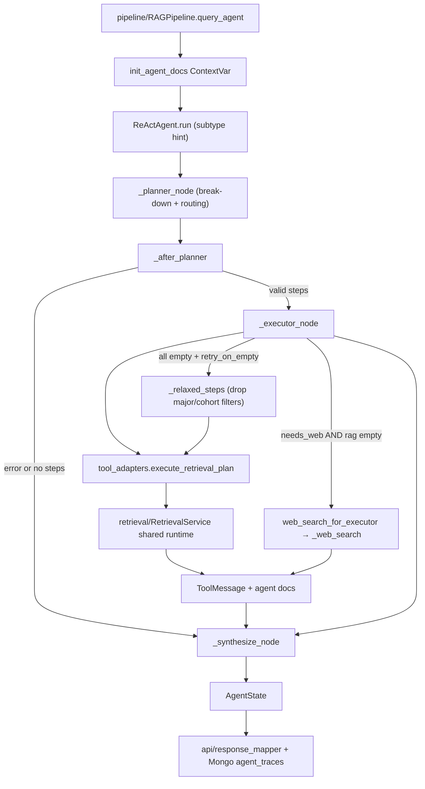

# Module: `agent`

Đã xác thực mã nguồn (Source-verified): 2026-06-24 từ `agent/__init__.py`, `agent/react_agent.py`, `agent/planning.py`, `agent/tool_adapters.py`, `agent/graph_state.py`, `agent/state.py`, `agent/prompts.py`, `agent/lc_tools.py`.

## Mục Đích (Purpose)

Module `agent` là tầng Agentic RAG được sử dụng bởi `RAGPipeline.query_agent()` để xử lý các câu hỏi phức tạp. Nó không trực tiếp định nghĩa (expose) các HTTP route. Đối tượng gọi công khai (public caller) là `pipeline`, làm nhiệm vụ chuyển đổi `AgentState` cuối cùng thành API metadata, tài liệu đã truy xuất (retrieved documents), traces lưu vào MongoDB, và payload debug cho UI.

Tên class công khai vẫn giữ là `ReActAgent` để đảm bảo tính tương thích khi import, nhưng đồ thị chạy thực tế (runtime graph) hiện chỉ bao gồm mô hình Planner-Executor. Vòng lặp liên kết tool (tool-binding loop) cũ của LangGraph và luồng clarify tool đã bị loại bỏ. Node phân tách (decompose node) riêng biệt cũng không còn: hiện tại `planner` (bộ lập kế hoạch) thực hiện cả việc chia nhỏ câu truy vấn (so sánh / nhiều khía cạnh) lẫn điều hướng tới các collection (routing) chỉ trong một lần gọi LLM duy nhất, và `complexity_subtype` được truyền vào như một gợi ý cho prompt của planner thay vì được dùng làm điều kiện tiên quyết cho bước decompose trước đó.

## Cấu Trúc File (File Map)

```text
agent/
  __init__.py       Exports công khai cho state, adapters, prompts, và ReActAgent.
  graph_state.py    AgentGraphState TypedDict (trạng thái runtime của LangGraph).
  state.py          AgentState và ToolResult dataclasses dùng để logging/API.
  prompts.py        SYNTHESIS_PROMPT, PLANNER_SYSTEM_PROMPT.
  planning.py       Các hàm hỗ trợ thuần túy cho planner: phân tích JSON, xem trước trace, chuẩn hóa phạm vi thực thể (entity-scope) của plan.
  react_agent.py    Điều phối đồ thị Planner-Executor, gợi ý subtype, xác thực plan, các node executor/synthesis.
  tool_adapters.py  Điều phối tool, các adapter cho retrieval/web, RAG cache, chia sẻ runtime, các ContextVar docs.
```

## Các Contract Công Khai (Public Contracts)

`agent.__init__` xuất ra (thông qua `__all__`):

- `ReActAgent`
- `AgentState`, `ToolResult`, `AgentGraphState`
- `execute_retrieval_plan()`, `web_search_for_executor()`
- `set_runtime()`, `cache_clear()`
- `init_agent_docs()`, `get_agent_docs()`
- `SYNTHESIS_PROMPT`, `PLANNER_SYSTEM_PROMPT`

`tool_adapters.inject_from_retrieval_service()` là một runtime hook quan trọng mặc dù nó không nằm trong `__all__`. `RAGPipeline.__init__()` gọi nó sau khi khởi tạo `RetrievalService` dùng chung.

Chữ ký hàm `ReActAgent.run()` (được gọi bởi pipeline):

```python
agent.run(
    query: str,
    session_id: str = "",
    history: list[dict[str, str]] | None = None,
    complexity_subtype: str | None = None,
    user_context: dict[str, Any] | None = None,
    top_k: int | None = None,
) -> AgentState
```

Tham số `history` được chấp nhận để đảm bảo khả năng tương thích chữ ký hàm, nhưng không được sử dụng bởi đồ thị hiện tại.

## Luồng Thực Thi Runtime (Runtime Flow)

```text
RAGPipeline.query_agent()
  -> init_agent_docs()                       (ContextVar cho từng request)
  -> ReActAgent.run(query, session_id, history, complexity_subtype, user_context, top_k)
     -> planner xây dựng + xác thực một kế hoạch truy xuất bằng JSON (START -> planner)
     -> executor nếu kế hoạch hợp lệ và có các bước; ngược lại chuyển sang synthesize
     -> synthesize
  -> state.to_log_dict() -> Mongo agent_traces
  -> get_agent_docs() -> các tài liệu truy xuất cho API/UI
```

Hành vi của các node Planner-Executor:

- Đồ thị chạy là `START -> planner -> executor? -> synthesize -> END`. Không có node decompose và không có `route_entry`; `execution_path` luôn là `"planner"` (được giữ lại trong state để đảm bảo tính tương thích khi log).
- `_subtype_hint()` biến đổi `complexity_subtype` thành một chỉ thị ngắn bằng tiếng Việt được nối thêm vào prompt của planner (ví dụ: so sánh -> tách theo từng thực thể; nhiều nguồn -> một bước cho từng khía cạnh/collection). Việc này thay thế bước decompose cũ với chi phí LLM bằng không.
- `_planner_node()` yêu cầu một kế hoạch dưới dạng JSON (`steps`, `needs_web`, `reasoning`) sử dụng `PLANNER_SYSTEM_PROMPT` + gợi ý subtype, giữ lại tối đa 4 bước, và ủy quyền việc phân tích JSON / chuẩn hóa phạm vi thực thể cho các helper trong `planning.py`. Planner tự thực hiện việc chia nhỏ nhiều khía cạnh (ví dụ: "điều kiện tốt nghiệp" -> các bước `quy_dinh` + `chuong_trinh`) theo các quy tắc trong prompt của nó.
- Chuỗi JSON (có thể được rào bằng markdown) được phân tích bởi `planning._parse_json_object()` thông qua một wrapper tương thích mỏng trong `react_agent.py`; không sử dụng cách lột bỏ dấu backtick thô sơ.
- `_validate_plan()` yêu cầu phải có danh sách `steps` không rỗng, trong đó mỗi bước có một `query` không rỗng và một `collection` nằm trong `_VALID_COLLECTIONS`. Nếu JSON không hợp lệ, không có bước nào, hoặc collection không hợp lệ, sẽ gán `state.error` (`planner_invalid_json` / `planner_empty_steps` / `planner_invalid_plan`); `RAGPipeline.query_agent()` sở hữu chính sách xử lý lỗi (fallback policy) này.
- `_after_planner()` điều hướng tới `"synthesize"` nếu có lỗi (`error`), nếu không sẽ điều hướng tới `"executor"` khi kế hoạch được xác thực lại thành công.
- `_executor_node()` gọi `execute_retrieval_plan()` với `top_k` do pipeline cung cấp. Nếu tất cả các bước trả về rỗng và `_retry_on_empty` là `True` (mặc định), nó sẽ gọi `_relaxed_steps()` để loại bỏ các bộ lọc `major_hint`/`cohort_hint` và thử lại một lần qua `execute_retrieval_plan()`. Nếu quá trình thử lại trả về kết quả, những kết quả đó sẽ thay thế cho kết quả ban đầu. Phép tìm kiếm web (web search) chỉ được gắn thêm vào khi `needs_web` được bật **và** các bước RAG không tạo ra message nào hữu ích (web là công cụ fallback dự phòng, không phải luôn chạy song song). Nếu không có tool message không rỗng nào còn sót lại ngay cả sau khi thử lại relax-retry + web, nó sẽ gán `final_answer = _NO_INFO_ANSWER` **và** `error = "agent_no_results"`, để `RAGPipeline.query_agent()` lùi về RAG truyền thống thay vì khiến người dùng không có câu trả lời.
- `_synthesize_node()` viết câu trả lời cuối cùng bằng tiếng Việt từ nội dung của các `ToolMessage` không rỗng sử dụng `SYNTHESIS_PROMPT`. Nếu `final_answer` đã được thiết lập ở luồng trên thì sẽ truyền thẳng qua; nếu gọi LLM bị lỗi, nó sẽ tự động giảm cấp xuống kết quả thô bị cắt bớt.

## Luồng Module (Module Flow)



Ranh giới với các module bên ngoài (External module boundaries):

- Điểm vào và chính sách dự phòng (fallback policy) nằm trong module `pipeline`; `agent` trả về `AgentState` và các tài liệu thu thập được.
- Truy xuất (Retrieval) và Tavily được tiêm (injected) từ `retrieval/RetrievalService` dùng chung; `agent` không được tự ý tải (cold-load) các đối tượng embedders/searchers độc lập.
- Hình dạng API trả về cuối cùng thuộc sở hữu của `api/response_mapper.py` và `schemas/chat.py`.
- Các Prompt nằm trong module này; việc tạo đối tượng chat-model provider được dùng chung với `llm`/settings.

## Các Collection và Tra cứu đặc biệt

`web_search_for_executor()` là wrapper cho việc tìm kiếm web, nó tuân thủ thiết lập `TAVILY_FALLBACK_ENABLED` — nếu là `False`, nó trả về thông báo bị tắt vô điều kiện bất kể giá trị `needs_web` của planner. Nó ngoài ra còn xóa các thông tin định danh cá nhân trước khi gọi Tavily API. Các chuỗi trạng thái/lỗi dạng ngoặc (`[Loi: ...]`, `[Web fallback dang tat ...]`) do wrapper trả về được `_append_web_executor_result()` coi là rỗng (qua `_is_web_error_text`) và KHÔNG bao giờ được đưa vào synthesis như một tool result.

Bảng định danh collection cho Agent (`COLLECTION_MAP`):

| Tên cho Agent | Tên Collection Qdrant nội bộ |
| --- | --- |
| `chuong_trinh` | `ctdt` |
| `quy_dinh` | `quydinh` |
| `ke_hoach` | `kehoach` |
| `ho_tro_sv` | `stsv` |

Lưu ý: `lich_thi` là một collection hợp lệ khác đối với agent nhưng nó KHÔNG có trong `COLLECTION_MAP` vì nó hoàn toàn bỏ qua Qdrant để sử dụng kho lưu trữ có cấu trúc là Elasticsearch/Mongo.

`_MAJOR_FILTERABLE_COLLECTIONS = frozenset({"chuong_trinh"})` — chỉ `ctdt` mới hỗ trợ bộ lọc `resolved_major` trên Qdrant; các collection khác dựa vào chuỗi câu truy vấn (query text) để xác định phạm vi.

## Trạng Thái và Logging (State And Logging)

`AgentGraphState` (TypedDict, trạng thái runtime của LangGraph). Các trường quan trọng:

- `messages` (được thu gọn (reduce) thông qua `add_messages`), `query`, `session_id`
- `tool_call_history` (ordered list of executor tool names)
- `iteration`, `max_iterations`, `final_answer`, `error`
- `execution_path`, `sub_questions`, `retrieval_plan`, `complexity_subtype`, `user_context`, `top_k`
- Chỉ dành cho Trace: `decompose_trace`, `planner_trace`, `executor_results`, `synthesis_trace`


`AgentState` (dataclass, dùng cho lưu trữ tĩnh/API). Được xây dựng bởi `_to_agent_state()`. Nó giữ lại:

- Các kết quả tool gần đây trong context-window tại `tool_results` (giới hạn tối đa bởi `_CONTEXT_WINDOW_TOOL_LIMIT = 3`).
- Log đầy đủ chưa bị cắt bớt ở `_log_tool_results` (được dùng bởi `to_log_dict()` cho Mongo). Không phải là trường khởi tạo (init field); `repr=False`.
- `tool_call_history`, `iteration` (gán thành `len(tool_call_history)` sau khi đồ thị chạy xong), `route` (mặc định là `"complex"`), `final_answer`, `error`, `execution_path`, `complexity_subtype`, `sub_questions`, `retrieval_plan`, và các dict dùng lưu vết (trace dicts).

Các trường trong `ToolResult` dataclass: `tool_name`, `args: dict`, `result: str`, `iteration: int`, `latency_ms: float`, `timestamp: str`. Hỗ trợ `__getitem__` để có khả năng truy cập kiểu dictionary nhằm đảm bảo tính tương thích ngược.

`AgentState.add_tool_result()` hỗ trợ 2 kiểu tham số gọi:
- `add_tool_result(tool_name, args_dict, result_str, latency_ms=0.0)` — kiểu chuẩn hóa
- `add_tool_result(tool_name, result_str)` — kiểu cũ; `args` sẽ trở thành `{}`

## Runtime Injection Và An Toàn Đa Luồng (Thread Safety)

`tool_adapters` sở hữu một `_AdapterRuntime` dataclass: `settings`, `bge_embedder`, `e5_embedder`, `searcher` (`MultiCollectionSearch`), `reranker` (tùy chọn), `tavily_tool` (tùy chọn), `exam_es_store` (tùy chọn). Runtime thông thường được tiêm (injected) thông qua `inject_from_retrieval_service()` từ `RetrievalService` dùng chung. `_build_runtime()` là phương án fallback tải lười (lazy fallback); `set_runtime(None)` khôi phục lại chế độ lazy mode.

Điều phối hàm `_rag_search()`: `_build_rag_request()` → kiểm tra cache → `_search_rag_candidates()` (nhúng bằng BGE+E5, gọi searcher) → `_rerank_or_trim_results()` → `_expand_parent_context_if_enabled()` → `_append_agent_docs()` → `_format_search_results()` → ghi vào cache.

`_format_web_results()` gọi `_formatting_settings()`, cái mà sẽ đọc `_RUNTIME.settings` nếu được thiết lập, nếu không sẽ gọi thẳng tới `Settings()` — do đó nếu luồng chạy chỉ dùng để định dạng (formatter-only) thì nó không tải nhầm (cold-load) các đối tượng embedders hay searchers.

Các quy tắc an toàn đa luồng (Thread-safety):

- Sử dụng các helper `ContextVar` là `init_agent_docs()`, `get_agent_docs()` và `_append_agent_docs()` cho tài liệu của từng request. Không được tự ý đưa vào các danh sách kết quả (result lists) dạng biến toàn cục (global).
- `clear_agent_docs()` là một hàm alias tương thích ngược dùng để đặt lại context thành danh sách rỗng (chứ không phải `None`).
- `_RAG_CACHE` là bộ đệm in-process FIFO (`_RAG_CACHE_MAX = 256`) với key là `(retrieval_query.lower(), collection, top_k, cohort, resolved_major.upper())` và được bảo vệ bởi `_CACHE_LOCK`.
- Việc tuần tự hóa Reranker nằm bên trong `BGEReranker.rerank` (`self._lock` ở cấp độ instance), do đó mọi luồng gọi đều được bảo vệ. `_RERANKER_LOCK` cũ ở cấp module đã bị xóa để tránh khóa kép (double-locking).
- `execute_retrieval_plan()` chạy các bước của plan trong một thread pool (`max_workers = min(4, len(steps))`) bằng cách sử dụng `contextvars.copy_context().run` cho mỗi task để `ContextVar` của docs được đồng bộ qua. Mỗi bước có giới hạn timeout là 45s; các lỗi sẽ được log và bước bị lỗi sẽ bị loại khỏi kết quả.

## Các Tùy Chỉnh Truy Xuất (Retrieval Knobs)

Hành vi của `_rag_search()`:

- `top_k` được truyền từ `RAGPipeline.query_agent()` vào `ReActAgent.run()` và `execute_retrieval_plan()`. Giá trị có hiệu lực `top_k = max(1, int(top_k or settings.top_k))`.
- Kho ứng viên thô (Raw candidate pool): `max(round(top_k * raw_candidate_multiplier), raw_candidate_min)`.
- Các đối số của Reranker (kwargs): `reranker_min_top_k` (bị giới hạn tối đa bởi `top_k`), `reranker_score_threshold`, `reranker_table_score_threshold`.
- Loại bỏ mã số sinh viên 8 chữ số và các tiền tố `mssv`/`mã sv` khỏi câu truy vấn trước khi lấy dữ liệu.
- Làm giàu (enrich) các từ khóa về ngành (major) thông qua `enrich_major_references_for_query()`.
- Đối với `chuong_trinh` có ngành (major) duy nhất/đã xác định: loại bỏ từ khóa ngành khỏi câu truy vấn lấy dữ liệu (`strip_major_from_query_for_retrieval`) vì bộ lọc (filter) đã xử lý việc xác định phạm vi này.
- Bỏ qua reranker đối với các câu truy vấn thuộc `chuong_trinh` có chứa từ khóa học kỳ (kỳ/kì/ky/chẵn/lẻ/đăng ký) để tránh việc reranker đánh rớt các bảng thông tin chương trình học dài.
- Mở rộng bối cảnh gốc một cách tùy chọn (`parent_context_enabled`, `parent_max_chars_agent`, mặc định là 500 ký tự); tự động loại bỏ các phần tử trùng lặp (deduplicate) bằng `parent_id` trong formatter.

## Cấu Hình (Settings)

Các cài đặt (settings) chính được module này sử dụng:

- `agent_enabled`, `agent_model`
- `lm_studio_base_url` / `lm_studio_url` / `lm_studio_api_key`
- `agent_max_iterations`, `agent_tool_result_limit`
- `agent_retry_on_empty` (kiểu bool, mặc định `True`) — bật tính năng thử lại sau khi nới lỏng bộ lọc (relax-and-retry) ở executor khi kết quả truy xuất rỗng.
- `agent_synthesis_provider`, `agent_synthesis_model`, `agent_synthesis_temperature`, `agent_synthesis_max_tokens`
- `agent_search_result_count`, `agent_search_result_char_limit`
- `raw_candidate_multiplier`, `raw_candidate_min`
- `reranker_min_top_k`, `reranker_score_threshold`, `reranker_table_score_threshold`
- `tavily_api_key`, `tavily_cache_maxsize`, `tavily_cache_ttl_seconds`, `tavily_fallback_enabled`, `tavily_max_results`, `tavily_search_depth`, `tavily_web_result_count`, `tavily_web_content_char_limit`
- `parent_context_enabled`, `parent_max_chars_agent`
- `elasticsearch_host`, `elasticsearch_port`, `exam_schedule_es_index` (dùng cho truy vấn `lich_thi`)

Các nhà cung cấp tổng hợp dữ liệu (synthesis providers) được hỗ trợ: `"gemini"` (thông qua endpoint API tương thích chuẩn OpenAI của Google Generative Language, model mặc định là `gemini-3.1-flash-lite`), `"ollama"` (thông qua Ollama cục bộ endpoint `/v1`), hoặc tùy chọn dự phòng tương thích LM Studio/OpenAI (tất cả đi qua `ChatOpenAI`). `localhost` trong các cấu hình base URL sẽ được thay thế bằng `127.0.0.1` để tương thích với LM Studio trên hệ điều hành macOS.

## Lưu Ý Bảo Trì (Maintenance Notes)

- Trước khi thay đổi cấu trúc đồ thị (graph topology), hãy cập nhật phần mô tả cấu trúc ở file này và trong `tests/test_agent_langgraph.py`.
- Khi bổ sung các hành vi mới cho adapter, hãy cập nhật `tool_adapters.py` và các bài test adapter trực tiếp tương ứng.
- Giữ `planning.py` là một file chức năng thuần túy (pure): không tải runtime hay model, không gọi hàm lấy dữ liệu (retrieval calls), không ghi vào `ContextVar`.
- Không sử dụng lại các schema dạng graph-bound tool mà không cập nhật chính sách dự phòng cho pipeline, những mong đợi về log truy vết API (API trace expectations), và các bài kiểm tra (tests) cho agent.
- Nếu bạn thay đổi các trường lưu vết (trace) công khai ở output, hãy nhớ cập nhật `api/response_mapper.py`, `schemas/chat.py`, các thành phần hiển thị trace ở giao diện frontend (nếu có), và cập nhật tài liệu ở file này.
- `clear_agent_docs()` không được export qua `__init__` — không được gọi trực tiếp nó từ bên ngoài module; dùng `init_agent_docs()` để thiết lập lại dữ liệu trên mỗi request.
- `_PLANNER_ERROR_ANSWER` được sử dụng bởi `_executor_node` khi danh sách các bước bị rỗng (xảy ra tình trạng chạy đua/race khi xác thực kế hoạch) và bởi `_synthesize_node` khi không có tool messages nào trả về đi kèm với lỗi (`error`); `_NO_INFO_ANSWER` là câu trả lời dự phòng cho trường hợp kế hoạch đã được xác thực hợp lệ nhưng trả về không có kết quả đầu ra (no-results-from-valid-plan).

## Các Lệnh Hữu Ích (Useful Checks)

```bash
python -m py_compile agent/*.py
python -m pytest tests/test_adapters.py tests/test_agent_langgraph.py tests/test_constants.py -q -m "not integration"
```
