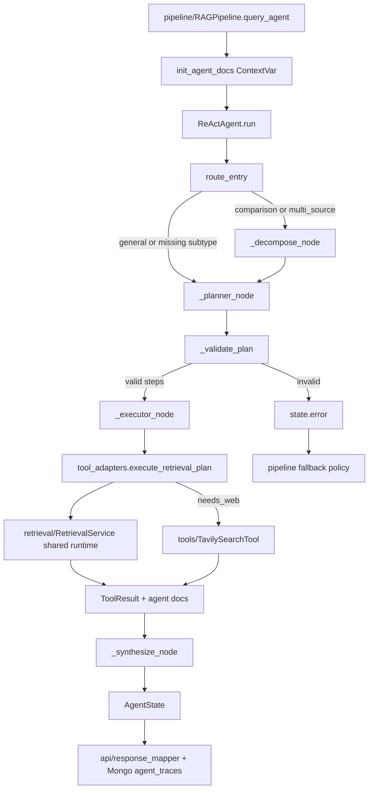

# Module: `agent`

Source-verified: 2026-06-02 from `agent/*.py`, `pipeline/rag_pipeline.py`, `config/settings.py`, and focused planner-executor tests.

## Purpose

`agent` is the agentic RAG layer used by `RAGPipeline.query_agent()` for complex questions. It does not expose HTTP routes directly. The public caller is the pipeline, which converts the final `AgentState` into API metadata, retrieved documents, Mongo traces, and UI debug payloads.

The public class name remains `ReActAgent` for import compatibility, but the runtime graph is now Planner-Executor only. The old LangGraph tool-binding loop and clarify tool path have been removed.

## File Map

```text
agent/
  __init__.py       Public exports for state, adapters, and ReActAgent.
  graph_state.py    AgentGraphState TypedDict used by LangGraph.
  lc_tools.py       Legacy direct wrapper functions; no graph-bound tools.
  prompts.py        System, synthesis, decomposition, and planner prompts.
  react_agent.py    Planner-Executor graph nodes, routing, validation, synthesis.
  state.py          AgentState and ToolResult dataclasses for logging/API.
  tool_adapters.py  Legacy tool dispatcher, retrieval/web adapters, cache, ContextVar docs.
```

## Public Contracts

`agent.__init__` exports:

- `ReActAgent`
- `AgentState`, `ToolResult`, `AgentGraphState`
- `execute_tool()`, `execute_retrieval_plan()`, `web_search_for_executor()`
- `set_runtime()`, `cache_clear()`
- `init_agent_docs()`, `get_agent_docs()`

`tool_adapters.inject_from_retrieval_service()` is an important runtime hook even though it is not in `__all__`. `RAGPipeline.__init__()` calls it after building the shared `RetrievalService`.

## Runtime Flow

```text
RAGPipeline.query_agent()
  -> init_agent_docs()
  -> ReActAgent.run(query, history, user_context, complexity_subtype, top_k)
     -> route_entry
        -> comparison/multi_source: decompose -> planner
        -> general/missing subtype: planner
     -> validate plan
     -> executor when the plan is valid and has steps
     -> synthesize
  -> get_agent_docs()
  -> API response mapper + Mongo agent trace
```

Planner-Executor behavior:

- `_decompose_node()` uses the synthesis LLM and `DECOMPOSE_SYSTEM_PROMPT` only for `comparison` and `multi_source`.
- `_planner_node()` asks for JSON retrieval steps.
- JSON fenced responses are parsed through the shared helper in `react_agent.py`; do not use naive backtick stripping.
- `_validate_plan()` requires non-empty steps and valid `query` plus `collection` fields.
- Planner invalid JSON, empty steps, or invalid collection sets `state.error`; `RAGPipeline.query_agent()` handles fallback policy.
- `_executor_node()` calls `execute_retrieval_plan()` with the pipeline-provided effective `top_k`, and optionally calls `web_search_for_executor()` for `needs_web`.
- Empty retrieval texts are filtered before synthesis. If every retrieval step is empty, the agent returns a deterministic no-information answer without triggering fallback.
- `_synthesize_node()` writes the final Vietnamese answer from non-empty tool results.

## Module Flow



External module boundaries:

- Entry and fallback policy live in `pipeline`; `agent` returns `AgentState` and collected docs.
- Retrieval and Tavily are injected from the shared `retrieval/RetrievalService`; the agent must not cold-load independent embedders/searchers.
- Final API shape is owned by `api/response_mapper.py` and `schemas/chat.py`.
- Prompts live in this module, but chat-model provider construction is shared with `llm`/settings.

## Legacy Tools

`execute_tool()` is kept as a compatibility wrapper for tests and older direct callers. It is not bound to the LangGraph agent.

Supported direct tool names:

- `rag_search`
- `multi_rag_search`
- `compare_cohorts`
- `compare_programs`
- `web_search`

Agent-facing collection aliases:

| Agent name | Internal collection |
| --- | --- |
| `chuong_trinh` | `ctdt` |
| `quy_dinh` | `quydinh` |
| `ke_hoach` | `kehoach` |
| `ho_tro_sv` | `stsv` |

## State And Logging

`AgentGraphState` is the mutable LangGraph state. Important fields:

- `messages`
- `tool_call_history`
- `execution_path`
- `sub_questions`, `retrieval_plan`
- `top_k`
- `final_answer`, `error`

`AgentState` is the persistence/API shape. It keeps:

- Recent context-window tool results in `tool_results`.
- Full, untrimmed log results in `_log_tool_results`.
- `tool_call_history`, `iterations`, `route`, `final_answer`, `error`.

## Runtime Injection And Thread Safety

`tool_adapters` owns an `_AdapterRuntime` with settings, BGE/E5 embedders, `MultiCollectionSearch`, optional reranker, and Tavily tool. Runtime must come from the shared `RetrievalService` so eval/admin/runtime overrides propagate to agent retrieval without loading heavy models twice.

Thread-safety rules:

- Use `_append_agent_docs()` and ContextVar helpers for per-request docs. Do not introduce global result lists.
- `_RAG_CACHE` is an in-process FIFO cache protected by `_CACHE_LOCK`.
- `_RERANKER_LOCK` serializes reranker access because tokenizer/runtime paths are not thread-safe.
- `execute_retrieval_plan()` runs plan steps in a thread pool and uses `contextvars.copy_context().run` per task.

## Retrieval Knobs

Agent retrieval uses the same runtime settings as classic RAG:

- `top_k` is passed from `RAGPipeline.query_agent()` into `ReActAgent.run()` and `execute_retrieval_plan()`.
- Raw candidate pool size comes from `raw_candidate_multiplier` and `raw_candidate_min`.
- Reranker calls receive `reranker_min_top_k`, `reranker_score_threshold`, and `reranker_table_score_threshold`.

## Settings

Main settings consumed by this module:

- `agent_enabled`
- `agent_model`
- `lm_studio_base_url` / `lm_studio_url`
- `agent_max_iterations`
- `agent_temperature`
- `agent_max_tokens`
- `agent_tool_result_limit`
- `agent_synthesis_provider`
- `agent_synthesis_model`
- `agent_synthesis_temperature`
- `agent_synthesis_max_tokens`
- `raw_candidate_multiplier`
- `raw_candidate_min`
- `reranker_min_top_k`
- `reranker_score_threshold`
- `reranker_table_score_threshold`

Supported synthesis providers in code: `gemini`, `ollama`, or an LM Studio/OpenAI-compatible fallback.

## Maintenance Notes

- Before changing graph topology, update the topology description here and tests in `tests/test_agent_langgraph.py`.
- When adding adapter behavior, update `tool_adapters.py` and direct adapter tests.
- Do not reintroduce graph-bound tool schemas without also updating pipeline fallback policy, API trace expectations, and agent tests.
- If changing public trace fields, update `api/response_mapper.py`, `schemas/chat.py`, frontend trace components, and this file.

## Useful Checks

```bash
python -m py_compile agent/*.py
python -m pytest tests/test_adapters.py tests/test_agent_langgraph.py tests/test_constants.py -q -m "not integration"
```
