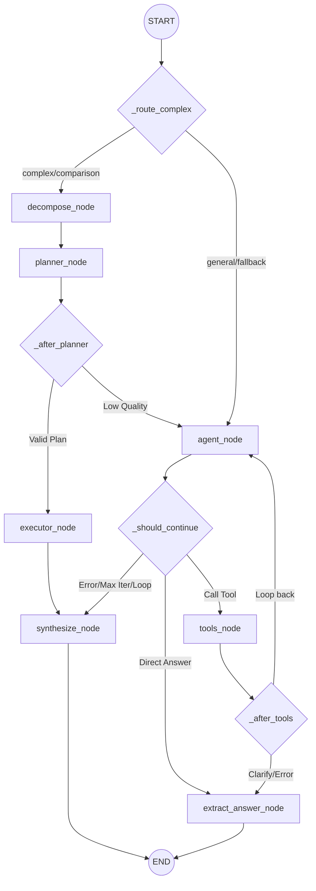

# Module: `agent` — LangGraph Orchestration & Planner-Executor Layer

## 1. Tổng quan kiến trúc (Dual-Path Orchestration)

Module `agent` là tầng điều phối thông minh nhất trong hệ thống RAG v2, chịu trách nhiệm chuyển đổi từ một pipeline tìm kiếm tuyến tính sang một hệ thống có khả năng suy luận, lập kế hoạch và tự sửa lỗi.

Kiến trúc dựa trên **LangGraph**, hỗ trợ hai luồng xử lý riêng biệt tối ưu cho các loại câu hỏi khác nhau:

### 1.1. Planner-Executor Path (Tối ưu Hiệu suất & So sánh)
- **Đối tượng**: Các câu hỏi phức tạp (So sánh mã ngành/mã khóa, đa nguồn dữ liệu).
- **Cơ chế**: Sử dụng LLM cấu hình mạnh (ví dụ: **Gemini**) để phân tích câu hỏi (`decompose_node`) và lập kế hoạch tìm kiếm (`planner_node`), sau đó thực thi các bước tìm kiếm **song song** (`executor_node`).
- **Ưu điểm**: Giảm latency từ ~60s xuống còn **8-15s** đối với các truy vấn phức tạp hoặc so sánh đa nguồn.

### 1.2. ReAct Agent Loop Path (Linh hoạt & Dynamic)
- **Đối tượng**: Các truy vấn tổng quát (General), mơ hồ (Ambiguous) hoặc các câu hỏi đơn giản cần công cụ.
- **Cơ chế**: Vòng lặp ReAct (Reasoning + Acting) truyền thống sử dụng mô hình local như **Qwen 2.5 8B**.
- **Ưu điểm**: Khả năng suy luận từng bước, tự sửa lỗi truy vấn, và hội thoại làm rõ thông tin (Clarification).

---

## 2. Cấu trúc Module

```text
agent/
├── react_agent.py        # Core Orchestrator — Định nghĩa LangGraph graph & Nodes logic
├── tool_adapters.py      # Execution Layer — Thực thi tool, Parallel Executor, Caching & Thread-safety
├── lc_tools.py           # LangChain Wrappers — Định nghĩa StructuredTools cho Agent
├── prompts.py            # System Prompts — Quản lý prompts cho Decompose, Planner, Agent & Synthesis
├── graph_state.py        # Internal State — Định nghĩa AgentGraphState (TypedDict) cho LangGraph
├── state.py              # External State — Định nghĩa AgentState (Dataclass) dùng để log MongoDB
└── __init__.py           # Module Exports — Public APIs
```

---

## 3. Các thành phần chính và Logic chuyên sâu

### 3.1. LangGraph Topology (Dual-Path Graph)



### 3.2. Planner-Executor: Cơ chế Lập kế hoạch & Song song hóa
- **Anti-bias Mechanism**: Trong node `decompose` và `planner`, hệ thống sẽ chặn không tự động tiêm `major_code` của sinh viên vào truy vấn nếu câu hỏi đã chứa ≥2 mã ngành hoặc có các từ khóa so sánh (`so sánh`, `khác gì`). Điều này tránh làm lệch (bias) luồng suy luận của LLM về một ngành duy nhất.
- **Parallel Executor**: Lớp `execute_retrieval_plan` (trong `tool_adapters.py`) sử dụng `ThreadPoolExecutor` để chạy tối đa 4 bước tìm kiếm đồng thời, giúp thời gian phản hồi không tăng tuyến tính theo số lượng câu hỏi con.
- **Plan Validation (`_validate_plan`)**: Kiểm tra chất lượng của JSON plan. Nếu <50% số bước (steps) hợp lệ (thiếu query hoặc sai collection), hệ thống sẽ fallback về luồng `agent` loop.

### 3.3. ReAct Agent: Chiến thuật Phòng thủ & Context Trimming
Do sử dụng mô hình Local (Qwen 8B) có budget ngữ cảnh hữu hạn (~3200 tokens), module áp dụng chiến thuật phòng thủ nghiêm ngặt:
- **Context Trimming (`_trim_messages_for_context`)**: 
  - Luôn giữ lại `SystemMessage` và câu hỏi `HumanMessage` cuối.
  - Khi vượt budget, nội dung `ToolMessage` được rút gọn (cắt xuống 600 chars).
  - Nếu vẫn đầy, tự động drop các cặp (AIMessage + ToolMessage) cũ nhất.
- **Loop & Duplicate Detection**: Sử dụng mã băm MD5 8-char (`_make_call_sig`) cho tham số tool. 
  - Chặn ngay lặp tool y hệt (cùng tên, cùng tham số). 
  - Nếu lặp cùng tên tool nhưng khác tham số (trừ `rag_search` và `clarify_question`), ép ngưng loop và gọi `synthesize`.
- **Retry Defense-in-depth**: Nếu tìm kiếm trả về trống `[Khong tim thay...]`, ở lần 1 sẽ inject một prompt nhắc Agent gỡ bỏ thông tin thừa. Lần 2 sẽ ép hội thoại kết thúc để tránh tốn LLM call.

### 3.4. Quản lý State: Phân tách Runtime và Persistence
- **`AgentGraphState` (Runtime)**: Là `TypedDict` có reducer `add_messages`. Chỉ tồn tại và dịch chuyển bên trong vòng lặp của LangGraph.
- **`AgentState` (Persistence)**: Được mapping sau khi graph chạy xong để sử dụng trong Pipeline và MongoDB. Phân chia rõ ràng:
  - `tool_results`: Giới hạn `_CONTEXT_WINDOW_TOOL_LIMIT` (3) để đưa vào context LLM.
  - `_log_tool_results`: Chứa **toàn bộ** log không bị cắt xén, đảm bảo UI và MongoDB nhận được thông tin đầy đủ nhất.

### 3.5. Cơ sở hạ tầng Công cụ (Tool Adapters & Thread-Safety)
- **Shared Runtime Injection (`set_runtime`)**: Pipeline tiêm trực tiếp các instance của `BGEm3Embedder`, `E5MultilingualEmbedder`, `Retriever` và `Reranker` vào Agent để tránh cold-start (~17s) mỗi lần chạy tool tìm kiếm.
- **Thread-safe Per-request Docs (`_agent_docs_ctx`)**: Sử dụng biến `ContextVar` để lưu danh sách tài liệu tìm được. Đảm bảo ở môi trường FastAPI đa luồng (multi-thread), tài liệu trả về của user này không bị lẫn sang UI của user khác.
- **RAG Cache**: In-memory FIFO cache (256 entries), băm theo `(query, collection, top_k, cohort, major)`, có lock an toàn.
- **Skip Rerank Heuristic**: Trong `chuong_trinh`, nếu query chứa các từ như `kỳ`, `kì`, `đăng ký`, bước Reranking sẽ tự động bị bỏ qua do reranker thường chấm điểm thấp và làm rơi rụng các tài liệu dạng bảng biểu dài.
- **PII Stripping (`strip_personal_identifiers`)**: Xóa mã sinh viên (chuỗi 8 số) hoặc tiền tố "mã sv:" khỏi query trước khi đưa vào embedding vector để tránh nhiễu.

---

## 4. LLM Roles (Phân vai mô hình)

Hệ thống cung cấp cơ chế `agent_synthesis_provider` linh hoạt, cho phép tách vai trò:

| Role | Mô hình cấu hình | Mục đích | Latency |
|---|---|---|---|
| **Orchestrator** | `agent_model` (VD: Qwen 8B Local) | Chạy ReAct loop, gọi tool. Cần tốc độ cao, deterministic. | Rất thấp |
| **Reasoner / Synthesizer** | `agent_synthesis_model` (VD: Gemini Flash / Qwen lớn hơn) | Decompose query, lập plan, và viết câu trả lời tổng hợp (Synthesis) tự nhiên nhất. | Trung bình |

---

## 5. Quy tắc cập nhật Module (Maintenance Rules)

1. **Bảo toàn `ContextVar`**: Bất kỳ logic nào cần thêm tài liệu hiển thị ra UI đều phải dùng `_append_agent_docs(items)` thay vì append global list.
2. **Thêm Tool mới**:
    - Khai báo schema chuẩn Pydantic tại `lc_tools.py`.
    - Viết logic thuần tại `tool_adapters.py`, trả về string thuần tuý. Đừng ném Exception sập graph, hãy trả về chuỗi có format `[Loi: ...]`.
    - Đăng ký map vào `execute_tool` và list `LANGGRAPH_TOOLS`.
3. **Sửa Graph Routing**: Nếu thêm edge hoặc node mới vào `react_agent.py`, bắt buộc cập nhật lại sơ đồ Mermaid trong tài liệu này.

---

## 6. Latency Benchmark (Tham khảo)

| Kịch bản | Thời gian phản hồi | Ghi chú |
|---|---|---|
| **Comparison (Planner)** | 8s - 15s | Lập kế hoạch (Gemini) + Song song RAG |
| **General (Agent Loop)** | 30s - 60s | Phụ thuộc vào số vòng lặp (~15-20s/vòng local) |
| **Simple Fallback** | 4s - 8s | Bỏ qua tool, trực tiếp synthesize |

---
*Cập nhật lần cuối: 2026-05-11 bởi Antigravity*
