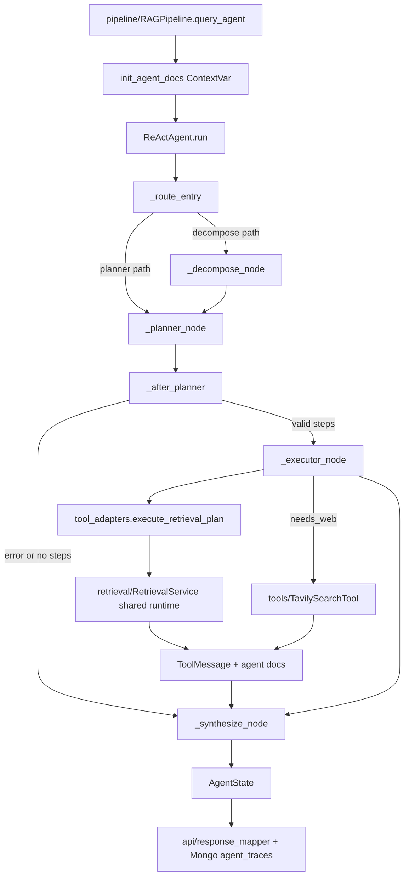

# Module: `agent`

Source-verified: 2026-06-05 from `agent/__init__.py`, `agent/react_agent.py`, `agent/tool_adapters.py`, `agent/graph_state.py`, `agent/state.py`, `agent/prompts.py`, `agent/lc_tools.py`, and `pipeline/rag_pipeline.py`.

## Purpose

`agent` is the agentic RAG layer used by `RAGPipeline.query_agent()` for complex questions. It does not expose HTTP routes directly. The public caller is the pipeline, which converts the final `AgentState` into API metadata, retrieved documents, Mongo traces, and UI debug payloads.

The public class name remains `ReActAgent` for import compatibility, but the runtime graph is now Planner-Executor only. The old LangGraph tool-binding loop and clarify tool path have been removed.

## File Map

```text
agent/
  __init__.py       Public exports for state, adapters, prompts, and ReActAgent.
  graph_state.py    AgentGraphState TypedDict (LangGraph runtime state).
  state.py          AgentState and ToolResult dataclasses for logging/API.
  prompts.py        AGENT_SYSTEM_PROMPT, SYNTHESIS_PROMPT, DECOMPOSE_SYSTEM_PROMPT, PLANNER_SYSTEM_PROMPT.
  react_agent.py    Planner-Executor graph: nodes, routing, plan validation, synthesis.
  tool_adapters.py  Tool dispatcher, retrieval/web adapters, RAG cache, shared runtime, ContextVar docs.
  lc_tools.py       Thin legacy wrapper functions delegating to execute_tool(); not graph-bound.
```

## Public Contracts

`agent.__init__` exports:

- `ReActAgent`
- `AgentState`, `ToolResult`, `AgentGraphState`
- `execute_tool()`, `execute_retrieval_plan()`, `web_search_for_executor()`
- `set_runtime()`, `cache_clear()`
- `init_agent_docs()`, `get_agent_docs()`
- `AGENT_SYSTEM_PROMPT`, `SYNTHESIS_PROMPT`, `DECOMPOSE_SYSTEM_PROMPT`, `PLANNER_SYSTEM_PROMPT`

`tool_adapters.inject_from_retrieval_service()` is an important runtime hook even though it is not in `__all__`. `RAGPipeline.__init__()` calls it after building the shared `RetrievalService`.

`ReActAgent.run()` signature (called by the pipeline):

```python
agent.run(query, session_id="", history=None, complexity_subtype=None,
          user_context=None, top_k=None) -> AgentState
```

`history` is accepted for signature compatibility but is not consumed by the current graph.

## Runtime Flow

```text
RAGPipeline.query_agent()
  -> init_agent_docs()                       (per-request ContextVar)
  -> ReActAgent.run(query, session_id, history, complexity_subtype, user_context, top_k)
     -> route_entry (from execution_path)
        -> comparison/multi_source: decompose -> planner
        -> general/other subtype: planner
     -> planner builds + validates a JSON retrieval plan
     -> executor when the plan is valid and has steps; else synthesize
     -> synthesize
  -> state.to_log_dict() -> Mongo agent_traces
  -> get_agent_docs() -> retrieved documents for API/UI
```

Planner-Executor behavior:

- `run()` sets `execution_path` to `"decompose"` when `complexity_subtype` is `comparison` or `multi_source`, otherwise `"planner"`. `_route_entry()` reads this field to pick the START edge.
- `_decompose_node()` uses the synthesis LLM and `DECOMPOSE_SYSTEM_PROMPT`. Queries are enriched via `enrich_major_references_for_query()`. On failure it falls back to the original query (max 4 sub-questions).
- `_planner_node()` asks for a JSON plan (`steps`, `needs_web`, `reasoning`) using `PLANNER_SYSTEM_PROMPT`, keeps at most 4 steps, and runs `_normalise_plan_steps_for_entities()` to re-inject single major/cohort scope when the planner emits generic steps for entity-scoped collections (`quy_dinh`, `chuong_trinh`).
- JSON (optionally markdown-fenced) is parsed by `_parse_json_object()`; do not use naive backtick stripping.
- `_validate_plan()` requires non-empty steps where every step has a non-empty `query` and a `collection` in `_VALID_COLLECTIONS`. Invalid JSON, empty steps, or invalid collections set `state.error` (`planner_invalid_json` / `planner_empty_steps` / `planner_invalid_plan`); `RAGPipeline.query_agent()` owns the fallback policy.
- `_after_planner()` routes to `synthesize` if `error` is set, otherwise to `executor` when the plan revalidates.
- `_executor_node()` calls `execute_retrieval_plan()` with the pipeline-provided `top_k`, filters empty results, builds `ToolMessage`s, and optionally calls `web_search_for_executor()` when `needs_web` is set. If no tool messages survive it returns the deterministic no-information answer (`_NO_INFO_ANSWER`) without triggering fallback.
- `_synthesize_node()` writes the final Vietnamese answer from non-empty tool messages using `SYNTHESIS_PROMPT`. If a `final_answer` was already set upstream it is passed through; on LLM failure it degrades to a truncated raw result.

## Module Flow



External module boundaries:

- Entry and fallback policy live in `pipeline`; `agent` returns `AgentState` and collected docs.
- Retrieval and Tavily are injected from the shared `retrieval/RetrievalService`; the agent must not cold-load independent embedders/searchers.
- Final API shape is owned by `api/response_mapper.py` and `schemas/chat.py`.
- Prompts live in this module, but chat-model provider construction is shared with `llm`/settings.

## Legacy Tools

`execute_tool()` is the runtime dispatcher kept as a compatibility wrapper for tests and direct callers. It is not bound to a LangGraph tool-binding loop (the planner/executor calls `_rag_search` via `execute_retrieval_plan` directly). `lc_tools.py` provides thin wrapper functions (`_rag_search`, `_multi_rag_search`, `_compare_cohorts`, `_compare_programs`, `_web_search`) that delegate to `execute_tool()`.

Supported direct tool names:

- `rag_search`
- `multi_rag_search`
- `compare_cohorts` (rejects major codes, redirects to `compare_programs`)
- `compare_programs` (rejects cohort codes, redirects to `compare_cohorts`)
- `web_search`

Agent-facing collection aliases (`COLLECTION_MAP`):

| Agent name | Internal Qdrant collection |
| --- | --- |
| `chuong_trinh` | `ctdt` |
| `quy_dinh` | `quydinh` |
| `ke_hoach` | `kehoach` |
| `ho_tro_sv` | `stsv` |

## State And Logging

`AgentGraphState` is the mutable LangGraph state (TypedDict). Key fields:

- `messages` (reduced by `add_messages`), `query`, `session_id`
- `tool_call_history`, `tool_call_signatures` (legacy, unused for routing)
- `iteration`, `max_iterations`, `final_answer`, `error`
- `execution_path`, `sub_questions`, `retrieval_plan`, `complexity_subtype`, `user_context`, `top_k`
- Trace-only: `decompose_trace`, `planner_trace`, `executor_results`, `synthesis_trace`
- `empty_result_count`

`AgentState` is the persistence/API dataclass, built by `_to_agent_state()`. It keeps:

- Recent context-window tool results in `tool_results` (capped at `_CONTEXT_WINDOW_TOOL_LIMIT = 3`).
- Full untrimmed log in `_log_tool_results` (used by `to_log_dict()` for Mongo).
- `tool_call_history`, `iteration`, `route`, `final_answer`, `error`, `execution_path`, `complexity_subtype`, `sub_questions`, `retrieval_plan`, and the trace dicts.

## Runtime Injection And Thread Safety

`tool_adapters` owns an `_AdapterRuntime` dataclass with settings, BGE/E5 embedders, the searcher (`MultiCollectionSearch`), an optional reranker, and an optional Tavily tool. Runtime is normally injected via `inject_from_retrieval_service()` from the shared `RetrievalService` so eval/admin/runtime overrides propagate and heavy models load once. `_build_runtime()` is the lazy fallback; `set_runtime(None)` resets to lazy mode.

Thread-safety rules:

- Use `init_agent_docs()`/`get_agent_docs()`/`_append_agent_docs()` ContextVar helpers for per-request docs. Do not introduce global result lists.
- `_RAG_CACHE` is an in-process FIFO cache (`_RAG_CACHE_MAX = 256`) keyed by (retrieval_query, collection, top_k, cohort, major) and protected by `_CACHE_LOCK`.
- Reranker serialization lives inside `BGEReranker.rerank` (instance-level `self._lock`), so every call path is protected. The old module-level `_RERANKER_LOCK` here was removed to avoid double-locking.
- `execute_retrieval_plan()` runs plan steps in a thread pool (`max_workers = min(4, len(steps))`) using `contextvars.copy_context().run` per task so the docs ContextVar propagates.

## Retrieval Knobs

Agent retrieval uses the same runtime settings as classic RAG. `_rag_search()`:

- `top_k` is passed from `RAGPipeline.query_agent()` into `ReActAgent.run()` and `execute_retrieval_plan()`.
- Raw candidate pool size comes from `raw_candidate_multiplier` and `raw_candidate_min`.
- Reranker calls receive `reranker_min_top_k`, `reranker_score_threshold`, and `reranker_table_score_threshold`.
- Strips personal identifiers (8-digit student IDs / MSSV prefixes) and enriches major references before retrieval.
- Skips the reranker for `chuong_trinh` semester-keyword queries (kỳ/chẵn/lẻ/đăng ký) to avoid dropping long curriculum tables.
- Optionally expands parent context (`parent_context_enabled`, `parent_max_chars_agent`, default 500).

## Settings

Main settings consumed by this module:

- `agent_enabled`, `agent_model`
- `lm_studio_base_url` / `lm_studio_url` / `lm_studio_api_key`
- `agent_max_iterations`, `agent_tool_result_limit`
- `agent_synthesis_provider`, `agent_synthesis_model`, `agent_synthesis_temperature`, `agent_synthesis_max_tokens`
- `agent_search_result_count`, `agent_search_result_char_limit`
- `raw_candidate_multiplier`, `raw_candidate_min`
- `reranker_min_top_k`, `reranker_score_threshold`, `reranker_table_score_threshold`
- `tavily_*` (api_key, cache, max_results, search_depth, web_result_count, web_content_char_limit)

Supported synthesis providers in code: `gemini`, `ollama`, or an LM Studio/OpenAI-compatible fallback (all via `ChatOpenAI`).

## Maintenance Notes

- Before changing graph topology, update the topology description here and `tests/test_agent_langgraph.py`.
- When adding adapter behavior, update `tool_adapters.py` and direct adapter tests.
- Do not reintroduce graph-bound tool schemas without also updating pipeline fallback policy, API trace expectations, and agent tests.
- If changing public trace fields, update `api/response_mapper.py`, `schemas/chat.py`, frontend trace components, and this file.

## Useful Checks

```bash
python -m py_compile agent/*.py
python -m pytest tests/test_adapters.py tests/test_agent_langgraph.py tests/test_constants.py -q -m "not integration"
```
