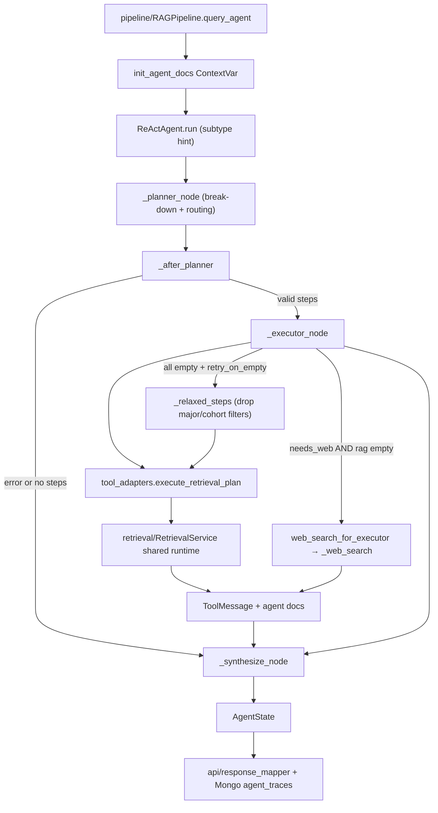

# Module: `agent`

Source-verified: 2026-06-24 from `agent/__init__.py`, `agent/react_agent.py`, `agent/planning.py`, `agent/tool_adapters.py`, `agent/graph_state.py`, `agent/state.py`, `agent/prompts.py`, `agent/lc_tools.py`.

## Purpose

`agent` is the agentic RAG layer used by `RAGPipeline.query_agent()` for complex questions. It does not expose HTTP routes directly. The public caller is the pipeline, which converts the final `AgentState` into API metadata, retrieved documents, Mongo traces, and UI debug payloads.

The public class name remains `ReActAgent` for import compatibility, but the runtime graph is now Planner-Executor only. The old LangGraph tool-binding loop and clarify tool path have been removed. The separate decompose node has also been removed: the planner now does both query break-down (comparison / multi-aspect) and collection routing in a single LLM call, and `complexity_subtype` is passed as a planner prompt hint instead of gating a decompose pre-step.

## File Map

```text
agent/
  __init__.py       Public exports for state, adapters, prompts, and ReActAgent.
  graph_state.py    AgentGraphState TypedDict (LangGraph runtime state).
  state.py          AgentState and ToolResult dataclasses for logging/API.
  prompts.py        SYNTHESIS_PROMPT, PLANNER_SYSTEM_PROMPT.
  planning.py       Pure planner helpers: JSON parsing, trace previews, plan entity-scope normalization.
  react_agent.py    Planner-Executor graph orchestration, subtype hint, plan validation, executor/synthesis nodes.
  tool_adapters.py  Tool dispatcher, retrieval/web adapters, RAG cache, shared runtime, ContextVar docs.
  lc_tools.py       Thin legacy wrapper functions delegating to execute_tool(); not graph-bound.
```

## Public Contracts

`agent.__init__` exports (via `__all__`):

- `ReActAgent`
- `AgentState`, `ToolResult`, `AgentGraphState`
- `execute_tool()`, `execute_retrieval_plan()`, `web_search_for_executor()`
- `set_runtime()`, `cache_clear()`
- `init_agent_docs()`, `get_agent_docs()`
- `SYNTHESIS_PROMPT`, `PLANNER_SYSTEM_PROMPT`

`tool_adapters.inject_from_retrieval_service()` is an important runtime hook even though it is not in `__all__`. `RAGPipeline.__init__()` calls it after building the shared `RetrievalService`.

`ReActAgent.run()` signature (called by the pipeline):

```python
agent.run(
    query: str,
    session_id: str = "",
    history: list[dict[str, str]] | None = None,
    complexity_subtype: str | None = None,
    user_context: dict[str, Any] | None = None,
    top_k: int | None = None,
) -> AgentState
```

`history` is accepted for signature compatibility but is not consumed by the current graph.

## Runtime Flow

```text
RAGPipeline.query_agent()
  -> init_agent_docs()                       (per-request ContextVar)
  -> ReActAgent.run(query, session_id, history, complexity_subtype, user_context, top_k)
     -> planner builds + validates a JSON retrieval plan (START -> planner)
     -> executor when the plan is valid and has steps; else synthesize
     -> synthesize
  -> state.to_log_dict() -> Mongo agent_traces
  -> get_agent_docs() -> retrieved documents for API/UI
```

Planner-Executor node behavior:

- The graph is `START -> planner -> executor? -> synthesize -> END`. There is no decompose node and no `route_entry`; `execution_path` is always `"planner"` (kept on state for log compatibility).
- `_subtype_hint()` turns `complexity_subtype` into a short Vietnamese instruction appended to the planner prompt (`comparison` -> split per entity; `multi_source` -> step per aspect/collection). This replaces the old decompose pre-step at zero extra LLM cost.
- `_planner_node()` asks for a JSON plan (`steps`, `needs_web`, `reasoning`) using `PLANNER_SYSTEM_PROMPT` + the subtype hint, keeps at most 4 steps, and delegates JSON parsing / entity-scope normalization to `planning.py` helpers. The planner does its own multi-aspect break-down (e.g. "điều kiện tốt nghiệp" -> quy_dinh + chuong_trinh steps) per its prompt rules.
- JSON (optionally markdown-fenced) is parsed by `planning._parse_json_object()` through a thin compatibility wrapper in `react_agent.py`; do not use naive backtick stripping.
- `_validate_plan()` requires non-empty steps where every step has a non-empty `query` and a `collection` in `_VALID_COLLECTIONS`. Invalid JSON, empty steps, or invalid collections set `state.error` (`planner_invalid_json` / `planner_empty_steps` / `planner_invalid_plan`); `RAGPipeline.query_agent()` owns the fallback policy.
- `_after_planner()` routes to `"synthesize"` if `error` is set, otherwise to `"executor"` when the plan re-validates.
- `_executor_node()` calls `execute_retrieval_plan()` with the pipeline-provided `top_k`. When all steps return empty and `_retry_on_empty` is `True` (default), it calls `_relaxed_steps()` to drop `major_hint`/`cohort_hint` filters and retries once via `execute_retrieval_plan()`. If the relaxed retry yields results those replace the original. Web search is appended only when `needs_web` is set **and** the RAG steps produced no usable messages (web is a fallback, not an always-on companion). If no non-empty tool messages survive even after relax-retry + web, it sets `final_answer = _NO_INFO_ANSWER` **and** `error = "agent_no_results"`, so `RAGPipeline.query_agent()` falls back to classic RAG instead of dead-ending the user.
- `_synthesize_node()` writes the final Vietnamese answer from non-empty `ToolMessage` content using `SYNTHESIS_PROMPT`. If `final_answer` was already set upstream it is passed through; on LLM failure it degrades to a truncated raw result.

## Module Flow



External module boundaries:

- Entry and fallback policy live in `pipeline`; `agent` returns `AgentState` and collected docs.
- Retrieval and Tavily are injected from the shared `retrieval/RetrievalService`; the agent must not cold-load independent embedders/searchers.
- Final API shape is owned by `api/response_mapper.py` and `schemas/chat.py`.
- Prompts live in this module; chat-model provider construction is shared with `llm`/settings.

## Legacy Tools

`execute_tool()` is the runtime dispatcher kept as a compatibility wrapper for tests and direct callers. It is not bound to a LangGraph tool-binding loop — the planner/executor calls `_rag_search` via `execute_retrieval_plan()` directly. `lc_tools.py` provides thin wrapper functions (`_rag_search`, `_multi_rag_search`, `_compare_cohorts`, `_compare_programs`, `_web_search`) that delegate to `execute_tool()`.

Supported direct tool names:

- `rag_search`
- `multi_rag_search`
- `compare_cohorts` — rejects major codes (redirects to `compare_programs`); runs two parallel `_rag_search` calls
- `compare_programs` — rejects cohort codes (redirects to `compare_cohorts`); runs two parallel `_rag_search` calls; accepts optional `course_keyword`
- `web_search`
- `exam_schedule_search` — structured query for exam schedules bypassing Qdrant to use Elasticsearch.

`_web_search` respects `TAVILY_FALLBACK_ENABLED` setting — if false it returns a static disabled message regardless of planner's `needs_web`. `web_search_for_executor()` additionally strips personal identifiers before calling `_web_search`.

Agent-facing collection aliases (`COLLECTION_MAP`):

| Agent name | Internal Qdrant collection |
| --- | --- |
| `chuong_trinh` | `ctdt` |
| `quy_dinh` | `quydinh` |
| `ke_hoach` | `kehoach` |
| `ho_tro_sv` | `stsv` |

Note: `lich_thi` is another valid agent collection but it is NOT in `COLLECTION_MAP` because it bypasses Qdrant entirely to use a structured Elasticsearch/Mongo store.

`_MAJOR_FILTERABLE_COLLECTIONS = frozenset({"chuong_trinh"})` — only `ctdt` supports `resolved_major` filter in Qdrant; other collections rely on query text for scoping.

## State And Logging

`AgentGraphState` (TypedDict, LangGraph runtime state). Key fields:

- `messages` (reduced by `add_messages`), `query`, `session_id`
- `tool_call_history`, `tool_call_signatures` (legacy, unused for routing)
- `iteration`, `max_iterations`, `final_answer`, `error`
- `execution_path`, `sub_questions`, `retrieval_plan`, `complexity_subtype`, `user_context`, `top_k`
- Trace-only: `decompose_trace`, `planner_trace`, `executor_results`, `synthesis_trace`
- `empty_result_count` — declared in TypedDict but populated tracking is via relax-retry logic in `_executor_node`; the field itself is initialized to `0` and not incremented by nodes

`AgentState` (dataclass, persistence/API). Built by `_to_agent_state()`. It keeps:

- Recent context-window tool results in `tool_results` (capped at `_CONTEXT_WINDOW_TOOL_LIMIT = 3`).
- Full untrimmed log in `_log_tool_results` (used by `to_log_dict()` for Mongo). Not an init field; `repr=False`.
- `tool_call_history`, `iteration` (set to `len(tool_call_history)` after graph run), `route` (default `"complex"`), `final_answer`, `error`, `execution_path`, `complexity_subtype`, `sub_questions`, `retrieval_plan`, and the trace dicts.

`ToolResult` dataclass fields: `tool_name`, `args: dict`, `result: str`, `iteration: int`, `latency_ms: float`, `timestamp: str`. Supports `__getitem__` for backward-compat dict-style access.

`AgentState.add_tool_result()` supports two call signatures:
- `add_tool_result(tool_name, args_dict, result_str, latency_ms=0.0)` — canonical
- `add_tool_result(tool_name, result_str)` — legacy; `args` becomes `{}`

## Runtime Injection And Thread Safety

`tool_adapters` owns an `_AdapterRuntime` dataclass: `settings`, `bge_embedder`, `e5_embedder`, `searcher` (`MultiCollectionSearch`), `reranker` (optional), `tavily_tool` (optional), `exam_es_store` (optional). Runtime is normally injected via `inject_from_retrieval_service()` from the shared `RetrievalService`. `_build_runtime()` is the lazy fallback; `set_runtime(None)` resets to lazy mode.

`_rag_search()` orchestration: `_build_rag_request()` → cache check → `_search_rag_candidates()` (embeds with BGE+E5, calls searcher) → `_rerank_or_trim_results()` → `_expand_parent_context_if_enabled()` → `_append_agent_docs()` → `_format_search_results()` → cache write.

`_format_web_results()` calls `_formatting_settings()` which reads `_RUNTIME.settings` if set, else `Settings()` directly — so a formatter-only unit path does not cold-load embedders/searchers.

Thread-safety rules:

- Use `init_agent_docs()`/`get_agent_docs()`/`_append_agent_docs()` ContextVar helpers for per-request docs. Do not introduce global result lists.
- `clear_agent_docs()` is a backward-compat alias that resets context to an empty list (not `None`).
- `_RAG_CACHE` is an in-process FIFO cache (`_RAG_CACHE_MAX = 256`) keyed by `(retrieval_query.lower(), collection, top_k, cohort, resolved_major.upper())` and protected by `_CACHE_LOCK`.
- Reranker serialization lives inside `BGEReranker.rerank` (instance-level `self._lock`), so every call path is protected. The old module-level `_RERANKER_LOCK` was removed to avoid double-locking.
- `execute_retrieval_plan()` runs plan steps in a thread pool (`max_workers = min(4, len(steps))`) using `contextvars.copy_context().run` per task so the docs ContextVar propagates. Each step has a 45 s timeout; failures are logged and the step is excluded from results.

## Retrieval Knobs

`_rag_search()` behavior:

- `top_k` is passed from `RAGPipeline.query_agent()` into `ReActAgent.run()` and `execute_retrieval_plan()`. Effective `top_k = max(1, int(top_k or settings.top_k))`.
- Raw candidate pool: `max(round(top_k * raw_candidate_multiplier), raw_candidate_min)`.
- Reranker kwargs: `reranker_min_top_k` (capped at `top_k`), `reranker_score_threshold`, `reranker_table_score_threshold`.
- Strips 8-digit student IDs and `mssv`/`mã sv` prefixes from queries before retrieval.
- Enriches major references via `enrich_major_references_for_query()`.
- For `chuong_trinh` with a single/resolved major: strips the major token from the retrieval query (`strip_major_from_query_for_retrieval`) since the filter handles scoping.
- Skips reranker for `chuong_trinh` semester-keyword queries (kỳ/kì/ky/chẵn/lẻ/đăng ký) to avoid dropping long curriculum tables.
- Optionally expands parent context (`parent_context_enabled`, `parent_max_chars_agent`, default 500 chars); deduplicates by `parent_id` in formatter.

## Settings

Main settings consumed by this module:

- `agent_enabled`, `agent_model`
- `lm_studio_base_url` / `lm_studio_url` / `lm_studio_api_key`
- `agent_max_iterations`, `agent_tool_result_limit`
- `agent_retry_on_empty` (bool, default `True`) — enables empty-result relax-and-retry in executor
- `agent_synthesis_provider`, `agent_synthesis_model`, `agent_synthesis_temperature`, `agent_synthesis_max_tokens`
- `agent_search_result_count`, `agent_search_result_char_limit`
- `raw_candidate_multiplier`, `raw_candidate_min`
- `reranker_min_top_k`, `reranker_score_threshold`, `reranker_table_score_threshold`
- `tavily_api_key`, `tavily_cache_maxsize`, `tavily_cache_ttl_seconds`, `tavily_fallback_enabled`, `tavily_max_results`, `tavily_search_depth`, `tavily_web_result_count`, `tavily_web_content_char_limit`
- `parent_context_enabled`, `parent_max_chars_agent`
- `elasticsearch_host`, `elasticsearch_port`, `exam_schedule_es_index` (for `lich_thi` search)

Supported synthesis providers: `"gemini"` (via Google generative language OpenAI-compat endpoint, default model `gemini-3.1-flash-lite`), `"ollama"` (via local Ollama `/v1`), or LM Studio/OpenAI-compatible fallback (all via `ChatOpenAI`). `localhost` in base URLs is substituted with `127.0.0.1` for macOS LM Studio compatibility.

## Maintenance Notes

- Before changing graph topology, update the topology description here and `tests/test_agent_langgraph.py`.
- When adding adapter behavior, update `tool_adapters.py` and direct adapter tests.
- Keep `planning.py` pure: no runtime/model loading, no retrieval calls, no ContextVar writes.
- Do not reintroduce graph-bound tool schemas without also updating pipeline fallback policy, API trace expectations, and agent tests.
- If changing public trace fields, update `api/response_mapper.py`, `schemas/chat.py`, frontend trace components, and this file.
- `clear_agent_docs()` is not exported from `__init__` — do not call it from outside the module; use `init_agent_docs()` to reset per request.
- `_PLANNER_ERROR_ANSWER` is used by `_executor_node` when steps list is empty (plan validation race) and by `_synthesize_node` when there are no tool messages and `error` is set; `_NO_INFO_ANSWER` is the fallback for the no-results-from-valid-plan path.

## Useful Checks

```bash
python -m py_compile agent/*.py
python -m pytest tests/test_adapters.py tests/test_agent_langgraph.py tests/test_constants.py -q -m "not integration"
```
