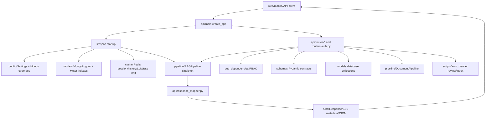

# Module: `api`

Source-verified: 2026-06-02 from `api/main.py`, `api/routes/*.py`, `api/services/*.py`, `api/response_mapper.py`, `api/dependencies.py`, and GitNexus route/API queries.

## Purpose

`api` is the FastAPI interface layer. It owns app construction, lifespan startup/shutdown, public HTTP routes, streaming SSE, response normalization, request/session dependency helpers, and Redis-backed rate-limit middleware.

It calls into `pipeline`, `models`, `cache`, `retrieval`, `auth`, and `schemas`, but it should not contain retrieval or generation logic itself.

## File Map

```text
api/
  main.py                 FastAPI app factory, lifespan, CORS, router registration.
  dependencies.py         Session/history/user-context helpers.
  response_mapper.py      Pipeline/agent result -> ChatResponse/v3 shape.
  schemas.py              Small legacy/local schemas.
  middleware/rate_limit.py FastAPI middleware wrapper around SlidingWindowRateLimiter.
  services/
    notification_delivery.py DB notification creation plus best-effort Expo push delivery.
  routes/
    chat.py               /chat, /chat/v3, /api/chat/v3, /chat/stream, /chat/suggest
    upload.py             /admin document pipeline endpoints.
    retrieval.py          /retrieval/search diagnostic endpoint.
    session.py            /session and intended /sessions helpers.
    health.py             /health and validity reload.
    metrics.py            /metrics/usage and /metrics/eval.
    lookup.py             /lookup mobile quick lookup endpoints.
    bookmark.py           /bookmarks and /bookmark-folders.
    feedback.py           /feedback endpoints.
    notification.py       /notifications user endpoints.
    notification_admin.py /admin/notifications creation/broadcast endpoints.
```

Ignore `api/.agent/` if present locally; it is not part of the FastAPI runtime.

## App Lifecycle

Entrypoint:

```text
backend/main.py -> api.main.app -> create_app() -> lifespan()
```

Startup in `lifespan()`:

1. Load `.env` from the RAG_v2 root.
2. Build `Settings`.
3. Merge persisted admin LLM overrides from Mongo `system_config` when available.
4. Initialize `MongoLogger` if `mongodb_enabled`.
5. Initialize Redis manager, session store, LLM cache, history cache, and rate limiter if Redis flags are enabled.
6. Store runtime singletons on `app.state`.
7. Build one `RAGPipeline` with the same effective `Settings` instance in a thread executor.
8. Create Mongo indexes through `models.database.create_indexes()`.
9. Warm up the local agent LLM if available.
10. Optionally schedule `scripts.auto_crawler` through APScheduler if `crawler_enabled`.

Shutdown stops the scheduler and closes Redis resources when present.

## Router Registration

`create_app()` includes these routers:

| Router file | Prefix in router/app | Public surface |
| --- | --- | --- |
| `chat.py` | none | `/chat`, `/chat/v3`, `/api/chat/v3`, `/chat/stream`, `/chat/suggest` |
| `health.py` | none | `/health`, `/api/admin/reload-validity` |
| `session.py` | `/session` | `/session`, `/session/{id}`, intended `/sessions`, `/sessions/me` |
| `metrics.py` | none | `/metrics/usage`, `/metrics/eval` |
| `retrieval.py` | `/retrieval` | `/retrieval/search` |
| `upload.py` | `/admin` | `/admin/documents*`, `/admin/converters`, `/admin/chunkers` |
| `bookmark.py` | none | `/bookmarks*`, `/bookmark-folders*` |
| `feedback.py` | none | `/feedback*` |
| `lookup.py` | `/lookup` | `/lookup/ctdt/{major_code}`, `/lookup/regulations`, `/lookup/calendar`, `/lookup/compare` |
| `notification.py` | none | `/notifications*` |
| `notification_admin.py` | `/admin/notifications` | authenticated notification creation/broadcast |
| `routers/auth.py` | app prefix `/auth` | `/auth/login`, `/auth/callback`, `/auth/register`, `/auth/login`, `/auth/refresh`, `/auth/me`, `/auth/logout`, `/auth/admin/create` |

## Module Flow



External module boundaries:

- `api` resolves HTTP, auth/session/user context, request validation, and response mapping; it does not embed, retrieve, rerank, or generate directly.
- `pipeline` owns chat and document orchestration; `models`/`cache` own persistence/cache.
- `auth` and `routers/auth.py` own credentials and RBAC dependencies used by protected routes.
- `schemas` are the contract boundary with web/mobile/shared clients.

## Chat Routes

`routes/chat.py` is the main runtime API.

- `POST /chat` calls `RAGPipeline.query_v3()` and maps to `ChatResponse`.
- `POST /chat/v3` and `POST /api/chat/v3` return a trace/debug-friendly shape.
- `POST /chat/stream` emits SSE events.
- `GET /chat/suggest` returns suggested questions for mobile/profile contexts.

Authenticated requests:

- If Bearer JWT is valid, routes derive `user_id` and `user_context` from the DB user.
- Access JWTs are intentionally short-lived; web/mobile clients refresh through
  `/auth/refresh` and retry requests rather than expecting chat/session routes
  to refresh credentials themselves.
- Body-supplied identity fields remain for legacy unauthenticated clients but should not override authenticated identity.

SSE event contract:

```text
{"type":"session","session_id":"..."}
{"type":"token","delta":"..."}
{"type":"metadata", ...}
{"type":"done"}
```

Pipeline work is sync/heavy, so routes use `anyio.to_thread.run_sync()` or thread executors where needed to avoid blocking the event loop.

## Response Mapping

`response_mapper.py` normalizes heterogeneous pipeline outputs:

- retrieved source docs -> `RetrievedDocument`
- collection scores -> `CollectionScore`
- filters and collection counts -> `FilterInfo`, `CollectionResult`
- agent traces/tool calls -> `AgentTracePayload`
- string/float/int parsing helpers for loosely shaped pipeline metadata

When changing pipeline output fields, update mapper tests and frontend/mobile normalizers.

## Admin Upload Routes

`routes/upload.py` is admin-only and wraps `DocumentPipeline`.

Main groups:

- Upload/list/get/delete documents.
- Convert PDF to Markdown.
- Review/update Markdown.
- Clean Markdown.
- Review/update cleaned text.
- Chunk with selected strategy.
- Review/select/approve chunks.
- Embed and index into Mongo/Qdrant/Elasticsearch.
- Run full pipeline.
- Roll back indexed/chunked/cleaned/converted states.
- Discover converters/chunkers.

All admin document routes depend on `auth.rbac.require_admin`.

`routes/admin_stats.py` also owns the admin LLM config surface:

- `GET /admin/config/llm` returns effective runtime LLM settings with keys masked.
- `GET /admin/config/api-keys`, `POST /admin/config/api-keys`, and `POST /admin/config/api-keys/{key_id}/activate` manage secret-free DeepSeek/Google/Tavily key rows for the admin UI.
- `PUT /admin/config/llm` prepares a pipeline LLM reload, persists approved overrides/API keys in Mongo, then commits the prepared runtime and invalidates Redis LLM answers when chat generation tuning changes.
- Runtime toggle endpoint `PATCH /admin/config` is separate; it does not share the persisted LLM override contract.
- Admin crawler review endpoints live here too: `POST /admin/crawler/trigger` starts crawl/chunk/stage, `GET /admin/crawler/status` returns pending/indexed review runs with chunk previews, `GET /admin/crawler/runs/{run_id}/chunks` returns full chunk content, `PATCH /admin/crawler/runs/{run_id}/chunks/{chunk_id}` edits staged content, and `POST /admin/crawler/runs/{run_id}/index` starts background indexing.
- Crawler indexing uses the app pipeline's warmed BGE/E5 embedders when available, then indexes edited chunks via `scripts.auto_crawler.index_staged_crawler_run()`.

## Notifications

User notification routes require a valid access token and store inbox rows in
Mongo. `/notifications/subscribe` stores Expo push tokens plus topic
subscriptions; `/notifications/unsubscribe` removes topics or the whole
subscription.

`api/services/notification_delivery.py` is the shared delivery boundary for
admin/system-created notifications. It writes Mongo notification rows first,
then best-effort sends Expo push messages to subscribed devices and cleans up
invalid push tokens without making DB notification creation fail.

## Session Routes

`routes/session.py` reads from Redis first, then Mongo. It preserves legacy owner aliases:

- canonical Mongo `_id`
- `email`
- `username`
- `student_id`

Destructive actions require authenticated ownership. Delete removes durable session data through `MongoLogger.delete_session()` and Redis session/history when Redis is enabled.

## Current Caution

`routes/retrieval.py` tries `getattr(pipeline, "service", None)`. `RAGPipeline` currently stores the shared service as `_retrieval_service` and does not expose `service`. If this remains unchanged, `/retrieval/search` may cold-load a new `RetrievalService`, including heavy models. Prefer adding a read-only property or using `_retrieval_service` intentionally.

`notification_admin.py` is mounted under `/admin/notifications`, but the source
currently depends on `get_current_user` rather than `require_admin`. If this
surface is intended to be admin-only, tighten the dependency before exposing it
outside trusted deployments.

## Useful Checks

```bash
python -m py_compile api/*.py api/routes/*.py api/middleware/*.py
python -m pytest tests/test_chat_route_mode.py tests/test_response_mapper.py tests/test_upload_api.py tests/test_dependencies.py -q -m "not integration"
```
