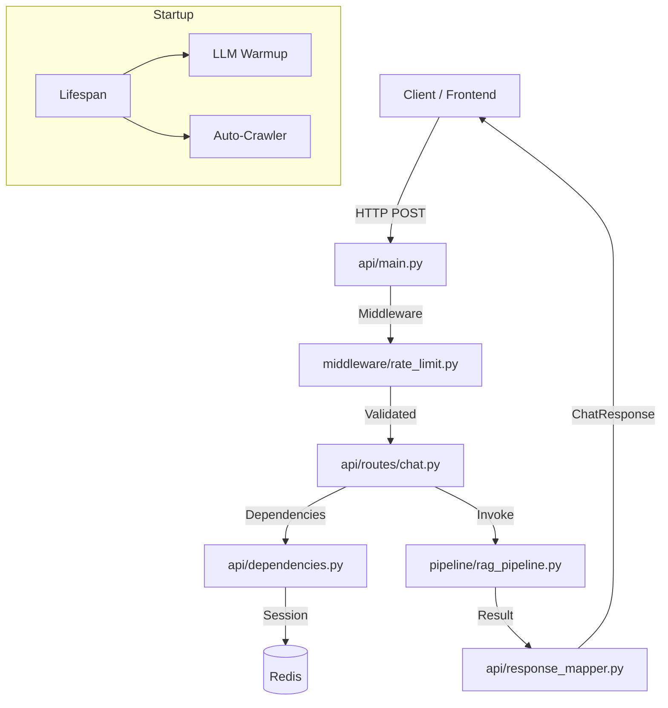

# Module: `api` — FastAPI REST & Streaming Layer

## 1. Tổng quan kiến trúc

Module `api` đóng vai trò là tầng giao diện (interface) công khai của hệ thống RAG v2. Nó chịu trách nhiệm quản lý vòng đời ứng dụng (lifespan), điều phối các request HTTP, thực thi các chính sách bảo mật/giới hạn (rate limiting), và ánh xạ dữ liệu phức tạp từ backend sang định dạng phản hồi chuẩn cho người dùng.

Được xây dựng trên nền tảng **FastAPI**, module này tận dụng tối đa sức mạnh của lập trình bất đồng bộ (`asyncio`) để xử lý hàng ngàn request đồng thời, đặc biệt là các luồng streaming dữ liệu thời gian thực.

---

## 2. Cấu trúc Module

```
api/
├── main.py              # App Factory & Lifespan — Khởi tạo hệ thống, singleton và startup tasks
├── dependencies.py      # Logic Dependency — Xử lý session resolution và history parsing
├── response_mapper.py   # Data Mapping — Ánh xạ từ AgentState/Pipeline Result sang Pydantic Response
├── schemas.py           # Pydantic Schemas — Định nghĩa cấu trúc Request/Response (Local)
├── middleware/
│   └── rate_limit.py    # Rate Limiter — Giới hạn tần suất Sliding Window (Redis-backed)
└── routes/
    ├── chat.py          # Core Endpoints — /chat, /chat/v3, /chat/stream, /chat/suggest
    ├── bookmark.py      # Mobile saved answers — /bookmarks, /bookmark-folders
    ├── feedback.py      # Mobile answer ratings — /feedback
    ├── lookup.py        # Mobile quick lookup — /lookup/ctdt, regulations, calendar, compare
    ├── notification.py  # Mobile notifications — /notifications, subscriptions
    ├── health.py        # Monitoring — Health check cho tất cả backend services (Redis, Qdrant, ES...)
    ├── metrics.py       # Analytics — Thu thập thông tin sử dụng, latency và cache stats
    ├── session.py       # Session Management — Quản lý lịch sử hội thoại (List/Delete)
    ├── retrieval.py     # Diagnostic — Endpoint hỗ trợ debug kết quả tìm kiếm thô
    └── upload.py        # Admin Document Upload — 15 endpoints for document pipeline management (Phase 2)
```

---

## 3. Các thành phần và Cơ chế cốt lõi

### 3.1. Lifespan & Initialization (`main.py`)
Hệ thống quản lý vòng đời một cách chặt chẽ để đảm bảo tài nguyên được khởi tạo đúng cách và giải phóng an toàn:
- **Startup Sequence**: 
    1. Load biến môi trường từ `.env`.
    2. Khởi tạo **MongoLogger** & **RedisManager** (Singletons).
    3. Khởi tạo **RAGPipeline** (tốn ~17s nếu load model mới, thường được chạy trong thread executor để không block).
    4. Tự động tạo Index cho MongoDB (`create_indexes`).
    5. **LLM Warmup**: Gửi một request "hello" giả tới local LLM để tránh độ trễ cho người dùng đầu tiên.
    6. **Auto-Crawler Scheduler**: Khởi chạy lịch trình crawl dữ liệu `kehoach` hàng ngày (nếu enabled).
- **Global State**: Tất cả các singletons (`pipeline`, `mongo_logger`, `redis_session`, `rate_limiter`) được lưu trữ trong `app.state` để truy cập nhanh từ các router và middleware.

### 3.2. Smart Routing & Streaming (`routes/chat.py`)
Hệ thống hỗ trợ 3 cơ chế xử lý câu hỏi linh hoạt:
- **Non-streaming (`/chat`, `/chat/v3`)**: Nhận câu hỏi và trả về toàn bộ câu trả lời kèm metadata dưới dạng JSON.
- **Streaming (`/chat/stream`)**: Sử dụng **Server-Sent Events (SSE)**.
    - Phát các token (`type: token`) ngay khi LLM sinh ra.
    - **Metadata Injection**: Sau khi stream xong, hệ thống gửi một event cuối cùng (`type: metadata`) chứa đầy đủ thông tin về nguồn trích dẫn, latency, và vết agent (trace) trước khi gửi event `done`.
- **Modes**:
    - `auto`: Tự động định tuyến (Chitchat -> Simple RAG -> Complex Agent).
    - `rag`: Cưỡng bức dùng pipeline RAG truyền thống.
    - `agent`: Cưỡng bức dùng LangGraph Agent.
- **Mobile auth context**: Nếu request có `Authorization: Bearer`, `chat.py`
  dùng profile từ JWT/DB để tạo `user_id` và `user_context`, ghi đè mọi
  `user_id/user_context` trong body. Body legacy vẫn được giữ cho web/dev
  clients không authenticated.
- **Suggested questions**: `GET /chat/suggest` trả danh sách câu hỏi gợi ý nhẹ
  theo `cohort/major` từ query params hoặc authenticated profile.

### 3.3. Response Mapping Logic (`response_mapper.py`)
Để giữ cho `routes/chat.py` ngắn gọn và dễ bảo trì, toàn bộ logic chuyển đổi dữ liệu được tách ra `ChatResponseMapper`:
- Chuẩn hóa các trường dữ liệu từ nhiều nguồn khác nhau (AgentState vs Standard RAG).
- Xử lý các trường dữ liệu tùy chọn (`optional`), tính toán `rank` tự động cho văn bản trích dẫn.
- Xây dựng cấu trúc `agent_trace` chi tiết (tool calls, iterations, latency per tool) để hiển thị trên UI Debugger.

### 3.4. Rate Limiting Middleware (`middleware/rate_limit.py`)
Thực hiện giới hạn tần suất truy cập cho các endpoint tiêu tốn tài nguyên LLM:
- **Sliding Window**: Sử dụng Redis Sorted Sets để quản lý số lượng request trong 1 phút và 1 ngày.
- **Header Exposure**: Luôn trả về các header `X-RateLimit-Limit-*` và `X-RateLimit-Remaining-*`.
- **Identification**: Nhận diện người dùng theo thứ tự ưu tiên: `user_id` (trong JSON body) > `X-Forwarded-For` (IP proxy) > `client_host` (IP trực tiếp).

### 3.5. Session & Dependency (`dependencies.py`)
- **Session Resolution**: Tự động tạo mới hoặc khôi phục session. Hỗ trợ cơ chế **Dual-Write** (ghi đồng thời vào Redis để truy xuất nhanh và MongoDB để lưu trữ lâu dài).
- **History Parsing**: Chuyển đổi danh sách tin nhắn từ Pydantic sang format dict mà pipeline backend yêu cầu.
- **Authenticated Identity Helpers**: `user_id_from_user()` và
  `user_context_from_user()` chuẩn hóa cách các route mobile lấy identity từ
  JWT. `sync_redis_session_from_mongo()` refresh Redis session metadata sau khi
  pipeline ghi turn vào MongoDB.
- **Authenticated session metadata actions**: `DELETE /session/{session_id}`
  hard-deletes a user's own session, turns, query logs, agent traces, and Redis
  history cache. `PATCH /session/{session_id}` renames a user's own session
  without changing `updated_at` ordering. Both routes require JWT auth and
  accept legacy owner aliases (`_id`, email, username, student id) for sessions
  created before the canonical Mongo `_id` owner contract.
- **Session list compatibility**: `GET /sessions/me` merges sessions across the
  same owner aliases and deduplicates by `session_id`, newest first.

### 3.6. Mobile Feature Routes
- `bookmark.py`: user-scoped saved answers. `POST /bookmarks` lấy snapshot từ
  `turns`, `GET /bookmarks` phân trang, `DELETE /bookmarks/{id}`, và
  `GET/POST /bookmark-folders`.
- `feedback.py`: `POST /feedback` upsert một rating cho mỗi
  `(user_id, session_id, turn_id)`.
- `lookup.py`: thin lookup layer dùng `pipeline._retrieval_service` hiện có cho
  CTĐT/quy định/lịch; `/lookup/compare` dùng `pipeline.query_v3()` để tổng hợp.
- `notification.py`: lưu/đọc thông báo mobile và subscription Expo push token.

---

## 4. Tương tác hệ thống



---

## 5. Hiệu năng và Giới hạn

- **Overhead**: Tầng API chỉ đóng góp **~3-8ms** vào tổng thời gian phản hồi (chủ yếu là serialization).
- **Thread Safety**: Tất cả các cuộc gọi tới pipeline đồng bộ (heavy computation) đều được wrap trong `anyio.to_thread.run_sync` để tránh nghẽn Event Loop của FastAPI.
- **Streaming**: Hỗ trợ back-pressure thông qua `asyncio.Queue` trong luồng phát SSE.

---
*Cập nhật lần cuối: 2026-05-15 bởi Codex*
