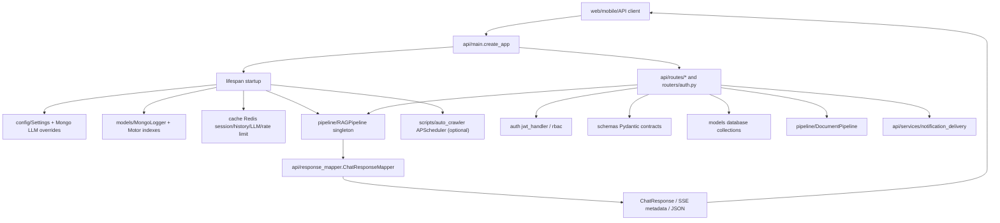

# Module: `api`

Source-verified: 2026-06-05 from `api/main.py`, `api/dependencies.py`, `api/response_mapper.py`, `api/schemas.py`, `api/__init__.py`, `api/middleware/rate_limit.py`, `api/services/notification_delivery.py`, and `api/routes/*.py` (chat, health, session, metrics, retrieval, upload, bookmark, feedback, lookup, notification, notification_admin, admin_stats).

## Purpose

`api` is the FastAPI interface layer. It owns app construction, lifespan startup/shutdown, public HTTP routes, streaming SSE, response normalization, request/session dependency helpers, and Redis-backed rate-limit middleware.

It calls into `pipeline`, `models`, `cache`, `retrieval`, `auth`, `scripts`, and `schemas`, but it should not contain retrieval or generation logic itself.

## File Map

```text
api/
  __init__.py             Package marker.
  main.py                 FastAPI app factory, lifespan, CORS, router registration, rate-limit startup hook.
  dependencies.py         Session resolution, history parsing, user-id/user-context helpers, Redis<-Mongo sync.
  response_mapper.py      ChatResponseMapper: pipeline result dict -> ChatResponse / normalized v3 shape.
  schemas.py              Backward-compat shim re-exporting schemas.chat models.
  middleware/
    __init__.py
    rate_limit.py         RateLimitMiddleware wrapping SlidingWindowRateLimiter (chat endpoints only).
  services/
    __init__.py
    notification_delivery.py  DB notification creation + best-effort Expo push delivery.
  routes/
    __init__.py
    chat.py               /chat, /chat/v3, /api/chat/v3, /chat/suggest, /chat/stream
    health.py             /health, /api/admin/reload-validity
    session.py            /session, /session/{id}, /sessions, /sessions/me (prefix /session)
    metrics.py            /metrics/usage, /metrics/eval
    retrieval.py          /retrieval/search diagnostic endpoint (prefix /retrieval)
    upload.py             /admin/documents* pipeline + /admin/converters, /admin/chunkers (prefix /admin)
    bookmark.py           /bookmarks*, /bookmark-folders*
    feedback.py           /feedback, /feedback/list, /feedback/stats
    lookup.py             /lookup/ctdt/{major_code}, /lookup/regulations, /lookup/calendar, /lookup/compare
    notification.py       /notifications* user inbox + subscribe/unsubscribe
    notification_admin.py /admin/notifications, /admin/notifications/broadcast (prefix /admin/notifications)
    admin_stats.py        /admin/stats/*, /admin/users/{id}/status, /admin/crawler/*, /admin/config* (prefix /admin)
```

Ignore `api/.agent/` if present locally; it is not part of the FastAPI runtime.

## App Lifecycle

Entrypoint:

```text
api.main.app = create_app() -> lifespan()
```

Startup in `lifespan()`:

1. Load `.env` from the RAG_v2 root.
2. Build `Settings`.
3. Merge persisted admin LLM overrides from Mongo `system_config` via `_load_persisted_llm_config()` when `mongodb_enabled`.
4. Raise if no `google_api_key` is resolved (env or DB).
5. Initialize `MongoLogger` if `mongodb_enabled`; record `mongo_status` on `app.state`.
6. If `redis_enabled` and ping succeeds: init Redis session store (dual-write), rate limiter, LLM response cache, and conversation history cache per their flags.
7. Store runtime singletons + `settings` on `app.state`.
8. Build one `RAGPipeline` (with `mongo_logger` and optional `llm_cache`) in a thread executor.
9. Create Mongo indexes through `models.database.create_indexes()` when Mongo is up.
10. Run `admin_stats.check_mongo_version()` to gate `$percentile` aggregation features.
11. Schedule a delayed `warmup_llm()` task that invokes the agent LLM with a "hello".
12. Optionally schedule `scripts.auto_crawler.AutoCrawlPipeline` via APScheduler cron if `crawler_enabled`.

Shutdown stops the scheduler and closes Redis resources when present.

## Router Registration

`create_app()` includes these routers (CORS allows localhost/LAN dev origins for web/Expo/Android):

| Router file | Prefix | Public surface |
| --- | --- | --- |
| `chat.py` | none | `/chat`, `/chat/v3`, `/api/chat/v3`, `/chat/suggest`, `/chat/stream` |
| `health.py` | none | `/health`, `/api/admin/reload-validity` |
| `session.py` | `/session` | `/session`, `/session/{id}` (GET/DELETE/PATCH), `/sessions`, `/sessions/me` |
| `metrics.py` | none | `/metrics/usage`, `/metrics/eval` |
| `retrieval.py` | `/retrieval` | `/retrieval/search` |
| `upload.py` | `/admin` | `/admin/documents*`, `/admin/converters`, `/admin/chunkers` |
| `bookmark.py` | none | `/bookmarks*`, `/bookmark-folders*` |
| `feedback.py` | none | `/feedback`, `/feedback/list`, `/feedback/stats` |
| `lookup.py` | `/lookup` | `/lookup/ctdt/{major_code}`, `/lookup/regulations`, `/lookup/calendar`, `/lookup/compare` |
| `notification.py` | none | `/notifications*` user inbox + subscribe/unsubscribe |
| `notification_admin.py` | `/admin/notifications` | `POST /admin/notifications`, `POST /admin/notifications/broadcast` |
| `admin_stats.py` | `/admin` | `/admin/stats/*`, `/admin/users/{id}/status`, `/admin/crawler/*`, `/admin/config*` |
| `routers/auth.py` | `/auth` | auth/login/callback/register/refresh/me/logout/admin endpoints |

`create_app()` also defines `GET /` (service banner) and an `@app.on_event("startup")` hook that registers `RateLimitMiddleware` only if a `rate_limiter` was created during lifespan.

## Module Flow



External module boundaries:

- `api` resolves HTTP, auth/session/user context, request validation, and response mapping; it does not embed, retrieve, rerank, or generate directly.
- `pipeline` owns chat (`RAGPipeline`) and document (`DocumentPipeline`) orchestration; `models`/`cache` own persistence/cache.
- `auth.jwt_handler` (`get_current_user`, `get_optional_current_user`) and `auth.rbac.require_admin` own credentials and RBAC dependencies used by protected routes.
- `scripts.auto_crawler` owns crawl/stage/index work invoked by the scheduler and admin crawler endpoints.
- `schemas` (`chat`, `mobile`, `document`, `constants`) are the contract boundary with web/mobile/shared clients.

## Chat Routes

`routes/chat.py` is the main runtime API.

- `POST /chat` (`response_model=ChatResponse`): routes by `mode` — `agent` → `pipeline.query_agent(require_agent=True)`, `rag` → `pipeline.query`, else (`auto`) → `pipeline.query_v3`. Maps via `ChatResponseMapper.to_chat_response`.
- `POST /chat/v3` and `POST /api/chat/v3`: same mode control, returns the normalized v3 dict (`normalize_v3_result`). When `mode=agent` but the agent is disabled, returns a RAG fallback with `agent_error="Agent is disabled"`.
- `GET /chat/suggest`: lightweight suggested questions personalized by `cohort`/`major` query params or the authenticated profile.
- `POST /chat/stream`: SSE streaming via `pipeline.query_stream`.

`_log_legacy_turn_for_agent_response()` backfills legacy turn/query logs for agent answers so `/chat` history stays consistent with classic RAG logging.

Authenticated requests use `get_optional_current_user`. When a Bearer JWT is valid, `user_id` and `user_context` derive from the DB user (`user_id_from_user`, `user_context_from_user`); body-supplied identity fields are legacy fallbacks. Clients refresh expired access tokens through `/auth/refresh` and retry.

SSE event contract:

```text
{"type":"session","session_id":"..."}
{"type":"token","delta":"..."}
{"type":"metadata", ...}   # built from pipeline.last_* attributes
{"type":"error","error":"..."}   # on producer failure
{"type":"done"}
```

Pipeline work is sync/heavy, so routes use `anyio.to_thread.run_sync()` (or a thread executor producing into an `asyncio.Queue` for streaming) to avoid blocking the event loop.

## Response Mapping

`response_mapper.py` exposes `ChatResponseMapper` (all `@staticmethod`) to normalize heterogeneous pipeline outputs:

- `to_chat_response` / `normalize_v3_result` — build the `ChatResponse` model / stable v3 dict.
- `_to_retrieved_documents` + per-doc mapping → `RetrievedDocument`.
- `to_filter_models` → `FilterInfo`; `to_collection_result_models` → `CollectionResult`.
- `to_tool_call_models` → `AgentToolCall`; `to_agent_trace_model` → `AgentTracePayload`.
- `_safe_float`/`_optional_float`/`_optional_int`/`_to_string_list`/`_optional_dict(_list)` parse loosely shaped metadata.
- Backfills `tools_used`/`tool_calls` from `agent_trace` when top-level fields are empty.

When changing pipeline output fields, update mapper tests and frontend/mobile normalizers.

## Admin Document Routes (`routes/upload.py`)

Admin-only (`require_admin`), wraps a module-level `DocumentPipeline` singleton; background steps return **202 Accepted** and update `DocumentRecord.status` asynchronously.

- `POST /admin/documents` (201) upload PDFs; `GET /admin/documents` list; `GET /admin/documents/{id}` detail; `DELETE /admin/documents/{id}` delete + cleanup.
- `POST /admin/documents/{id}/rollback` revert to previous state.
- `POST /admin/documents/{id}/convert` (PDF→Markdown), `clean`, `chunk`, `index`, `pipeline` (full auto) — all background 202.
- `GET/PUT /admin/documents/{id}/markdown` and `/cleaned` review+approve.
- `GET /admin/documents/{id}/chunks` (paginated), `GET .../chunk-strategies`, `POST .../chunks/select`, `PUT .../chunks` (approve).
- `GET /admin/converters`, `GET /admin/chunkers` discovery.

## Admin Stats & Config (`routes/admin_stats.py`)

Admin-only (`require_admin`), prefix `/admin`. Owns the observability dashboard, user management, crawler review, and LLM/runtime config surfaces.

- Stats: `GET /admin/stats/overview`, `/admin/stats/users`, `/admin/stats/users/breakdown`, `/admin/stats/queries`, `/admin/stats/agent`, `/admin/stats/feedback/topics`, `/admin/stats/system`. `$percentile` latency is gated by `_MONGO_SUPPORTS_PERCENTILE` (set at startup by `check_mongo_version`).
- Users: `PATCH /admin/users/{user_id}/status` activate/deactivate (blocks self-deactivation, writes audit log).
- Crawler review: `POST /admin/crawler/trigger` (cooldown + single-run lock), `GET /admin/crawler/status`, `GET /admin/crawler/runs/{run_id}/chunks`, `PATCH /admin/crawler/runs/{run_id}/chunks/{chunk_id}`, `POST /admin/crawler/runs/{run_id}/index`. Indexing reuses the app pipeline's BGE/E5 embedders and calls `scripts.auto_crawler.index_staged_crawler_run`. Completed crawls broadcast a notification via `notification_delivery.broadcast_user_notification`.
- Runtime toggles: `PATCH /admin/config` toggles whitelisted boolean settings on `app.state.settings` (not persisted).
- LLM config: `GET /admin/config/llm` (keys masked); `PUT /admin/config/llm` prepares a pipeline LLM reload, persists overrides/API keys in Mongo, commits the prepared runtime, and invalidates the Redis LLM cache when chat-generation fields change.
- API keys: `GET /admin/config/api-keys`, `POST /admin/config/api-keys`, `POST /admin/config/api-keys/{key_id}/activate` manage secret-free DeepSeek/Google/Tavily key rows and hot-swap runtime clients.
- Env config: `GET /admin/config/env` and `PUT /admin/config/env` edit a whitelist of retrieval/crawler/rate-limit/chat/self-eval/Tavily settings at runtime and persist them to the `system_config` collection.

## Retrieval Diagnostic (`routes/retrieval.py`)

`POST /retrieval/search` (`RetrievalRequest` → `RetrievalResponse`) runs embed → hybrid search → optional rerank directly against the pipeline's retrieval service, returning mapped docs, applied filters, collection counts, fusion weights, and latency. No auth dependency.

## Notifications

User notification routes (`routes/notification.py`) require a valid access token and store inbox rows in Mongo: list / unread-count / read / read-all / delete, plus `POST /notifications/subscribe` (stores Expo push token + topics) and `POST /notifications/unsubscribe` (removes topics or the whole subscription).

`api/services/notification_delivery.py` is the shared delivery boundary for admin/system-created notifications. It resolves target users (by topic or all users), inserts Mongo notification rows, then best-effort sends batched Expo push messages (`https://exp.host/--/api/v2/push/send`) and prunes `DeviceNotRegistered` tokens without failing DB creation.

## Session Routes (`routes/session.py`)

Reads Redis first, then Mongo. Preserves legacy owner aliases — canonical Mongo `_id`, `email`, `username`, `student_id` — so old sessions remain readable/owned. Create (`POST /session`), get-with-turns (`GET /session/{id}`), list (`GET /sessions?user_id=`), my-sessions (`GET /sessions/me`, auth required), update title (`PATCH /session/{id}`), delete (`DELETE /session/{id}`). Destructive/owned actions require authenticated ownership via `_assert_session_owned`.

## Rate Limiting (`middleware/rate_limit.py`)

`RateLimitMiddleware` applies only to `POST /chat`, `/chat/v3`, `/api/chat/v3`, `/chat/stream`. It identifies callers by JSON-body `user_id` → `X-Forwarded-For` → client IP, checks the `SlidingWindowRateLimiter`, returns 429 with `Retry-After` when exceeded, records after success, and injects `X-RateLimit-*` headers.

## Current Caution

`routes/retrieval.py` reads `getattr(pipeline, "service", None)`. `RAGPipeline` exposes the shared service as `retrieval_service` / `_retrieval_service` (as used elsewhere in `lookup.py` and `admin_stats.py`), not `service`. As written, `/retrieval/search` will fall back to cold-loading a new `RetrievalService` (heavy models). Prefer aligning this with `retrieval_service`/`_retrieval_service`.

`notification_admin.py` is mounted under `/admin/notifications`, but its handlers depend on `get_current_user` rather than `require_admin`. If this surface is meant to be admin-only, tighten the dependency before exposing it outside trusted deployments.

## Useful Checks

```bash
python -m py_compile api/*.py api/routes/*.py api/middleware/*.py api/services/*.py
python -m pytest tests/test_chat_route_mode.py tests/test_response_mapper.py tests/test_upload_api.py tests/test_dependencies.py -q -m "not integration"
```
