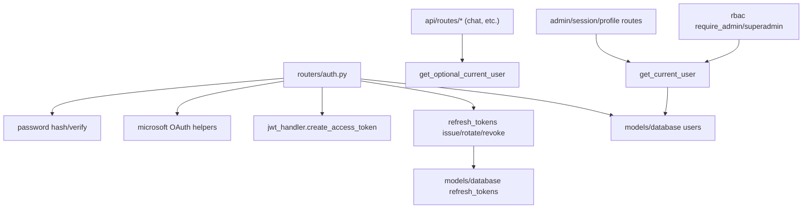

# Module: `auth`

Source-verified: 2026-06-05 from `auth/__init__.py`, `auth/jwt_handler.py`, `auth/refresh_tokens.py`, `auth/microsoft.py`, `auth/password.py`, `auth/rbac.py`, plus `routers/auth.py` and `models/user.py`.

## Purpose

`auth` contains authentication and authorization primitives used by FastAPI routes. It does not register routes itself; HTTP endpoints live in `routers/auth.py`. The package `__init__.py` is empty (no re-exports); import directly from submodules.

## File Map

```text
auth/
  __init__.py       Empty package marker (no exports).
  jwt_handler.py    JWT creation/verification and FastAPI current-user dependencies.
  refresh_tokens.py Opaque refresh-token sessions, rotation, hashing, revocation.
  microsoft.py      Microsoft OAuth URL, token exchange, Graph user-info retrieval.
  password.py       bcrypt password hashing and verification helpers.
  rbac.py           Admin and superadmin dependencies.
```

## JWT Contract

Uses python-jose (`jose`) with HS256 by default. `JWT_SECRET_KEY` is required
at runtime (raises `RuntimeError` if unset); `JWT_ALGORITHM` defaults to `HS256`.

`create_access_token(user_id, email, role="student")` creates tokens with:

- `sub`: MongoDB user id (string)
- `email`
- `role`
- `typ`: `"access"`
- `jti`: random uuid4
- `iat`: issued-at (UTC)
- `exp`: expiry (UTC)

Access token lifetime defaults to `JWT_ACCESS_EXPIRE_MINUTES=15`. Legacy
`JWT_EXPIRE_MINUTES` is still accepted as a fallback for existing deployments
and tests. `access_token_expires_in_seconds()` exposes the response `expires_in`
value (minutes × 60).

`verify_token(token)` decodes/validates signature and expiry, returning the
payload dict. It raises `HTTPException 401` on expired or otherwise invalid
tokens.

FastAPI dependencies:

- `get_current_user()` — uses `OAuth2PasswordBearer` (`tokenUrl="/auth/login"`,
  `auto_error=True`). Requires a valid Bearer token, a `sub` that is a valid
  `ObjectId`, a matching user in the `users` collection, and `is_active=True`;
  otherwise `401`. Returns a `UserDocument`.
- `get_optional_current_user()` — uses `HTTPBearer(auto_error=False)`. Returns
  `None` when no Authorization header is present, but a present-but-invalid
  token still fails `401` (same DB/active checks as above).

Chat and other client routes use optional auth; admin and destructive/session
routes require strict auth.

## Refresh Token Sessions

`refresh_tokens.py` issues opaque random tokens (`secrets.token_urlsafe(64)`)
and stores only a SHA-256 hash (`hashlib.sha256`) in MongoDB collection
`REFRESH_TOKENS_COLLECTION`.

Stored fields:

- `token_hash`
- `user_id`
- `family_id` (uuid4 when not supplied)
- `client_type` (`"web"` | `"mobile"`)
- `created_at`
- `expires_at`
- `last_used_at`
- `revoked_at`
- `replaced_by`

Default refresh lifetime is `JWT_REFRESH_EXPIRE_DAYS=30` with idle timeout
`JWT_REFRESH_IDLE_DAYS=7`. Public functions:

- `create_refresh_session(db, *, user_id, client_type="web", family_id=None)` — returns the raw token once.
- `rotate_refresh_token(db, token, *, client_type="web")` — returns `(new_raw_token, user)`. Rotates on every use; the new token inherits the parent's `expires_at` (absolute lifetime is not extended on rotation). Reuse of an already-revoked token revokes the entire family.
- `revoke_refresh_token(db, token, *, now=None)` — revokes a single token; returns bool.
- `revoke_refresh_family(db, family_id, *, now=None)` — revokes all live tokens in a family.
- `hash_refresh_token`, `generate_refresh_token`, `refresh_token_max_age_seconds` — helpers.

Motor returns naive UTC datetimes; `_as_utc()` re-attaches UTC before comparing
with `_now()` for expiry/idle checks. `rotate_refresh_token` uses a
find-then-update pattern with a documented theoretical TOCTOU race.

Web clients receive refresh tokens through an HttpOnly cookie (set in
`routers/auth.py`). Mobile clients (`client_type="mobile"`) receive/send the
opaque refresh token in API JSON.

## Microsoft OAuth

`microsoft.py` owns (settings read at call-time from env):

- `_settings()` → `(tenant_id, client_id, client_secret, redirect_uri)`. `MICROSOFT_TENANT_ID` defaults to `"common"`; `MICROSOFT_CLIENT_ID` and `MICROSOFT_CLIENT_SECRET` are required; `MICROSOFT_REDIRECT_URI` defaults to `http://localhost:8000/auth/callback`.
- `get_authorization_url()` — builds the v2.0 authorize URL (scopes `openid profile email User.Read`, `response_mode=query`).
- `exchange_code_for_token(code)` — POSTs to the v2.0 token endpoint via `httpx`; raises `502` on HTTP error, `503` if Microsoft is unreachable.
- `get_microsoft_user_info(access_token)` — `GET https://graph.microsoft.com/v1.0/me`; same `502`/`503` error mapping.

The router layer validates accepted HUST/SIS identity behavior and persists users.

## Passwords

`password.py` uses bcrypt directly: `hash_password(plain)` and
`verify_password(plain, hashed)`. Do not compare plain-text passwords in routes.

## RBAC

`rbac.py` provides (both depend on `get_current_user`):

- `require_admin()` — strictly requires `current_user.role == "admin"`, else `403`. (Superadmin status alone does NOT satisfy this check.)
- `require_superadmin()` — requires `str(current_user.id)` to be in `SUPERADMIN_USER_IDS` (comma-separated ObjectId strings), else `403`.

`UserDocument.role` defaults to `"student"` (`student | admin`). Superadmin is
not a DB role; it is a configured env-var overlay used to gate admin-account
creation.

## Module Flow



External module boundaries:

- HTTP request/response behavior lives in `routers/auth.py`; this module exposes reusable primitives and dependencies.
- User and refresh-token documents are stored through `models/database.py` (`USERS_COLLECTION`, `REFRESH_TOKENS_COLLECTION`); user shape is `models/user.py`.
- `require_admin`/`require_superadmin` and `get_current_user`/`get_optional_current_user` are consumed across `api/routes/*` (admin_stats, chat, bookmark, notification, notification_admin, feedback, lookup, session, upload) and `routers/auth.py`.

## Maintenance Notes

- If JWT payload fields change, update `models/user.py`, frontend/mobile auth stores, and tests.
- If refresh-token session fields change, update `models/database.py` indexes, `routers/auth.py`, web/mobile auth clients, and refresh tests.
- Keep route-level auth rules in `routers/auth.py` and admin routes explicit.
- Never trust body-supplied `user_id` when a Bearer token is present (`get_current_user` reads only `sub`).

## Useful Checks

```bash
python -m py_compile auth/*.py routers/auth.py
python -m pytest tests/test_auth_refresh.py tests/test_rbac.py -q -m "not integration"
```
