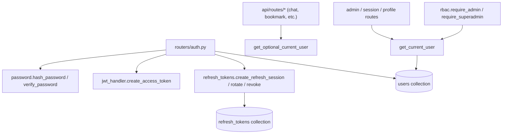

# Module: `auth`

Source-verified: 2026-06-24 from `auth/__init__.py`, `auth/jwt_handler.py`, `auth/refresh_tokens.py`, `auth/password.py`, `auth/rbac.py`, plus `routers/auth.py` and `models/user.py`.

## Purpose

`auth` contains authentication and authorization primitives used by FastAPI routes. It does not register routes itself; HTTP endpoints live in `routers/auth.py`. The package `__init__.py` is essentially empty (1 line, no re-exports); import directly from submodules.

## File Map

```text
auth/
  __init__.py       Empty package marker (no exports).
  jwt_handler.py    JWT creation/verification and FastAPI current-user dependencies.
  refresh_tokens.py Opaque refresh-token sessions, rotation, hashing, revocation.
  password.py       bcrypt password hashing and verification helpers.
  rbac.py           Admin and superadmin role-enforcement dependencies.
```

## JWT Contract

Uses `python-jose` (`jose`) with HS256 by default. `JWT_SECRET_KEY` is **required** at runtime — raises `RuntimeError("JWT_SECRET_KEY environment variable is not set.")` if unset. `JWT_ALGORITHM` defaults to `"HS256"`.

### `create_access_token(user_id: str, email: str, role: str = "student") -> str`

Signs a JWT with the following payload claims:

| Claim   | Value |
|---------|-------|
| `sub`   | MongoDB `_id` as plain string (used to look up the user) |
| `email` | HUST email address (informational; do not trust without DB check) |
| `role`  | `"student"` or `"admin"` |
| `typ`   | `"access"` |
| `jti`   | `str(uuid4())` |
| `iat`   | issued-at (UTC) |
| `exp`   | `iat + JWT_ACCESS_EXPIRE_MINUTES` minutes |

Access token lifetime reads `JWT_ACCESS_EXPIRE_MINUTES` first; falls back to legacy `JWT_EXPIRE_MINUTES`; hard default is `15` minutes.

`access_token_expires_in_seconds() -> int` exposes the lifetime in seconds (minutes × 60) for `expires_in` response fields.

### `verify_token(token: str) -> dict`

Decodes and validates signature and expiry; returns the payload dict. Raises `HTTPException 401` on expired (`ExpiredSignatureError`) or otherwise invalid (`JWTError`) tokens.

### FastAPI dependencies

- **`get_current_user(token, db) -> UserDocument`** — uses `OAuth2PasswordBearer(tokenUrl="/auth/login", auto_error=True)`. Requires: valid Bearer token → `sub` is a valid `ObjectId` → user exists in `users` collection → `is_active=True`. Any failure raises `HTTPException 401`. Returns a `UserDocument`.

- **`get_optional_current_user(credentials, db) -> UserDocument | None`** — uses `HTTPBearer(auto_error=False)`. Returns `None` when no `Authorization` header is present; if a header is present but the token is malformed/expired, raises `HTTPException 401`. Same DB + active checks as above when credentials are present.

Chat and other client routes use optional auth; admin and destructive/session routes require strict auth.

## Refresh Token Sessions

`refresh_tokens.py` issues opaque random tokens (`secrets.token_urlsafe(64)`) and stores only a SHA-256 hash (`hashlib.sha256`) in MongoDB collection `REFRESH_TOKENS_COLLECTION`.

**Env config:**

| Variable | Default | Meaning |
|----------|---------|---------|
| `JWT_REFRESH_EXPIRE_DAYS` | `30` | Absolute lifetime from creation |
| `JWT_REFRESH_IDLE_DAYS` | `7` | Idle timeout from `last_used_at` |

**Stored document fields:** `token_hash`, `user_id`, `family_id` (uuid4 auto-assigned if not supplied), `client_type`, `created_at`, `expires_at`, `last_used_at`, `revoked_at`, `replaced_by`.

**Public functions:**

- `generate_refresh_token() -> str` — returns a high-entropy opaque token.
- `hash_refresh_token(token: str) -> str` — SHA-256 hex digest; used for all DB lookups.
- `refresh_token_max_age_seconds() -> int` — `JWT_REFRESH_EXPIRE_DAYS * 86400` (for cookie `Max-Age`).
- `create_refresh_session(db, *, user_id: str, client_type: str = "web", family_id: str | None = None) -> str` — inserts a session document; returns the raw token once.
- `rotate_refresh_token(db, token: str, *, client_type: str = "web") -> tuple[str, UserDocument]` — validates, revokes the presented token, inserts a new child token inheriting `family_id` and `expires_at` (absolute lifetime is **not** extended on rotation), returns `(new_raw_token, user)`. Reuse of an already-revoked token triggers full family revocation.
- `revoke_refresh_token(db, token: str, *, now: datetime | None = None) -> bool` — revokes a single token by hash; returns `True` if a document was modified.
- `revoke_refresh_family(db, family_id: str, *, now: datetime | None = None) -> None` — sets `revoked_at` on all live tokens in the family.

**Known gotcha — Motor datetime naivety:** Motor/PyMongo returns naive UTC datetimes by default. `_as_utc(dt)` re-attaches `timezone.utc` before comparing with `_now()` to avoid comparison errors.

**Known gotcha — TOCTOU race in `rotate_refresh_token`:** The find-then-update pattern has a theoretical race if two concurrent requests present the same token simultaneously. Worst case: a duplicate child token in the same family; reuse detection will eventually revoke the family. A full fix requires a MongoDB transaction or an atomic `findOneAndUpdate` migration (documented in source).

Web clients receive refresh tokens through an HttpOnly cookie (set in `routers/auth.py`). Mobile clients (`client_type="mobile"`) receive/send the opaque refresh token in the API JSON response.

## Passwords

`password.py` wraps `bcrypt` directly — no passlib dependency.

- `hash_password(plain: str) -> str` — `bcrypt.hashpw(plain.encode(), bcrypt.gensalt()).decode()`
- `verify_password(plain: str, hashed: str) -> bool` — `bcrypt.checkpw(plain.encode(), hashed.encode())`

Do not compare plain-text passwords in route handlers; always delegate to these helpers.

## RBAC

`rbac.py` provides two FastAPI dependencies (both depend on `get_current_user`):

- **`require_admin(current_user) -> UserDocument`** — requires `current_user.role == "admin"`, else `HTTPException 403 "Admin role required"`. Note: superadmin status alone does **not** satisfy this check; the DB `role` field must be `"admin"`.
- **`require_superadmin(current_user) -> UserDocument`** — reads `SUPERADMIN_USER_IDS` (comma-separated `ObjectId` strings) from env **at call-time** (not cached). Requires `str(current_user.id)` to be in that set, else `HTTPException 403 "Superadmin privileges required"`.

`UserDocument.role` is `"student"` by default; valid values are `student | admin`. Superadmin is **not** a DB role — it is an env-var overlay used exclusively to gate admin-account creation.

## Module Flow



External module boundaries:

- HTTP request/response behavior lives in `routers/auth.py`; this module exposes only reusable primitives and dependencies.
- User and refresh-token documents are stored through `models/database.py` (`USERS_COLLECTION`, `REFRESH_TOKENS_COLLECTION`); user shape is `models/user.UserDocument`.
- `require_admin`, `require_superadmin`, `get_current_user`, and `get_optional_current_user` are consumed across `api/routes/*` (admin_stats, chat, bookmark, notification, notification_admin, feedback, lookup, session, upload) and `routers/auth.py`.

## Maintenance Notes

- If JWT payload fields change, update `models/user.py`, frontend/mobile auth stores, and all JWT tests.
- If refresh-token session fields change, update `models/database.py` indexes, `routers/auth.py`, web/mobile auth clients, and refresh tests.
- `require_superadmin` re-reads `SUPERADMIN_USER_IDS` on every request. This is intentional (runtime override without restart) but adds a tiny `os.environ` access per call.
- Keep route-level auth rules in `routers/auth.py`; never duplicate role checks across routers.
- Never trust body-supplied `user_id` when a Bearer token is present — `get_current_user` reads identity exclusively from the `sub` claim.

## Useful Checks

```bash
# Syntax check all auth submodules
python -m py_compile auth/jwt_handler.py auth/refresh_tokens.py auth/password.py auth/rbac.py

# Run auth-related tests (no integration calls)
python -m pytest tests/test_auth_refresh.py tests/test_rbac.py -q -m "not integration"
```
