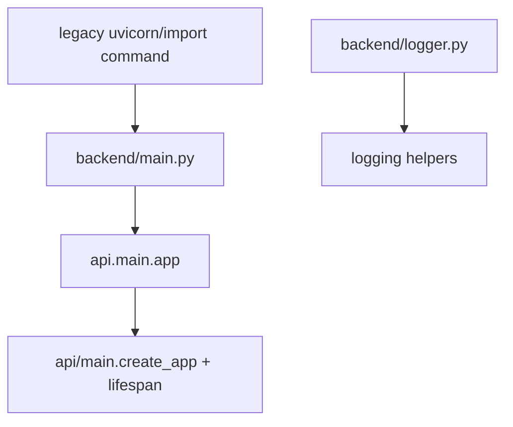

# Module: `backend`

Source-verified: 2026-06-02 from `backend/*.py` and `api/main.py`.

## Purpose

`backend` is a compatibility wrapper around the current FastAPI application under `api/`. It is not the primary backend implementation.

## File Map

```text
backend/
  main.py    Re-exports/runs `api.main.app` for legacy commands.
  logger.py  Logging helper/configuration code.
```

## Runtime Contract

Primary application code lives in:

```text
api/main.py
```

Use `backend/main.py` only when a script or deployment command still expects the older backend entrypoint. Architecture, routes, lifespan, and pipeline initialization should be documented and changed in `api/`, not here.

## Module Flow



External module boundaries:

- `backend` is a shim; route, lifespan, settings, and pipeline behavior belong in `api`.
- Deployment docs can reference this wrapper only for compatibility with older commands.

## Maintenance Notes

- Do not add new route logic to `backend/`.
- Keep this wrapper thin so old commands continue to work.
- If app startup behavior changes, update `api/MODULE.md` and `ARCHITECTURE.md`.
