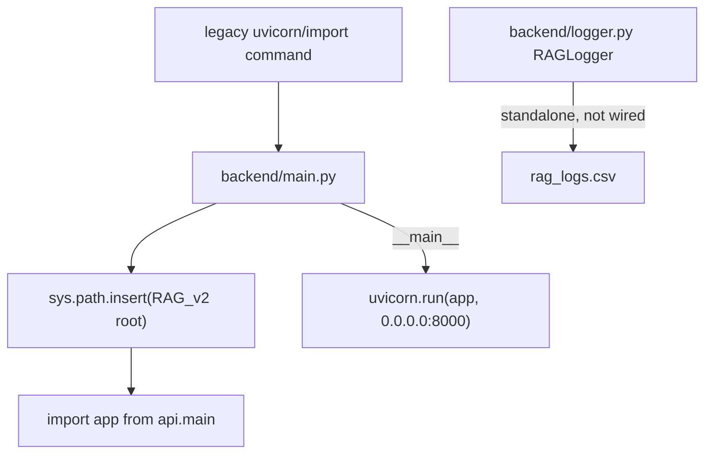

# Module: `backend`

Source-verified: 2026-06-05 from `backend/main.py` and `backend/logger.py`.

## Purpose

`backend` is a thin compatibility wrapper around the current FastAPI application under `api/`. It is not the primary backend implementation.

## File Map

```text
backend/
  main.py    Adds RAG_v2 root to sys.path, imports `app` from `api.main`, and runs uvicorn under `__main__`.
  logger.py  `RAGLogger` — a standalone CSV interaction logger (timestamp/question/answer/model_name); not the app logging config.
```

## Runtime Contract

Primary application code lives in:

```text
api/main.py
```

`backend/main.py` prepends the RAG_v2 root to `sys.path`, re-exports `app` from `api.main`, and when run as `__main__` starts uvicorn on `0.0.0.0:8000` (hard-coded, not from `Settings`). Use it only when a script or deployment command still expects the older entrypoint (`python src/RAG_v2/backend/main.py` or `uvicorn src.RAG_v2.backend.main:app`). Architecture, routes, lifespan, and pipeline initialization should be documented and changed in `api/`, not here.

`backend/logger.py` is independent of the app: `RAGLogger` appends rows to a CSV (UTF-8-BOM) and is not wired into `main.py`.

## Module Flow



External module boundaries:

- `backend` is a shim; route, lifespan, settings, and pipeline behavior belong in `api`.
- Deployment docs can reference this wrapper only for compatibility with older commands.

## Maintenance Notes

- Do not add new route logic to `backend/`.
- Keep this wrapper thin so old commands continue to work.
- If app startup behavior changes, update `api/MODULE.md` and `ARCHITECTURE.md`.
