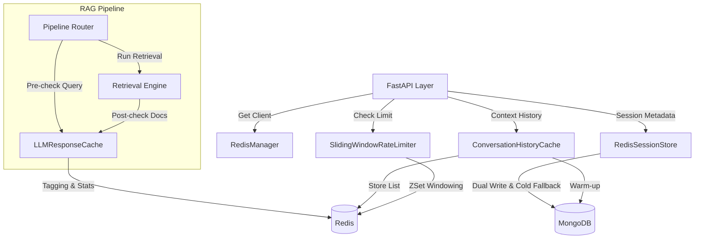

# Module: `cache` — Redis-backed High Performance Caching & Infrastructure

## 1. Tổng quan

Module `cache` là lớp hạ tầng tốc độ cao của hệ thống RAG v2, sử dụng **Redis** làm backend chính. Module này chịu trách nhiệm tối ưu hóa hiệu năng toàn diện thông qua việc giảm tải cho các dịch vụ tốn kém (LLM, Databases), quản lý trạng thái phiên làm việc (Session), lưu trữ ngữ cảnh hội thoại siêu tốc (History) và thực thi các chính sách giới hạn tài nguyên (Rate Limiting).

Việc sử dụng Redis giúp hệ thống đạt được độ trễ cực thấp (sub-millisecond) cho các thao tác đọc/ghi dữ liệu tạm thời, đồng thời hỗ trợ khả năng mở rộng (scalability) khi chạy nhiều instance API. Các cơ chế Fail-soft và Dual-write được tích hợp sâu giúp duy trì tính ổn định của hệ thống ngay cả khi có sự cố.

---

## 2. Cấu trúc Module

```text
cache/
├── redis_client.py     # Connection Manager — Quản lý connection pool, singleton và health check.
├── llm_cache.py        # Dual-layer LLM Cache — Pre-retrieval (tiết kiệm ~20s) và Post-retrieval cache (FAQ promotion, Surgical Invalidation).
├── session_store.py    # Session Management — Dual-write sang MongoDB, giới hạn 100 sessions/user, Zombie cleanup.
├── history_cache.py    # Context History — Lưu 20 tin nhắn gần nhất bằng LPUSH/LTRIM phục vụ short-term memory.
└── rate_limiter.py     # Rate Limiting — Giới hạn Sliding Window theo phút và ngày với Redis Sorted Sets.
```

---

## 3. Các thành phần và Cơ chế cốt lõi

### 3.1. Centralized Connection Management (`redis_client.py`)
Sử dụng class `RedisManager` (Singleton) để quản lý kết nối an toàn và hiệu quả:
- **Connection Pool**: Tối ưu hóa việc tái sử dụng kết nối TCP, giảm overhead khởi tạo. Hỗ trợ Health Check định kỳ.
- **Graceful Shutdown**: Tự động đóng toàn bộ pool một cách an toàn khi ứng dụng FastAPI tắt.
- **Security Logging**: Tự động ẩn (redact) mật khẩu trong connection URL khi ghi log, đảm bảo an toàn thông tin.

### 3.2. Dual-Layer LLM Cache (`llm_cache.py`)
Cơ chế caching thông minh 2 lớp để tối đa hóa hiệu năng và độ chính xác:
- **Pre-retrieval Cache (`q:{sha}`)**: Lưu kết quả chỉ dựa trên (Query đã chuẩn hóa + Model) với TTL ngắn (5 phút). Kiểm tra *trước* khi chạy retrieval, giúp tiết kiệm 15-25s nếu có hit.
- **Post-retrieval Cache (`{sha}`)**: Exact-match dựa trên SHA256 của (Query + Sorted Doc IDs + Model). TTL mặc định 1 giờ.
- **FAQ Promotion**: Hệ thống theo dõi tần suất (`hit_count`). Nếu một câu hỏi được hit >= 5 lần, TTL sẽ được tự động thăng cấp (promote) lên 24 giờ.
- **Surgical Invalidation**: Reverse-index lưu trữ `doc_cache_tag:{doc_id}`. Khi Crawler cập nhật dữ liệu của một tài liệu, hệ thống dùng hàm `invalidate_by_docs` để chỉ xóa chính xác các cache entry liên quan đến document đó, giữ nguyên phần còn lại của cache.

### 3.3. Session Store & Dual-Write (`session_store.py`)
Quản lý metadata phiên chat nhanh chóng qua Redis Hash và Sorted Sets:
- **Dual-Write Strategy**: Mọi thao tác tạo mới hoặc cập nhật session đều được ghi đồng thời vào Redis (nhanh) và MongoDB (bền vững).
- **User Limits**: Giữ tối đa `100 sessions` gần nhất cho mỗi User để tối ưu bộ nhớ.
- **Cold Cache Fallback / Warm-up**: Nếu không tìm thấy session trong Redis, hệ thống truy vấn MongoDB và nạp ngược lại Redis để các request tiếp theo truy xuất siêu nhanh.
- **Zombie Cleanup**: Tự động dọn dẹp các session ID "mồ côi" trong `user_sessions` Sorted Set khi Hash chứa metadata đã bị Redis xóa do hết hạn (TTL 7 ngày).
- **Mongo Sync After Turns**: `sync_from_mongo(session_id)` refresh Redis từ
  MongoDB sau khi pipeline ghi turn qua `MongoLogger`, giữ `title`,
  `updated_at`, và `turn_count` nhất quán cho mobile session list.
- **Session ID Consistency**: `new_session()` dual-write trực tiếp cùng
  `session_id` sang MongoDB thay vì tạo ID thứ hai rồi sửa lại.

### 3.4. Fast Context History (`history_cache.py`)
Lưu trữ ngữ cảnh hội thoại ngắn hạn để tránh query MongoDB liên tục:
- **LPUSH + LTRIM**: Giữ cố định 20 messages (tương đương 10 lượt hỏi-đáp) mới nhất trong Redis List.
- **Cache Warming**: Hỗ trợ nạp (warm-up) lịch sử từ MongoDB lên Redis theo đúng thứ tự (oldest-first lpush) khi cache miss.
- **Auto Expiration**: TTL 2 giờ, tự động giải phóng bộ nhớ nếu user ngừng chat.

### 3.5. Sliding Window Rate Limiter (`rate_limiter.py`)
Thực thi giới hạn API sử dụng cấu trúc Sorted Sets (score = timestamp):
- **Continuous Sliding Window**: Khắc phục nhược điểm của Fixed Window, không bị hiện tượng "burst" (truy cập ồ ạt) tại các thời điểm chuyển giao phút/ngày.
- **Multi-level Limits**: Hỗ trợ đồng thời Rate Limit theo Phút (RPM) và Ngày (RPD).
- **Retry-After Calculation**: Trả về chính xác số giây người dùng cần chờ (`retry_after_seconds`) để được mở khóa.
- **Alert Thresholds**: Cảnh báo sớm qua logger nếu user tiêu thụ > 80% quota (`alert_threshold`).

---

## 4. Thiết kế Schema Redis

Bảng dưới đây liệt kê các cấu trúc dữ liệu chính đang vận hành trong Redis:

| Key Pattern | Type | Mô tả | TTL |
|:---|:---|:---|:---|
| `session:{sid}` | Hash | Metadata session (user_id, title, turn_count, created_at, updated_at). | 7 ngày |
| `user_sessions:{uid}` | ZSet | Danh sách các `session_id` của user (score = ts). Max 100 items. | N/A |
| `history:{sid}` | List | Lưu 20 messages gần nhất. Dùng LPUSH/LTRIM. | 2 giờ |
| `llm_cache:{sha}` | Hash | Post-retrieval cache. Fingerprint từ (Query + DocIDs + Model). | 1h -> 24h |
| `llm_cache:q:{sha}` | Hash | Pre-retrieval cache. Fingerprint từ (Query + Model). | 5 phút |
| `llm_cache:stats` | Hash | Lưu số liệu `hits` và `misses` của bộ đệm LLM. | N/A |
| `doc_cache_tag:{did}`| Set | Danh sách post-retrieval cache keys chứa `doc_id` này. Dùng để xóa tag. | 24 giờ |
| `rate:min:{id}` | ZSet | Sliding window cho giới hạn theo phút. Member là UUID, Score là Timestamp. | 120 giây |
| `rate:day:{id}` | ZSet | Sliding window cho giới hạn theo ngày. | 24h + 60s |

---

## 5. Tương tác hệ thống



---

## 6. Hiệu năng và Lưu ý (Best Practices)

- **Độ trễ thấp**: Hầu hết các lệnh Redis (HGETALL, LPUSH, ZADD) sử dụng trong module đều thực thi qua cơ chế **Pipeline** của `redis-py` giúp gộp nhiều network trips thành một, giảm độ trễ thực tế xuống dưới **2ms**.
- **Memory Management**: Việc giới hạn lịch sử chat (`_HISTORY_LIMIT = 20`) và giới hạn user session (`_MAX_SESSIONS_PER_USER = 100`) ngăn chặn Redis cạn kiệt RAM do dữ liệu tồn đọng.
- **Fail-soft Architecture**: Nếu kết nối Redis bị gián đoạn, `rate_limiter` sẽ tự động cho phép request đi tiếp, `session_store` và `history_cache` sẽ tự động bypass và lấy dữ liệu trực tiếp từ MongoDB. Hệ thống log warning thay vì sụp đổ (crash).

---
*Cập nhật lần cuối: 2026-05-15 bởi Codex*
