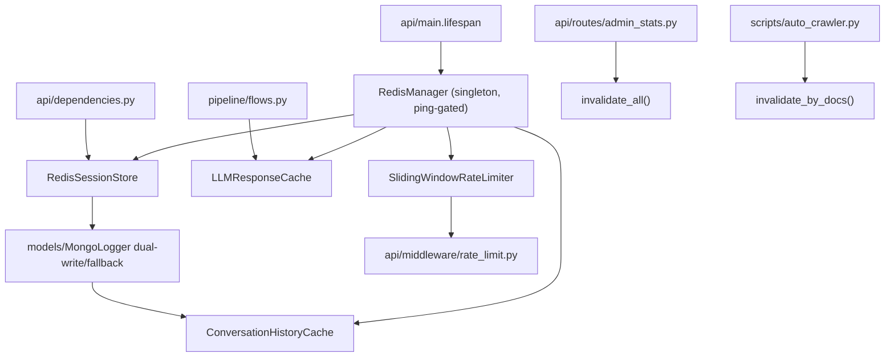

# Module: `cache`

Source-verified: 2026-06-12 from `cache/__init__.py`, `cache/redis_client.py`, `cache/session_store.py`, `cache/history_cache.py`, `cache/llm_cache.py`, `cache/rate_limiter.py`.

## Purpose

`cache` provides optional Redis infrastructure for four concerns: session metadata, recent conversation history, exact-match LLM response caching, and sliding-window rate limiting. Every public method wraps Redis calls in `try/except redis.RedisError` and degrades gracefully — sessions/history fall back to MongoDB, the rate limiter allows the request, caches return `None`/no-op.

There is **no in-memory fallback inside this module** — `fakeredis` is used only in `tests/`. At runtime, Redis is gated by `Settings.redis_enabled` plus per-feature flags; resources are only created if `RedisManager.ping()` succeeds.

The cross-student answer-leak bug is fixed by mixing the student's `profile` (normalized `major|cohort` string) into every LLM cache key. A request with an empty `profile` (anonymous) remains in a separate key space and never collides with a profiled one.

## File Map

```text
cache/
  __init__.py        Package docstring only; no exports.
  redis_client.py    RedisManager: singleton connection-pool wrapper, ping, redacted-URL logging, close().
  session_store.py   RedisSessionStore: session metadata in Hash + per-user ZSet, MongoDB dual-write/fallback.
  history_cache.py   ConversationHistoryCache: recent chat turns in a Redis List (LPUSH + LTRIM).
  llm_cache.py       LLMResponseCache: post-retrieval + pre-retrieval answer cache with profile-scoped keys,
                     doc-tag invalidation, and FAQ TTL promotion.
  rate_limiter.py    SlidingWindowRateLimiter + RateLimitResult: per-minute/per-day sliding windows via ZSets.
```

## Backend Selection / Runtime Ownership

`api/main.py:lifespan()` builds Redis resources and stores them on `app.state`:

- `RedisManager.from_settings(settings)` returns a process-wide singleton holding one `ConnectionPool` (`decode_responses=True`; pool/timeout sizes from `redis_*` settings).
- If `redis_manager.ping()` succeeds, per-feature flags decide what gets created:
  - `use_redis_session` → `app.state.redis_session` (`RedisSessionStore`)
  - `use_redis_cache` → `app.state.llm_cache` (`LLMResponseCache`)
  - `use_redis_history` → `app.state.history_cache` (`ConversationHistoryCache`), also assigned to `mongo_logger.history_cache`
  - `app.state.rate_limiter` (`SlidingWindowRateLimiter`)
- On import error / ping failure / exception, the corresponding `app.state` slots stay `None`.
- Shutdown calls `redis_manager.close()` (closes client + disconnects pool, resets the class-level singleton).

## Redis Key Contracts

| Key pattern | Type | Fields / Members | Purpose | TTL |
|---|---|---|---|---|
| `session:{sid}` | Hash | session_id, user_id, title, created_at, updated_at, turn_count | Session metadata | 7 days (refreshed on turn/title update) |
| `user_sessions:{uid}` | ZSet | member=sid, score=updated_at_ts | Per-user session list newest-first, trimmed to 100 | none (members trimmed via `zremrangebyrank`) |
| `history:{sid}` | List | JSON `{"role", "content"}` per element, newest at index 0 | Recent messages, oldest-first on read | 2 hours idle |
| `llm_cache:{sha256}` | Hash | answer, sources_json, model, created_at, hit_count | Post-retrieval answer, keyed by query+doc_ids+model+profile | 1 h; promoted to 24 h at 5 hits |
| `llm_cache:q:{sha256}` | Hash | answer, sources_json, model, created_at, hit_count | Pre-retrieval query-only answer, keyed by query+model+profile | 5 minutes |
| `llm_cache:stats` | Hash | hits, misses | Cache hit/miss counters (post-retrieval path only) | none |
| `doc_cache_tag:{doc_id}` | Set | cache key strings | Reverse index doc_id → post-retrieval cache keys for surgical invalidation | 24 hours |
| `rate:min:{id}` | ZSet | member=uuid, score=unix_ts | Requests-per-minute sliding window | 60 s + 10 s buffer |
| `rate:day:{id}` | ZSet | member=uuid, score=unix_ts | Requests-per-day sliding window | 86 400 s + 60 s buffer |

## RedisManager

```python
class RedisManager:
    _instance: Optional["RedisManager"] = None

    def __init__(self, url: str, settings: Optional[Settings] = None) -> None: ...
    @classmethod
    def from_settings(cls, settings: Settings) -> "RedisManager": ...  # singleton
    def get_client(self) -> redis.Redis: ...
    def ping(self) -> bool: ...
    def close(self) -> None: ...  # resets _instance; call from lifespan shutdown
```

Settings consumed: `redis_url`, `redis_max_connections` (default 20), `redis_socket_timeout` (5.0 s), `redis_connect_timeout` (5.0 s), `redis_health_check_interval` (30 s). Pool is created with `decode_responses=True` and `retry_on_timeout=True`. Password is redacted from log output via `_redact_url`.

## LLM Response Cache

### Key construction — profile scoping (cross-student leak fix)

Both cache layers mix in `profile` to prevent a personal answer from being served to a different student.

**Post-retrieval key** (`_build_key`):
```python
fingerprint = f"{query.strip().lower()}||{','.join(sorted_doc_ids)}||{model}||{profile}"
key = f"llm_cache:{sha256(fingerprint)}"
```

**Pre-retrieval / query-only key** (`_build_query_only_key`):
```python
fingerprint = f"llm_qcache:{query.strip().lower()}||{model}||{profile}"
key = f"llm_cache:q:{sha256(fingerprint)}"
```

`profile` defaults to `""`. An empty profile (anonymous callers) never collides with a profiled key because the literal `profile` segment differs. Callers that omit `profile` are unaffected (legacy behaviour preserved).

### Class signature

```python
class LLMResponseCache:
    def __init__(self, redis_client: redis.Redis) -> None: ...

    # Post-retrieval (doc-ids known)
    def get(self, query: str, doc_ids: List[str], model: str, profile: str = "") -> Optional[Dict[str, Any]]: ...
    def put(self, query: str, doc_ids: List[str], model: str, answer: str, sources: List[Dict[str, Any]], profile: str = "") -> None: ...

    # Pre-retrieval (query only, checked before reflection/retrieval)
    def get_by_query(self, query: str, model: str, profile: str = "") -> Optional[Dict[str, Any]]: ...
    def put_by_query(self, query: str, model: str, answer: str, sources: List[Dict[str, Any]], profile: str = "") -> None: ...

    # Invalidation
    def invalidate_by_docs(self, doc_ids: List[str]) -> int: ...   # surgical, via doc tags; returns count removed
    def invalidate_all(self) -> int: ...                            # full wipe; use only for model change / full reindex

    # Stats
    def get_stats(self) -> Dict[str, int]: ...  # {"hits": int, "misses": int}
```

### Return shape (both `get` and `get_by_query`)

```python
{
    "answer": str,
    "sources": list,          # decoded from sources_json field
    "model_name": str,
    "cached_at": str,         # ISO-8601 UTC string
    "hit_count": int,         # only present on get(); absent on get_by_query()
}
```

### TTL constants

| Constant | Value | Used for |
|---|---|---|
| `_DEFAULT_TTL` | 3 600 s (1 h) | Post-retrieval initial TTL |
| `_FAQ_TTL` | 86 400 s (24 h) | Post-retrieval promoted TTL at `_FAQ_HIT_THRESHOLD` = 5 hits |
| `_TAG_TTL` | 86 400 s (24 h) | `doc_cache_tag:{doc_id}` reverse-index sets |
| `_QUERY_CACHE_TTL` | 300 s (5 min) | Pre-retrieval / query-only TTL (shorter; no doc-level invalidation) |

### Gotchas

- `get` increments `hit_count` unconditionally via pipeline before checking if the key exists; this means a miss will attempt `hincrby` on a non-existent key (Redis no-ops gracefully, but the pipeline returns `1` for `hincrby` even on a miss — the code correctly checks `results[0]` for emptiness, not `results[1]`).
- `invalidate_all` scans `llm_cache:[0-9a-f]*` (post-retrieval keys only by regex) and `doc_cache_tag:*`. It does **not** scan `llm_cache:q:*` (pre-retrieval keys); those expire naturally within 5 minutes.
- The module-level docstring in `llm_cache.py` lists `sources_summary` as the hash field — this is **stale/wrong**; the actual field name in all code paths is `sources_json`.
- Stats are only tracked for the post-retrieval path (`_record_hit` / `_record_miss`); `get_by_query` hits are logged but not counted in `llm_cache:stats`.

## Session Store

```python
class RedisSessionStore:
    def __init__(self, redis_client: redis.Redis, mongo_logger: Any = None) -> None: ...
    def new_session(self, user_id: Optional[str] = None) -> str: ...
    def get_session(self, session_id: str) -> Optional[Dict[str, Any]]: ...
    def list_sessions(self, user_id: str, limit: int = 50) -> List[Dict[str, Any]]: ...
    def update_session_on_turn(self, session_id: str, question: str, turn_id: int) -> None: ...
    def delete_session(self, session_id: str, user_id: Optional[str] = None) -> bool: ...
    def update_session_title(self, session_id: str, title: str) -> bool: ...
    def sync_from_mongo(self, session_id: str) -> None: ...
```

Key behaviours:
- `new_session` generates a UUID, writes `session:{sid}` Hash (TTL 7 days) and `user_sessions:{uid}` ZSet entry, trims ZSet to `_MAX_SESSIONS_PER_USER` = 100, then dual-writes to MongoDB. On Redis failure falls back to `mongo_logger.new_session`.
- `list_sessions` reads ZSet newest-first, batch-fetches hashes in a pipeline, prunes zombie IDs (member in ZSet but Hash expired), falls back to MongoDB when ZSet is empty or Redis fails.
- `update_session_on_turn` sets `title` from the first 80 chars of `question` only when `turn_id == 1`.
- `sync_from_mongo` re-warms Redis metadata from MongoDB; called after `MongoLogger` logs turns so session list views stay consistent without coupling `MongoLogger` to Redis.
- `_SESSION_TTL_SECONDS` = 604 800 s (7 days).

## History Cache

```python
class ConversationHistoryCache:
    def __init__(self, redis_client: redis.Redis) -> None: ...
    def get_history(self, session_id: str) -> Optional[List[Dict[str, str]]]: ...  # None = cache miss → fallback to Mongo
    def add_message(self, session_id: str, role: str, content: str) -> None: ...
    def warm_history(self, session_id: str, history: List[Dict[str, str]]) -> None: ...  # input is oldest-first
    def delete_history(self, session_id: str) -> None: ...
```

- `_HISTORY_LIMIT` = 20 messages (10 turns), `_HISTORY_TTL` = 7 200 s (2 hours).
- LPUSH + LTRIM keeps newest at index 0; `get_history` reverses to return oldest-first.
- `get_history` returns `None` (not `[]`) when the key is absent, so callers can distinguish a cache miss from an empty history and fall back to MongoDB.

## Rate Limiter

```python
@dataclass
class RateLimitResult:
    allowed: bool
    remaining_rpm: int
    remaining_rpd: int
    retry_after_seconds: float = 0.0
    limit_type: Optional[str] = None   # "minute" | "day" | None

class SlidingWindowRateLimiter:
    def __init__(self, redis_client: redis.Redis, rpm: int = 20, rpd: int = 200, alert_threshold: float = 0.8) -> None: ...
    def check(self, identifier: str) -> RateLimitResult: ...   # does NOT record; returns allowed=True on Redis failure
    def record(self, identifier: str) -> None: ...             # call AFTER successful LLM invocation
    def get_usage(self, identifier: str) -> dict: ...          # {"minute_used", "minute_limit", "day_used", "day_limit"}
```

`identifier` is `user_id` for authenticated users or IP address for anonymous. `check` cleans expired ZSet members, counts windows, computes `retry_after` from the oldest surviving member, and logs a warning when usage exceeds `alert_threshold`. Minute limit is checked before daily limit.

## Module Flow



## Settings (`config/settings.py`)

| Setting | Default | Purpose |
|---|---|---|
| `redis_url` | — | Connection URL |
| `redis_enabled` | — | Master on/off gate |
| `redis_max_connections` | 20 | Pool size |
| `redis_socket_timeout` | 5.0 s | Socket read/write timeout |
| `redis_connect_timeout` | 5.0 s | Connection timeout |
| `redis_health_check_interval` | 30 s | Pool health-check interval |
| `use_redis_session` | — | Enable session store |
| `use_redis_cache` | — | Enable LLM cache |
| `use_redis_history` | — | Enable history cache |
| `rate_limit_enabled` | — | Enable rate limiter middleware |
| `rate_limit_rpm` | 20 | Requests per minute |
| `rate_limit_rpd` | 200 | Requests per day |
| `rate_limit_alert_threshold` | 0.8 | Log-warning threshold fraction |

## Maintenance Notes

- **Profile must be passed by every cache caller.** If a new call site omits `profile`, anonymous and profiled answers will share a key space — silently re-introducing the cross-student leak.
- The module docstring in `llm_cache.py` (lines 13–16) lists `sources_summary` as a hash field. This is a documentation bug; the field is `sources_json` everywhere in the code. Do not use `sources_summary`.
- `invalidate_all` does not clear pre-retrieval `llm_cache:q:*` keys. This is intentional (5-min TTL makes it low-risk), but be aware after a model change.
- `RedisManager` holds a class-level singleton `_instance`. In tests, always call `close()` in teardown or use `fakeredis` with a fresh instance; otherwise state leaks across test cases.
- `user_sessions:{uid}` ZSet has no TTL; it is kept tidy by `zremrangebyrank` trimming to 100 and by zombie-cleanup in `list_sessions`. If a user is deleted, their ZSet key will linger until all member hashes expire and the next `list_sessions` call cleans zombies.

## Useful Checks

```bash
# Syntax check all cache files
python -m py_compile src/RAG_v2/cache/*.py

# Run cache-specific tests (no integration)
pytest src/RAG_v2/tests/test_phase1_redis.py src/RAG_v2/tests/test_phase2_redis.py -q -m "not integration"

# Verify profile-scoping: two profiles must produce different keys
python - <<'EOF'
from cache.llm_cache import LLMResponseCache
import redis
r = redis.Redis()  # or fakeredis
c = LLMResponseCache(r)
k1 = c._build_key("query", ["doc1"], "gpt-4o", profile="CNTT|K22")
k2 = c._build_key("query", ["doc1"], "gpt-4o", profile="KTPM|K21")
k3 = c._build_key("query", ["doc1"], "gpt-4o", profile="")
assert k1 != k2 != k3, "Profile scoping broken"
print("OK:", k1, k2, k3)
EOF
```
