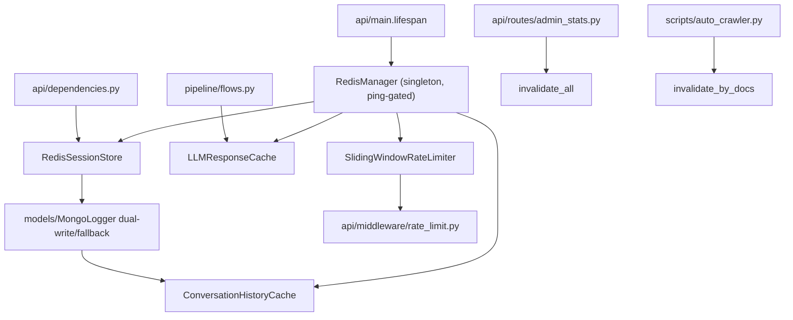

# Module: `cache`

Source-verified: 2026-06-05 from `cache/__init__.py`, `cache/redis_client.py`, `cache/session_store.py`, `cache/history_cache.py`, `cache/llm_cache.py`, `cache/rate_limiter.py`, plus consumers `api/main.py`, `api/dependencies.py`, `api/middleware/rate_limit.py`, `api/routes/admin_stats.py`, `pipeline/flows.py`, `scripts/auto_crawler.py`, and `config/settings.py`.

## Purpose

`cache` contains optional Redis infrastructure for sessions, short chat history, an exact-match LLM response cache, and sliding-window rate limiting. Every class is fail-soft: each public method wraps Redis calls in `try/except redis.RedisError` and on failure either falls back to MongoDB (sessions/history) or degrades gracefully (rate limiter allows the request; caches return `None`/no-op).

There is **no in-memory or fakeredis fallback inside the module** — `fakeredis` is used only in `tests/`. At runtime, Redis is gated by `Settings.redis_enabled` plus per-feature flags, and only wired up if `RedisManager.ping()` succeeds.

## File Map

```text
cache/
  __init__.py        Package docstring only; no exports.
  redis_client.py    RedisManager: singleton connection-pool wrapper, ping health check, redacted-URL logging, close().
  session_store.py   RedisSessionStore: session metadata in Hash + per-user ZSet, MongoDB dual-write/fallback.
  history_cache.py   ConversationHistoryCache: recent chat turns in a Redis List (LPUSH + LTRIM).
  llm_cache.py       LLMResponseCache: post-retrieval + pre-retrieval (query-only) answer cache with doc-tag invalidation and FAQ promotion.
  rate_limiter.py    SlidingWindowRateLimiter + RateLimitResult: per-minute / per-day sliding windows via Redis sorted sets.
```

## Backend Selection / Runtime Ownership

`api/main.py:lifespan()` builds Redis resources and stores them on `app.state`:

- `RedisManager.from_settings(settings)` returns a process-wide singleton holding one `ConnectionPool` (`decode_responses=True`; pool/timeout sizes from `redis_*` settings).
- If `redis_manager.ping()` succeeds, `redis_status = "ok"` and the per-feature flags decide what gets created:
  - `use_redis_session` → `app.state.redis_session` (`RedisSessionStore`)
  - `use_redis_cache` → `app.state.llm_cache` (`LLMResponseCache`)
  - `use_redis_history` → `app.state.history_cache` (`ConversationHistoryCache`), also assigned to `mongo_logger.history_cache`
  - `app.state.rate_limiter` (`SlidingWindowRateLimiter`)
- On import error / ping failure / exception, `redis_status` becomes `not_installed` / `failed` / `disabled` and the corresponding `app.state` slots stay `None`.
- Shutdown calls `redis_manager.close()` (closes client + disconnects pool, resets the singleton).

## Redis Key Contracts

| Key pattern | Type | Fields / Member | Purpose | TTL |
| --- | --- | --- | --- | --- |
| `session:{sid}` | Hash | session_id, user_id, title, created_at, updated_at, turn_count | Session metadata. | 7 days (refreshed on turn/title) |
| `user_sessions:{uid}` | ZSet | member=sid, score=updated_at ts | Per-user session list (newest first), trimmed to 100. | none (members trimmed) |
| `history:{sid}` | List | JSON `{role, content}` per element | Recent messages, newest at index 0. | 2 hours idle |
| `llm_cache:{sha256}` | Hash | answer, sources_json, model, created_at, hit_count | Post-retrieval answer cache keyed by query+doc_ids+model. | 1h, promoted to 24h at 5 hits |
| `llm_cache:q:{sha256}` | Hash | answer, sources_json, model, created_at, hit_count | Pre-retrieval query-only cache (no doc_ids). | 5 minutes |
| `llm_cache:stats` | Hash | hits, misses | Cache hit/miss counters. | none |
| `doc_cache_tag:{doc_id}` | Set | cache keys | Reverse index doc_id → post-retrieval cache keys, for invalidation. | 24 hours |
| `rate:min:{id}` | ZSet | member=uuid, score=ts | Requests-per-minute sliding window. | 60s + 10s buffer |
| `rate:day:{id}` | ZSet | member=uuid, score=ts | Requests-per-day sliding window. | 86400s + 60s buffer |

## Session Store

`RedisSessionStore(redis_client, mongo_logger=None)`:

- `new_session()` creates a UUID session, writes the Hash (`_SESSION_TTL_SECONDS` = 7d) and ZSet entry, trims to `_MAX_SESSIONS_PER_USER` = 100, then dual-writes to Mongo. On Redis failure it falls back to `mongo_logger.new_session`.
- `get_session()` reads Redis, falls back to Mongo on miss and warms the cache.
- `list_sessions()` reads the ZSet newest-first, batch-fetches hashes, prunes "zombie" IDs (member present but hash expired), and falls back to Mongo when the ZSet is empty or Redis fails.
- `update_session_on_turn()` increments `turn_count`, refreshes `updated_at` + TTL + ZSet score, and sets `title` from the first question (turn_id == 1).
- `delete_session()` removes the Hash, `history:{sid}`, and ZSet member, then delegates durable delete to Mongo.
- `update_session_title()` updates Mongo (then `sync_from_mongo`) and Redis without touching `updated_at`.
- `sync_from_mongo()` re-warms Redis metadata from Mongo (used after `MongoLogger` logs turns).

`api/dependencies.py` calls `redis_session.new_session/get_session` and `sync_from_mongo` when `redis_session` is wired.

## History Cache

`ConversationHistoryCache(redis_client)` keeps a bounded recent window per session (latency only, not durable):

- `_HISTORY_LIMIT` = 20 messages, `_HISTORY_TTL` = 2 hours.
- `add_message()` = LPUSH + LTRIM(0, 19) + EXPIRE.
- `get_history()` returns oldest-first (reversed) or `None` on miss (key absent / Redis error) so callers fall back to Mongo.
- `warm_history()` rebuilds from a Mongo (oldest-first) list; `delete_history()` clears it.

## LLM Cache

`LLMResponseCache(redis_client)` has two layers:

- **Pre-retrieval / query-only** (`get_by_query` / `put_by_query`): key `llm_cache:q:{sha}` from normalized query + model, TTL `_QUERY_CACHE_TTL` = 300s. Checked before reflection/retrieval; no doc tags.
- **Post-retrieval** (`get` / `put`): key `llm_cache:{sha}` from normalized query + sorted doc_ids + model, TTL `_DEFAULT_TTL` = 3600s. `get` increments `hit_count` and at `_FAQ_HIT_THRESHOLD` = 5 promotes TTL to `_FAQ_TTL` = 86400s. `put` also writes `doc_cache_tag:{doc_id}` reverse-index sets (TTL `_TAG_TTL` = 24h).

Invalidation:

- `invalidate_by_docs(doc_ids)` reads the doc tags and `unlink`s only affected entries (used by `scripts/auto_crawler.py` after staged-chunk indexing).
- `invalidate_all()` scans `llm_cache:[0-9a-f]*` + `doc_cache_tag:*` and deletes them (used by `api/routes/admin_stats.py` on LLM config reload).
- `get_stats()` returns `{hits, misses}` from `llm_cache:stats`.

Keys are SHA256 of a normalized fingerprint (`query.strip().lower()`, sorted doc_ids, model).

Pipeline write contract (`pipeline/flows.py`): query/doc cache entries are written only for stable local answers (answered status, no no-info/no-source markers, no dynamic/stale-risk signal, no pre/post web fallback). On read, both `get_by_query` and `get` set trace markers (`llm_cache_hit`, query-cache hit, context/rerank counts) so evaluators do not mistake cache hits for full retrieval traces; backend eval defaults to no-cache validation.

## Rate Limiter

`SlidingWindowRateLimiter(redis_client, rpm=20, rpd=200, alert_threshold=0.8)` with `RateLimitResult` dataclass:

- `check()` cleans expired ZSet members, counts the minute/day windows, computes `retry_after` from the oldest member, logs an alert near `alert_threshold`, and returns allow/deny — it does **not** record.
- `record()` adds a UUID member to both windows with EXPIRE buffers; call it after a successful LLM invocation.
- `get_usage()` returns current minute/day usage for metrics.
- `api/middleware/rate_limit.py` wraps the limiter; on Redis failure `check()` returns `allowed=True`.

## Module Flow



External module boundaries:

- `cache` is optional and fail-soft; callers must continue through Mongo or uncached paths when Redis is unavailable.
- Durable session/turn storage stays in `models/MongoLogger`; Redis accelerates session lists, history, response cache, and rate limits.
- Cache invalidation is triggered by admin LLM reloads (`invalidate_all`) and crawler indexing of changed documents (`invalidate_by_docs`).

## Settings (`config/settings.py`)

- Connection: `redis_url`, `redis_enabled`, `redis_max_connections` (20), `redis_socket_timeout` (5.0), `redis_connect_timeout` (5.0), `redis_health_check_interval` (30).
- Feature flags: `use_redis_session`, `use_redis_cache`, `use_redis_history`.
- Rate limiting: `rate_limit_enabled`, `rate_limit_rpm` (20), `rate_limit_rpd` (200), `rate_limit_alert_threshold` (0.8).

## Useful Checks

```bash
python -m py_compile cache/*.py
python -m pytest tests/test_phase1_redis.py tests/test_phase2_redis.py -q -m "not integration"
```
