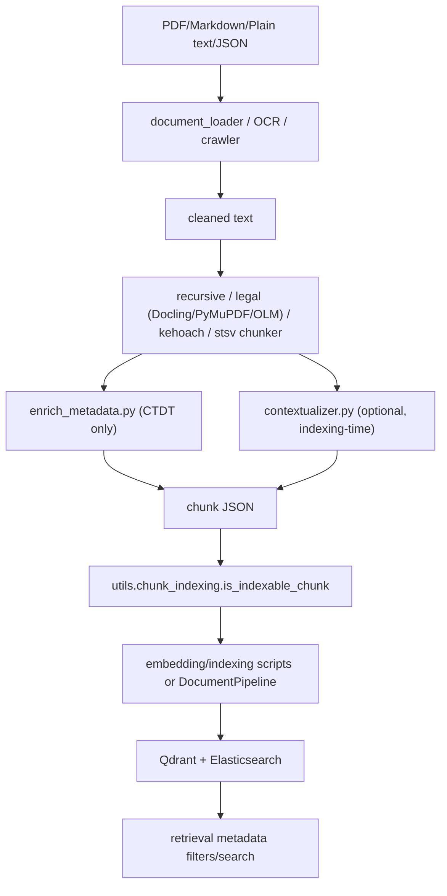

# Module: `chunking`

Source-verified: 2026-06-24 from `chunking/*.py` and `chunking/chunker/*.py` (main.py, standalone_pipeline.py, enrich_metadata.py, contextualizer.py, chunker/_init_.py, base_chunker.py, recursive_chunker.py, hierarchical_legal_chunker.py, hierarchical_legal_chunker_pymupdf.py, olmocr_legal_chunker.py, kehoach_chunker.py, stsv_chunker.py, chunking.py, markdown_table.py).

## Purpose

`chunking` converts cleaned Markdown / plain text / JSON sources into retrieval chunks with metadata. It contains a set of reusable chunker classes (one per source type), offline batch/CLI pipelines, document-metadata enrichment, and optional LLM contextualization.

## File Map

```text
chunking/
  main.py                         CLI + pipelines: main_pipeline (hierarchical/olmocr/recursive),
                                  stsv_pipeline, kehoach_pipeline, process_folder.
                                  Chunker selection via --chunker {hierarchical,olmocr,recursive,stsv,kehoach}.

  standalone_pipeline.py          Dependency-light PDF -> markdown (PyMuPDF fitz) -> simple
                                  article/paragraph chunks via simple_chunk_by_article().
                                  No chunker classes used — fully standalone.

  enrich_metadata.py              CTDT document-metadata extraction/enrichment (effective_date,
                                  applicable_cohort, applicable_major, document_type) written
                                  back into chunk JSON. expiry_date is always None for CTDT.
  contextualizer.py               ChunkContextualizer: LLM-generated context prefix per chunk
                                  at indexing time.
  README.md                       Human-facing usage notes.
  chunker/
    _init_.py                     ⚠️ NOT a working package init — filename is _init_.py not
                                  __init__.py. Imports HierarchicalLegalChunker from
                                  hierarchical_legal_chunker, but the actual class is
                                  ArticleLevelLegalChunker (name mismatch → ImportError).
                                  Also imports STSVChunker but not KeHoachChunker.
                                  Callers import concrete modules directly, bypassing this.
    base_chunker.py               DocumentChunker ABC (parse, split_oversized_chunks,
                                  add_chunk_ids, validate_chunks, save_chunks, chunk_document).
                                  NOT subclassed by any of the concrete chunkers below —
                                  exists as a design reference only.
    recursive_chunker.py          RecursiveChunker: H2-section parent/child Markdown chunker.
                                  The real chunker for ctdt + quydinh documents.
    hierarchical_legal_chunker.py ArticleLevelLegalChunker: legal article parent/child
                                  (Docling MD, # and ## headings).
    hierarchical_legal_chunker_pymupdf.py ArticleLegalChunkerPyMuPDF: legal variant for
                                  **bold** CHƯƠNG/Điều headings; split_threshold param.
    olmocr_legal_chunker.py       OlmOcrLegalChunker (+ ChunkLevel/ChunkData/DocumentMetadata
                                  dataclasses): plain-text legal docs, appendix + recursive fallback.
                                  The real chunker for OLM-OCR quydinh documents.
    markdown_table.py             Table parser and formatters. Provides utilities for extracting,
                                  formatting, and serializing Markdown tables cleanly.
    kehoach_chunker.py            KeHoachChunker: crawled plan/notice JSON articles.
    stsv_chunker.py               STSVChunker: student-handbook JSON (Roman/numbered sections).
    chunking.py                   ⚠️ DEAD CODE. Legacy functional helpers:
                                  parse_legal_document_structure, chunk_markdown_with_hierarchy,
                                  etc. Only detects "## Điều" headings (h2-only). Hardcodes
                                  path "../output_docling_clean/QCDT_2025_5445_QD-DHBK.clean.md".
                                  Uses print() not logging. Not imported anywhere in the pipeline.
```

## Chunker Classes

| Class / module | Input | Entry point / return |
| --- | --- | --- |
| `RecursiveChunker` (`recursive_chunker.py`) | Markdown with `##` H2 sections | `chunk_document(text, source="") -> (chunks, stats)` |
| `ArticleLevelLegalChunker` (`hierarchical_legal_chunker.py`) | Legal Markdown with `#`/`##` CHƯƠNG/Điều headings | `chunk_document(text) -> (chunks, stats)` |
| `ArticleLegalChunkerPyMuPDF` (`hierarchical_legal_chunker_pymupdf.py`) | PyMuPDF4LLM Markdown (**bold** CHƯƠNG/Điều) | `chunk_document(text) -> (chunks, stats)` |
| `OlmOcrLegalChunker` (`olmocr_legal_chunker.py`) | OLM-OCR plain text (no `#`) | `chunk_document(text) -> (chunks, stats)` |
| `KeHoachChunker` (`kehoach_chunker.py`) | Crawled article dict (`content_text`) | `chunk_document(article: Dict) -> List[Dict]` |
| `STSVChunker` (`stsv_chunker.py`) | Student-handbook JSON dict (`Description`) | `chunk_document(doc: Dict) -> List[Dict]` |
| `DocumentChunker` (`base_chunker.py`) | n/a | Abstract base — not used by any concrete chunker above |
| `chunking.py` functions | Legal Markdown with `## Điều` only | **DEAD CODE** — not called by any pipeline |

### RecursiveChunker (real chunker for ctdt + quydinh)

- **Constructor**: `RecursiveChunker(chunk_size=1024, chunk_overlap=0, protect_tables=True, add_section_context=True, min_chunk_size=50, parent_chunk_max_chars=10000)`
- **Strategy**: H2 sections → parent chunks (full section, capped at `parent_chunk_max_chars`); content split into children via `RecursiveCharacterTextSplitter` with `chunk_overlap=0` (H2 boundary supplies context; overlap causes duplicates). Large H2 falls back to H3 parents; H3 still too large → sequential `_split_into_blocks`.
- **Post-processing pipeline (per section)**:
  1. `_protect_tables_in_text` + restore — tables ≤ `chunk_size` replaced with placeholder before splitting
  2. Tiny chunk merge (< `min_chunk_size`)
  3. `_fix_mid_table_chunks` — injects missing header+separator into chunks starting mid-table
  4. `_split_oversized_chunk` → `_hard_resplit` fallback — guarantees no child > `chunk_size * 1.3`
  5. `_fix_section_metadata_from_content` — overrides stale `section_h2/h3/h4` from actual headings in content
  6. `_inject_section_context` — prepends heading to table-only chunks (if `add_section_context`)
  7. Small-chunk merge (< `max(min_chunk_size, 200)`)
  8. `_merge_heading_only_chunks` — heading-only chunks merged into next/prev chunk
  9. `_deduplicate_overlap_headings` — removes duplicate heading line introduced by merging
  10. `_inject_khoản_context` — injects parent numbered-item intro for chunks starting with `a) b) c)…` sub-items
- **Parent metadata**: `doc_type="curriculum"`, `level="parent"`, `section_h1/h2/h3/h4`, `hierarchy_path`, `chunk_type="parent"`, `has_table`, `child_count`, `parent_id=None`, `effective_date/expiry_date/applicable_cohort/applicable_major/document_type` (all None, filled by `enrich_metadata`).
- **Child metadata**: same shape; `level="child"`, `parent_id=<uuid of parent>`, `chunk_type`: `"text"`, `"table"`, or `"mixed"`.
- **Orphan chunks**: preamble text before first H2 — no `parent_id`.
- **IDs**: each chunk gets a `uuid.uuid4()` `id`; `chunk_id`/`readable_id` are `chunk_NNNN` (re-indexed after all processing).

### OlmOcrLegalChunker (real chunker for OLM-OCR quydinh)

- **Constructor**: `OlmOcrLegalChunker(min_child_size=300, max_child_size=1000, parent_size_limit=4000, chunk_overlap=100, fallback_chunk_size=1000, fallback_chunk_overlap=200)`
- **Detection**: CHƯƠNG/Điều/PHỤ LỤC by regex without `#` prefix (plain text). Appendix detected by `PHỤ LỤC|Phụ lục`.
- **Parsing phases**: `header` → `body` → `appendix`. Header ends at first CHƯƠNG/Điều.
- **Chunk levels**: `ChunkLevel.HEADER`, `PARENT` (one per Điều), `CHILD` (clauses), `APPENDIX`, `RECURSIVE` (fallback).
- **Fallback**: if `_has_legal_structure()` returns False → `_fallback_recursive_chunk()` using `RecursiveCharacterTextSplitter`.
- **Output shape via `ChunkData.to_dict()`**: `content`, `metadata` (level, chapter, chapter_title, article, article_title, clause, has_table, is_appendix, appendix_number, chunk_size), `chunk_id`, `readable_id`, `parent_id`.
- **IDs**: `readable_id` = `"header"`, `"parent_cX_aY"`, `"child_cX_aY_cN"`, `"appendix_N"`.

### ArticleLevelLegalChunker (Docling Markdown legal)

- **Constructor**: `ArticleLevelLegalChunker(min_child_size=500, max_child_size=1000, parent_size_limit=4000, chunk_overlap=150)`
- **Detection**: `_is_chapter` matches `^#*\s*CHƯƠNG\s+[IVX\d]+`; `_is_article` matches `^##?\s*Điều\s+\d+`.
- **Output**: header chunk + (parent + children) per Điều. Small article (≤ `max_child_size`) → 1 child = whole article. Large → split by `1. 2. 3.` clauses; table-containing articles split around tables (`is_table_chunk=True` flag on table children).
- **IDs via `add_chunk_ids()`**: every chunk gets `uuid.uuid4()` `id`; `metadata.parent_id` wired; `child_count` tracked on parent. Same schema as `RecursiveChunker`.

### ArticleLegalChunkerPyMuPDF

- **Constructor**: `ArticleLegalChunkerPyMuPDF(min_child_size=500, max_child_size=1000, parent_size_limit=4000, split_threshold=1500, chunk_overlap=0)`
- **Detection**: strips `**` bold markers before matching; `_is_chapter` uses `IGNORECASE`; `_is_article` matches `^Điều\s+\d+` after cleaning.
- **Key difference from Docling**: `split_threshold=1500` — only creates children when article > this threshold (default no-overlap split). Tags all chunks/stats with `source_format="pymupdf4llm"`.
- **IDs**: identical `add_chunk_ids` implementation as `ArticleLevelLegalChunker`.

### KeHoachChunker

- **Constructor**: `KeHoachChunker(chunk_size=1024, chunk_overlap=150, add_context_prefix=True, single_chunk_threshold=1500, long_item_threshold=300)`
- **Input**: dict with `content_text`, `baiviet_id`, `title`/`title_detail`, `category`, `tag_in_title`, `date_str`, `url`.
- **Strategy**: short (< 1500) → 1 chunk; numbered items (`1. 2. …`) → long items per chunk, short items grouped; else recursive split. Context prefix: `"[title]"`.
- **Output**: `chunk_id` (uuid4), `content`, `metadata` (`baiviet_id`, `title`, `category`, `tag_in_title`, `date_str`, `url`, `section_label`, `chunk_index`, `total_chunks`, `chunk_size`, `source="kehoach"`).
- **File helpers**: `chunk_file(json_path)` reads array-or-single-dict JSON.

### STSVChunker

- **Constructor**: `STSVChunker(chunk_size=1024, chunk_overlap=150, add_context_prefix=True, single_chunk_threshold=1500, long_item_threshold=300)`
- **Input**: dict with `DocumentID`, `Title`, `TypeDoc`, `Description`, `TimeCreate`.
- **Strategy**: short (< 1500) → 1 chunk; Roman sections (I. II. III.) → split at Roman, then numbered items inside; numbered items only → long per chunk, short grouped; else recursive split. Context prefix: `"[title | type_doc | section_ctx]"`.
- **Output**: `chunk_id` (uuid4), `content`, `metadata` (`doc_id`, `title`, `type_doc`, `time_create`, `section_context`, `item_label`, `chunk_index`, `total_chunks`, `chunk_size`, `has_links`).
- **Helpers**: `chunk_file(json_path)`, `chunk_directory(dir_path, output_path=None)`.

## Metadata Enrichment

`enrich_metadata.py` extracts from filename + title-area headings (H1/H2, first ~1500 chars of text — NOT full body):

- `effective_date`: filename date pattern priority, then "ngày DD tháng MM năm YYYY" in first 2000 chars, then year in H1/filename
- `expiry_date`: always `None` for CTDT
- `applicable_cohort`: K50–K99 from filename + first 3000 chars (returns comma-separated sorted list)
- `applicable_major`: "Ngành đào tạo:" field > "Tên chương trình:" field > H1 > program code map (`PROGRAM_CODE_MAP`) > filename keyword patterns > first non-generic H2 heading > filename extraction
- `document_type`: one of `curriculum` (default), `training_framework`, `talent_program`, `advanced_program`, `high_quality_program`, `international_program`, `integrated_program`

`enrich_chunks(chunks, doc_metadata)` writes these five fields onto every chunk's `metadata`.

`process_ctdt_directory(ctdt_root)` walks `ctdt_root/<faculty>/{clean_data/*_fix.md, chunks_recursive_parent_child/*_fix_chunks.json}` pairs.

## Contextual Retrieval

`contextualizer.py` (`ChunkContextualizer`) runs once at indexing time. Requires an injected `llm` with `generate(prompt: str) -> str`. Skips chunks with `level="parent"` (if `skip_parent_chunks=True`) and chunks shorter than 50 chars. Prepends `"[<context sentence>]\n"` to `content`. `contextualize_single(chunk_text, doc_title, hierarchy_path, collection)` is the convenience/test entry point.

## Chunk Contract

Chunk dicts vary by chunker; common fields:

- `content` (str)
- `metadata` (dict)
- `id` (uuid str) — present on RecursiveChunker, ArticleLevelLegalChunker, ArticleLegalChunkerPyMuPDF output; absent from OlmOcrLegalChunker, KeHoachChunker, STSVChunker
- `chunk_id` (int index or `"chunk_NNNN"` str or uuid4 str depending on chunker)
- `readable_id` (str)
- `chunk_size` in `metadata`
- `level` in `metadata`: `"header"`, `"parent"`, `"child"`, `"appendix"`, `"recursive"` (OlmOcr); or `"parent"`/`"child"` (hierarchical/pymupdf/recursive)
- `parent_id` in `metadata`: uuid of parent (child chunks); `None` for parents/headers
- `child_count` in `metadata`: number of children (parent chunks only)
- `has_table` (bool) in `metadata`
- `chunk_type`: `"text"`, `"table"`, `"mixed"`, `"parent"` (RecursiveChunker children only)
- Legal extras: `chapter`, `chapter_full`/`chapter_title`, `article`, `article_full`/`article_title`, `is_table_chunk`, `is_appendix`, `source_format="pymupdf4llm"`
- RecursiveChunker: `section_h1/h2/h3/h4`, `hierarchy_path`, `doc_title`, `source`, `chunk_index`, `total_chunks`, `document_type`, `effective_date`, `expiry_date`, `applicable_cohort`, `applicable_major`
- KeHoach: `baiviet_id`, `title`, `category`, `tag_in_title`, `date_str`, `url`, `section_label`, `source="kehoach"`
- STSV: `doc_id`, `title`, `type_doc`, `time_create`, `section_context`, `item_label`, `has_links`

Parent/header chunks are produced for context but are typically excluded from indexing downstream (filtered by `utils.chunk_indexing.is_indexable_chunk`).

## Module Flow



External module boundaries:

- `document_loader` / OCR / crawler produce text; `chunking` turns it into chunks + metadata.
- `pipeline/document_pipeline.py` and `scripts/auto_crawler.py` own review/index lifecycle and persistence.
- Metadata fields must stay compatible with `data/MODULE.md`, `retrieval/metadata_filters.py`, and evaluation labels.

## Notes

- `chunking.py` is confirmed dead code. It only handles `## Điều` (h2-only) — not `# CHƯƠNG` headers, not plain-text OLM-OCR format. It hardcodes an absolute path to a specific file and uses `print()` throughout. Nothing in the pipeline imports it.
- `chunker/_init_.py` imports `HierarchicalLegalChunker` (class does not exist — actual name is `ArticleLevelLegalChunker`) → would raise `ImportError` if used as a package. Callers import concrete modules directly.
- `DocumentChunker` (`base_chunker.py`) is NOT subclassed by any production chunker; its `chunk_document` calls `post_process_chunks` which is a no-op hook. It is a design artifact.

- `OlmOcrLegalChunker` output does NOT include a top-level `id` field (only `chunk_id`, `readable_id`). The indexing pipeline must handle this difference vs. `RecursiveChunker`/`ArticleLevelLegalChunker`.
- `ArticleLegalChunkerPyMuPDF` sets `chunk_overlap=0` by default; `ArticleLevelLegalChunker` defaults to `chunk_overlap=150`.
- Keep metadata fields aligned with `data/MODULE.md` and retrieval filters. The `effective_date`, `expiry_date`, `applicable_cohort`, `applicable_major`, `document_type` fields are reserved slots in `RecursiveChunker` output (all `None`; filled later by `enrich_metadata`).

## Maintenance Notes

- When adding a new chunker: (1) confirm the top-level `id` (uuid) field is present so the indexing pipeline can wire parent-child links; (2) update `main.py` `--chunker` choices and pipelines; (3) add metadata fields to `data/MODULE.md` and `retrieval/metadata_filters.py`.
- `enrich_metadata.py` only reads `clean_data/*_fix.md` + `chunks_recursive_parent_child/*_chunks.json` — path convention is hardcoded. Adjust `process_ctdt_directory` if directory layout changes.

## Useful Checks

```bash
python -m py_compile chunking/*.py chunking/chunker/*.py
python -m pytest tests/test_chunk_indexing_policy.py tests/test_document_pipeline.py -q -m "not integration"
```
