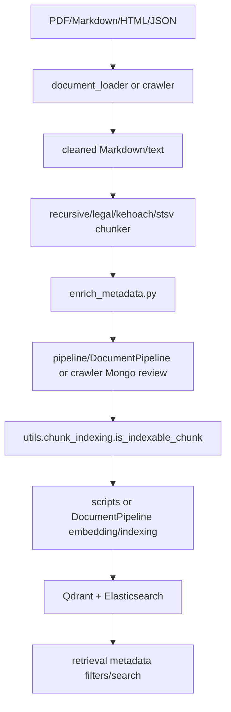

# Module: `chunking`

Source-verified: 2026-06-02 from `chunking/**/*.py`, `pipeline/document_pipeline.py`, `scripts/auto_crawler.py`, and data/indexing docs.

## Purpose

`chunking` converts cleaned Markdown/HTML/text into retrieval chunks with metadata. It contains both legacy/offline pipelines and reusable chunker classes used by admin upload and scripts.

## File Map

```text
chunking/
  main.py                         Legacy/offline pipelines for quydinh, stsv, kehoach folders.
  main_v2.py                      Processor-based pipeline wrapper.
  standalone_pipeline.py          Simple PDF -> markdown -> chunks path.
  batch_process_pymupdf.py        Batch PyMuPDF processing.
  batch_standalone.py             Batch standalone processing.
  enrich_metadata.py              Metadata extraction/enrichment for legal/curriculum chunks.
  chunker/
    base_chunker.py               DocumentChunker interface.
    recursive_chunker.py          Recursive Markdown chunker.
    hierarchical_legal_chunker.py Legal article hierarchy chunker.
    hierarchical_legal_chunker_pymupdf.py PyMuPDF legal hierarchy variant.
    olmocr_legal_chunker.py       OLMOCR legal chunking with levels/dataclasses.
    kehoach_chunker.py            Plan/news chunker.
    stsv_chunker.py               Student handbook/support chunker.
    chunking.py                   Older functional legal chunking helpers.
```

## Main Chunking Strategies

| Strategy | Main files | Best for |
| --- | --- | --- |
| recursive | `recursive_chunker.py` | Generic Markdown/PDF text, admin fallback. |
| hierarchical/legal | `hierarchical_legal_chunker*.py`, `olmocr_legal_chunker.py` | Regulations with articles/clauses/headings. |
| kehoach | `kehoach_chunker.py` | Crawled HUST plans/notices. |
| stsv | `stsv_chunker.py` | Student-support handbook/article JSON. |

Admin PDF upload may use recursive/hierarchical/OLMOCR style chunkers; `kehoach` and `stsv` style data usually comes from crawler/offline data pipelines.

## Metadata Enrichment

`enrich_metadata.py` extracts:

- effective dates
- applicable cohorts
- applicable majors
- document type
- generic heading cleanup
- CTDT directory metadata

The output is consumed by `retrieval/metadata_filters.py`, indexing scripts, and eval.

## Chunk Contract

Chunks should include:

- stable `id` or `chunk_id`
- `content` or text
- `metadata`
- hierarchy fields where available
- `chunk_index`, `total_chunks`, `chunk_size`
- `level`/`chunk_type` for parent/header/child behavior

Parent/header chunks can be stored for review but should not be indexed if `utils.chunk_indexing.is_indexable_chunk()` rejects them.

## Module Flow



External module boundaries:

- `document_loader` produces Markdown/text; `chunking` turns it into chunks and metadata.
- `pipeline/document_pipeline.py` and `scripts/auto_crawler.py` decide review/index lifecycle and persistence.
- Metadata fields must remain compatible with `data/MODULE.md`, `retrieval/metadata_filters.py`, and evaluation labels.

## Maintenance Notes

- Keep metadata fields aligned with `data/MODULE.md` and retrieval filters.
- When changing chunking logic, run document pipeline tests and current policy eval.
- Avoid hard-coded absolute paths in production chunk outputs.

## Useful Checks

```bash
python -m py_compile chunking/*.py chunking/chunker/*.py
python -m pytest tests/test_chunk_indexing_policy.py tests/test_document_pipeline.py -q -m "not integration"
```
