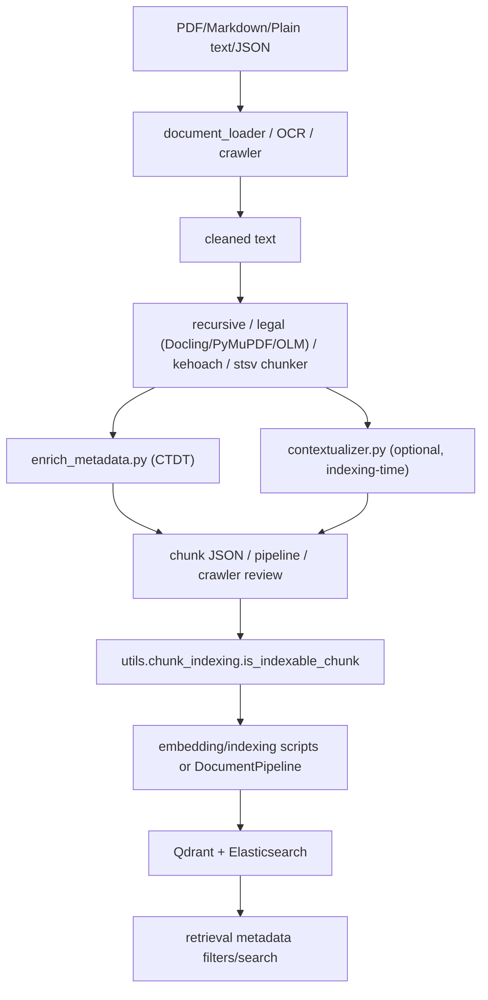

# Module: `chunking`

Source-verified: 2026-06-05 from `chunking/*.py` and `chunking/chunker/*.py` (main.py, main_v2.py, standalone_pipeline.py, batch_process_pymupdf.py, batch_standalone.py, enrich_metadata.py, contextualizer.py, chunker/_init_.py, base_chunker.py, recursive_chunker.py, hierarchical_legal_chunker.py, hierarchical_legal_chunker_pymupdf.py, olmocr_legal_chunker.py, kehoach_chunker.py, stsv_chunker.py, chunking.py).

## Purpose

`chunking` converts cleaned Markdown / plain text / JSON sources into retrieval chunks with metadata. It contains a set of reusable chunker classes (one per source type), offline batch/CLI pipelines, document-metadata enrichment, and optional LLM contextualization.

## File Map

```text
chunking/
  main.py                         CLI + pipelines: main_pipeline (hierarchical/olmocr/recursive),
                                  stsv_pipeline, kehoach_pipeline, process_folder.
  main_v2.py                      ChunkingProcessor (BaseProcessor framework) wrapping
                                  ArticleLevelLegalChunker for Markdown folders.
  standalone_pipeline.py          Dependency-light PDF -> markdown (PyMuPDF) -> simple
                                  article/paragraph chunks.
  batch_process_pymupdf.py        Batch driver for ArticleLegalChunkerPyMuPDF over .md folders.
  batch_standalone.py             Batch driver wrapping standalone_pipeline over a PDF folder.
  enrich_metadata.py              CTDT document-metadata extraction/enrichment (date, cohort,
                                  major, document_type) written back into chunk JSON.
  contextualizer.py               ChunkContextualizer: LLM-generated context prefix per chunk.
  README.md                       Human-facing usage notes.
  chunker/
    _init_.py                     Package init (NOTE: filename is _init_.py, not __init__.py;
                                  imports a non-existent HierarchicalLegalChunker — see Notes).
    base_chunker.py               DocumentChunker ABC (parse/split_oversized_chunks + helpers).
    recursive_chunker.py          RecursiveChunker: H2-section parent/child Markdown chunker.
    hierarchical_legal_chunker.py ArticleLevelLegalChunker: legal article parent/child (Docling MD, # headings).
    hierarchical_legal_chunker_pymupdf.py ArticleLegalChunkerPyMuPDF: legal variant for **bold** headings.
    olmocr_legal_chunker.py       OlmOcrLegalChunker (+ ChunkLevel/ChunkData/DocumentMetadata
                                  dataclasses): plain-text legal docs, appendix + recursive fallback.
    kehoach_chunker.py            KeHoachChunker: crawled plan/notice JSON articles.
    stsv_chunker.py               STSVChunker: student-handbook JSON (Roman/numbered sections).
    chunking.py                   Legacy functional legal chunking helpers (clause-level).
```

## Chunker Classes

| Class / module | Input | Strategy |
| --- | --- | --- |
| `RecursiveChunker` (`recursive_chunker.py`) | Markdown text | H2 sections -> parent chunks; content split into children via `RecursiveCharacterTextSplitter` (overlap 0); table protection, mid-table header repair, table row-splitting, oversized split, tiny-chunk merge, heading/khoản context injection. Large H2 falls back to H3 parents. `chunk_document(text, source)` returns `(chunks, stats)`. |
| `ArticleLevelLegalChunker` (`hierarchical_legal_chunker.py`) | Legal Markdown with `#`/`##` headings | One header chunk; each Điều becomes a parent + child chunks (split by `1.`/`2.` clauses, chapter context, table protection). `chunk_document` -> `(chunks, stats)`. |
| `ArticleLegalChunkerPyMuPDF` (`hierarchical_legal_chunker_pymupdf.py`) | PyMuPDF4LLM Markdown (**bold** CHƯƠNG/Điều) | Same parent/child legal strategy; only splits articles above `split_threshold`; tags metadata `source_format="pymupdf4llm"`. |
| `OlmOcrLegalChunker` (`olmocr_legal_chunker.py`) | OLM-OCR plain text (no `#`) | Detects CHƯƠNG/Điều/PHỤ LỤC by regex; header + parent/child + appendix chunks via `ChunkData` dataclass; `RecursiveCharacterTextSplitter` fallback when no legal structure. |
| `KeHoachChunker` (`kehoach_chunker.py`) | Crawled article dicts (`content_text`) | Short -> single chunk; numbered items -> long items per chunk, short items grouped; else recursive split. Optional `[title]` prefix. |
| `STSVChunker` (`stsv_chunker.py`) | Student-handbook JSON (`Description`) | Roman sections then numbered items; long items per chunk, short items grouped; recursive split for prose. Optional `[title | type | section]` prefix; flags `has_links`. |
| `DocumentChunker` (`base_chunker.py`) | n/a | Abstract base (parse, split_oversized_chunks, add_chunk_ids, validate_chunks, save_chunks). Not subclassed by the concrete chunkers above. |
| `chunking.py` functions | Legal Markdown path | Legacy clause-level `parse_legal_document_structure` + `chunk_markdown_with_hierarchy`. |

`main.py` selects a chunker via `--chunker {hierarchical, olmocr, recursive, stsv, kehoach}`. `main_v2.py` only wires `ArticleLevelLegalChunker`.

## Metadata Enrichment

`enrich_metadata.py` extracts, from filename + title-area headings (not full body):

- `effective_date`
- `expiry_date` (always None for CTDT)
- `applicable_cohort` (Kxx)
- `applicable_major` (field text / heading / program-code map / filename patterns)
- `document_type` (curriculum, training_framework, talent_program, advanced_program, high_quality_program, international_program, integrated_program)

`enrich_chunks` writes these fields onto every chunk's `metadata`; `process_ctdt_directory` walks the CTDT tree (`clean_data/*_fix.md` + `chunks_recursive_parent_child/*_chunks.json`).

## Contextual Retrieval

`contextualizer.py` (`ChunkContextualizer`) runs once at indexing time. For each non-parent, non-tiny chunk it asks an injected `llm.generate(prompt)` for a one-sentence Vietnamese context line and prepends `"[context]\n"` to `content`. `contextualize_single` is the convenience/test entry point.

## Chunk Contract

Chunk dicts vary by chunker but commonly include:

- `content` (text)
- `metadata` (dict)
- an id: `chunk_id` and/or `readable_id`, `id` (uuid in `RecursiveChunker`)
- `chunk_size`; often `chunk_index` / `total_chunks`
- `level` / `chunk_type` (parent / child / header / appendix / recursive; text / table / mixed)
- `parent_id`, `child_count`, hierarchy fields (`section_h1..h4`, `hierarchy_path`, or `chapter`/`article`/`clause`)
- legal/OLM extras: `has_table`, `is_table_chunk`, `is_appendix`, `source_format`

Parent/header chunks are produced for context but are typically excluded from indexing downstream.

## Module Flow



External module boundaries:

- `document_loader` / OCR / crawler produce text; `chunking` turns it into chunks + metadata.
- `pipeline/document_pipeline.py` and `scripts/auto_crawler.py` own review/index lifecycle and persistence.
- Metadata fields must stay compatible with `data/MODULE.md`, `retrieval/metadata_filters.py`, and evaluation labels.

## Notes

- `chunker/_init_.py` imports `HierarchicalLegalChunker` from `hierarchical_legal_chunker` (the actual class is `ArticleLevelLegalChunker`) and is named `_init_.py` rather than `__init__.py`, so it is not a working package init. Callers import the concrete modules directly (e.g. `from chunker.hierarchical_legal_chunker import ArticleLevelLegalChunker`), bypassing it.
- Keep metadata fields aligned with `data/MODULE.md` and retrieval filters.
- Avoid hard-coded absolute paths in production chunk outputs.

## Useful Checks

```bash
python -m py_compile chunking/*.py chunking/chunker/*.py
python -m pytest tests/test_chunk_indexing_policy.py tests/test_document_pipeline.py -q -m "not integration"
```
