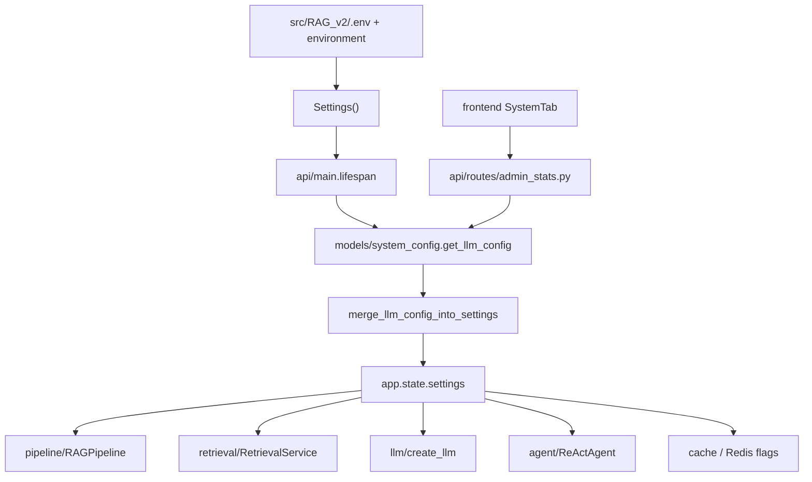

# Module: `config`

Source-verified: 2026-06-12 from `config/__init__.py`, `config/settings.py`.

## Purpose

`config` owns the single, authoritative runtime-settings model for the RAG v2
system.  It exposes one class — `Settings(BaseSettings)` — that reads env vars
and a `.env` file, applies typed defaults, and is injected wherever
configuration is needed.

**Boundaries:**
- This module only defines and validates defaults.  No business logic lives here.
- Runtime mutation and persistence of admin-overridable fields (LLM provider,
  model, keys) is handled by `models/system_config.py` + `api/routes/admin_stats.py`.
- There is **no** `get_settings()` / `lru_cache` accessor in this module.
  Consumers import `Settings` directly:
  `from config.settings import Settings` then instantiate or receive via
  `Depends`.

## File Map

```text
config/
  __init__.py   Re-exports `Settings` (only public symbol).
  settings.py   `Settings(BaseSettings)` with all fields and defaults;
                loads <RAG_v2>/.env (utf-8), extra="ignore".
```

## Settings Reference

`Settings(BaseSettings)` — all fields are overridable by env var (case-insensitive).
`.env` file resolved at `<RAG_v2>/.env`.  Unknown keys silently ignored.

### Provider selectors

| Field | Type | Default | Notes |
|---|---|---|---|
| `llm_provider` | `str` | `"deepseek"` | `deepseek \| gemini \| openai \| azure \| ollama \| lm_studio` |
| `embedding_provider` | `str` | `"ensemble"` | `ensemble \| bge_m3 \| e5` |
| `reranker_provider` | `str` | `"bge"` | `bge \| cohere \| none` |

### API keys

| Field | Type | Default |
|---|---|---|
| `deepseek_api_key` | `str` | `""` |
| `google_api_key` | `str` | `""` |
| `openai_api_key` | `str` | `""` |
| `tavily_api_key` | `str` | `""` |
| `llm_api_key` | `str` | `""` — unified alias, resolved by provider factory |

### Azure OpenAI

| Field | Type | Default |
|---|---|---|
| `azure_openai_endpoint` | `str` | `""` |
| `azure_openai_api_key` | `str` | `""` |
| `azure_openai_api_version` | `str` | `"2024-02-01"` |
| `azure_openai_deployment` | `str` | `""` |

### Local inference (LM Studio / Ollama)

| Field | Type | Default |
|---|---|---|
| `lm_studio_base_url` | `str` | `"http://localhost:1234/v1"` |
| `lm_studio_url` | `str` | `"http://localhost:1234/v1"` — duplicate alias |
| `ollama_base_url` | `str` | `"http://localhost:11434"` |

### Chat / answer generation (LLM)

| Field | Type | Default | Notes |
|---|---|---|---|
| `chat_model` | `str` | `"deepseek-v4-flash"` | Main answer generation model |
| `chat_temperature` | `float` | `0.0` | |
| `chat_max_tokens` | `int` | `1500` | Raised from 1024 to prevent truncation |

### Agent (LangGraph / ReAct)

| Field | Type | Default | Notes |
|---|---|---|---|
| `agent_enabled` | `bool` | `True` | |
| `agent_max_iterations` | `int` | `3` | Reduced from 4 for speed |
| `agent_model` | `str` | `"qwen2.5-7b-instruct"` | Local model; tool-calling only |
| `agent_temperature` | `float` | `0.0` | Deterministic tool selection |
| `agent_max_tokens` | `int` | `1200` | |
| `agent_tool_result_limit` | `int` | `5000` | Max chars per ToolMessage |
| `agent_synthesis_provider` | `str` | `"gemini"` | `"" \| gemini \| lm_studio \| ollama` |
| `agent_synthesis_model` | `str` | `"gemini-3.1-flash-lite"` | Final user-facing answer |
| `agent_synthesis_temperature` | `float` | `0.2` | |
| `agent_synthesis_max_tokens` | `int` | `2500` | Raised from 2000 to prevent truncation |
| `agent_search_result_count` | `int` | `4` | Docs returned per agent search call |
| `agent_search_result_char_limit` | `int` | `1200` | Chars per result in agent context |

### Reflection (query rewriting)

| Field | Type | Default | Notes |
|---|---|---|---|
| `reflection_enabled` | `bool` | `True` | |
| `reflection_provider` | `str` | `"gemini"` | `gemini \| lm_studio \| ollama \| openai` |
| `reflection_model` | `str` | `"gemini-3.1-flash-lite"` | |
| `reflection_temperature` | `float` | `0.0` | |
| `reflection_max_tokens` | `int` | `1024` | Raised from 256 to prevent truncation |

### Retrieval

| Field | Type | Default | Notes |
|---|---|---|---|
| `collections` | `List[str]` | `["stsv","quydinh","kehoach","ctdt"]` | Qdrant collections searched |
| `top_k` | `int` | `7` | Final docs after reranking |
| `vector_top_k` | `int` | `50` | Per-collection vector search limit |
| `keyword_top_k` | `int` | `50` | Per-collection keyword search limit |
| `vector_pool_k` | `int` | `40` | Global vector pool after merge |
| `keyword_pool_k` | `int` | `40` | Global keyword pool after merge |
| `raw_candidate_multiplier` | `float` | `4.0` | Candidate pool multiplier |
| `raw_candidate_min` | `int` | `20` | Minimum candidate pool size |
| `vector_weight` | `float` | `0.8` | RRF fusion weight for vector scores |
| `keyword_weight` | `float` | `0.2` | RRF fusion weight for keyword scores |
| `context_doc_char_limit` | `int` | `2000` | Per-doc char limit in context |
| `context_total_char_budget` | `int` | `12000` | Total context char budget |
| `context_list_total_char_budget` | `int` | `24000` | Budget for list-style queries |
| `context_total_char_budget_with_expansion` | `int` | `16000` | Budget when sibling expansion active |

### Reranker

| Field | Type | Default | Notes |
|---|---|---|---|
| `reranker_model` | `str` | `"BAAI/bge-reranker-v2-m3"` | |
| `reranker_top_k` | `int` | `7` | Docs kept after reranking |
| `reranker_score_threshold` | `float` | `0.0` | Raw logit floor for standard chunks; calibrated p10=2.77 for relevant docs; 0.0 keeps full recall |
| `reranker_table_score_threshold` | `float` | `-1.0` | Relaxed threshold for table chunks (cross-encoder gives lower raw logits on tabular text) |
| `reranker_min_top_k` | `int` | `3` | Always keep at least N top-scored docs even if below threshold |

### Router

| Field | Type | Default | Notes |
|---|---|---|---|
| `router_mode` | `str` | `"classifier"` | `classifier \| llm` |
| `domain_routing_enabled` | `bool` | `True` | Collection-aware routing (Phase 8) |
| `domain_confidence_threshold` | `float` | `0.65` | Min classifier confidence |

### Self-evaluation & Tavily web fallback

| Field | Type | Default | Notes |
|---|---|---|---|
| `self_eval_enabled` | `bool` | `False` | Adds ~2–5 s per query |
| `self_eval_min_top_score` | `float` | `100.0` | Effectively disables score-based eval bypass (BGE raw logits, not probabilities) |
| `tavily_fallback_enabled` | `bool` | `False` | Master switch; conditions below also required |
| `tavily_search_depth` | `str` | `"basic"` | `basic` (1 credit) or `advanced` (2 credits) |
| `tavily_max_results` | `int` | `5` | Fetch pool from Tavily |
| `tavily_web_result_count` | `int` | `3` | Results kept after filtering (≤ max_results) |
| `tavily_web_content_char_limit` | `int` | `1500` | Per-result content char limit |
| `web_fallback_dynamic_collections` | `List[str]` | `["kehoach"]` | Collections treated as dynamic |
| `web_fallback_on_dynamic` | `bool` | `False` | Trigger Tavily for dynamic queries |
| `web_fallback_on_no_info` | `bool` | `False` | Trigger Tavily on no-info pattern |
| `tavily_cache_ttl_seconds` | `int` | `3600` | |
| `tavily_cache_maxsize` | `int` | `200` | |

Note: `web_fallback_on_dynamic` / `web_fallback_on_no_info` also control LLM
response-cache bypass for freshness/dynamic queries regardless of
`tavily_fallback_enabled`.

### Retrieval improvement feature flags

All default **OFF** unless noted. Safe-rollout toggles — do not enable without
evaluating impact.

| Field | Type | Default | Notes |
|---|---|---|---|
| `web_query_enrichment_enabled` | `bool` | `False` | A1: academic year + homepage filter |
| `score_cliff_enabled` | `bool` | `False` | B1: per-collection score cliff |
| `per_collection_norm_enabled` | `bool` | `False` | B2: per-collection score normalisation |
| `sibling_expansion_enabled` | `bool` | `False` | C1: sibling chunk expansion |
| `parent_context_enabled` | `bool` | `True` | C5: parent-child context — **ON** by default |
| `freshness_tavily_check_enabled` | `bool` | `False` | C3: date_str freshness check |
| `low_conf_pool_expand_enabled` | `bool` | `False` | C4: 2× candidate pool in Tier 3 |
| `hyde_enabled` | `bool` | `True` | HyDE post-rerank fallback — **ON** by default |
| `hyde_min_results` | `int` | `3` | Trigger HyDE when reranked < N |
| `hyde_confidence_threshold` | `float` | `0.3` | **Reserved / unused** in pipeline |
| `sibling_budget_ratio` | `float` | `0.30` | 30 % of total budget for siblings |
| `sibling_per_doc_limit` | `int` | `800` | Per-sibling char limit |
| `parent_max_chars` | `int` | `1500` | Max chars from parent content |
| `parent_max_chars_agent` | `int` | `500` | Reduced parent chars in agent context |

### Data stores

#### Qdrant

| Field | Type | Default |
|---|---|---|
| `qdrant_host` | `str` | `"localhost"` |
| `qdrant_port` | `int` | `6333` |

#### Elasticsearch

| Field | Type | Default |
|---|---|---|
| `elasticsearch_host` | `str` | `"localhost"` |
| `elasticsearch_port` | `int` | `9200` |

#### MongoDB

| Field | Type | Default |
|---|---|---|
| `mongodb_uri` | `str` | `"mongodb://localhost:27017"` |
| `mongodb_database` | `str` | `"rag_chatbot"` |
| `mongodb_enabled` | `bool` | `True` |

#### Redis

| Field | Type | Default | Notes |
|---|---|---|---|
| `redis_url` | `str` | `"redis://localhost:6379/0"` | |
| `redis_enabled` | `bool` | `True` | Master switch |
| `redis_max_connections` | `int` | `20` | |
| `redis_socket_timeout` | `float` | `5.0` | |
| `redis_connect_timeout` | `float` | `5.0` | |
| `redis_health_check_interval` | `int` | `30` | Seconds between PING on idle conns |
| `use_redis_session` | `bool` | `True` | Phase 1: session store |
| `use_redis_cache` | `bool` | `True` | Phase 2: LLM response cache |
| `use_redis_history` | `bool` | `True` | Phase 2: conversation history cache |

### Rate limiting

| Field | Type | Default | Notes |
|---|---|---|---|
| `rate_limit_enabled` | `bool` | `True` | |
| `rate_limit_rpm` | `int` | `20` | Requests per minute |
| `rate_limit_rpd` | `int` | `200` | Requests per day |
| `rate_limit_alert_threshold` | `float` | `0.8` | Alert at 80 % capacity |

### Auto crawler

| Field | Type | Default | Notes |
|---|---|---|---|
| `crawler_enabled` | `bool` | `True` | |
| `crawler_schedule_hour` | `int` | `2` | Hour of daily run |
| `crawler_schedule_minute` | `int` | `0` | |
| `crawler_delay` | `float` | `1.0` | Seconds between requests |
| `crawler_retention_months` | `int` | `12` | |
| `crawler_tags` | `str` | `"ĐTĐH:%C4%90T%C4%90H"` | Comma-sep `Name:encoded` pairs |

### Offline evaluation

| Field | Type | Default |
|---|---|---|
| `post_index_eval_enabled` | `bool` | `True` |
| `post_index_eval_command` | `str` | `""` |
| `post_index_eval_max_cases` | `int` | `120` |

### Admin / document upload

| Field | Type | Default | Notes |
|---|---|---|---|
| `superadmin_user_ids` | `str` | `""` | Comma-separated MongoDB ObjectIds |
| `upload_dir` | `str` | `"uploads"` | |
| `max_upload_size_mb` | `int` | `50` | |
| `max_upload_batch` | `int` | `5` | |

### Server / CORS

| Field | Type | Default |
|---|---|---|
| `cors_origins` | `List[str]` | `["*"]` |
| `api_host` | `str` | `"0.0.0.0"` |
| `api_port` | `int` | `8000` |

## Runtime Contract

Precedence (highest → lowest):

```text
environment variables
src/RAG_v2/.env  (utf-8, extra keys ignored)
defaults in settings.py
```

There is **no** `get_settings()` / `lru_cache` wrapper in this module. Consumers
import and instantiate `Settings` directly, or receive it via FastAPI `Depends`.

Admin-managed runtime overrides (live LLM provider/model swaps) are merged into
the `Settings` object during `api/main.py` lifespan startup via
`models/system_config.get_llm_config` → `merge_llm_config_into_settings` —
those fields are persisted in MongoDB, not here.

## Module Flow



## Maintenance Notes

- Adding a field requires updating `.env.example` and, for user-visible knobs,
  the admin UI and evaluation CLI overrides.
- Keep defaults safe for local dev (localhost stores, no secrets).
- Feature flags: document whether the disabled state is fail-soft or
  fail-closed, and which phase/ticket introduced the flag.
- `lm_studio_base_url` and `lm_studio_url` are duplicates with identical
  defaults; consolidate if the duplicate causes confusion.
- `hyde_confidence_threshold` is defined but not read by the pipeline (reserved
  for future use).

## Useful Checks

```bash
# Syntax check
python -m py_compile config/settings.py config/__init__.py

# Dump effective settings (from RAG_v2/ with .venv active)
python -c "from config.settings import Settings; import json; print(json.dumps(Settings().model_dump(), default=str, indent=2))"
```
