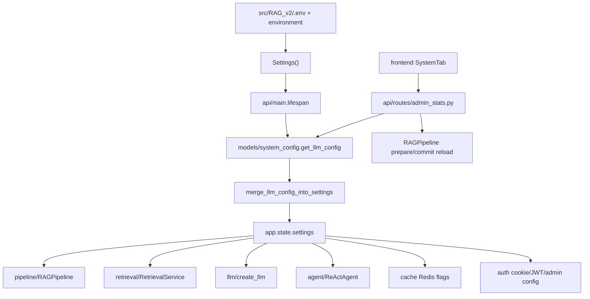

# Module: `config`

Source-verified: 2026-06-02 from `config/settings.py`, `api/main.py`, `api/routes/admin_stats.py`, and `models/system_config.py`.

## Purpose

`config` defines the process-wide runtime settings model. Most modules should read configuration through `Settings`, not hard-coded environment variables or constants.

## File Map

```text
config/
  __init__.py
  settings.py  Pydantic BaseSettings model and defaults.
```

## Settings Groups

Main setting families in `Settings`:

- Providers: `llm_provider`, `embedding_provider`, `reranker_provider`
- API keys: `deepseek_api_key`, `google_api_key`, `openai_api_key`, `tavily_api_key`, `llm_api_key`
- Agent: `agent_enabled`, model, max iterations, synthesis provider/model/tokens
- Store hosts: Qdrant, Elasticsearch, MongoDB, Redis
- Collections: `collections`
- Chat LLM: `chat_model`, temperature, token limit
- Retrieval: top-k, vector/keyword pools, fusion weights, raw candidate pool,
  context budgets
- Reranker: model, top-k, thresholds, minimum returned top-k
- Tavily/web fallback: fallback gates, depth, max results, cache settings
- Reflection/routing: reflection provider/model, domain routing thresholds
- Crawler: schedule and retention
- Redis/cache/rate limit: flags and quotas
- Auth/admin/upload: superadmin ids, upload size/batch, CORS, API host/port

## Current Defaults

Important defaults in `settings.py` as of this verification:

| Setting | Default |
| --- | --- |
| `llm_provider` | `deepseek` |
| `chat_model` | `deepseek-v4-flash` |
| `agent_enabled` | `True` |
| `agent_model` | `qwen2.5-7b-instruct` |
| `agent_synthesis_provider` | `gemini` |
| `agent_synthesis_model` | `gemini-3.1-flash-lite` |
| `collections` | `["stsv", "quydinh", "kehoach", "ctdt"]` |
| `top_k` | `5` |
| `vector_top_k` / `keyword_top_k` | `50` / `50` |
| `vector_weight` / `keyword_weight` | `0.8` / `0.2` |
| `parent_context_enabled` | `True` |
| `tavily_fallback_enabled` | `False` |
| `redis_enabled` | `True` |
| `crawler_enabled` | `True` |
| `api_port` | `8000` |

## Runtime Contract

Settings load from:

```text
src/RAG_v2/.env
environment variables
defaults in settings.py
Mongo system_config/llm_config overrides applied at FastAPI startup
```

Do not hard-code provider/model/host values in application code when a setting exists.

Admin runtime LLM config is persisted by `models/system_config.py`, then merged
into the in-memory `Settings` object during FastAPI startup and after successful
`PUT /admin/config/llm`. Persisted model/tuning fields are intentionally limited
to the current SystemTab form:

- `llm_provider`
- `chat_model`
- `chat_temperature`
- `chat_max_tokens`
- `agent_model`
- `reflection_model`

Managed API key records support provider secrets for `deepseek`, `google`, and
`tavily`; public admin responses return fingerprints/status, not raw secrets.
Runtime toggle fields such as `agent_enabled`, `self_eval_enabled`,
`tavily_fallback_enabled`, `crawler_enabled`, `reflection_enabled`, and
`domain_routing_enabled` use the separate `PATCH /admin/config` lifecycle.

RAG retrieval tuning settings are consumed through `RAGPipeline._cfg` and
`pipeline.flows`, including `raw_candidate_multiplier`, `raw_candidate_min`,
`reranker_score_threshold`, `reranker_table_score_threshold`, and
`reranker_min_top_k`. Keep these in sync with `.env.example` and evaluation CLI
overrides.

## Module Flow



External module boundaries:

- `config` owns defaults and validation only; runtime mutation/persistence goes through `models/system_config.py` and admin routes.
- All modules should consume `Settings` fields instead of hard-coded hosts, model names, or feature flags.
- New settings must stay synchronized with `.env.example`, admin UI where applicable, and evaluation CLI overrides.

## Maintenance Notes

- Adding a setting requires updating `.env.example`, docs, and any deployment config.
- Keep defaults safe for local development.
- For new feature flags, document whether disabled state is fail-soft or fail-closed.

## Useful Checks

```bash
python -m py_compile config/*.py
```
