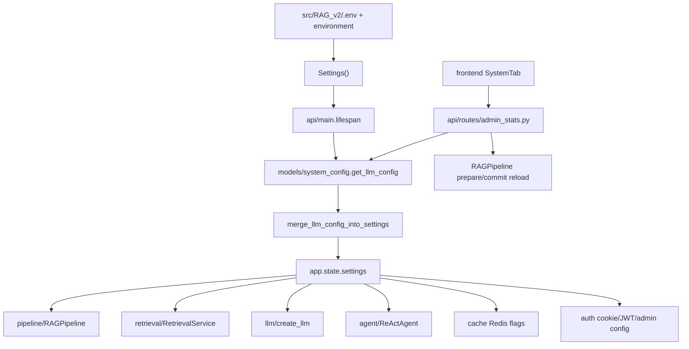

# Module: `config`

Source-verified: 2026-06-05 from `config/__init__.py` and `config/settings.py`.

## Purpose

`config` defines the process-wide runtime settings model. Most modules should read configuration through `Settings`, not hard-coded environment variables or constants.

## File Map

```text
config/
  __init__.py  Re-exports `Settings`.
  settings.py  Pydantic `BaseSettings` model and defaults; loads `<RAG_v2>/.env` (utf-8), extra="ignore".
```

## Settings Groups

`Settings(BaseSettings)` reads env vars / `.env` (case-insensitive) over the in-code defaults. Main setting families:

- Provider selectors: `llm_provider` (deepseek), `embedding_provider` (ensemble), `reranker_provider` (bge)
- API keys: `deepseek_api_key`, `google_api_key`, `openai_api_key`, `tavily_api_key`, `llm_api_key`
- Azure OpenAI: `azure_openai_endpoint`/`_api_key`/`_api_version`/`_deployment`
- LM Studio / Ollama base URLs
- Agent (LangGraph): `agent_enabled`, `agent_max_iterations`, `agent_model`, temperature/tokens, `agent_tool_result_limit`, and synthesis `agent_synthesis_provider`/`_model`/`_temperature`/`_max_tokens`
- Store hosts: Qdrant, Elasticsearch, MongoDB (`mongodb_uri`/`_database`/`mongodb_enabled`), Redis
- Collections: `collections`
- Chat LLM: `chat_model`, `chat_temperature`, `chat_max_tokens`
- Retrieval: `top_k`, `vector_top_k`/`keyword_top_k`, `vector_pool_k`/`keyword_pool_k`, `raw_candidate_multiplier`/`raw_candidate_min`, fusion weights, context char budgets, `agent_search_result_*`
- Reranker: `reranker_model`, `reranker_top_k`, `reranker_score_threshold`, `reranker_table_score_threshold`, `reranker_min_top_k`
- Router: `router_mode` (classifier)
- Evaluation & Tavily/web fallback: `self_eval_enabled`/`self_eval_min_top_score`, `tavily_fallback_enabled`, `tavily_search_depth`/`tavily_max_results`/`tavily_web_result_count`/`tavily_web_content_char_limit`, `web_fallback_dynamic_collections`, `web_fallback_on_dynamic`/`web_fallback_on_no_info`, `tavily_cache_ttl_seconds`/`tavily_cache_maxsize`
- Offline eval: `post_index_eval_enabled`/`_command`/`_max_cases`
- Reflection: `reflection_enabled`, `reflection_provider`/`_model`/`_temperature`/`_max_tokens`
- Collection-aware routing (Phase 8): `domain_routing_enabled`, `domain_confidence_threshold`
- Crawler: enabled, schedule hour/minute, delay, retention, tags
- Redis / cache flags: `redis_*`, `use_redis_session`/`_cache`/`_history`
- Rate limiting: `rate_limit_enabled`, `rate_limit_rpm`/`_rpd`, `rate_limit_alert_threshold`
- Retrieval improvement flags (mostly OFF for safe rollout): `web_query_enrichment_enabled`, `score_cliff_enabled`, `per_collection_norm_enabled`, `sibling_expansion_enabled`, `parent_context_enabled` (ON), `freshness_tavily_check_enabled`, `low_conf_pool_expand_enabled`, HyDE (`hyde_enabled`/`hyde_min_results`/`hyde_confidence_threshold`), sibling/parent char budgets
- Auth/admin/upload: `superadmin_user_ids`, `upload_dir`, `max_upload_size_mb`, `max_upload_batch`, `cors_origins`, `api_host`/`api_port`

## Current Defaults

Important defaults in `settings.py` as of this verification:

| Setting | Default |
| --- | --- |
| `llm_provider` | `deepseek` |
| `chat_model` | `deepseek-v4-flash` |
| `agent_enabled` | `True` |
| `agent_model` | `qwen2.5-7b-instruct` |
| `agent_synthesis_provider` | `gemini` |
| `agent_synthesis_model` | `gemini-3.1-flash-lite` |
| `reranker_provider` | `bge` |
| `embedding_provider` | `ensemble` |
| `collections` | `["stsv", "quydinh", "kehoach", "ctdt"]` |
| `top_k` | `7` |
| `vector_top_k` / `keyword_top_k` | `50` / `50` |
| `vector_pool_k` / `keyword_pool_k` | `40` / `40` |
| `vector_weight` / `keyword_weight` | `0.8` / `0.2` |
| `reranker_top_k` / `reranker_min_top_k` | `7` / `3` |
| `reranker_score_threshold` / `_table_score_threshold` | `-1.0` / `-1.0` |
| `router_mode` | `classifier` |
| `self_eval_enabled` | `False` |
| `reflection_enabled` / `reflection_provider` | `True` / `gemini` |
| `domain_routing_enabled` / `domain_confidence_threshold` | `True` / `0.65` |
| `parent_context_enabled` | `True` |
| `hyde_enabled` | `True` |
| `tavily_fallback_enabled` | `False` |
| `redis_enabled` | `True` |
| `crawler_enabled` | `True` |
| `cors_origins` | `["*"]` |
| `api_host` / `api_port` | `0.0.0.0` / `8000` |

## Runtime Contract

Precedence as configured in `settings.py` (`model_config`): environment variables
and the `.env` file at `<RAG_v2>/.env` override the in-code defaults; unknown env
keys are ignored (`extra="ignore"`).

```text
src/RAG_v2/.env
environment variables
defaults in settings.py
(admin runtime overrides merged into the Settings object by api startup — see api/ and models/)
```

Do not hard-code provider/model/host values in application code when a setting
exists; consume `Settings` fields instead. Admin-managed runtime LLM config and
secret/toggle persistence live outside this module (in `api/` admin routes and
`models/system_config.py`) — see those modules for the exact persisted-field set.

## Module Flow



External module boundaries:

- `config` owns defaults and validation only; runtime mutation/persistence goes through `models/system_config.py` and admin routes.
- All modules should consume `Settings` fields instead of hard-coded hosts, model names, or feature flags.
- New settings must stay synchronized with `.env.example`, admin UI where applicable, and evaluation CLI overrides.

## Maintenance Notes

- Adding a setting requires updating `.env.example`, docs, and any deployment config.
- Keep defaults safe for local development.
- For new feature flags, document whether disabled state is fail-soft or fail-closed.

## Useful Checks

```bash
python -m py_compile config/*.py
```
