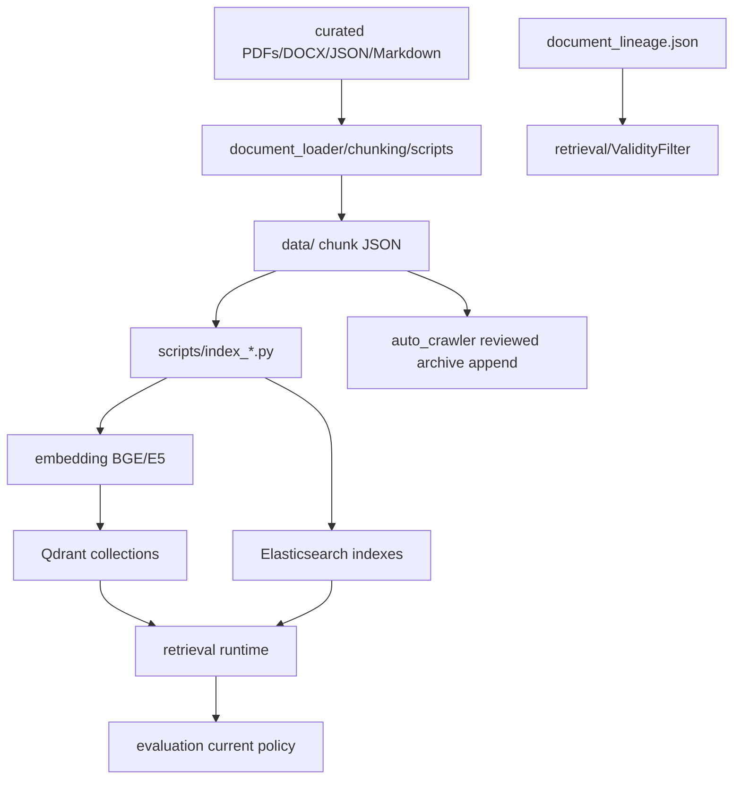

# Module: `data`

Source-verified: 2026-06-05 from the `data/` tree (top-level `document_lineage.json`; `ctdt/{cokhi,dien-dientu,hoa,soict,toan,vatlieu}`; `quydinh/{olmocr,chunks,admin_upload}`; `kehoach/{,chunks}`; `stsv/{,chunks,clean_data}`), plus sampled chunk JSON metadata in each collection.

## Purpose

`data` is the local corpus and metadata source for RAG indexing. It is not imported as a normal Python package, but many runtime components depend on its file layout and metadata conventions.

The indexed production collections are:

- `ctdt`
- `quydinh`
- `kehoach`
- `stsv`
- `test` for upload/dev use (no curated files under `data/`)

## Directory Layout

```text
data/
  document_lineage.json   Supersession/validity registry used by ValidityFilter.

  ctdt/                   Curriculum data, grouped by institute/major (6 majors):
                            cokhi, dien-dientu, hoa, soict, toan, vatlieu.
    <major>/
      output_docling/     Raw Markdown from PDF/DOCX (docling), one .md per program.
      clean_data/         Cleaned Markdown (*_fix.md) ready for chunking.
      chunks_recursive_parent_child/
                          Parent/child chunk JSON (*_fix_chunks.json) for indexing.
                          (toan has two stray docling .md at major root: MI2.md, toantin.md)

  quydinh/                Academic regulations pipeline (PDF -> OCR -> Markdown -> chunks).
    olmocr/
      converted/          OCR'd Markdown (16 .md).
      cleaned/            Cleaned Markdown (18 .md).
      quydinh/            Additional source Markdown (16 .md).
      chunks_recursive_parent_child_3/
                          Per-document parent/child chunk JSON (18 *_chunks.json).
      batch_convert.py, convert_html_to_markdown_tables.py  Conversion helpers.
    chunks/quydinh_all_chunks.json   Merged chunk set used for indexing.
    admin_upload/         Chunk JSON from admin-uploaded regulations (recursive_chunks).
    output_full.json      Aggregated source export.

  kehoach/                Crawled plan/news/notice data.
    crawl.py, crawl_detail.py, reprocess_content_text.py  Crawl + post-processing.
    kehoach_list_output_full.json, baiviet_output_full.json  Raw crawl exports.
    chunks/
      kehoach_list_all_chunks.json   Plan/schedule list chunks.
      baiviet_all_chunks.json        Article (bai viet) chunks.

  stsv/                   Student-support handbook/articles, one JSON per topic (~83).
    clean_data/           clean_data.py + data.json staging.
    chunks/stsv_all_chunks.json      Merged chunk set used for indexing.
```

Approximate file counts: `ctdt` 113 (75 md, 38 json) · `quydinh` 73 (50 md, 21 json) ·
`kehoach` 7 (4 json, 3 py) · `stsv` ~86 (85 json, 1 py). No PDFs are kept under `data/`.

Crawler output for `kehoach`/`quydinh` stages new chunks in Mongo `crawler_runs` and
`crawler_chunks` before appending reviewed chunks back to the chunk JSON during the
admin-approved indexing step.

## Collection Semantics

| Collection | Content | Runtime filter focus |
| --- | --- | --- |
| `ctdt` | Curriculum, majors, courses, credits, prerequisites, semester plans. | `major_code`, `major_name` |
| `quydinh` | Academic regulations, scholarships, graduation, foreign-language rules, disciplinary scoring. | `applicable_cohort`, `applicable_major` |
| `kehoach` | Schedules, registration windows, notices, deadlines, recruitment news. | `date_str`, freshness sorting |
| `stsv` | Forms, student-support procedures, insurance, housing, careers, contact info. | usually no metadata prefilter |

## File Formats

- `*.md` — Markdown source/intermediate (docling output, cleaned `_fix.md`, OCR output). Not indexed directly.
- `*_chunks.json` / `*_all_chunks.json` — JSON arrays of chunk objects; the indexing input.
- Source export JSON (`stsv/*.json`, `*_output_full.json`, `output_full.json`) — pre-chunk raw documents.
- `*.py` — crawl/convert/clean helper scripts colocated with their data, not runtime modules.

## Metadata Contracts

Indexed chunk objects carry:

- `id` and/or `chunk_id` (some sets also add `readable_id`)
- `content` text field
- `metadata` dict
- collection-specific source/title fields

Common `metadata` keys (ctdt/quydinh recursive chunks):

- `doc_title`, `source`
- `chunk_index`, `total_chunks`, `chunk_size`
- `level` (`parent`/`child`), `parent_id`, `chunk_type`
- `section_h1..h4`, `hierarchy_path`, `has_table`

`ctdt` chunks include:

- `major_code`, `major_name`
- `doc_type` / `document_type` (`curriculum`)
- recursive hierarchy fields above

`quydinh` chunks include:

- `applicable_cohort`, `applicable_major`
- `effective_date`, `expiry_date`
- `document_type`
- recursive hierarchy fields above

`kehoach` chunks include:

- `baiviet_id`, `title`
- `category`, `tag_in_title`
- `date_str`, `url`, `source`

`stsv` source JSON uses `DocumentID`, `Title`, `TypeDoc`, `Description`; chunked
records expose `chunk_id`, `content`, and a `metadata` dict with title/section/type fields.

## Lineage And Validity

`document_lineage.json` is consumed by `retrieval/validity_filter.py`. It contains a
`documents` array; each entry has `doc_id`, `title`, `source_file`, `effective_from`,
`scope`, `replaces`, and `status` (`active`/superseded).

Use it to mark old documents as superseded when a newer regulation replaces them.
Retrieval prefers active documents and drops superseded sources where possible. If too
few results remain after filtering, `ValidityFilter` keeps original results rather than
returning an empty answer context.

## Relationship To Other Modules

- `scripts/index_*.py` read chunk JSON files and write Qdrant/Elasticsearch.
- `chunking/` creates or enriches chunks and metadata.
- `document_loader/` converts PDFs/DOCX to Markdown for chunking.
- `pipeline/document_pipeline.py` writes admin-uploaded artifacts under `uploads/`, not directly into curated `data/`.
- `retrieval/metadata_filters.py` and `retrieval/validity_filter.py` assume the fields above.

## Module Flow



External module boundaries:

- `data` is a file/metadata contract, not runtime logic.
- Runtime stores are Qdrant/Elasticsearch/Mongo; data files feed indexing and validity/freshness checks.
- Changing metadata names requires updates in chunking, scripts, retrieval filters, API traces, and evaluation labels.

## Maintenance Notes

- Do not change metadata field names casually; routing, filtering, and UI traces depend on them.
- For new CTDT major codes, update `retrieval/metadata_filters.py`, `query/reflection.py`, eval labels, and docs.
- For `kehoach`, academic term tokens such as `2025.2`, `20252`, and `2025-2` are semester scope, not posting dates.
- Generated artifacts and large raw data should not be treated as architecture source unless they define metadata contracts.
