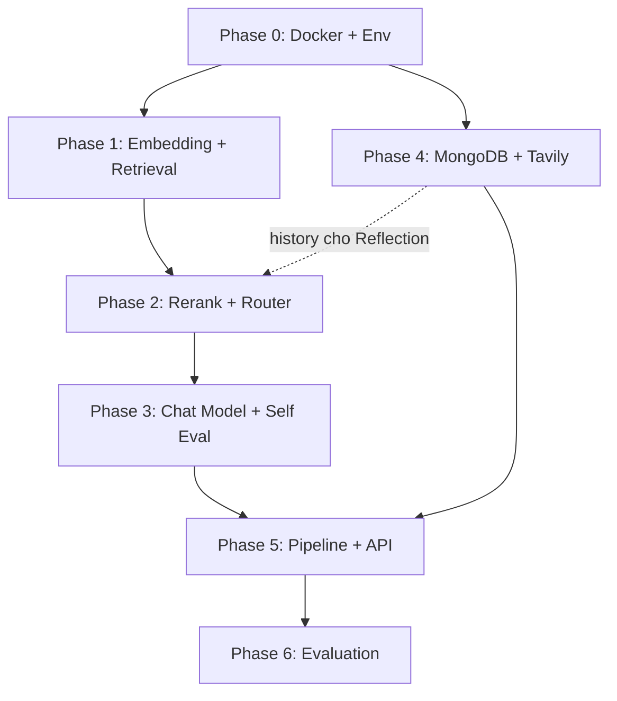

# 📘 RAG v2 — Development Guide

> Hướng dẫn chi tiết thứ tự thực hiện, công nghệ sử dụng cho từng task.

---

## 🔧 Phase 0: Infrastructure Setup (Làm đầu tiên!)

> **Mục tiêu**: Setup các services cần thiết trước khi code.

### Task 0.1 — Docker Compose cho tất cả services

| Thứ tự | Việc | Công nghệ | Ghi chú |
|--------|------|-----------|---------|
| ① | Cài Docker Desktop | Docker | Bắt buộc |
| ② | Tạo `docker-compose.yml` | Docker Compose | Chạy tất cả services 1 lệnh |
| ③ | Setup Qdrant | `qdrant/qdrant:latest` | Port 6333, lưu vectors |
| ④ | Setup Elasticsearch | `elasticsearch:8.x` | Port 9200, keyword search |
| ⑤ | Setup MongoDB | `mongo:7` | Port 27017, chat history |

```yaml
# docker-compose.yml (đặt ở RAG_v2/)
version: '3.8'
services:
  qdrant:
    image: qdrant/qdrant:latest
    ports:
      - "6333:6333"
    volumes:
      - qdrant_data:/qdrant/storage

  elasticsearch:
    image: elasticsearch:8.15.0
    environment:
      - discovery.type=single-node
      - xpack.security.enabled=false
      - ES_JAVA_OPTS=-Xms512m -Xmx512m
    ports:
      - "9200:9200"
    volumes:
      - es_data:/usr/share/elasticsearch/data

  mongodb:
    image: mongo:7
    ports:
      - "27017:27017"
    volumes:
      - mongo_data:/data/db

volumes:
  qdrant_data:
  es_data:
  mongo_data:
```

```bash
# Khởi chạy tất cả
docker-compose up -d

# Kiểm tra
curl http://localhost:6333        # Qdrant
curl http://localhost:9200        # Elasticsearch
mongosh --port 27017              # MongoDB
```

### Task 0.2 — Python Environment + Dependencies

```bash
pip install qdrant-client elasticsearch pymongo
pip install transformers torch sentence-transformers
pip install FlagEmbedding          # cho BGE-M3, BGE-Reranker
pip install openai tavily-python
pip install fastapi uvicorn pydantic-settings
pip install python-dotenv
```

### Task 0.3 — Config `.env`

```env
# .env (đặt ở RAG_v2/)
OPENAI_API_KEY=sk-xxx
TAVILY_API_KEY=tvly-xxx

QDRANT_HOST=localhost
QDRANT_PORT=6333

ELASTICSEARCH_HOST=localhost
ELASTICSEARCH_PORT=9200

MONGODB_URI=mongodb://localhost:27017
MONGODB_DB=rag_chatbot

BGE_M3_MODEL=BAAI/bge-m3
E5_MODEL=intfloat/multilingual-e5-large
RERANKER_MODEL=BAAI/bge-reranker-v2-m3
```

---

## 🔴 Phase 1: Embedding + Hybrid Retrieval

### Thứ tự thực hiện

```
Task 1.1 (Embedding) → Task 1.2 (Qdrant) → Task 1.3 (ES) → Task 1.4 (Hybrid)
     ↓ phụ thuộc         ↓ phụ thuộc         ↓ phụ thuộc       ↓ kết hợp
  Tạo vectors        Lưu vectors vào DB   Index text vào ES   Merge results
```

---

### Task 1.1 — Embedding Layer ⭐ Ưu tiên cao nhất

**File**: `embedding/bge_m3.py`, `embedding/e5_multilingual.py`, `embedding/ensemble.py`

| Bước | Việc | Chi tiết |
|------|------|---------|
| 1 | Tạo `BaseEmbedder` | Abstract class với method `embed(texts) → List[List[float]]` |
| 2 | Implement `BGEm3Embedder` | Dùng `FlagModel` từ thư viện `FlagEmbedding` |
| 3 | Implement `E5MultilingualEmbedder` | Dùng `sentence-transformers` hoặc `transformers` |
| 4 | Implement `EnsembleEmbedder` | Nhận list embedders + weights, trả weighted average |
| 5 | Test | Embed 10 câu hỏi mẫu, kiểm tra dimension + cosine similarity |

**Công nghệ**:
- `FlagEmbedding` — cho BGE-M3 (dense + sparse embedding)
- `sentence-transformers` — cho E5-large
- Dimension: BGE-M3 = 1024, E5-large = 1024

**Lưu ý**:
- BGE-M3 hỗ trợ cả dense + sparse → có thể dùng sparse cho keyword matching
- E5 cần prefix `"query: "` cho query, `"passage: "` cho document
- GPU recommended, fallback CPU nếu không có

---

### Task 1.2 — Qdrant Vector Store ⭐ Ưu tiên cao

**File**: `retrieval/qdrant_store.py`

| Bước | Việc | Chi tiết |
|------|------|---------|
| 1 | Kết nối Qdrant | `QdrantClient(host, port)` |
| 2 | Tạo collection | 2 named vectors: `bge_m3` (1024d) + `e5` (1024d) |
| 3 | `index_documents()` | Upsert points với vectors + payload (text, metadata) |
| 4 | `search()` | Search với cả 2 vectors, fusion scores |
| 5 | `delete_by_metadata()` | Xóa theo source file |

**Công nghệ**: `qdrant-client` Python SDK

```python
# Ví dụ tạo collection
client.create_collection(
    collection_name="university_docs",
    vectors_config={
        "bge_m3": models.VectorParams(size=1024, distance=models.Distance.COSINE),
        "e5": models.VectorParams(size=1024, distance=models.Distance.COSINE),
    }
)
```

---

### Task 1.3 — Elasticsearch BM25 ⭐ Ưu tiên cao

**File**: `retrieval/elasticsearch_store.py`

| Bước | Việc | Chi tiết |
|------|------|---------|
| 1 | Kết nối ES | `Elasticsearch(host)` |
| 2 | Tạo index | Custom mapping với Vietnamese analyzer |
| 3 | `index_documents()` | Bulk index chunks |
| 4 | `keyword_search()` | BM25 search |

**Công nghệ**: `elasticsearch` Python SDK

**Lưu ý**: Cấu hình `icu_analyzer` hoặc `standard` + `lowercase` + `asciifolding` cho tiếng Việt

---

### Task 1.4 — Hybrid Search ⭐ Ưu tiên trung bình (sau 1.2 + 1.3)

**File**: `retrieval/hybrid_search.py`

| Bước | Việc | Chi tiết |
|------|------|---------|
| 1 | Gọi Qdrant search | Vector search → scores |
| 2 | Gọi ES search | Keyword search → scores |
| 3 | RRF Fusion | Reciprocal Rank Fusion kết hợp 2 result sets |
| 4 | Return top-K | Sorted by fused score |

**Công nghệ**: Tự implement RRF (đơn giản ~20 dòng code)

```python
# RRF formula
def rrf_score(rank, k=60):
    return 1.0 / (k + rank)
```

---

## 🔴 Phase 2: Reranking + Query Router

### Thứ tự thực hiện

```
Task 2.1 (Reranker) ──→ Tích hợp vào Hybrid Search
Task 2.2 (Router)   ──→ Song song với 2.1
Task 2.3 (Reflection) → Sau Router, cần MongoDB (Phase 4) cho chat history
```

> ⚠️ Task 2.3 (Reflection) phụ thuộc MongoDB cho "thêm context từ history" — có thể implement basic trước (không cần history), bổ sung sau Phase 4.

---

### Task 2.1 — Reranker ⭐ Ưu tiên cao nhất trong Phase 2

**File**: `reranking/bge_reranker.py`

| Bước | Việc | Chi tiết |
|------|------|---------|
| 1 | Load model | `FlagReranker('BAAI/bge-reranker-v2-m3')` |
| 2 | `rerank(query, docs)` | Compute relevance scores cho mỗi (query, doc) pair |
| 3 | Sort + top-K | Return top 5 docs theo rerank score |

**Công nghệ**: `FlagEmbedding` (class `FlagReranker`)

**Lưu ý**: Reranker là cross-encoder → chậm hơn bi-encoder nhưng chính xác hơn. Chỉ dùng cho top 20-30 candidates → rerank → top 5.

---

### Task 2.2 — Query Router ⭐ Ưu tiên cao

**File**: `query/router.py`, `query/prompts.py`

| Bước | Việc | Chi tiết |
|------|------|---------|
| 1 | Viết classification prompt | Few-shot prompt cho 3 intents |
| 2 | Implement `QueryRouter` | Gọi OpenAI API với structured output |
| 3 | Return routing decision | `{"intent": "chitchat" \| "rag" \| "tool_search"}` |

**Công nghệ**: OpenAI GPT-4o-mini (nhanh, rẻ, đủ cho classification)

**Prompt mẫu**:
```
Classify the user's query into one of: chitchat, rag, tool_search
- chitchat: greetings, small talk, not about university
- rag: questions about courses, regulations, programs
- tool_search: need real-time info, news, external data
```

---

### Task 2.3 — Query Reflection ⭐ Ưu tiên trung bình

**File**: `query/reflection.py`

| Bước | Việc | Chi tiết |
|------|------|---------|
| 1 | Rewrite | LLM viết lại query rõ ràng hơn |
| 2 | Clarify | Nếu mơ hồ → thêm chi tiết |
| 3 | Format | Chuẩn hóa (lowercase, bỏ dấu thừa) |
| 4 | Add context | Thêm context từ chat history (sau Phase 4) |

**Công nghệ**: OpenAI GPT-4o-mini

---

## 🔴 Phase 3: Chat Model + Self Evaluation

### Thứ tự thực hiện

```
Task 3.1 (Chat Model) → Task 3.2 (Self Eval)
     ↓ trước              ↓ sau (cần Chat Model)
```

---

### Task 3.1 — Chat Model ⭐ Ưu tiên cao nhất trong Phase 3

**File**: `llm/chat_model.py`, `llm/prompts.py`

| Bước | Việc | Chi tiết |
|------|------|---------|
| 1 | Implement `ChatModel` | Wrapper cho OpenAI API |
| 2 | `generate(query, context, history)` | Gọi API với system + user prompt |
| 3 | Streaming support | Dùng `stream=True` cho SSE |
| 4 | Viết system prompts | RAG prompt, Chitchat prompt |

**Công nghệ**: `openai` Python SDK, GPT-4o / GPT-4o-mini

---

### Task 3.2 — Self Evaluation ⭐ Ưu tiên trung bình

**File**: `llm/self_eval.py`

| Bước | Việc | Chi tiết |
|------|------|---------|
| 1 | Viết evaluation prompt | Kiểm tra: relevance, faithfulness, completeness |
| 2 | `evaluate(query, context, response)` | LLM tự đánh giá response |
| 3 | Return pass/fail | `{"pass": bool, "reason": str}` |

**Công nghệ**: OpenAI GPT-4o-mini (đánh giá nhanh, rẻ)

---

## 🟡 Phase 4: Tavily + MongoDB

### Thứ tự thực hiện

```
Task 4.2 (MongoDB) → Task 4.1 (Tavily) — MongoDB nên làm trước
     ↓ cần thiết cho         ↓ fallback
  history, memory       khi self-eval fail
```

> 💡 **MongoDB nên ưu tiên hơn Tavily** vì nhiều module phụ thuộc: Query Reflection (history), Conversation State.

---

### Task 4.2 — MongoDB ⭐ Ưu tiên cao nhất trong Phase 4

**File**: `memory/mongo_client.py`, `memory/chat_history.py`, `memory/conversation.py`

| Bước | Việc | Chi tiết |
|------|------|---------|
| 1 | `MongoClient` | Connection pooling với `pymongo` |
| 2 | `ChatHistoryStore` | CRUD: save, get, clear messages |
| 3 | `ConversationState` | Track session, save final answers |

**Công nghệ**: `pymongo` SDK

**Collections**:
```
rag_chatbot (database)
├── chat_messages     # {session_id, role, content, timestamp}
├── conversations     # {session_id, status, created_at, last_active}
└── answers           # {session_id, query, answer, sources, scores}
```

---

### Task 4.1 — Tavily Search ⭐ Ưu tiên trung bình

**File**: `tools/tavily_search.py`

| Bước | Việc | Chi tiết |
|------|------|---------|
| 1 | Setup Tavily API key | Đăng ký tại tavily.com |
| 2 | Implement `TavilySearchTool` | Wrapper cho Tavily API |
| 3 | `search(query)` | Return formatted web results |

**Công nghệ**: `tavily-python` SDK

---

## 🟡 Phase 5: FastAPI + Integration

### Thứ tự thực hiện

```
Task 5.3 (Config)  → Task 5.1 (Pipeline) → Task 5.2 (FastAPI)
     ↓ nền tảng         ↓ core logic           ↓ expose API
```

---

### Task 5.3 — Config ⭐ Làm đầu tiên

**File**: `config/settings.py`

**Công nghệ**: `pydantic-settings` + `.env`

```python
from pydantic_settings import BaseSettings

class Settings(BaseSettings):
    openai_api_key: str
    qdrant_host: str = "localhost"
    qdrant_port: int = 6333
    # ... tất cả config
    
    class Config:
        env_file = ".env"
```

---

### Task 5.1 — Pipeline ⭐ Ưu tiên cao

**File**: `pipeline/rag_pipeline.py`, `pipeline/flows.py`

| Bước | Việc | Chi tiết |
|------|------|---------|
| 1 | `chitchat_flow()` | Router → ChatModel → MongoDB |
| 2 | `rag_flow()` | Router → Reflect → Embed → Search → Rerank → ChatModel → SelfEval |
| 3 | `RAGPipeline.process()` | Entry point kết hợp tất cả |

---

### Task 5.2 — FastAPI ⭐ Ưu tiên trung bình

**File**: `api/main.py`, `api/routes/`, `api/schemas.py`

**Công nghệ**: FastAPI + Uvicorn

---

## 🟢 Phase 6: Evaluation

### Task 6.1 — Evaluation Dataset + Metrics

| Metric | Đo gì | Công nghệ |
|--------|--------|-----------|
| Hit Rate | Retrieval có tìm đúng doc không | Custom script |
| MRR | Rank trung bình của doc đúng | Custom script |
| Faithfulness | Response có dựa trên context không | LLM-as-judge |
| Relevance | Response có trả lời đúng câu hỏi không | LLM-as-judge |

---

## 📊 Tổng quan Dependencies



> **Gợi ý**: Có thể làm song song Phase 1 + Phase 4 (MongoDB setup) để tiết kiệm thời gian.
