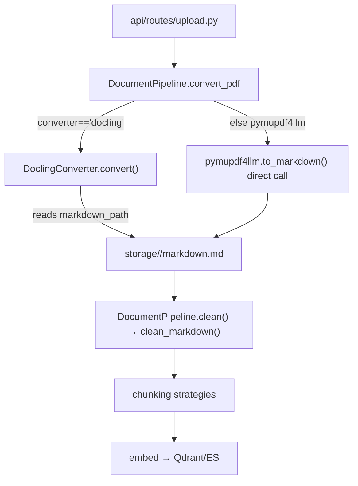

# Module: `document_loader`

Source-verified: 2026-06-12 from `document_loader/__init__.py`, `document_loader/main.py`, `document_loader/main_v2.py`, `document_loader/clean_markdown.py`, `document_loader/pdf_to_markdown/__init__.py`, `pdf_to_markdown/base/converter.py`, `pdf_to_markdown/converters/{docling_converter,pymupdf4llm_converter,__init__}.py`, `pdf_to_markdown/core/{processor,vietnamese_processor,__init__}.py`, `pdf_to_markdown/batch_converter.py`, `pdf_to_markdown/test_components.py`, and `pipeline/document_pipeline.py` (consumer).

## Purpose

`document_loader` converts source PDF/DOCX documents into Markdown and cleans converted Markdown before chunking. It does **not** handle web URLs, crawling, or HTML cleaning — only local document-to-Markdown conversion. It is consumed by `pipeline/document_pipeline.py` (admin upload path) and by standalone CLI scripts.

## File Map

```text
document_loader/
  __init__.py                              Empty package marker (1 line).
  clean_markdown.py                        Markdown cleanup (clean_markdown, is_toc_table_row); also a standalone batch-clean script.
  main.py                                  Legacy CLI: builds a converter + PDFProcessor, converts one hardcoded file. Bare imports (no package prefix); must be run from document_loader/ dir.
  main_v2.py                               DocumentLoaderProcessor over common.BaseProcessor; PDF/DOCX -> .md + _metadata.json with skip logic. BROKEN: imports `from common import BaseProcessor` which does not exist in the project.
  pdf_to_markdown/
    __init__.py                            Package marker (__version__ = "1.0.0").
    base/converter.py                      BasePDFConverter ABC: convert() contract + _save_markdown/_save_metadata/_get_stats helpers.
    base/__init__.py                       Empty.
    converters/
      __init__.py                          Imports DoclingConverter, PyMuPDF4LLMConverter. __all__ also names UnifiedPDFConverter and PDFPlumberConverter — neither has a source file (dead exports).
      docling_converter.py                 DoclingConverter — wraps docling.document_converter.DocumentConverter.
      pymupdf4llm_converter.py             PyMuPDF4LLMConverter — wraps pymupdf4llm.to_markdown(); plus convert_with_images().
    core/
      __init__.py                          Imports VietnameseTextProcessor. __all__ also names PDFDetector — no source file (dead export).
      processor.py                         PDFProcessor — process_single / process_directory orchestration over a converter.
      vietnamese_processor.py              VietnameseTextProcessor — Vietnamese encoding/Unicode/tone normalization.
    batch_converter.py                     Standalone batch script. BROKEN: imports simple_converter (no such module).
    test_components.py                     Manual smoke script (skipped under pytest). BROKEN: imports core.pdf_detector (missing).
    output_quick_test/                     Sample generated .md fixtures (committed artifacts; not used by any test).
```

## Conversion Contract

All converters subclass `BasePDFConverter` (`base/converter.py`) and implement:

- `convert(pdf_path: Path) -> Dict[str, Any]` — converts one document, writes `<stem>.md` and `<stem>_metadata.json` into `output_dir`, and returns a stats dict. Stat keys: `conversion_time` (str), `num_chars` (int), `num_lines` (int), `status` ("success"), `converter` (str), `pdf_path` (str), `markdown_path` (str), `json_path` (str), plus converter-specific extras. Markdown text is **written to disk** — not returned in the dict.

Implemented converters:

- `DoclingConverter(output_dir)` — uses `docling.document_converter.DocumentConverter`. Metadata JSON is the full `document.export_to_dict()`, which includes a `"pages"` list. Stats include `num_pages`.
- `PyMuPDF4LLMConverter(output_dir, **kwargs)` — uses `pymupdf4llm.to_markdown(pdf_path, **conversion_options)`. `**kwargs` are stored as `self.conversion_options` and forwarded on every call. Returns `{"status": "failed", ...}` on error instead of raising. Extra `convert_with_images(pdf_path, image_dir, dpi)` re-runs via a temporary converter with `write_images=True, image_path=image_dir, dpi=dpi`.

`PDFProcessor(converter)` (`core/processor.py`) drives a converter over a single file (`process_single(pdf_path)`) or a directory glob (`process_directory(pdf_dir, pattern="*.pdf", show_progress=True)`), collecting per-file stats dicts.

### How the pipeline actually uses the converters

`pipeline/document_pipeline.py` does **not** go through `PDFProcessor`. Its `convert_pdf` method:

- For `converter="docling"`: instantiates `DoclingConverter(output_dir=storage/doc_id)`, calls `.convert(pdf_path)`, then reads the markdown back from `result["markdown_path"]`.
- For `converter="pymupdf4llm"` (default): calls **`pymupdf4llm.to_markdown(str(pdf_path))`** directly — `PyMuPDF4LLMConverter` is **not used** on this path.

`clean_markdown` is imported from `document_loader.clean_markdown` and called in the pipeline's `clean()` step on the saved markdown text.



## Cleanup Contract

`clean_markdown.py` exposes:

- `is_toc_table_row(line: str) -> bool` — returns `True` if the line matches a dotted-leader TOC pattern (`re.search(r"\.{3,}\s*\d+\s*(\||$)", ...)`).
- `clean_markdown(text: str) -> str` — strips `MỤC LỤC` sections (heading `#`–`###`), TOC dotted-leader rows, alignment-only rules (`[-_.]{5,}`), normalises whitespace in non-table lines, normalises whitespace inside table cells, and collapses 3+ blank lines to 2. Returns cleaned string; does not write files.

When run as a script, it batch-cleans `.md` files in `../output_docling_clean` (relative to the file), writing `<stem>_clean.md` beside each. This hardcoded path is only relevant for offline one-off use.

## Vietnamese Post-Processing

`VietnameseTextProcessor` (`core/vietnamese_processor.py`) — standalone utility, **not called by any active pipeline path**.

Public API:

- `process(text: str) -> str` — full pipeline: fix `COMMON_ERRORS` mojibake map → NFC normalize → reconstruct separated tone marks → clean whitespace.
- `detect_and_fix(text: str) -> Dict[str, Any]` — same processing, returns `{original_length, fixed_length, issues_found: List[str], num_fixes, fixed_text}`.
- `is_vietnamese_text(text: str, threshold: float = 0.05) -> bool` — returns True if ratio of Vietnamese characters exceeds threshold.

## Maintenance Notes

- **Pipeline asymmetry**: `DoclingConverter` is used via the class; `PyMuPDF4LLMConverter` is bypassed — the pipeline calls `pymupdf4llm.to_markdown` directly. If pymupdf4llm conversion options need changing for the admin upload path, edit `pipeline/document_pipeline.py`, not `PyMuPDF4LLMConverter`.
- **Dead/broken entry points** (not on the pipeline path):
  - `main.py` — hardcoded absolute paths to `D:\GR\src\RAG\...`; bare imports require running from `document_loader/` dir.
  - `main_v2.py` — `from common import BaseProcessor` fails; `common` module does not exist in this project.
  - `batch_converter.py` — `from simple_converter import convert_vietnamese_pdf` fails; no such module.
  - `test_components.py` — `from core.pdf_detector import PDFDetector` fails; no source file for `PDFDetector`.
- **Dead `__all__` entries**: `converters/__init__.py` lists `UnifiedPDFConverter` and `PDFPlumberConverter`; `core/__init__.py` lists `PDFDetector` — none are implemented.
- Converter output directly affects chunking and retrieval quality; update chunking/eval docs when changing conversion options.
- Do not make admin upload depend on the committed `output_quick_test/` fixtures.

## Useful Checks

```bash
# Compile-check the live modules
python -m py_compile document_loader/clean_markdown.py \
  document_loader/pdf_to_markdown/base/converter.py \
  document_loader/pdf_to_markdown/converters/docling_converter.py \
  document_loader/pdf_to_markdown/converters/pymupdf4llm_converter.py \
  document_loader/pdf_to_markdown/core/processor.py \
  document_loader/pdf_to_markdown/core/vietnamese_processor.py

# Run document pipeline tests
python -m pytest tests/test_document_pipeline.py -q -m "not integration"
```
