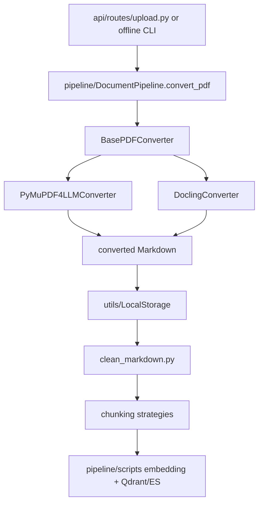

# Module: `document_loader`

Source-verified: 2026-06-02 from `document_loader/**/*.py`, `pipeline/document_pipeline.py`, and upload route discovery.

## Purpose

`document_loader` converts source PDFs/documents into Markdown and cleans converted Markdown before chunking. It is used by offline pipelines and admin upload.

## File Map

```text
document_loader/
  clean_markdown.py                        Markdown cleanup helpers.
  main.py                                  Legacy entrypoint.
  main_v2.py                               Processor-based entrypoint.
  pdf_to_markdown/
    base/converter.py                      BasePDFConverter interface.
    converters/docling_converter.py        Docling converter.
    converters/pymupdf4llm_converter.py    PyMuPDF4LLM converter.
    core/processor.py                      PDFProcessor orchestration.
    core/vietnamese_processor.py           Vietnamese text normalization.
    batch_converter.py                     Batch conversion helper.
```

## Conversion Contract

Converters implement a common PDF converter interface and return Markdown text plus metadata where supported.

Admin upload pipeline uses converter names such as:

- `pymupdf4llm`
- `docling`

`DocumentPipeline.convert_pdf()` stores converted Markdown through `LocalStorage` and updates document status.

## Cleanup Contract

`clean_markdown.py` removes common conversion noise, including table-of-contents style rows. Cleaned Markdown feeds chunkers and must preserve legal/article headings and tables as much as possible.

## Module Flow



External module boundaries:

- `document_loader` converts and cleans; upload state, DB records, storage paths, chunking, and indexing are owned by `pipeline`, `models`, `utils`, and `chunking`.
- Converter names are part of the admin API/UI contract and must remain aligned with `api/routes/upload.py`.

## Maintenance Notes

- Converter output affects chunking and retrieval quality directly; update chunking/eval docs when changing it.
- Keep converter names aligned with `api/routes/upload.py` discovery endpoints and admin UI.
- Do not make admin upload depend on generated quick-test output folders.

## Useful Checks

```bash
python -m py_compile document_loader/*.py document_loader/pdf_to_markdown/**/*.py
python -m pytest tests/test_document_pipeline.py -q -m "not integration"
```
