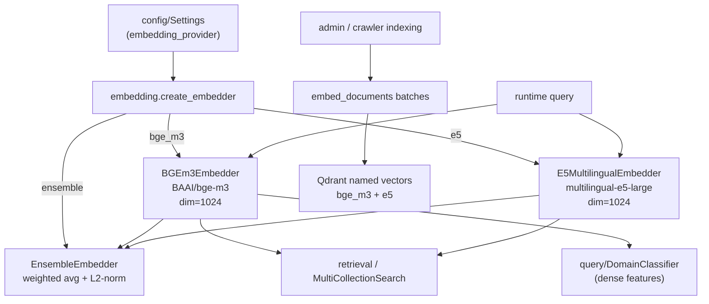

# Module: `embedding`

Source-verified: 2026-06-12 from `embedding/__init__.py`, `embedding/base.py`, `embedding/bge_m3.py`, `embedding/e5_multilingual.py`, `embedding/ensemble.py`, `embedding/test_embedding.py`.

## Purpose

`embedding` converts text into dense (and optionally sparse) vectors for semantic retrieval and classification. It provides a common `BaseEmbedder` abstract interface, two concrete implementations (BGE-M3 via `FlagEmbedding`, E5-multilingual via `sentence-transformers`), and a weighted ensemble wrapper.

In production retrieval, BGE and E5 are instantiated separately and their scores fused in Qdrant multi-collection search. `EnsembleEmbedder` is available but is **not the main production retrieval path**.

Boundaries: this module owns vector generation only. Qdrant upsert/search lives in `retrieval`; indexing scripts live in `pipeline` and `scripts`.

## File Map

```text
embedding/
  __init__.py         Lazy factory (create_embedder) + lazy exports via module-level __getattr__.
  base.py             BaseEmbedder ABC: embed / embed_query / embed_documents / dimension.
  bge_m3.py           BGEm3Embedder over BAAI/bge-m3 via FlagEmbedding; dense + sparse; LRU query cache.
                      Also defines _EmbeddingCache and _resolve_torch_device (local copies).
  e5_multilingual.py  E5MultilingualEmbedder over intfloat/multilingual-e5-large via sentence-transformers;
                      query/passage prefixes; normalizes embeddings; LRU query cache.
                      Also defines _EmbeddingCache and _resolve_torch_device (local copies — duplicated).
  ensemble.py         EnsembleEmbedder — weighted average of multiple BaseEmbedder instances, L2-normalized.
  test_embedding.py   Manual smoke script (auto-skips under pytest); loads BGE-M3 + E5, checks dims/cosine.
```

## Public API

### `BaseEmbedder` (ABC) — `base.py`

```python
class BaseEmbedder(ABC):
    def embed(self, texts: List[str]) -> List[List[float]]: ...
    def embed_query(self, text: str) -> List[float]: ...
    def embed_documents(self, texts: List[str]) -> List[List[float]]: ...

    @property
    def dimension(self) -> int: ...
```

### `create_embedder` — `__init__.py`

```python
def create_embedder(settings: Settings) -> BaseEmbedder
```

Dispatches on `settings.embedding_provider`:

| Value | Returns |
|---|---|
| `"bge_m3"` | `BGEm3Embedder()` with defaults |
| `"e5"` | `E5MultilingualEmbedder()` with defaults |
| `"ensemble"` | `EnsembleEmbedder([BGEm3Embedder(), E5MultilingualEmbedder()])` — equal weights (0.5 each) |
| anything else | raises `ValueError` |

Lazy `__getattr__` in `__init__.py` defers importing `torch`, `FlagEmbedding`, and `sentence_transformers` until a concrete class is actually accessed.

## Models

| Class | Model identifier (`DEFAULT_MODEL`) | Vector dim | Backend |
|---|---|---|---|
| `BGEm3Embedder` | `"BAAI/bge-m3"` | 1024 | `FlagEmbedding.BGEM3FlagModel` |
| `E5MultilingualEmbedder` | `"intfloat/multilingual-e5-large"` | 1024 | `sentence_transformers.SentenceTransformer` |
| `EnsembleEmbedder` | configured child embedders | must match child dim | weighted `np.tensordot` + L2-norm |

## `BGEm3Embedder` — `bge_m3.py`

```python
class BGEm3Embedder(BaseEmbedder):
    DEFAULT_MODEL = "BAAI/bge-m3"

    def __init__(
        self,
        model_name: str = DEFAULT_MODEL,
        use_fp16: bool = True,
        device: Optional[str] = None,
        batch_size: int = 32,
        max_length: int = 512,
    ) -> None: ...

    # BaseEmbedder interface
    def embed(self, texts: List[str]) -> List[List[float]]: ...          # dense, no cache
    def embed_query(self, text: str) -> List[float]: ...                  # dense, LRU-cached
    def embed_documents(self, texts: List[str]) -> List[List[float]]: ... # dense, no cache

    # BGE-M3 extras
    def encode_sparse(self, texts: List[str]) -> List[Dict[int, float]]: ...
    def encode_all(self, texts: List[str]) -> Dict[str, object]: ...
```

**Device / precision:**
- `_resolve_torch_device(device)` → CUDA → MPS → CPU (local copy in this file).
- `use_fp16` is forced to `False` unless device is `"cuda"`. The constructor parameter default is `True` but it is overridden at runtime on non-CUDA devices.
- MPS and CPU always run in fp32.

**Encoding details:**
- `embed` / `embed_query` / `embed_documents` all call `_encode_dense`: `return_dense=True`, `return_sparse=False`, `return_colbert_vecs=False`.
- `encode_sparse`: `return_dense=False`, `return_sparse=True`; returns `output["lexical_weights"]` — a `List[Dict[int, float]]` (token-id → weight map).
- `encode_all`: both `return_dense=True` and `return_sparse=True`; returns `{"dense_vecs": List[List[float]], "lexical_weights": List[Dict[int, float]]}`. Converts `dense_vecs` from `np.ndarray` to list explicitly.
- ColBERT vectors (`return_colbert_vecs`) are never requested.

**Cache:**
- Private `_query_cache = _EmbeddingCache(maxsize=512)` — used by `embed_query` only.
- `embed` and `embed_documents` are uncached.
- Cache key: SHA-256 of UTF-8 encoded text.
- `_EmbeddingCache` is an `OrderedDict`-based LRU; exposes `.stats` property (`hits`, `misses`, `size`).

## `E5MultilingualEmbedder` — `e5_multilingual.py`

```python
class E5MultilingualEmbedder(BaseEmbedder):
    DEFAULT_MODEL  = "intfloat/multilingual-e5-large"
    QUERY_PREFIX   = "query: "
    PASSAGE_PREFIX = "passage: "

    def __init__(
        self,
        model_name: str = DEFAULT_MODEL,
        device: Optional[str] = None,
        batch_size: int = 32,
        max_length: int = 512,
    ) -> None: ...
```

**Prefix behavior:**
- `embed_query(text)` → prepends `"query: "` → caches result under the **unprefixed** text.
- `embed_documents(texts)` → prepends `"passage: "` to every text; no cache.
- `embed(texts)` → **no prefix added**; caller is responsible. Bypasses cache.

**Device / dtype:**
- Same `_resolve_torch_device` logic as BGE (local copy — duplicated in this file).
- `dtype = torch.float16` if `device == "cuda"`, else `torch.float32`. Passed as `model_kwargs={"low_cpu_mem_usage": True, "dtype": dtype}`.
- `model.max_seq_length = max_length` set after construction.

**Encoding:**
- `_encode` calls `SentenceTransformer.encode(..., normalize_embeddings=True, show_progress_bar=False)` → outputs are L2-normalized.
- Returns `embeddings.tolist()`.

**Cache:** same `_EmbeddingCache(maxsize=512)` pattern as BGE.

> **Gotcha:** `_EmbeddingCache` and `_resolve_torch_device` are **copy-pasted** into both `bge_m3.py` and `e5_multilingual.py`. They are not shared from a common utility. Any bug fix or resize must be applied in both files.

## `EnsembleEmbedder` — `ensemble.py`

```python
class EnsembleEmbedder(BaseEmbedder):
    def __init__(
        self,
        embedders: List[BaseEmbedder],
        weights: Optional[List[float]] = None,
    ) -> None: ...
```

- Raises `ValueError` if `embedders` is empty.
- Raises `ValueError` if child embedder dimensions differ.
- `weights=None` → equal weights (`1/n` each). Custom weights are normalized to sum to 1.
- Weights stored as `np.array(..., dtype=np.float64)`.

**Computation:**
- `embed_query`: `np.dot(weights, vectors)` → L2-normalize.
- `embed` / `embed_documents`: `_weighted_average(method, texts)` → `np.tensordot(weights, all_vecs, axes=([0],[0]))` → L2-normalize each row.
- No cache at the ensemble level; delegates to child `embed_query` / `embed_documents` which have their own caches.

## Integration Points

- `config/settings.py` — exposes `embedding_provider`; consumed by `create_embedder`.
- `retrieval/service.py` — constructs BGE and E5 once via `RetrievalService.from_settings()`.
- `pipeline/flows.py` — calls BGE/E5 query embeddings before multi-collection Qdrant search.
- `agent/tool_adapters.py` — receives embedder instances via runtime injection.
- `query/domain_classifier.py` — uses BGE-M3 dense embeddings as logistic-regression features.
- `pipeline/document_pipeline.py` — lazily loads embedders for admin-upload indexing.
- `scripts.auto_crawler` — reuses warmed BGE/E5 instances when indexing approved crawler chunks.

## Module Flow



## Maintenance Notes

- Vector dimensions are hardcoded to `1024` in both `BGEm3Embedder._dimension` and `E5MultilingualEmbedder._dimension`. Any model swap must update these and the matching Qdrant collection configs.
- `_EmbeddingCache` and `_resolve_torch_device` are duplicated in `bge_m3.py` and `e5_multilingual.py`. Consider extracting to a shared `_utils.py` to avoid drift.
- LRU cache only covers `embed_query`; repeated document batches (e.g., re-indexing) are not cached. This is intentional — document sets are large and non-repetitive.
- The `use_fp16=True` default in `BGEm3Embedder.__init__` is misleading: it is silently overridden to `False` on non-CUDA devices. MPS and CPU always run fp32.
- `EnsembleEmbedder` weights are re-normalized to sum to 1. Passing `weights=[0.6, 0.4]` (already summing to 1) is safe; passing unnormalized values is also safe.
- `test_embedding.py` expects similar-pair cosine ≥ 0.70 and dissimilar-pair < 0.70 as sanity thresholds. These are smoke-test heuristics, not hard model contracts.

## Useful Checks

```bash
# Syntax check all files
python -m py_compile src/RAG_v2/embedding/base.py src/RAG_v2/embedding/bge_m3.py \
    src/RAG_v2/embedding/e5_multilingual.py src/RAG_v2/embedding/ensemble.py \
    src/RAG_v2/embedding/__init__.py

# Manual smoke test — loads both models, checks dims + cosine similarity
# (auto-skipped under pytest; run directly)
python src/RAG_v2/embedding/test_embedding.py
```
