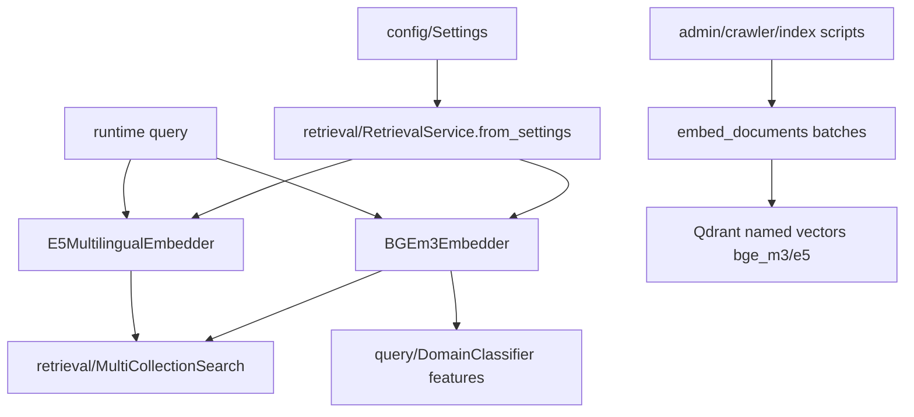

# Module: `embedding`

Source-verified: 2026-06-02 from `embedding/*.py`, `retrieval/service.py`, `pipeline/flows.py`, `agent/tool_adapters.py`, and crawler review indexing.

## Purpose

`embedding` converts text into dense vectors for semantic retrieval and classification. It provides a common `BaseEmbedder` interface plus concrete BGE-M3 and E5 multilingual implementations.

Runtime retrieval usually uses BGE and E5 separately, then fuses scores in Qdrant/MultiCollectionSearch. `EnsembleEmbedder` exists for weighted-vector averaging but is not the main production retrieval path.

## File Map

```text
embedding/
  __init__.py         Lazy factory and backward-compatible exports.
  base.py            BaseEmbedder abstract interface.
  bge_m3.py          BGEm3Embedder using BAAI/bge-m3 through FlagEmbedding.
  e5_multilingual.py E5MultilingualEmbedder using intfloat/multilingual-e5-large.
  ensemble.py        EnsembleEmbedder weighted averaging wrapper.
```

## Public API

`BaseEmbedder` defines:

```python
embed_query(text: str) -> list[float]
embed_documents(texts: list[str]) -> list[list[float]]
```

`embedding.__init__` supports:

- `create_embedder(settings)`
- lazy `BGEm3Embedder`
- lazy `E5MultilingualEmbedder`
- lazy `EnsembleEmbedder`

The lazy exports avoid importing heavy ML dependencies such as `torch` unless a concrete embedder is requested.

## Models

| Class | Model | Vector dim | Main use |
| --- | --- | --- | --- |
| `BGEm3Embedder` | `BAAI/bge-m3` | 1024 | Qdrant vector search and domain classifier features. |
| `E5MultilingualEmbedder` | `intfloat/multilingual-e5-large` | 1024 | Second multilingual retrieval signal. |
| `EnsembleEmbedder` | configured embedders | depends on inputs | Weighted average for compatibility/experiments. |

E5 query/doc prefixes are handled in the concrete class. BGE-M3 currently uses dense vectors only.

## Integration Points

- `retrieval/service.py` constructs BGE and E5 once through `RetrievalService.from_settings()`.
- `pipeline/flows.py` uses BGE/E5 query embeddings before multi-collection search.
- `agent/tool_adapters.py` receives the same embedder instances through runtime injection.
- `query/domain_classifier.py` uses BGE-M3 embeddings as logistic-regression features.
- `pipeline/document_pipeline.py` lazily loads embedders for admin upload indexing.
- `scripts.auto_crawler.index_staged_crawler_run()` can reuse the app
  pipeline's warmed BGE/E5 embedders when admin-approved crawler chunks are
  indexed.

## Module Flow



External module boundaries:

- `embedding` owns vector generation only; Qdrant upsert/search is in `retrieval` and indexing scripts.
- Heavy model instances should be created once by `RetrievalService` or reused by crawler/admin indexing when possible.
- Any model/dimension change affects Qdrant collections, scripts, retrieval, agent adapters, and eval baselines.

## Maintenance Notes

- Keep vector dimensions aligned with Qdrant named vectors `bge_m3` and `e5`.
- Do not import concrete embedders in lightweight modules unless the model is actually needed.
- If changing model names or dimensions, update Qdrant collection setup, indexing scripts, retrieval docs, and evaluation baselines.

## Useful Checks

```bash
python -m py_compile embedding/*.py
python -m pytest tests/test_reranker_factory.py -q -m "not integration"
```
