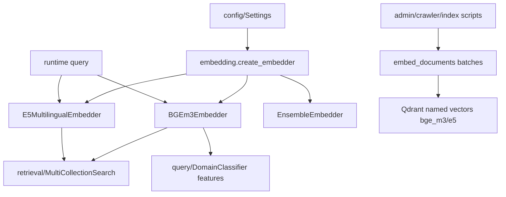

# Module: `embedding`

Source-verified: 2026-06-05 from `embedding/__init__.py`, `embedding/base.py`, `embedding/bge_m3.py`, `embedding/e5_multilingual.py`, `embedding/ensemble.py`, `embedding/test_embedding.py`, plus consumer review (`config/settings.py`, `retrieval/service.py`, `pipeline/flows.py`, `agent/tool_adapters.py`).

## Purpose

`embedding` converts text into vectors for semantic retrieval and classification. It provides a common `BaseEmbedder` interface plus concrete BGE-M3 and E5-multilingual implementations, and an ensemble wrapper.

Runtime retrieval usually uses BGE and E5 separately, then fuses scores in Qdrant/MultiCollectionSearch. `EnsembleEmbedder` exists for weighted-vector averaging but is not the main production retrieval path.

## File Map

```text
embedding/
  __init__.py         Lazy factory (create_embedder) + lazy/backward-compatible exports via __getattr__.
  base.py             BaseEmbedder abstract interface (embed/embed_query/embed_documents/dimension).
  bge_m3.py           BGEm3Embedder over BAAI/bge-m3 via FlagEmbedding; dense + sparse; query LRU cache.
  e5_multilingual.py  E5MultilingualEmbedder over intfloat/multilingual-e5-large via sentence-transformers; query/passage prefixes; query LRU cache.
  ensemble.py         EnsembleEmbedder — L2-normalized weighted average of multiple embedders.
  test_embedding.py   Manual smoke script (skips under pytest); embeds Vietnamese samples, checks dims/cosine.
```

## Public API

`BaseEmbedder` (ABC) defines:

```python
embed(texts: list[str]) -> list[list[float]]
embed_query(text: str) -> list[float]
embed_documents(texts: list[str]) -> list[list[float]]
dimension -> int            # property
```

`embedding.__init__` supports:

- `create_embedder(settings)` — dispatches on `settings.embedding_provider` (`"bge_m3"`, `"e5"`, `"ensemble"`); raises `ValueError` on unknown provider. `"ensemble"` builds `EnsembleEmbedder([BGEm3Embedder(), E5MultilingualEmbedder()])` with default (equal) weights.
- lazy `BGEm3Embedder`, `E5MultilingualEmbedder`, `EnsembleEmbedder` (resolved via module `__getattr__`).

Lazy exports avoid importing heavy ML dependencies (`torch`, `FlagEmbedding`, `sentence_transformers`) unless a concrete embedder is requested.

## Models

| Class | Model (as written) | Vector dim | Notes |
| --- | --- | --- | --- |
| `BGEm3Embedder` | `BAAI/bge-m3` (`DEFAULT_MODEL`) | 1024 | Dense via `embed*`; sparse lexical weights via `encode_sparse`; both via `encode_all`. |
| `E5MultilingualEmbedder` | `intfloat/multilingual-e5-large` (`DEFAULT_MODEL`) | 1024 | Adds `query: ` / `passage: ` prefixes; normalizes embeddings. |
| `EnsembleEmbedder` | configured child embedders | child dim (must match) | Weighted average, then L2-normalized; equal weights if none given. |

### Embedder behavior details

- **Device**: both concrete embedders call `_resolve_torch_device` → CUDA, else Apple MPS, else CPU. BGE uses `use_fp16` only on CUDA; E5 uses `torch.float16` on CUDA else `float32`.
- **Batching**: both default `batch_size=32`, `max_length=512` (E5 sets `model.max_seq_length`).
- **Caching**: each concrete embedder holds a private `_EmbeddingCache` (thread-noted LRU, `maxsize=512`, SHA-256 key) used by `embed_query` only; `embed`/`embed_documents` are uncached. `EnsembleEmbedder` has no cache of its own but delegates to children.
- **BGE-M3 outputs**: `embed`/`embed_query`/`embed_documents` return dense vectors (`return_dense=True`); `encode_sparse` returns `list[dict[int, float]]` token-weight maps; `encode_all` returns `{"dense_vecs", "lexical_weights"}`. ColBERT vectors are never requested (`return_colbert_vecs=False`).
- **E5 prefixes**: `embed_query` prepends `query: `, `embed_documents` prepends `passage: `; raw `embed` applies no prefix (caller's responsibility).

## Integration Points

- `config/settings.py` provides `embedding_provider` consumed by `create_embedder`; also references BGE sparse encoding.
- `retrieval/service.py` constructs BGE and E5 once through `RetrievalService.from_settings()`.
- `pipeline/flows.py` uses BGE/E5 query embeddings before multi-collection search.
- `agent/tool_adapters.py` receives the same embedder instances through runtime injection.
- `query/domain_classifier.py` uses BGE-M3 embeddings as logistic-regression features.
- `pipeline/document_pipeline.py` lazily loads embedders for admin upload indexing.
- `scripts.auto_crawler.index_staged_crawler_run()` can reuse the app pipeline's warmed BGE/E5 embedders when admin-approved crawler chunks are indexed.

## Module Flow



External module boundaries:

- `embedding` owns vector generation only; Qdrant upsert/search lives in `retrieval` and indexing scripts.
- Heavy model instances should be created once by `RetrievalService` or reused by crawler/admin indexing when possible.
- Any model/dimension change affects Qdrant collections, scripts, retrieval, agent adapters, and eval baselines.

## Maintenance Notes

- Keep vector dimensions (1024) aligned with Qdrant named vectors `bge_m3` and `e5`.
- The query LRU cache assumes deterministic embeddings per text; clear/resize via `_EmbeddingCache(maxsize=...)` if model or prefixes change.
- Do not import concrete embedders in lightweight modules unless the model is actually needed — rely on the lazy factory/`__getattr__`.
- If changing model names or dimensions, update Qdrant collection setup, indexing scripts, retrieval docs, and evaluation baselines.

## Useful Checks

```bash
python -m py_compile embedding/*.py
python embedding/test_embedding.py   # manual model smoke test (loads BGE-M3 + E5; skipped under pytest)
```
