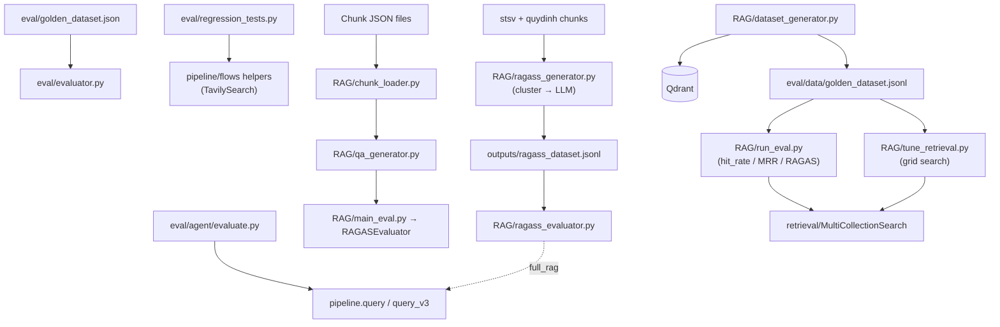

# Module: `eval`

Source-verified: 2026-06-12 from `eval/__init__.py`, `eval/evaluator.py`, `eval/regression_tests.py`,
`eval/golden_dataset.json`, `eval/agent/evaluate.py`, `eval/agent/question_sets/*.json`,
`eval/data/*.jsonl`, `eval/RAG/config.py`, `eval/RAG/llm_client.py`, `eval/RAG/llm_judge.py`,
`eval/RAG/chunk_loader.py`, `eval/RAG/qa_generator.py`, `eval/RAG/evaluator.py`,
`eval/RAG/main_eval.py`, `eval/RAG/demo_notebook.py`, `eval/RAG/dataset_generator.py`,
`eval/RAG/cluster_engine.py`, `eval/RAG/ragass_generator.py`, `eval/RAG/ragass_evaluator.py`,
`eval/RAG/run_eval.py`, `eval/RAG/run_ragass.py`, `eval/RAG/tune_retrieval.py`.

## Purpose

`eval` is the **legacy / specialized** evaluation harness. It is distinct from the sibling `evaluation/`
module (the two-layer offline framework used for production current-policy and historical-email
regression gating).

`eval/` holds:
- A curated **golden dataset** (`golden_dataset.json`) for routing/retrieval/agent test cases.
- A standalone routing+retrieval `Evaluator` and plain-assert retrieval regression tests.
- An agent-vs-baseline comparison runner (`agent/evaluate.py`).
- A self-contained **RAGAS** sub-package (`RAG/`) for synthetic QA-dataset generation and RAGAS
  scoring (faithfulness / answer_relevancy / context_precision / context_recall, plus hit_rate / MRR
  retrieval metrics), plus retrieval hyperparameter tuning.

Use `evaluation/` for production regression gates. Use `eval/` for RAGAS experiments, agent question
sets, retrieval tuning, and legacy evaluator flows.

## File Map

```text
eval/
  __init__.py                   "Week 4 benchmarking scripts" package marker (no exports).
  golden_dataset.json           Curated test_cases: routing | retrieval | agent categories.
  evaluator.py                  Standalone Evaluator: routing (ComplexityRouter) + retrieval
                                (collection + keyword-hit) over golden_dataset.json.
                                CLI: python -m eval.evaluator --category routing|retrieval|all [--report] [--json]
  regression_tests.py           Plain-assert regression suite targeting pipeline.flows helpers
                                (web-query enrichment, homepage filter, no-info patterns, freshness dates).
                                Run: python eval/regression_tests.py
  data/
    ite6_dataset_test.jsonl     Small QA test set (question/ground_truth/contexts/context_ids/collection).
    "sft_dataset (1).jsonl"     SFT-style dataset sample (filename has a space).
  agent/
    evaluate.py                 RAG-v2 baseline (pipeline.query) vs agent route (pipeline.query_v3)
                                on the question sets below; scores keyword overlap, route match,
                                tool selection; saves JSON report.
                                CAUTION: QUESTION_PATHS hardcodes eval/question_sets/ (parent of eval/agent/),
                                but the files live at eval/agent/question_sets/ — paths will fail at runtime.
                                DEFAULT_OUTPUT_PATH similarly points to eval/results.json, not eval/agent/results.json.
    question_sets/
      simple_questions.json     Simple-route questions (id/query/expected_keywords/expected_route/expected_tools).
      complex_questions.json    Complex-route questions (same schema + expected_tools).
    results.json                Saved output of a prior agent/evaluate.py run.
    REPORT_TEMPLATE.md          Markdown template for agent eval reports.
  RAG/                          Self-contained RAGAS sub-package (own README + requirements.txt).
    README.md                   Vietnamese usage guide.
    requirements.txt            ragas, datasets, langchain, openai, google-generativeai,
                                sentence-transformers, scikit-learn.
    config.py                   EvalConfig + BackendType enum + LMStudioConfig + GeminiConfig.
    llm_client.py               Unified LLM client: LMStudioClient, GeminiClient, FallbackClient.
                                Factory: create_llm_client(config) → BaseLLMClient.
    llm_judge.py                LLMJudgeFactory for RAGAS-compatible judge: GeminiBackend,
                                LMStudioBackend, AutoBackend. Separate from llm_client.py.
    chunk_loader.py             Load/filter/stratified-sample chunks from JSON → list[Chunk].
                                Entry: load_and_prepare_chunks(config).
    qa_generator.py             QAGenerator: LLM-generates factoid/multi_hop/comparative/procedural
                                QA pairs → QADataset. Entry: generator.generate(chunks).
    evaluator.py                RAGASEvaluator (runs RAGAS metrics over QADataset + answers)
                                + SimpleAnswerGenerator (context-grounded answer mock).
    main_eval.py                Orchestrates generate→evaluate; batch/split-by-file mode with
                                resumable progress JSON. Entry: python eval/RAG/main_eval.py --backend ...
    demo_notebook.py            Step-by-step demo script (notebook substitute). Runs top-level code
                                on import — not a module, run directly.
    dataset_generator.py        Synthetic QA generator that samples chunks from Qdrant OR local
                                JSON files. Outputs JSONL. Entry: python eval/RAG/dataset_generator.py
    cluster_engine.py           ClusterEngine: BGE-M3 embed + KMeans to group related chunks.
                                Used by ragass_generator.py. fit(chunks) then get_multi_chunk_groups().
    ragass_generator.py         Synthetic RAGAS dataset builder (single/multi/adversarial questions
                                from stsv + quydinh chunk files) → outputs/ragass_dataset.jsonl.
                                Entry: run(CONFIG). CONFIG is a plain dict defined at module level.
    ragass_evaluator.py         RAGAS eval over ragass .jsonl; two modes:
                                  dataset_validation — uses ground_truth_context_texts as contexts.
                                  full_rag — calls RAGPipeline.query_v3() for live retrieval.
                                Entry: run(CONFIG). CONFIG is a plain dict at module level.
    run_ragass.py               Entry point chaining ragass_generator → ragass_evaluator.
                                CLI: python eval/RAG/run_ragass.py [--step generate|eval|all] [--dataset ...]
    run_eval.py                 Retrieval + optional RAGAS runner over a .jsonl golden dataset via
                                MultiCollectionSearch (hit_rate / MRR; full mode adds RAGAS via llm_judge).
                                CLI: python eval/RAG/run_eval.py [--retrieval-only] [--llm gemini|lmstudio|auto]
    tune_retrieval.py           Grid-search tuner for fusion weights (vector_weight × keyword_weight ×
                                vector_pool_k × keyword_pool_k × top_k). Retrieval-only, no LLM needed.
                                CLI: python eval/RAG/tune_retrieval.py [--collection ...] [--metric mrr|hit_rate]
    outputs/                    Generated artifacts: QA datasets (JSON), ragass_dataset.jsonl,
                                batch progress JSON, RAGAS result JSONs, last full run log.
```

## `eval/evaluator.py` — Standalone Evaluator

```python
_DATASET_PATH = Path(__file__).resolve().parent / "golden_dataset.json"

def load_golden_dataset(path: Optional[Path] = None) -> List[Dict[str, Any]]: ...
    # Returns data["test_cases"]; file must have top-level key "test_cases".

class EvaluationResult:
    # test_id, category, query, expected, actual, passed, details, latency_ms
    def to_dict(self) -> Dict[str, Any]: ...  # query truncated to 80 chars

class Evaluator:
    def __init__(self, pipeline: Any = None) -> None: ...
    def evaluate_routing(self, test_cases) -> List[EvaluationResult]: ...
        # Imports ComplexityRouter from query.complexity_router at call time.
        # Filters test_cases where category == "routing". Checks route_result["tier"].
    def evaluate_retrieval(self, test_cases) -> List[EvaluationResult]: ...
        # Requires self._pipeline. Calls pipeline.query(question, history=[], top_k=5).
        # Pass threshold: expected_collection in result_collections AND keyword_ratio >= 0.5.
    def generate_report(self) -> Dict[str, Any]: ...
        # Keys: total_tests, total_passed, total_failed, overall_accuracy, categories, failures.
    def print_report(self) -> None: ...

def main(): ...  # argparse: --category, --dataset, --report, --json
                 # Exit code 1 if any tests failed.
```

Note: the `agent` category appears in `--category` help text but `evaluate_routing` only handles
`"routing"`, `evaluate_retrieval` only handles `"retrieval"`. There is no `evaluate_agent` method;
agent category tests are silently skipped.

## `eval/regression_tests.py` — Retrieval Regression Suite

13 plain-assert tests covering:
- **A1** (`test_web_query_*`): `_build_web_search_query` enrichment, academic-year injection, no
  double-HUST prefix.
- **A1** (`test_homepage_filter_*`): `TavilySearch.filter_results(results, exclude_homepages=True/False)`.
- **A2** (`test_no_info_*`): `_answer_has_no_info_signal` pattern detection + false-positive guard.
- **C3** (`test_is_date_within_days_*`): `_is_date_within_days(date_str, days)` — expects `dd/mm/YYYY`
  format; any other format returns `False` without raising.

All functions imported from `pipeline.flows` and `tools.tavily_search`. Collected in `ALL_TESTS`.

```python
def run_regression() -> dict:  # {"passed": int, "failed": int, "failures": list}
    # Iterates ALL_TESTS; sys.exit(1) if any failures.
```

## `eval/agent/evaluate.py` — Agent vs Baseline

```python
QUESTION_PATHS = {
    "simple": ROOT_DIR / "eval" / "question_sets" / "simple_questions.json",   # WRONG PATH
    "complex": ROOT_DIR / "eval" / "question_sets" / "complex_questions.json", # WRONG PATH
}
DEFAULT_OUTPUT_PATH = ROOT_DIR / "eval" / "results.json"   # WRONG PATH

def load_questions(path) -> list[dict]: ...
def evaluate_answer(answer: str, expected_keywords: list[str]) -> dict: ...
    # Returns: keyword_score (float), has_content (bool, len > 50), answer_length (int).
def run_evaluation(pipeline=None, question_paths=None, output_path=None) -> dict: ...
    # Runs pipeline.query (baseline) and pipeline.query_v3 (agent) on each question.
    # Prints AGENT/RAG/TIE per row, saves JSON to output_path.
    # Metrics: keyword_score, latency, route_match, tool_correct.
```

CAUTION: `ROOT_DIR = Path(__file__).resolve().parent.parent` (i.e. `src/RAG_v2`).
`QUESTION_PATHS` resolves to `src/RAG_v2/eval/question_sets/` but the actual files are at
`src/RAG_v2/eval/agent/question_sets/`. Running with defaults will raise `FileNotFoundError`.
Pass explicit `question_paths` to override.

## `eval/RAG/config.py` — Configuration

```python
class BackendType(str, Enum):
    LMSTUDIO = "lmstudio"
    GEMINI = "gemini"
    GEMINI_WITH_FALLBACK = "gemini_with_fallback"

@dataclass class LMStudioConfig:
    base_url: str = "http://localhost:1234/v1"
    model_name: str = "qwen3-8b"
    temperature: float = 0.1
    max_tokens: int = 2048
    timeout: int = 120

@dataclass class GeminiConfig:
    model_name: str = "gemini-3.1-flash-lite"   # NOTE: not "gemini-2.5-flash" as comments say
    temperature: float = 0.1
    max_tokens: int = 2048
    api_key: Optional[str] = None               # falls back to GOOGLE_API_KEY env var
    retry_on_rate_limit: bool = True
    fallback_wait_seconds: float = 5.0

@dataclass class EvalConfig:
    backend: BackendType = BackendType.GEMINI_WITH_FALLBACK
    chunk_files: list = [...]                   # defaults: ITE6 + quy-dinh-ngoai-ngu K70
    output_dir: str = "outputs"
    num_questions_per_chunk: int = 2
    max_chunks_to_sample: int = 30              # 0 in main_eval.py overrides to "use all"
    min_chunk_size: int = 100
    question_type_ratios: dict = {factoid:0.35, multi_hop:0.25, comparative:0.20, procedural:0.20}
    ragas_metrics: list = ["faithfulness","answer_relevancy","context_precision","context_recall"]
    lmstudio: LMStudioConfig = LMStudioConfig()
    gemini: GeminiConfig = GeminiConfig()

DEFAULT_CONFIG = EvalConfig()
```

## `eval/RAG/llm_client.py` — Unified LLM Client

Three concrete clients plus factory, all implementing `BaseLLMClient` (abstract):
`generate(prompt, system_prompt=None) -> str`, `get_langchain_llm()`, `get_langchain_embeddings()`.

- **`LMStudioClient`**: OpenAI-compatible API at `localhost:1234`. Prepends `/no_think` to user
  message to disable Qwen3 thinking mode.
- **`GeminiClient`**: `google.generativeai`; reads `GOOGLE_API_KEY`. Adds 0.5s sleep per call to
  avoid burst rate-limit.
- **`FallbackClient`**: Primary = Gemini; on any `_is_rate_limit_error` (429 / ResourceExhausted /
  "quota" / "rpm" etc.) switches permanently to LMStudio for the session. `reset_to_primary()` resets.
  Tracks call counts per backend via `print_stats()`.

```python
def create_llm_client(config: EvalConfig = DEFAULT_CONFIG) -> BaseLLMClient: ...
```

Note: `LMStudioClient.get_langchain_embeddings()` uses model `"text-embedding-nomic-embed-text-v1.5"`.

## `eval/RAG/llm_judge.py` — RAGAS Judge Backends

Separate from `llm_client.py`; provides RAGAS-compatible `get_ragas_llm()` / `get_ragas_embeddings()`
wrappers.

```python
class LLMJudgeBackend(ABC):
    def generate(self, prompt: str, max_tokens: int = 1024) -> str: ...
    def get_ragas_llm(self): ...         # → ragas.llms.LangchainLLMWrapper
    def get_ragas_embeddings(self): ...  # → ragas.embeddings.LangchainEmbeddingsWrapper
    def is_available(self) -> bool: ...  # ping test

class GeminiBackend(LLMJudgeBackend):
    # Reads GEMINI_API_KEY env var. Default model: gemini-1.5-flash (env: GEMINI_MODEL).
    # Embeddings: models/embedding-001.

class LMStudioBackend(LLMJudgeBackend):
    # Default: localhost:1234 (env: LMSTUDIO_BASE_URL), model: qwen3-8b (env: LMSTUDIO_MODEL).
    # Appends "/no_think" to prompt. Strips <think>...</think> blocks via _strip_thinking().
    # Embeddings: tries LMStudio /v1/embeddings first; fallback BAAI/bge-m3 via sentence-transformers.

class AutoBackend(LLMJudgeBackend):
    # Tries Gemini (if GEMINI_API_KEY set), then LMStudio. Falls back on rate-limit (429/quota).

class LLMJudgeFactory:
    @classmethod
    def create(cls, backend: str = "auto", **kwargs) -> LLMJudgeBackend: ...
    # backend: "gemini" | "lmstudio" | "auto"
```

Note: `GeminiBackend` default model is `gemini-1.5-flash` (from `GEMINI_MODEL` env, default that
string), whereas `GeminiClient` in `llm_client.py` defaults to `gemini-3.1-flash-lite`. They are
independent classes.

## `eval/RAG/chunk_loader.py` — Chunk Loading

```python
@dataclass class Chunk:
    chunk_id: str; content: str; source_file: str; doc_title: str
    hierarchy_path: str; section_h2: Optional[str]; section_h3: Optional[str]
    has_table: bool; chunk_type: str; level: str
    major_name: Optional[str]; applicable_major: Optional[list]; metadata: dict
    @property def full_context(self) -> str: ...   # "[hierarchy_path]\n\ncontent"
    @property def is_leaf(self) -> bool: ...       # level == "child"

def load_chunks_from_file(file_path: str | Path) -> list[Chunk]: ...
    # JSON array; "id" key takes priority over "chunk_id".

def filter_chunks(chunks, min_size=100, exclude_parent_only=True,
                  exclude_empty_content=True) -> list[Chunk]: ...
    # Parent chunks with < 3 non-heading lines are dropped.

def sample_chunks_stratified(chunks, max_total, seed=42) -> list[Chunk]: ...
    # Groups by source_file, then 1/3 of per-source budget from has_table=True chunks.

def load_and_prepare_chunks(config: EvalConfig = DEFAULT_CONFIG) -> list[Chunk]: ...
    # Main entry: load all config.chunk_files → filter → stratified sample.
```

## `eval/RAG/qa_generator.py` — QA Generation

```python
@dataclass class QAPair:
    question: str; ground_truth: str; question_type: str
    source_chunk_id: str; source_file: str; context: str
    hierarchy_path: str; has_table: bool

@dataclass class QADataset:
    pairs: list[QAPair]
    def to_dict(self) -> dict: ...  # {total, by_type, pairs: [{question, ground_truth,
                                    #   question_type, reference_contexts, source_chunk_id,
                                    #   source_file, hierarchy_path}]}
    def save(self, path: str | Path): ...

class QAGenerator:
    def __init__(self, llm_client: BaseLLMClient, config: EvalConfig): ...
    def generate(self, chunks: list[Chunk]) -> QADataset: ...
        # Generates num_questions_per_chunk QA pairs per chunk.
        # Question types assigned by question_type_ratios, shuffled per chunk.
        # One LLM call per (chunk, type). 0.3s inter-chunk delay.
        # Minimum quality: question >= 10 chars, answer >= 5 chars.
```

Four prompts in `QUESTION_PROMPTS`: `factoid`, `multi_hop`, `comparative`, `procedural`.
JSON repair: strips trailing commas before retrying `json.loads`.

## `eval/RAG/evaluator.py` (RAG subpackage) — RAGAS Evaluation

```python
@dataclass class EvalResult:
    metrics: dict[str, float]            # aggregate RAGAS scores
    per_sample_scores: list[dict]        # DataFrame rows
    total_samples: int; backend_used: str
    def summary(self) -> str: ...        # ASCII progress-bar display
    def save(self, path): ...

class RAGASEvaluator:
    def __init__(self, llm_client: BaseLLMClient, config: EvalConfig): ...
    def evaluate(self, qa_dataset: QADataset, answers: list[str],
                 batch_size: int = 5) -> EvalResult: ...
        # Wraps get_langchain_llm/get_langchain_embeddings in LangchainLLMWrapper /
        # LangchainEmbeddingsWrapper. Calls ragas.evaluate(raise_exceptions=False).

class SimpleAnswerGenerator:
    def generate_answers(self, pairs: list[QAPair]) -> list[str]: ...
        # LLM prompt: context[:2000] + question → answer. Empty string on error.
```

## `eval/RAG/main_eval.py` — Generation Orchestrator

CLI entry point for the QA-pipeline track.

```
python eval/RAG/main_eval.py --backend lmstudio|gemini|gemini_with_fallback
    [--max-chunks N]           (0 = use all valid chunks)
    [--questions-per-chunk N]
    [--generate-only]          (skip RAGAS evaluation)
    [--qa-file PATH]           (load existing dataset, skip generation)
    [--output-dir DIR]
    [--split-output-by-chunk-file]   (one JSON per chunk file)
    [--max-files-per-run N]          (batch cap per invocation)
    [--progress-file PATH]           (default: outputs/qa_batch_progress_<backend>.json)
    [--resume-from-progress / --no-resume-from-progress]
    [--chunk-files ...]        (default: 50+ hardcoded absolute paths under /Users/nam.nguyen/...)
```

CAUTION: `--chunk-files` default is a list of ~50 absolute paths under
`/Users/nam.nguyen/GR/src/RAG_v2/data/`. These will not exist on other machines; always pass
explicit paths when running on a different host.

Progress file uses temp-file + rename for safe atomic writes. Batch resume checks
`progress["files"][chunk_file]["status"] == "done"` and that the output file still exists.

## `eval/RAG/dataset_generator.py` — Qdrant-based Generator

Alternative generator that pulls chunks directly from **Qdrant** (or a local JSON file via
`--chunks-file`) instead of pre-exported JSON files.

```python
def generate_dataset(judge, collections, samples_per_collection, output_path, ...) -> int: ...
    # Scrolls Qdrant, samples, writes JSONL.
def generate_dataset_from_file(judge, chunks_file, collection, samples, output_path, ...) -> int: ...
    # Reads local JSON (content or text key), filters by min_len and level != "parent".

@dataclass class QAItem:
    question: str; ground_truth: str; contexts: List[str]; context_ids: List[str]
    collection: str; metadata: dict; question_type: str
```

Output: JSONL where each line is `asdict(QAItem)`.
`_generate_qa` truncates context to 2000 chars before sending to LLM.
Delay between chunks: `DELAY_GEMINI = 1.5s`, `DELAY_LMSTUDIO = 0.3s`.

Default output: `eval/data/golden_dataset.jsonl` (overridable via `--output`).

Four collections documented: `quydinh`, `ctdt`, `kehoach`, `stsv`.

## `eval/RAG/cluster_engine.py` — Chunk Clustering

```python
class ClusterEngine:
    def __init__(self, embed_model="BAAI/bge-m3", device=auto, chunks_per_cluster=5,
                 min_cluster_size=2, seed=42): ...
    def fit(self, chunks: List[Dict]) -> ClusterEngine: ...
        # Embeds via SentenceTransformer(batch_size=32, normalize_embeddings=True).
        # n_clusters = max(2, len(chunks) // chunks_per_cluster).
        # KMeans(n_init="auto").
    def get_cluster_map(self) -> Dict[int, List[Dict]]: ...   # clusters with >= min_cluster_size
    def get_related_chunks(self, chunk_id, top_k=3) -> List[Dict]: ...
        # Returns co-cluster chunks sorted by cosine similarity (dot product on normalized vecs).
    def get_multi_chunk_groups(self, min_size=2, max_size=3) -> List[List[Dict]]: ...
        # Clusters > max_size are split via sliding window (step = max_size).
    def get_cluster_id(self, chunk_id) -> Optional[int]: ...
    def stats(self) -> Dict: ...
```

Device auto-selection: `cuda` → `mps` (Apple Silicon) → `cpu`.

## `eval/RAG/ragass_generator.py` — RAGASS Dataset Builder

```python
CONFIG = {
    "chunk_files": {"stsv": ..., "quydinh": ...},  # absolute paths relative to RAG_v2 root
    "output_dir": Path(__file__).parent / "outputs",
    "output_file": "ragass_dataset.jsonl",          # written fresh (mode "w") each run
    "total_samples": 150,
    "question_ratios": {"single": 0.30, "multi": 0.50, "adversarial": 0.20},
    "min_chunk_len": 100,
    "chunks_per_cluster": 5, "min_cluster_size": 2, "multi_group_max_size": 3,
    "llm_backend": "gemini",
    "gemini_model": "gemini-3.1-flash-lite",
    "gemini_api_key": os.getenv("GEMINI_API_KEY") or os.getenv("GOOGLE_API_KEY"),
    "llm_delay_seconds": 30,    # per-call delay; aggressive throttle for free-tier RPM
    "llm_max_tokens": 1200,
    "seed": 42,
}

@dataclass class RAGASSItem:
    id: str          # sha1-based stable ID: {source}_{type}_{sha1[:10]}
    question: str; ground_truth: str
    ground_truth_contexts: List[str]       # list of "{source}/{chunk_id}" IDs
    ground_truth_context_texts: List[str]  # chunk text for RAGAS eval
    question_type: str   # "single" | "multi" | "adversarial"
    source: str; expected_collection: str; answerable: bool
    expected_behavior: str   # "answer_with_citation" | "refuse_insufficient_context"
    difficulty: str; answer_type: str
    atomic_facts: List[str]; expected_keywords: List[str]; expected_citations: List[str]
    doc_type: str; document_title: str; chapter: str; article: str; clause: str
    effective_date: str; metadata: Dict

def run(config: Dict = CONFIG) -> Path: ...
    # Loads .env from RAG_v2/.env via dotenv. Writes output in mode "w" (overwrites prior run).
    # Clusters all chunks then generates in order: single → multi → adversarial.
```

Three LLM prompt templates: `_SINGLE_PROMPT`, `_MULTI_PROMPT` (requires_chunks field),
`_ADVERSARIAL_PROMPT` (why_unanswerable field).
JSON parsing: strips markdown fence; falls back to regex `\{.*\}`.

CAUTION: output written in mode `"w"` — each full run overwrites the existing `ragass_dataset.jsonl`.
Multi-chunk items only use `requires_chunks` indices if valid; otherwise all group chunks are used.

## `eval/RAG/ragass_evaluator.py` — RAGASS Evaluation

```python
CONFIG = {
    "dataset_path": Path(__file__).parent / "outputs" / "ragass_dataset.jsonl",
    "output_dir":   Path(__file__).parent / "outputs",
    "output_file":  "ragass_eval_result.json",
    "gemini_api_key": ...,  "gemini_model": "gemini-3.1-flash-lite",
    "ragas_metrics": ["context_recall", "context_precision"],
    "filter_question_types": None,
    "eval_mode": "dataset_validation",   # or "full_rag"
}

@dataclass class EvalSample:  # internal repr for RAGAS evaluate
@dataclass class RAGASSEvalResult:
    eval_mode: str; total_samples: int
    metrics: Dict[str, float]              # overall aggregate
    per_type_metrics: Dict[str, Dict]      # breakdown by question_type
    per_sample_scores: List[Dict]
    def summary(self) -> str: ...
    def save(self, path: Path) -> None: ...

def load_dataset(dataset_path, filter_types=None) -> List[EvalSample]: ...
def run_ragas_eval(samples, metric_names, ragas_llm, ragas_emb) -> tuple[dict, list]: ...
def compute_per_type_metrics(per_sample, metric_names) -> Dict[str, Dict]: ...
def run(config: Dict = CONFIG) -> RAGASSEvalResult: ...
```

Mode `dataset_validation`: `answer = ground_truth` (validates dataset quality, no RAG system needed).
Mode `full_rag`: calls `RAGPipeline.query_v3(question, history=[], top_k=5)` for live retrieval.
Embeddings: `models/embedding-001` via `GoogleGenerativeAIEmbeddings`.

RAGAS type assertion: checks `isinstance(result, ragas.dataset_schema.EvaluationResult)` — will
break if RAGAS version changes the return type.

## `eval/RAG/run_eval.py` — Retrieval + RAGAS Runner

Evaluation over a `.jsonl` dataset (format from `dataset_generator.py`).

```python
@dataclass class EvalResult:
    # Retrieval: hit, reciprocal_rank, retrieved_correct_count, retrieval_ms
    # RAGAS (optional): context_precision, context_recall, faithfulness, answer_relevancy, generated_answer
    # llm_backend: str

def run_evaluation(dataset_path, top_k=5, filter_collection=None, retrieval_only=False,
                   llm_backend="auto", output_dir=Path("eval/results"),
                   vector_weight=0.7, keyword_weight=0.3,
                   lmstudio_url=None, lmstudio_model=None) -> Dict: ...
```

Reads `QDRANT_HOST/PORT` and `ES_HOST/PORT` from env (default `localhost`).
Loads both `BGEm3Embedder` and `E5MultilingualEmbedder` on startup.
Outputs: timestamped `summary_<ts>.json` + `results_<ts>.csv` + symlinks `*_latest.*`.
Gemini rate-limit guard: 1.0s sleep after each RAGAS score when backend is Gemini.

## `eval/RAG/tune_retrieval.py` — Retrieval Hyperparameter Tuner

Grid search over `vector_weight × keyword_weight × vector_pool_k × keyword_pool_k × top_k`.

```python
GRID = {
    "vector_weight":  [0.5, 0.6, 0.7, 0.8],
    "keyword_weight": [0.2, 0.3, 0.4, 0.5],
    "vector_pool_k":  [15, 20, 30],
    "keyword_pool_k": [15, 20, 30],
    "top_k":          [5],
}
MAX_WEIGHT_SUM = 1.05   # combos with vector_weight + keyword_weight > 1.05 skipped
```

Optimizes `mrr` (default) or `hit_rate`. Outputs JSON report to `eval/results/tuning_<ts>.json`.

## Golden Dataset Contract

`eval/golden_dataset.json` top-level keys: `_description`, `_version`, `test_cases`.
Each case: `id`, `category` (`routing` | `retrieval` | `agent`), `query`, plus:
- routing: `expected_route`
- retrieval: `expected_collection`, `expected_keywords`
- agent: category present but no `evaluate_agent` method exists in `eval/evaluator.py`

## Module Flow



## Maintenance Notes

- `eval/RAG/outputs/` is generated artifacts — do not commit QA datasets or RAGAS result JSONs.
- `eval/RAG/main_eval.py` `--chunk-files` defaults are absolute paths under
  `/Users/nam.nguyen/GR/...`. Always pass `--chunk-files` explicitly on any other machine.
- `eval/agent/evaluate.py` `QUESTION_PATHS` resolves to `eval/question_sets/` (not
  `eval/agent/question_sets/`). Hardcoded paths will fail; pass `question_paths` explicitly.
- `eval/evaluator.py` has no `evaluate_agent` implementation despite the `--category agent` option
  in the CLI; agent test cases are silently skipped.
- `RAG/` modules use package-relative imports (`from .config import ...`); run as part of the
  `eval.RAG` package, not as loose scripts from within the `RAG/` directory.
- `ragass_generator.py` overwrites `ragass_dataset.jsonl` on each full run (mode `"w"`).
- `GeminiConfig.model_name` defaults to `"gemini-3.1-flash-lite"`. The docstring and comments say
  "Gemini 2.5 Flash" — this is misleading; the actual value is the one above.
- `llm_judge.py` `GeminiBackend` defaults to `gemini-1.5-flash` (via `GEMINI_MODEL` env), different
  from `llm_client.py`'s `GeminiClient` which defaults to `gemini-3.1-flash-lite`. These are
  independent classes used by different pipelines.

## Useful Checks

```bash
python -m py_compile eval/evaluator.py eval/regression_tests.py \
    eval/agent/evaluate.py eval/RAG/*.py
python eval/regression_tests.py
# Quick RAGAS sub-package retrieval eval (no LLM, no Qdrant needed for routing only):
python -m eval.evaluator --category routing --report
```
