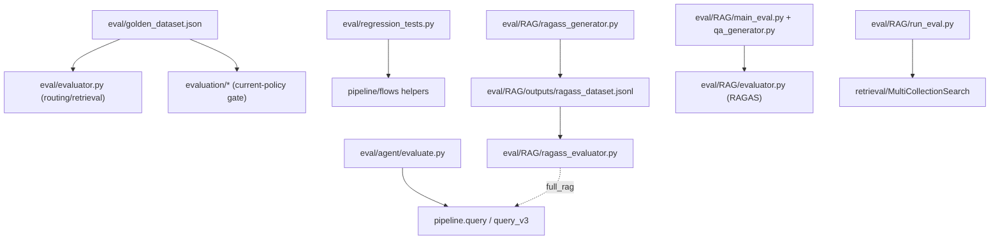

# Module: `eval`

Source-verified: 2026-06-05 from `eval/__init__.py`, `eval/evaluator.py`, `eval/regression_tests.py`, `eval/golden_dataset.json`, `eval/agent/evaluate.py`, `eval/agent/question_sets/*.json`, `eval/data/*.jsonl`, `eval/RAG/*.py` (config, main_eval, evaluator, chunk_loader, llm_client, qa_generator, ragass_generator, ragass_evaluator, run_eval, run_ragass, dataset_generator, cluster_engine, llm_judge, tune_retrieval, demo_notebook), `eval/RAG/README.md`, plus cross-references in `evaluation/two_layer_eval.py`, `evaluation/search_strategy_benchmark.py`, `evaluation/evaluate_current_pipeline.py`, `evaluation/fusion_weight_sweep.py`, and `tests/test_two_layer_eval.py`.

## Purpose

`eval` is the **legacy / specialized** evaluation harness. It is distinct from the newer `evaluation/` module (the current two-layer offline framework used for production current-policy and historical-email regression gating).

`eval/` holds:
- The curated **golden dataset** (`golden_dataset.json`) — still consumed by `evaluation/` as the current-policy current dataset.
- Standalone routing/retrieval evaluator and retrieval regression tests.
- An agent-vs-baseline comparison runner (`agent/`).
- A self-contained **RAGAS** sub-package (`RAG/`) for synthetic QA-dataset generation and RAGAS scoring (faithfulness / answer_relevancy / context_precision / context_recall, plus hit_rate / MRR retrieval metrics).

Use `evaluation/` for production regression gates. Use `eval/` for the golden dataset, RAGAS experiments, agent question sets, retrieval tuning, and older evaluator flows.

## File Map

```text
eval/
  __init__.py                "Week 4 benchmarking scripts" package marker.
  golden_dataset.json        Curated routing/retrieval/agent test_cases; consumed by evaluation/ (current-policy).
  evaluator.py               Standalone Evaluator over golden_dataset: routing (ComplexityRouter) + retrieval
                             (collection + keyword hit) categories. CLI: python -m eval.evaluator --category ...
  regression_tests.py        Plain-assert regression suite for pipeline.flows retrieval helpers
                             (web-query enrichment, homepage filter, no-info patterns, freshness dates).
  data/
    ite6_dataset_test.jsonl  Small QA test set (question/ground_truth).
    "sft_dataset (1).jsonl"  SFT-style dataset sample.
  agent/
    evaluate.py              RAG-v2 baseline (pipeline.query) vs smart-route/agent (pipeline.query_v3) on the
                             question sets; scores keyword overlap, route match, tool selection. NOTE: its hardcoded
                             paths point at eval/question_sets/*.json and eval/results.json (root), but the files
                             actually live under eval/agent/ below.
    question_sets/
      simple_questions.json  Simple-route question set (query/expected_keywords/route/tools).
      complex_questions.json Complex-route question set.
    results.json             Saved output of a prior agent/evaluate.py run.
    REPORT_TEMPLATE.md       Markdown template for agent eval reports.
  RAG/                       Self-contained RAGAS sub-package (own README + requirements).
    README.md                Vietnamese usage guide for the RAGAS harness.
    requirements.txt          ragas, datasets, langchain, openai, google-generativeai, sentence-transformers, sklearn...
    config.py                EvalConfig + backend enum (LMSTUDIO / GEMINI / GEMINI_WITH_FALLBACK), QA + RAGAS params.
    llm_client.py            Unified LLM client: LMStudioClient, GeminiClient, FallbackClient (Gemini→LMStudio on 429).
    chunk_loader.py          Load/filter/stratified-sample chunks from chunk JSON into Chunk objects.
    qa_generator.py          QAGenerator: LLM-generates factoid/multi_hop/comparative/procedural QA pairs (QADataset).
    evaluator.py             RAGASEvaluator + SimpleAnswerGenerator: runs RAGAS metrics over a QADataset.
    main_eval.py             Orchestrates generate→evaluate; batch/split-by-file mode with resumable progress JSON.
    demo_notebook.py         Step-by-step script demo of the generate/evaluate flow (notebook substitute).
    cluster_engine.py        ClusterEngine: BGE-M3 embed + KMeans clustering to find related chunk groups.
    ragass_generator.py      Synthetic RAGAS dataset builder (single/multi/adversarial questions) → outputs/*.jsonl.
    ragass_evaluator.py      RAGAS eval over the .jsonl dataset; dataset_validation or full_rag (RAGPipeline.query_v3).
    run_ragass.py            Entry point chaining ragass_generator → ragass_evaluator (--step generate|eval|all).
    run_eval.py              Retrieval+RAGAS runner over a .jsonl golden dataset via MultiCollectionSearch
                             (hit_rate/MRR; full mode adds RAGAS via llm_judge).
    dataset_generator.py     Synthetic QA generator that samples chunks directly from Qdrant collections.
    llm_judge.py             LLMJudgeFactory: Gemini / LMStudio judge backends (RAGAS LLM + embeddings + generate).
    tune_retrieval.py        Grid-search tuner for fusion (vector/keyword) weights via retrieval-only eval.
    outputs/                 Generated QA datasets, RAGAS results, batch progress JSON, ragass_dataset.jsonl.
```

## RAGAS Sub-package (`RAG/`)

Two related pipelines live here:

- **QA pipeline** (`main_eval.py` + `qa_generator.py` + `evaluator.py`): generates typed QA pairs from chunk JSON files and scores them with RAGAS. Supports LMStudio (Qwen3 8B), Gemini, or Gemini-with-LMStudio-fallback backends, and resumable per-file batch generation.
- **RAGASS pipeline** (`run_ragass.py` → `ragass_generator.py` → `ragass_evaluator.py`): clusters chunks (`cluster_engine.py`) and produces single/multi/adversarial questions with `ground_truth_contexts`, then evaluates `context_recall`/`context_precision`. `ragass_evaluator.py` has two modes: `dataset_validation` (uses gold contexts) and `full_rag` (calls `RAGPipeline.query_v3()`).

`run_eval.py` / `dataset_generator.py` / `tune_retrieval.py` form a separate retrieval-focused track (hit_rate/MRR over a `.jsonl` dataset, plus fusion-weight tuning), using `MultiCollectionSearch` and `llm_judge.py`.

Note: model identifiers in this sub-package (e.g. `gemini-3.1-flash-lite`, comments referencing "Gemini 2.5 Flash", `gemini-1.5-flash` default in `llm_judge.py`) reflect the code as written and are not validated here.

## Golden Dataset Contract

`eval/golden_dataset.json` has top-level keys `_description`/`_version` and a `test_cases` list. Each case carries `id`, `category` (`routing` | `retrieval` | `agent`), `query`, and category-specific expectations (`expected_route`, `expected_collection`, `expected_keywords`, ...).

It is read by `eval/evaluator.py` and, across the boundary, by `evaluation/` as the default current-policy dataset:
- `evaluation/two_layer_eval.py` (`DEFAULT_CURRENT_DATASET`)
- `evaluation/search_strategy_benchmark.py`, `evaluation/evaluate_current_pipeline.py`, `evaluation/fusion_weight_sweep.py`

## Module Flow



External module boundaries:

- `eval/golden_dataset.json` is shared with `evaluation/`; production regression gating lives in `evaluation`, not here.
- `tests/test_two_layer_eval.py` imports `eval.RAG.ragass_evaluator.load_dataset`, so that loader is covered by the test suite.
- Full-RAG/RAGAS runners instantiate `RAGPipeline`, so model/store prerequisites mirror runtime.
- The `RAG/` sub-package has its own `requirements.txt` (ragas, datasets, langchain, openai, google-generativeai, sentence-transformers, scikit-learn).

## Maintenance Notes

- Treat everything under `eval/RAG/outputs/` as generated artifacts (QA datasets, RAGAS results, batch progress).
- Do not overwrite `golden_dataset.json` from generators without review — it is the shared current-policy dataset.
- `eval/agent/evaluate.py` references `eval/question_sets/` and `eval/results.json` while the real files sit under `eval/agent/`; treat those hardcoded paths as stale if running it.
- Several `RAG/` modules use relative imports (`from .config import ...`) and so must be run as part of the `eval.RAG` package, not as loose scripts from inside the directory.

## Useful Checks

```bash
python -m py_compile eval/evaluator.py eval/regression_tests.py eval/agent/*.py eval/RAG/*.py
python eval/regression_tests.py
python -m pytest tests/test_two_layer_eval.py -q -m "not integration"
```
