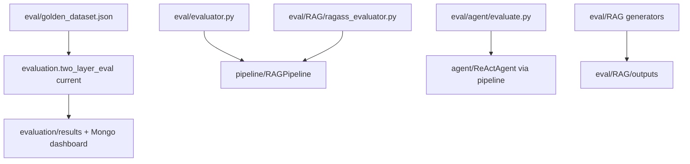

# Module: `eval`

Source-verified: 2026-06-02 from `eval/**/*.py`, `evaluation/MODULE.md`, and `api/routes/metrics.py`.

## Purpose

`eval` contains legacy and specialized evaluation assets. It complements the newer `evaluation/` module, which is the current two-layer offline evaluation framework.

Use `evaluation/` for production current-policy and historical-email regression gates. Use `eval/` for legacy golden data, RAGAS-style experiments, agent question sets, and older evaluator flows.

## File Map

```text
eval/
  golden_dataset.json        Default current-policy golden dataset used by evaluation/.
  evaluator.py               Legacy routing/retrieval/agent evaluator.
  agent/
    evaluate.py              Agent-focused eval runner.
    question_sets/*.json     Simple and complex agent question sets.
    REPORT_TEMPLATE.md
    results.json
  RAG/
    ragass_evaluator.py      RAGAS-style dataset/full-RAG evaluator.
    run_eval.py              RAG eval runner.
    dataset_generator.py     QA generation helpers.
    qa_generator.py          QA generation.
    ragass_generator.py      RAGAS dataset generation.
    llm_client.py            LLM client abstraction for eval.
    llm_judge.py             LLM judge helpers.
    tune_retrieval.py        Retrieval tuning utilities.
    outputs/                 Generated datasets/results.
```

## RAGAS Flow

`eval/RAG/ragass_evaluator.py` supports:

- dataset validation using saved contexts
- full RAG mode through `RAGPipeline.query_v3()`

Use this as a supplement to source-id based current policy eval, not as the only production gate.

## Golden Dataset Contract

`eval/golden_dataset.json` is read by `evaluation.two_layer_eval current`. Cases should include stable ids, query/question text, expected collections, and preferably expected source ids.

## Module Flow



External module boundaries:

- `eval` holds legacy/specialized assets; production regression gating lives in `evaluation`.
- Full-RAG/RAGAS runners may instantiate `RAGPipeline`, so model/store prerequisites mirror runtime.
- Generated outputs should not replace curated golden data without review.

## Maintenance Notes

- Treat large files under `eval/RAG/outputs/` as generated artifacts.
- Do not overwrite `golden_dataset.json` from generators without audit.
- If adding production regression cases, update `evaluation/search_strategy_labels.jsonl` when source-id metrics need labels.

## Useful Checks

```bash
python -m py_compile eval/evaluator.py eval/agent/*.py eval/RAG/*.py
python -m pytest tests/test_two_layer_eval.py -q -m "not integration"
```
