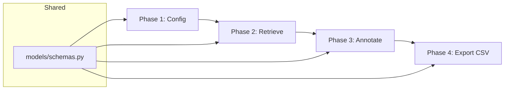

# 📘 RAG Evaluation Dataset Builder — Development Guide

> Hướng dẫn chi tiết từng phase để xây dựng ground truth dataset đánh giá RAG.

---

## 🔵 Phase 1: Cấu hình Retrieval

> **Mục tiêu**: Setup config trước khi bắt đầu annotate.

### Task 1.1 — Chọn Qdrant Collection

**File**: `config/retrieval_config.py`, `models/schemas.py`

| Bước | Việc | Chi tiết |
|------|------|----------|
| ① | Kết nối Qdrant | Dùng `QdrantClient` để list collections |
| ② | Hiển thị danh sách collections | UI cho phép chọn 1 hoặc nhiều collection |
| ③ | Validate collection tồn tại | Kiểm tra collection có data |

### Task 1.2 — Cấu hình Retrieval Parameters

| Bước | Việc | Chi tiết |
|------|------|----------|
| ① | Nhập `top_k` | Số lượng chunks retrieve (default: 10) |
| ② | Chọn `embedding_model` | Dropdown: `e5`, `bge_m3`, `hybrid` |
| ③ | Validate config | `top_k > 0`, `embedding_model` không rỗng |
| ④ | Lưu config | Config được gắn kèm từng record khi export |

**Công nghệ**: Pydantic `BaseModel` cho validation, Streamlit widgets cho UI

**Lưu ý**:
- `top_k` và `embedding_model` **bắt buộc** trước khi nhập query đầu tiên
- Config có thể thay đổi giữa các query → mỗi query lưu config riêng

---

## 🔵 Phase 2: Nhập Query & Retrieve Chunks

> **Mục tiêu**: Human nhập câu hỏi, hệ thống trả về chunks từ Qdrant.

### Task 2.1 — Query Input & Retrieval

**File**: `retrieval/chunk_retriever.py`

| Bước | Việc | Chi tiết |
|------|------|----------|
| ① | Nhận query từ UI | Text input trong Streamlit |
| ② | Embed query | Dùng embedding model đã chọn |
| ③ | Gọi Qdrant search | Search trên collection(s) đã chọn |
| ④ | Trả về chunks | `List[RetrievedChunk]` gồm chunk_id, score, text |

**Công nghệ**:
- `qdrant-client` — search API
- Embedding models từ `RAG_v2/embedding/` (BGE-M3, E5)

### Task 2.2 — Hiển thị Chunks

| Bước | Việc | Chi tiết |
|------|------|----------|
| ① | Hiển thị đầy đủ | Mỗi chunk: chunk_id, score, **nội dung text** |
| ② | Sorted by score | Cao → thấp |
| ③ | Expandable text | Chunk dài có thể expand/collapse |

**Lưu ý**: Luôn hiển thị **nội dung text đầy đủ** — không chỉ hiển thị ID.

---

## 🔵 Phase 3: Human Annotation

> **Mục tiêu**: Human đánh dấu chunks liên quan và điền metadata.

### Task 3.1 — Tick Relevant Chunks

**File**: `annotation/annotator.py`

| Bước | Việc | Chi tiết |
|------|------|----------|
| ① | Checkbox mỗi chunk | Human tick chunk nào relevant |
| ② | Lưu `relevant_doc_ids` | JSON array: `["id1", "id2"]` |
| ③ | Validate | Ít nhất 1 chunk phải được tick mới cho lưu |

### Task 3.2 — Điền Metadata

| Bước | Việc | Chi tiết |
|------|------|----------|
| ① | `query_type` | Dropdown: factoid / multi-hop / summarization / boolean |
| ② | `difficulty` | Radio: easy / medium / hard |
| ③ | `expected_answer` | Text area (optional — có thể để trống) |

### Task 3.3 — Session Management

| Bước | Việc | Chi tiết |
|------|------|----------|
| ① | Lưu annotation | Thêm vào session list |
| ② | Hiển thị progress | Số query đã annotate + tổng relevant chunks |
| ③ | Cho phép sửa | Xem lại và sửa annotation trước khi export |

**Ràng buộc**:
- `id` = UUID v4, auto-generate, **không cho phép chỉnh sửa**
- `relevant_doc_ids` luôn serialize dạng JSON array string, kể cả 1 phần tử: `["id1"]`
- Mỗi query phải có ≥ 1 chunk được tick mới cho phép lưu

---

## 🔵 Phase 4: Export CSV

> **Mục tiêu**: Xuất file CSV chuẩn cho evaluation pipeline.

### Task 4.1 — Export Logic

**File**: `export/csv_exporter.py`

| Cột | Ghi chú |
|-----|---------|
| `id` | UUID v4, tự sinh, unique |
| `query` | Câu hỏi human nhập |
| `query_type` | Annotation (factoid / multi-hop / ...) |
| `difficulty` | Annotation (easy / medium / hard) |
| `expected_answer` | Optional, để trống nếu chưa có |
| `relevant_doc_ids` | JSON array: `["id1","id2"]` |
| `top_k` | Config retrieval đã dùng |
| `embedding_model` | Config retrieval đã dùng |
| `retrieved_doc_ids` | ← Để trống (eval phase) |
| `retrieved_scores` | ← Để trống (eval phase) |
| `llm_output` | ← Để trống (eval phase) |
| `hit@1` | ← Để trống (eval phase) |
| `hit@k` | ← Để trống (eval phase) |
| `precision@k` | ← Để trống (eval phase) |
| `recall@k` | ← Để trống (eval phase) |
| `mrr` | ← Để trống (eval phase) |
| `latency_ms` | ← Để trống (eval phase) |

**Ràng buộc**:
- Các cột eval (từ `retrieved_doc_ids` trở đi) **luôn để trống** — không điền giá trị mặc định, không điền null, không điền 0
- Export tất cả queries trong session thành **một file CSV duy nhất**
- Cho phép review trước khi export

---

## 📊 Tổng quan Dependencies

---

## 🛠️ Công nghệ sử dụng

| Thành phần | Công nghệ |
|------------|-----------|
| UI | Streamlit |
| Data models | Pydantic v2 |
| Vector DB | Qdrant (qdrant-client) |
| Embedding | BGE-M3, E5 (từ `RAG_v2/embedding/`) |
| Export | Python `csv` module |
| ID generation | `uuid.uuid4()` |
