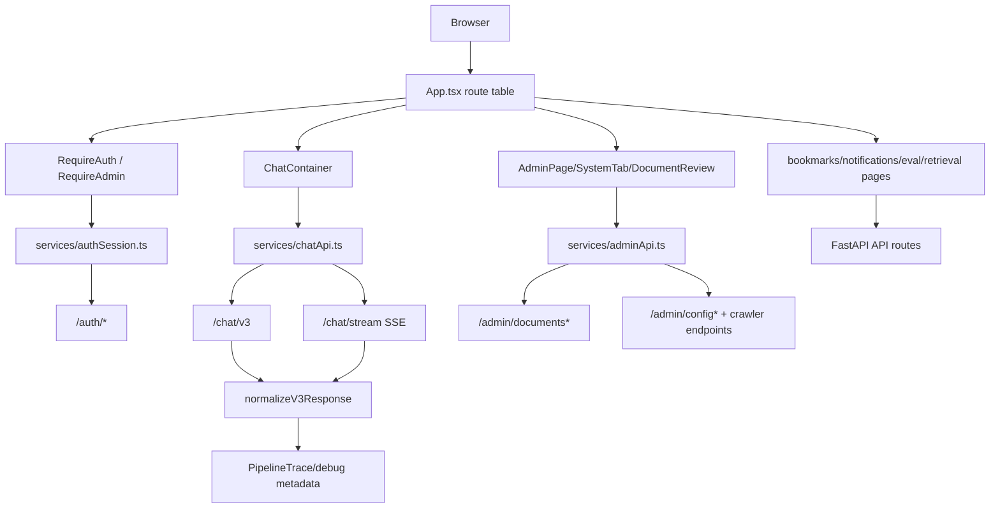

# Module: `frontend`

Source-verified: 2026-06-02 from `frontend/chat-companion/src/**`, `packages/shared`, `api/routes/*.py`, and API contract queries.

## Purpose

`frontend` contains the React/Vite web client under `frontend/chat-companion`. It provides chat, auth/profile, trace/debug, retrieval diagnostics, evaluation dashboard, admin document management, bookmarks, and notifications.

## App Stack

- React 18
- Vite
- React Router
- TanStack Query
- Axios and Fetch/ReadableStream for SSE
- shadcn/Radix UI components
- Tailwind CSS
- `@rag/shared` workspace package is available, while the web app still keeps local service/type modules for several features.

## Main Source Map

```text
frontend/chat-companion/src/
  App.tsx                       Route table.
  pages/                        Top-level screens.
  components/chat/              Chat UI, messages, actions, input.
  components/sidebar/           Conversation sidebar.
  components/admin/             Upload/review/chunk/index admin UI.
  components/trace/             Pipeline/agent trace visualizations.
  components/ui/                shadcn/Radix primitives.
  services/                     chat/auth/session/admin API clients.
  types/                        Local admin/chat types.
  hooks/                        Smart scroll, sidebar resize, toast/mobile hooks.
```

## Routes

`App.tsx` defines:

| Route | Purpose |
| --- | --- |
| `/` | Landing page, redirects/entry. |
| `/chat`, `/chat/:sessionId` | Main chat UI. |
| `/login`, `/register`, `/complete-profile` | Auth/profile flow. |
| `/trace` | Admin-only trace/debug page. |
| `/retrieval` | Admin-only retrieval diagnostic page. |
| `/eval` | Admin-only evaluation dashboard. |
| `/admin` | Admin document list/upload page. |
| `/admin/documents/:id` | Admin document review pipeline page. |
| `/bookmarks` | Saved answers. |
| `/notifications` | Notification inbox. |

Protected routes use live session validation:

- `RequireAuth`: `/chat`, `/chat/:sessionId`, `/complete-profile`,
  `/bookmarks`, `/notifications`.
- `RequireAdmin`: `/trace`, `/retrieval`, `/eval`, `/admin`,
  `/admin/documents/:id`.

Unauthenticated direct navigation redirects to `/login?next=<current-path>`.
Non-admin users who reach admin-only routes are redirected to `/chat`.

## API Services

Important local services:

- `services/chatApi.ts`: `/chat/v3`, `/chat/stream`, response normalization, source mapping.
- `services/authApi.ts`: login/register/profile helpers.
- `services/authSession.ts`: central access-token memory state, refresh single-flight,
  route-session validation, credentialed fetch, and logout.
- `services/authStorage.ts`: in-memory access token plus legacy localStorage
  migration/cleanup; user cache remains in localStorage.
- `services/sessionApi.ts`: session list/get/create/update/delete.
- `services/adminApi.ts`: upload pipeline actions and polling.

Token behavior:

- Web access tokens are kept in memory only.
- Legacy `localStorage.token` and `localStorage.access_token` are read once for
  migration and then removed.
- Refresh tokens are HttpOnly cookies set by the backend; axios/fetch clients use
  `withCredentials`/`credentials: "include"`.
- Axios and streaming fetch helpers refresh once on 401 and retry the original
  request once.

## Chat UI Contract

`ChatContainer` coordinates:

- selected session id
- message send
- streaming token updates
- metadata/debug panel data
- session invalidation
- persisted sidebar size

`PipelineTrace.tsx` expects pipeline metadata such as timings, filters, collection results, route/mode, Tavily details, and agent traces.

## Admin UI Contract

`AdminPage` owns a viewport-height shell with a desktop sidebar, compact mobile tab rail, and a scrollable `main` region because the app root keeps overflow locked for chat. Keep admin tab content inside that scroll region; tab switches reset it to the top.

`OverviewTab` uses compact metric cards, a usage band, and an operations summary panel rather than a loose page-level stat grid.

`SystemTab` keeps LLM model fields as selects. The configured current model is injected as an option when it is outside the curated model list so admin saves do not accidentally discard runtime settings. API key management uses secret-free rows/fingerprints from `/admin/config/api-keys`; the form can submit new DeepSeek/Google/Tavily secrets, but the backend does not echo raw keys.

Crawler status may include collection-level crawl summaries with bounded `saved_chunks` previews after a manual crawl. New crawler runs are staged for review in Mongo; `SystemTab` renders pending/indexed runs from `crawlerStatus.runs`, allows expanding a preview chunk to fetch/edit full content, and starts indexing through the per-run index endpoint. Article URLs in crawler previews should render as normal external links.

Notification pages consume `/notifications*` user routes. Admin/system
notification creation is exposed at `/admin/notifications` and
`/admin/notifications/broadcast`; current backend auth for those endpoints is
valid-user auth, not `require_admin`.

## Module Flow



External module boundaries:

- The web app consumes backend contracts from `api`, `schemas`, and `packages/shared`; it should not duplicate backend business rules beyond UX guards.
- Auth state uses backend refresh-cookie semantics; access tokens stay in memory.
- Trace/admin views must track optional metadata fields from `api/response_mapper.py` and `schemas/chat.py`.

## Maintenance Notes

- Keep web response normalization aligned with `api/response_mapper.py` and `packages/shared/src/utils/normalize.ts`.
- Keep auth flow aligned with `routers/auth.py`,
  `packages/shared/src/types/auth.ts`, and mobile auth behavior.
- When backend chat metadata changes, update `types/chat.ts`, `services/chatApi.ts`, and trace components.
- When admin document schemas change, update `types/admin.ts`, `services/adminApi.ts`, and admin components.
- Avoid adding runtime-only secrets to Vite env; only `VITE_*` values are exposed.

## Useful Checks

```bash
npm run lint --workspace=frontend/chat-companion
npm run build --workspace=frontend/chat-companion
```
