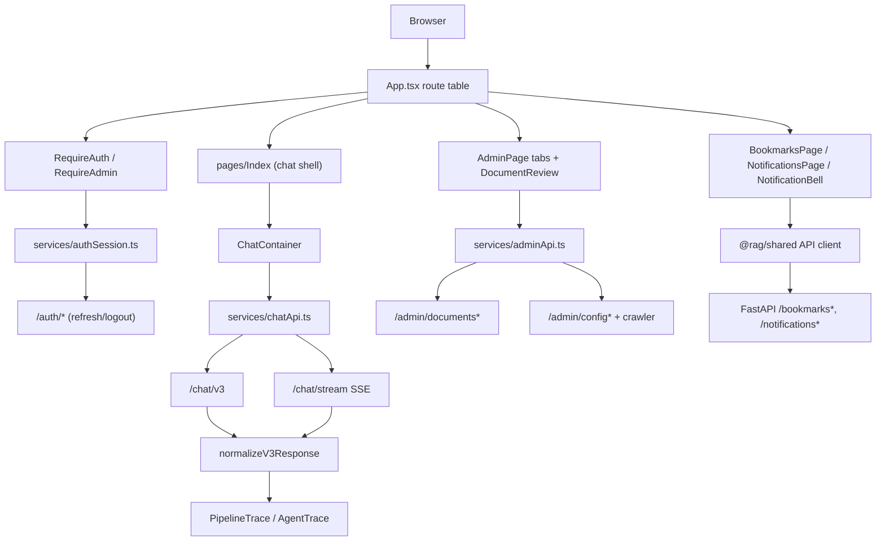

# Module: `frontend`

Source-verified: 2026-06-05 from `frontend/chat-companion/` (`package.json`, `vite.config.ts`, `index.html`), `frontend/chat-companion/src/**` (`App.tsx`, `main.tsx`, `pages/*`, `components/**`, `services/*`, `hooks/*`, `types/*`, `lib/utils.ts`), and `@rag/shared` import usage. node_modules and `.agent/` skill docs excluded.

## Purpose

`frontend` contains the React/Vite web client under `frontend/chat-companion`. It provides chat, auth/profile, conversation history, trace/debug, retrieval diagnostics, evaluation dashboard, admin document management + admin dashboard (overview/users/analytics/feedback/system), bookmarks, and notifications.

## App Stack

- React 18, TypeScript
- Vite 5 (`@vitejs/plugin-react-swc`)
- React Router v6 (`react-router-dom`)
- TanStack Query v5
- Axios and Fetch/ReadableStream for SSE streaming
- shadcn/Radix UI components, Tailwind CSS, `lucide-react` icons
- `react-markdown` + `remark-gfm` for answer rendering, `recharts` for admin charts
- `@rag/shared` workspace package supplies the bookmarks/notifications API client and shared types; the web app keeps local service/type modules for chat/auth/admin.

## Main Source Map

```text
frontend/chat-companion/
  package.json                  Vite/React app; scripts dev/build/lint/preview.
  vite.config.ts                Vite config (path alias @ -> src).
  index.html                    HTML entry.
  src/
    main.tsx                    ReactDOM root, mounts <App/>.
    App.tsx                     Route table + RequireAuth/RequireAdmin guards.
    index.css / App.css         Global/Tailwind styles.
    pages/                      Top-level screens (chat, auth, admin, trace, eval, bookmarks, notifications).
    components/chat/            ChatContainer, ChatMessage, ChatInput, TypingIndicator, MessageActionsWeb.
    components/sidebar/         ConversationSidebar (session list).
    components/admin/           Upload/review/chunk UI + dashboard tabs/sections.
    components/trace/           PipelineTrace, AgentTrace, DocRow.
    components/ui/              shadcn/Radix primitives.
    components/                 NavLink, HustLogo, NotificationBell (top-level shared).
    services/                   chat/auth/session/admin API clients.
    types/                      Local chat/admin/adminStats types.
    hooks/                      useSmartScroll, useResizableSidebar, useAdminFetch, use-mobile, use-toast.
    lib/utils.ts                cn() classnames helper + parseUtcDate.
```

## Routes

`App.tsx` (`BrowserRouter`) defines:

| Route | Element | Guard |
| --- | --- | --- |
| `/` | `LandingPage` | none |
| `/chat`, `/chat/:sessionId` | `Index` (chat shell) | `RequireAuth` |
| `/login` | `LoginPage` | none |
| `/register` | `RegisterPage` | none |
| `/complete-profile` | `CompleteProfile` | `RequireAuth` |
| `/trace` | `TracePage` | `RequireAdmin` |
| `/retrieval` | `RetrievalPage` | `RequireAdmin` |
| `/eval` | `EvalPage` | `RequireAdmin` |
| `/admin` | `AdminPage` | `RequireAdmin` |
| `/admin/documents/:id` | `DocumentReview` | `RequireAdmin` |
| `/bookmarks` | `BookmarksPage` | `RequireAuth` |
| `/notifications` | `NotificationsPage` | `RequireAuth` |
| `*` | `NotFound` | none |

Guard behavior (`App.tsx`):

- `RequireAuth` / `RequireAdmin` read the cached user from `getCurrentSessionUser()` for an optimistic first render, then verify once on mount via `ensureSession()`. The check runs once per guard lifetime (`verified` ref).
- While the first check is in flight with no cached user, the guard renders nothing.
- No valid session redirects to `/login?next=<encoded current path+search>`.
- `RequireAdmin` additionally redirects non-admin users (`user.role !== 'admin'`) to `/chat`.

## Chat Shell (`pages/Index.tsx`)

Hosts the authenticated chat UI: header (logo, sidebar toggle, admin Trace link, bookmarks button, `NotificationBell`, dark-mode toggle, `UserMenu` with logout), a resizable `ConversationSidebar` (desktop `ResizablePanel`, mobile `Sheet`), and `ChatContainer`. Loads the session list via TanStack Query (`getSessions(ownerId)`), persists dark-mode in `localStorage.theme`, and supports Cmd/Ctrl+B to toggle the sidebar.

## API Services

Local services (`src/services/`):

- `chatApi.ts`: `sendMessageV3` (`POST /chat/v3`), `sendMessageStream` (`POST /chat/stream`, SSE via `authFetch`), `sendMessage` (delegates to v3 `auto` mode), `retrievalSearch` (`POST /retrieval/search`), `getEvalDashboard` (`GET /metrics/eval`), `checkHealth` (`GET /health`). Includes `normalizeV3Response` (maps sources/agent_trace into `ChatV3Response`), `resolveChatIdentity`, and the axios `apiClient` with `installAuthInterceptors`.
- `authApi.ts`: login/register/profile helpers; exports `UserPublic`, `TokenResponse` types.
- `authSession.ts`: in-memory access-token session core — `ensureSession`, `ensureAccessToken`, `refreshSession` (single-flight), `applyTokenResponse`, `logoutSession`, `clearSession`, `getCurrentSessionUser`, the axios interceptor installer, and `authFetch` (credentialed fetch with 401 refresh+retry).
- `authStorage.ts`: in-memory access token + expiry, legacy `localStorage.token`/`access_token` migration/cleanup; user object cached in localStorage.
- `sessionApi.ts`: conversation session list/get/create/update/delete.
- `adminApi.ts`: admin document pipeline (upload/list/detail/chunks/markdown actions) + config/crawler endpoints, via its own `adminClient` axios instance with auth interceptors.

Bookmarks and notifications do NOT have local service files — `BookmarksPage`, `NotificationsPage`, and `NotificationBell` call `@rag/shared` helpers (`createApiClient`, `listBookmarks`, `listBookmarkFolders`, `deleteBookmark`, notification calls) wired to local `authSession` token/refresh helpers.

Token behavior:

- Access tokens are kept in memory only; refresh tokens are HttpOnly cookies set by the backend.
- Legacy `localStorage` access tokens are read once for migration then removed.
- Axios clients use `withCredentials: true`; fetch/SSE uses `credentials: 'include'`.
- Both axios interceptors and `authFetch` refresh once on 401 (single-flight `refreshSession`) and retry the original request once; failure clears the session.

## Chat UI Contract

`ChatContainer` (`components/chat/`) coordinates selected session id, message send, streaming token updates, metadata/debug panel data, pending-turn persistence in `sessionStorage`, and session-list invalidation. It streams via `sendMessageStream` and renders messages through `ChatMessage`/`TypingIndicator`/`MessageActionsWeb`.

`PipelineTrace.tsx` / `AgentTrace.tsx` render optional pipeline/agent metadata from the normalized response: timings, applied filters, collection results, route/mode, fusion weights, context/rerank traces, tool calls, and agent traces.

## Admin UI Contract

`AdminPage` is a viewport-height shell with desktop sidebar + mobile tab rail and a scrollable `main` region; it switches tabs by `activeTab` between `OverviewTab`, `UsersTab`, `AnalyticsTab`, `FeedbackTab`, and `SystemTab`.

- `AnalyticsTab` composes `QueryAnalyticsSection` and a lazily-loaded `AgentAnalyticsSection`.
- `OverviewTab` uses compact metric cards, a usage band, and an operations summary panel.
- `SystemTab` keeps LLM model fields as selects (injects the configured current model when outside the curated list) and manages API keys via secret-free fingerprint rows from `/admin/config/api-keys`; the backend never echoes raw keys. Renders crawler pending/indexed runs from `crawlerStatus.runs` with per-run preview/edit and indexing.
- Admin data fetching uses the shared `useAdminFetch` hook (loading/error/empty + toast on error) and `types/adminStats.ts`.

`DocumentReview` (`/admin/documents/:id`) drives the upload-to-index pipeline (converter/chunker selection, markdown/chunk editing) via `adminApi.ts` and `types/admin.ts`, using `components/admin/` (FileUploader, MarkdownEditor, MetadataForm, ChunkViewer, PipelineProgress, DocumentList).

Notification pages consume `/notifications*` user routes via `@rag/shared`.

## Module Flow



External module boundaries:

- The web app consumes backend contracts from `api`/`schemas` and the `@rag/shared` workspace package; it should not duplicate backend business rules beyond UX guards.
- Auth state uses backend refresh-cookie semantics; access tokens stay in memory.
- Trace/admin views must track optional metadata fields from `api/response_mapper.py` and `schemas/chat.py`.

## Maintenance Notes

- Keep `normalizeV3Response` aligned with backend response mapping and `@rag/shared` normalize utilities.
- Keep auth flow aligned with backend `routers/auth.py` and `@rag/shared` auth types.
- When backend chat metadata changes, update `types/chat.ts`, `services/chatApi.ts`, and trace components.
- When admin schemas change, update `types/admin.ts` / `types/adminStats.ts`, `services/adminApi.ts`, and admin components.
- Only `VITE_*` env values are exposed to the client (`VITE_API_URL`, default `http://localhost:8000`).

## Useful Checks

```bash
npm run lint --workspace=frontend/chat-companion
npm run build --workspace=frontend/chat-companion
```
