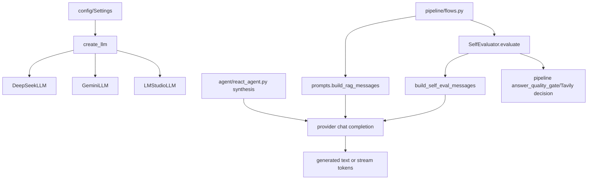

# Module: `llm`

Source-verified: 2026-06-02 from `llm/*.py`, `config/settings.py`, `pipeline/flows.py`, and `agent/react_agent.py`.

## Purpose

`llm` wraps chat model providers, prompt construction, streaming generation, and answer self-evaluation. It exposes a small `BaseLLM` contract so the pipeline can call generation without knowing provider-specific details.

The production default is DeepSeek `deepseek-v4-flash` through an OpenAI-compatible endpoint. Gemini and LM Studio remain supported providers.

## File Map

```text
llm/
  __init__.py     Provider registry, lazy provider import, create_llm().
  base.py         BaseLLM abstract interface.
  deepseek.py     DeepSeekLLM via DeepSeek OpenAI-compatible API.
  gemini.py       GeminiLLM via Google Generative Language OpenAI-compatible API.
  lm_studio.py    LMStudioLLM via local OpenAI-compatible endpoint.
  chat_model.py   Backward-compatible ChatModel export shim.
  prompts.py      RAG, chitchat, and self-eval prompt builders.
  self_eval.py    SelfEvaluator JSON judge wrapper.
```

## Public API

`BaseLLM` defines:

```python
generate(query, context=None, history=None, mode="rag") -> str
generate_stream(query, context=None, history=None, mode="rag") -> Generator[str, None, None]
```

`create_llm(settings)`:

- Reads `settings.llm_provider`.
- Lazy-imports `llm.deepseek`, `llm.gemini`, or `llm.lm_studio`.
- Builds provider with `settings.llm_api_key` first, then provider fallback:
  `settings.deepseek_api_key` for DeepSeek and `settings.google_api_key` for
  Gemini/other non-LM-Studio providers.
- Passes `settings.chat_model`, temperature, and max tokens.
- For `lm_studio`, passes `settings.lm_studio_base_url`.

Known provider registry keys in code:

- `deepseek`
- `gemini`
- `lm_studio`

## Provider Behavior

`DeepSeekLLM`:

- Uses `https://api.deepseek.com`.
- Reads `DEEPSEEK_API_KEY` or `LLM_API_KEY` fallback if no key is passed.
- Supports full-response and streaming generation.

`GeminiLLM`:

- Uses `OpenAI(api_key=..., base_url="https://generativelanguage.googleapis.com/v1beta/openai/")`.
- Retries `RateLimitError` up to 3 attempts with exponential backoff.
- Supports both non-streaming and streaming chat completions.

`LMStudioLLM`:

- Uses a local OpenAI-compatible endpoint, default `http://localhost:1234/v1`.
- Has one attempt by default.
- Supports non-streaming and streaming.

All providers call `build_rag_messages()`, `build_chitchat_messages()`, or `build_self_eval_messages()` depending on `mode`.

## Prompt Contracts

`prompts.py` owns:

- RAG grounding instructions.
- Context/history formatting.
- Chitchat prompt for non-retrieval responses.
- Self-evaluation prompt.

Important current prompt behavior:

- RAG answers must be grounded in supplied context.
- If source context contains URLs, answers should use Markdown links instead of plain "tai day" text.
- If context is in English for international/bilingual CTDT programs, answer should translate needed content into Vietnamese and preserve technical terms when useful.
- Prompt builders trim/format history before sending to the provider.

## Self Evaluation

`SelfEvaluator.evaluate(query, context, response)`:

- Builds a self-eval prompt.
- Calls the configured LLM with `mode="self_eval"`.
- Parses JSON, stripping Markdown fences if needed.
- Returns `pass`, `relevance`, `faithfulness`, `completeness`, `answer_status`, `should_web_search`, `web_search_query`, and `reason`.
- On parse failure, returns a fail result with `should_web_search=True`.

Pipeline/Tavily behavior depends on both `self_eval_enabled` and fallback settings; self-eval failure alone is diagnostic unless the caller gates on it.

## Module Flow



External module boundaries:

- `llm` receives formatted query/context/history and returns text/stream chunks; retrieval and citation selection are owned by `pipeline`/`retrieval`.
- Provider settings come from `config` and admin hot reload through `pipeline`.
- Self-eval output informs `pipeline` quality/fallback decisions but does not directly call Tavily.

## Settings

Main settings:

- `llm_provider`
- `deepseek_api_key`
- `google_api_key`
- `llm_api_key`
- `chat_model`
- `chat_temperature`
- `chat_max_tokens`
- `lm_studio_base_url`
- `self_eval_enabled`
- `self_eval_min_top_score`

The main chat default is `llm_provider="deepseek"` with
`chat_model="deepseek-v4-flash"`. Agent final synthesis is configured
separately in `agent/react_agent.py` through `agent_synthesis_provider` and
`agent_synthesis_model`; that path currently supports Gemini, Ollama, and an
OpenAI-compatible local/LM-Studio-style endpoint.

## Maintenance Notes

- Add new providers by updating `_PROVIDER_MODULES`, implementing `BaseLLM`, and registering with `@register_llm`.
- Keep prompt contract updates synchronized with frontend/mobile rendering expectations and tests.
- Do not place retrieval logic in this module; it receives already formatted context.

## Useful Checks

```bash
python -m py_compile llm/*.py
python -m pytest tests/test_phase7.py tests/test_phase8.py -q -m "not integration"
```
