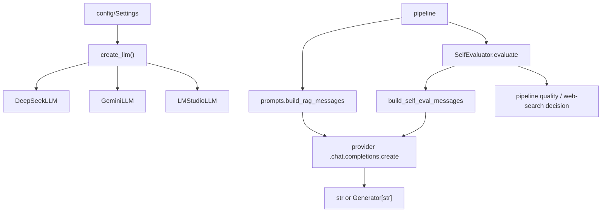

# Module: `llm`

Source-verified: 2026-06-12 from `llm/__init__.py`, `llm/base.py`, `llm/deepseek.py`, `llm/gemini.py`, `llm/lm_studio.py`, `llm/chat_model.py`, `llm/self_eval.py`, `llm/prompts.py`.

## Purpose

`llm` wraps chat model providers, prompt construction, streaming generation, and answer self-evaluation. It exposes a small `BaseLLM` contract so the pipeline can call generation without knowing provider-specific details.

All three concrete providers use the `openai` SDK `OpenAI` client pointed at different base URLs (all are OpenAI-compatible). The factory reads `settings.llm_provider`; the only non-`gemini` default in code is `deepseek` (per the `create_llm` key-resolution logic). Prompts are written in Vietnamese and target HUST students.

## File Map

```text
llm/
  __init__.py     Provider registry, _PROVIDER_MODULES map, register_llm decorator, create_llm() factory.
  base.py         BaseLLM abstract interface (generate, generate_stream).
  deepseek.py     DeepSeekLLM via DeepSeek OpenAI-compatible API; retry with backoff on generate; retry on stream-open.
  gemini.py       GeminiLLM via Google Generative Language OpenAI-compatible API; same retry pattern.
  lm_studio.py    LMStudioLLM via local OpenAI-compatible endpoint; _MAX_RETRIES=1 (single attempt effectively).
  chat_model.py   One-liner shim: re-exports GeminiLLM as ChatModel for legacy callers.
  prompts.py      RAG, chitchat, and self-eval prompt strings and message builders.
  self_eval.py    SelfEvaluator JSON judge wrapper.
```

## `BaseLLM` (`base.py`)

Abstract base class. Subclasses must set `model: str` in `__init__` and implement both abstract methods.

```python
class BaseLLM(ABC):
    model: str = ""

    @abstractmethod
    def generate(
        self,
        query: str,
        context: Optional[str] = None,
        history: Optional[List[Dict[str, str]]] = None,
        mode: str = "rag",
    ) -> str: ...

    @abstractmethod
    def generate_stream(
        self,
        query: str,
        context: Optional[str] = None,
        history: Optional[List[Dict[str, str]]] = None,
        mode: str = "rag",
    ) -> Generator[str, None, None]: ...
```

`mode` values used in practice: `"rag"`, `"chitchat"`, `"self_eval"`. The docstring lists only `"rag"` and `"chitchat"` in a couple of places — `"self_eval"` is the third valid value, used by `SelfEvaluator`.

## `create_llm` / `register_llm` (`__init__.py`)

```python
def register_llm(name: str) -> Callable[[type[BaseLLM]], type[BaseLLM]]: ...

def create_llm(settings: Settings) -> BaseLLM: ...
```

`create_llm` behaviour:

1. Reads `settings.llm_provider`.
2. If the provider is not in `_REGISTRY`, lazy-imports its module from `_PROVIDER_MODULES` (which triggers `@register_llm`). Raises `ValueError` for an unknown provider.
3. Resolves `api_key` as: `settings.llm_api_key` → if `None`, `settings.deepseek_api_key` when provider is `"deepseek"`, else `settings.google_api_key`.
4. Constructs the class with `model=settings.chat_model`, `temperature=settings.chat_temperature`, `max_tokens=settings.chat_max_tokens`.
5. For `"lm_studio"` only, also passes `base_url=settings.lm_studio_base_url`.

Note: the `lm_studio` provider's key resolution inside its own `__init__` falls back to `os.environ.get("OPENAI_API_KEY")`, not `DEEPSEEK_API_KEY` or `GOOGLE_API_KEY` — distinct from the other two providers.

`_PROVIDER_MODULES`:

| Key | Module |
|---|---|
| `"deepseek"` | `llm.deepseek` |
| `"gemini"` | `llm.gemini` |
| `"lm_studio"` | `llm.lm_studio` |

`__all__` = `["BaseLLM", "ChatModel", "SelfEvaluator", "register_llm", "create_llm"]`

## Provider Implementations

All three share the same `_build_messages` dispatch pattern:

```python
def _build_messages(self, query, context, history, mode) -> List[Dict[str, str]]:
    if mode == "chitchat":   return build_chitchat_messages(query, history)
    if mode == "self_eval":  return build_self_eval_messages(query)
    return build_rag_messages(query, context or "", history)   # default: "rag"
```

### `DeepSeekLLM` (`deepseek.py`)

```python
@register_llm("deepseek")
class DeepSeekLLM(BaseLLM):
    def __init__(
        self,
        api_key: Optional[str] = None,
        model: str = "deepseek-v4-flash",
        temperature: float = 0.0,
        max_tokens: int = 1500,
    ) -> None: ...
```

- Base URL: `https://api.deepseek.com`
- API key resolution (inside `__init__`): `api_key` → `DEEPSEEK_API_KEY` env var → `LLM_API_KEY` env var. Raises `ValueError` if none found.
- `generate`: retries `RateLimitError` up to `_MAX_RETRIES=3` times; backoff `2.0 * 2**attempt` seconds. Uses `for/else` — if the loop exhausts without `break`, re-raises `last_exc` or raises `RuntimeError`.
- `generate_stream`: retries the stream-open and first-chunk phase up to 3 times; once any token has been yielded to the caller the stream is not replayed.

### `GeminiLLM` (`gemini.py`)

```python
@register_llm("gemini")
class GeminiLLM(BaseLLM):
    def __init__(
        self,
        api_key: Optional[str] = None,
        model: str = "gemini-3.1-flash-lite",
        temperature: float = 0.3,
        max_tokens: int = 1024,
    ) -> None: ...
```

- Base URL: `https://generativelanguage.googleapis.com/v1beta/openai/`
- API key resolution: `api_key` → `GOOGLE_API_KEY` env var. No `ValueError` raised if `None` (silently passes `None` to `OpenAI(api_key=None, ...)`).
- `generate`: same `for/else` retry pattern as DeepSeek; `_MAX_RETRIES=3`, backoff `2.0 * 2**attempt`. Re-raises `last_exc` (no fallback `RuntimeError`).
- `generate_stream`: same retry-on-open pattern.
- `chat_model.py` re-exports `GeminiLLM as ChatModel`.

### `LMStudioLLM` (`lm_studio.py`)

```python
@register_llm("lm_studio")
class LMStudioLLM(BaseLLM):
    def __init__(
        self,
        api_key: Optional[str] = None,
        model: str = "qwen/qwen3-8b:2",
        temperature: float = 0.0,
        max_tokens: int = 1024,
        base_url: str = "http://localhost:1234/v1",
    ) -> None: ...
```

- Local endpoint; `base_url` is a constructor parameter (set by factory from `settings.lm_studio_base_url`).
- API key resolution: `api_key` → `OPENAI_API_KEY` env var.
- `_MAX_RETRIES = 1`, `_BASE_RETRY_DELAY = 1.0` — effectively a single attempt; the `for/else` loop can never retry.
- `generate`: raises `last_exc` or `RuntimeError` on the `else` branch.
- `generate_stream`: re-raises `last_exc` on `else` branch; **no stream completion log** (unlike DeepSeek/Gemini).

## Prompt Contracts (`prompts.py`)

Module-level constants baked at import time:

- `RAG_SYSTEM_PROMPT` — built via `.format(terminology_glossary=HUST_TERMINOLOGY_GLOSSARY_TEXT)` at module load. Cannot be patched after import without re-assigning the variable.
- `SELF_EVAL_SYSTEM_PROMPT` — built via `.replace("{terminology_glossary}", HUST_TERMINOLOGY_GLOSSARY_TEXT)` at module load.

Templates (not injected at load):

| Name | Placeholders |
|---|---|
| `RAG_USER_TEMPLATE` | `{context}`, `{query}` |
| `RAG_USER_WITH_HISTORY_TEMPLATE` | `{history}`, `{context}`, `{query}` |
| `CHITCHAT_USER_TEMPLATE` | `{query}` |
| `CHITCHAT_USER_WITH_HISTORY_TEMPLATE` | `{history}`, `{query}` |
| `SELF_EVAL_USER_TEMPLATE` | `{query}`, `{context}`, `{response}` |

### Message builders

```python
def build_rag_messages(
    query: str,
    context: str,
    history: Optional[List[Dict[str, str]]] = None,
) -> List[Dict[str, str]]: ...

def build_chitchat_messages(
    query: str,
    history: Optional[List[Dict[str, str]]] = None,
) -> List[Dict[str, str]]: ...

def build_self_eval_messages(user_content: str) -> List[Dict[str, str]]: ...

def _format_history(history: List[Dict[str, str]]) -> str: ...
```

`build_rag_messages` logs at `DEBUG` level (`len` of assembled user content only — no full document content). Providers dispatch `mode="self_eval"` by passing the already-formatted `user_content` string as the `query` argument to `build_self_eval_messages`.

Key prompt rules enforced by `RAG_SYSTEM_PROMPT`:

- Answer only from supplied context; state "Tôi không tìm thấy thông tin này trong tài liệu hiện có." if absent.
- Translate English context to Vietnamese; keep original terms in parentheses.
- When documents give different figures, prefer the first document; do not average.
- Never use numbered citation markers (`[1]`, "Tài liệu 1", etc.); cite by natural document name.
- If context contains a URL, embed as Markdown link `[phrase](URL)`; bare URLs are forbidden; do not fabricate links; replace spaces in URLs with `%20`.
- Programme/major disambiguation: if student's programme is stated in context, answer for that programme only; do not ask again.

## Self Evaluation (`self_eval.py`)

```python
class SelfEvaluator:
    def __init__(self, llm: BaseLLM) -> None: ...

    def evaluate(
        self,
        query: str,
        context: str,
        response: str,
    ) -> Dict[str, Any]: ...
```

`evaluate` flow:

1. Formats `SELF_EVAL_USER_TEMPLATE` with `query`, `context`, `response`.
2. Calls `self._llm.generate(query=user_content, mode="self_eval")`.
3. Calls `_parse_evaluation(raw)` which calls `_strip_markdown_fences` first.
4. Normalises `answer_status` to one of `"answered"` / `"insufficient"` / `"stale_risk"`; any other value is corrected using `"answered" if passed else "insufficient"`.
5. `should_web_search`: uses the JSON field value if present; falls back to `not passed` if the key is absent.

Return dict keys: `pass` (bool), `relevance`, `faithfulness`, `completeness`, `answer_status`, `should_web_search`, `web_search_query`, `reason`, `raw_response`.

On `JSONDecodeError` or `AttributeError`, returns a failing result with `should_web_search=True` and `reason` containing the first 200 chars of the raw response.

## Module Flow



External boundaries:

- `llm` receives formatted `query`/`context`/`history` and returns text or stream chunks; retrieval and citation selection are owned by `pipeline`/`retrieval`.
- Provider credentials and model params come exclusively from `config` via `create_llm`.
- Only external non-stdlib import into `prompts.py`: `utils.terminology.HUST_TERMINOLOGY_GLOSSARY_TEXT`.

## Settings consumed (via `create_llm`)

| Key | Notes |
|---|---|
| `llm_provider` | Registry key: `"deepseek"`, `"gemini"`, `"lm_studio"` |
| `llm_api_key` | Checked first for all providers |
| `deepseek_api_key` | Fallback when provider is `"deepseek"` and `llm_api_key` is falsy |
| `google_api_key` | Fallback for any non-`"deepseek"` provider when `llm_api_key` is falsy |
| `chat_model` | Passed as `model=` to provider constructor |
| `chat_temperature` | Passed as `temperature=` |
| `chat_max_tokens` | Passed as `max_tokens=` |
| `lm_studio_base_url` | Passed as `base_url=` only for `"lm_studio"` |

## Maintenance Notes

- Add a provider: add entry to `_PROVIDER_MODULES`, implement `BaseLLM` subclass, decorate with `@register_llm("name")`. Concrete providers must not read `Settings` directly.
- `GeminiLLM` does not raise `ValueError` for a missing API key at construction (passes `None` silently to the `openai` client); `DeepSeekLLM` does raise immediately. If you enforce strict validation, add a guard to `GeminiLLM.__init__`.
- `LMStudioLLM.generate_stream` has no completion-level log line (unlike the other two providers).
- `RAG_SYSTEM_PROMPT` and `SELF_EVAL_SYSTEM_PROMPT` are baked at import time — tests that need to inject a different glossary must monkeypatch the module-level string, not `HUST_TERMINOLOGY_GLOSSARY_TEXT`.
- Keep prompt-contract changes (Markdown links, citation style, programme disambiguation rules) synchronised with frontend/mobile rendering expectations and regression tests.
- Do not place retrieval logic in this module; it receives already-formatted context strings.

## Useful Checks

```bash
# Syntax check all files
python -m py_compile src/RAG_v2/llm/*.py

# Confirm provider registry loads correctly
python -c "from llm import create_llm; print('OK')"

# Check prompt injection at import
python -c "from llm.prompts import RAG_SYSTEM_PROMPT; assert 'HUST' in RAG_SYSTEM_PROMPT"
```
