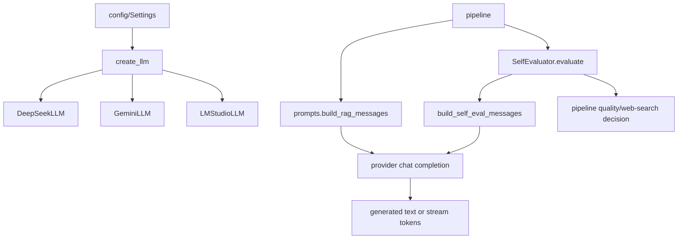

# Module: `llm`

Source-verified: 2026-06-05 from `llm/__init__.py`, `llm/base.py`, `llm/deepseek.py`, `llm/gemini.py`, `llm/lm_studio.py`, `llm/chat_model.py`, `llm/self_eval.py`, and `llm/prompts.py`.

## Purpose

`llm` wraps chat model providers, prompt construction, streaming generation, and answer self-evaluation. It exposes a small `BaseLLM` contract so the pipeline can call generation without knowing provider-specific details.

All three providers are OpenAI-compatible (they use the `openai` SDK `OpenAI` client against different base URLs). The factory default provider comes from `settings.llm_provider`; in code the production default is DeepSeek.

## File Map

```text
llm/
  __init__.py     Provider registry, _PROVIDER_MODULES map, register_llm decorator, create_llm() factory.
  base.py         BaseLLM abstract interface (generate, generate_stream).
  deepseek.py     DeepSeekLLM via DeepSeek OpenAI-compatible API; retry with backoff.
  gemini.py       GeminiLLM via Google Generative Language OpenAI-compatible API; retry with backoff.
  lm_studio.py    LMStudioLLM via local OpenAI-compatible endpoint; single attempt.
  chat_model.py   Backward-compatible shim: re-exports GeminiLLM as ChatModel.
  prompts.py      RAG, chitchat, and self-eval prompt strings and message builders.
  self_eval.py    SelfEvaluator JSON judge wrapper.
```

## Public API

`BaseLLM` (abstract, in `base.py`) defines a class attribute `model: str` and two abstract methods:

```python
generate(query, context=None, history=None, mode="rag") -> str
generate_stream(query, context=None, history=None, mode="rag") -> Generator[str, None, None]
```

`mode` is one of `"rag"`, `"chitchat"`, or `"self_eval"`.

`create_llm(settings)` in `__init__.py`:

- Reads `settings.llm_provider`.
- If the provider is not yet in `_REGISTRY`, lazy-imports its module from `_PROVIDER_MODULES` (which triggers the `@register_llm` decorator). Raises `ValueError` for an unknown provider.
- Resolves the API key as `settings.llm_api_key` first, else `settings.deepseek_api_key` when provider is `deepseek`, else `settings.google_api_key` for any other provider.
- Passes `model=settings.chat_model`, `temperature=settings.chat_temperature`, `max_tokens=settings.chat_max_tokens`.
- For `lm_studio` only, also passes `base_url=settings.lm_studio_base_url`.

`register_llm(name)` is a class decorator that registers a `BaseLLM` subclass under `name` in `_REGISTRY`.

Provider registry keys (`_PROVIDER_MODULES`):

- `deepseek` → `llm.deepseek`
- `gemini` → `llm.gemini`
- `lm_studio` → `llm.lm_studio`

`__init__.py` also re-exports `ChatModel` (from `chat_model.py`) and `SelfEvaluator` for backward compatibility. `__all__` = `BaseLLM`, `ChatModel`, `SelfEvaluator`, `register_llm`, `create_llm`.

## Provider Behavior

All three providers implement `generate` and `generate_stream`, dispatch by `mode` through a private `_build_messages` that calls `build_chitchat_messages` (chitchat), `build_self_eval_messages` (self_eval), or `build_rag_messages` (rag/default), and use `OpenAI(...).chat.completions.create`.

`DeepSeekLLM` (`@register_llm("deepseek")`):

- Base URL `https://api.deepseek.com`.
- Defaults: `model="deepseek-v4-flash"`, `max_tokens=1500`, `temperature=0.0`.
- Key resolution if `api_key` is None: `DEEPSEEK_API_KEY` then `LLM_API_KEY` env vars.
- `generate` retries `RateLimitError` up to 3 attempts with exponential backoff (`2.0 * 2**attempt` seconds). Streaming does not retry.

`GeminiLLM` (`@register_llm("gemini")`):

- Base URL `https://generativelanguage.googleapis.com/v1beta/openai/`.
- Defaults: `model="gemini-3.1-flash-lite"`, `max_tokens=1024`, `temperature=0.3`.
- Key resolution if `api_key` is None: `GOOGLE_API_KEY` env var.
- `generate` retries `RateLimitError` up to 3 attempts with exponential backoff (`2.0 * 2**attempt` seconds). Streaming does not retry.

`LMStudioLLM` (`@register_llm("lm_studio")`):

- Local OpenAI-compatible endpoint, constructor `base_url` default `http://localhost:1234/v1`.
- Defaults: `model="qwen/qwen3-8b:2"`, `max_tokens=1024`, `temperature=0.0`.
- Key resolution if `api_key` is None: `OPENAI_API_KEY` env var.
- `_MAX_RETRIES = 1` (effectively a single attempt; no real backoff). Streaming does not retry.

`chat_model.py` re-exports `GeminiLLM` as `ChatModel` for legacy callers.

## Prompt Contracts

`prompts.py` owns the system prompts and message builders (all in Vietnamese, targeting HUST):

- `RAG_SYSTEM_PROMPT` — grounding rules; built once via `.format()` injecting `HUST_TERMINOLOGY_GLOSSARY_TEXT` from `utils.terminology`.
- `RAG_USER_TEMPLATE` / `RAG_USER_WITH_HISTORY_TEMPLATE` — user content with/without history.
- `CHITCHAT_SYSTEM_PROMPT`, `CHITCHAT_USER_TEMPLATE`, `CHITCHAT_USER_WITH_HISTORY_TEMPLATE`.
- `SELF_EVAL_SYSTEM_PROMPT` — judge instructions with the glossary injected via `.replace()`; `SELF_EVAL_USER_TEMPLATE` formats `query`/`context`/`response`.

Builders:

- `build_rag_messages(query, context, history=None)` — system + one user message; logs the assembled user content.
- `build_chitchat_messages(query, history=None)`.
- `build_self_eval_messages(user_content)` — system + the pre-formatted user content.
- `_format_history(history)` — joins `{role, content}` dicts into `"Role: content"` lines.

Key prompt behaviors enforced by `RAG_SYSTEM_PROMPT`:

- Answer only from supplied context; otherwise state info not found.
- Translate needed content to Vietnamese (keeping original terms in parentheses) when source is English.
- Never use numbered citation markers (`[1]`, "Tài liệu 1", etc.); cite documents by natural name.
- If context contains a URL, embed it as a Markdown link `[phrase](URL)` rather than bare text or bare URL; do not fabricate links.

## Self Evaluation

`SelfEvaluator(llm)` wraps a `BaseLLM` judge. `evaluate(query, context, response)`:

- Formats `SELF_EVAL_USER_TEMPLATE` and calls `llm.generate(query=user_content, mode="self_eval")`.
- Parses JSON via `_parse_evaluation`, first stripping Markdown code fences (`_strip_markdown_fences`).
- Normalizes `answer_status` to one of `answered`/`insufficient`/`stale_risk`; derives `should_web_search` from the field or, if absent, from `not pass`.
- Returns dict keys: `pass`, `relevance`, `faithfulness`, `completeness`, `answer_status`, `should_web_search`, `web_search_query`, `reason`, and `raw_response`.
- On `JSONDecodeError`/`AttributeError`, returns a failing result with `should_web_search=True`.

## Module Flow



External module boundaries:

- `llm` receives formatted query/context/history and returns text/stream chunks; retrieval and citation selection are owned by `pipeline`/`retrieval`.
- Provider settings come from `config`.
- The only external import is `utils.terminology.HUST_TERMINOLOGY_GLOSSARY_TEXT` (in `prompts.py`).
- Self-eval output informs `pipeline` quality/fallback decisions but does not directly call any web-search backend.

## Settings consumed (via `create_llm`)

- `llm_provider`, `llm_api_key`, `deepseek_api_key`, `google_api_key`
- `chat_model`, `chat_temperature`, `chat_max_tokens`
- `lm_studio_base_url` (only for the `lm_studio` provider)

## Maintenance Notes

- Add a provider by: adding it to `_PROVIDER_MODULES`, implementing `BaseLLM`, and decorating the class with `@register_llm("name")`.
- Concrete providers must not read `Settings` directly; the factory passes credentials and params.
- Keep prompt-contract changes (Markdown links, citation style) synchronized with frontend/mobile rendering expectations and tests.
- Do not place retrieval logic in this module; it receives already-formatted context.

## Useful Checks

```bash
python -m py_compile llm/*.py
```
