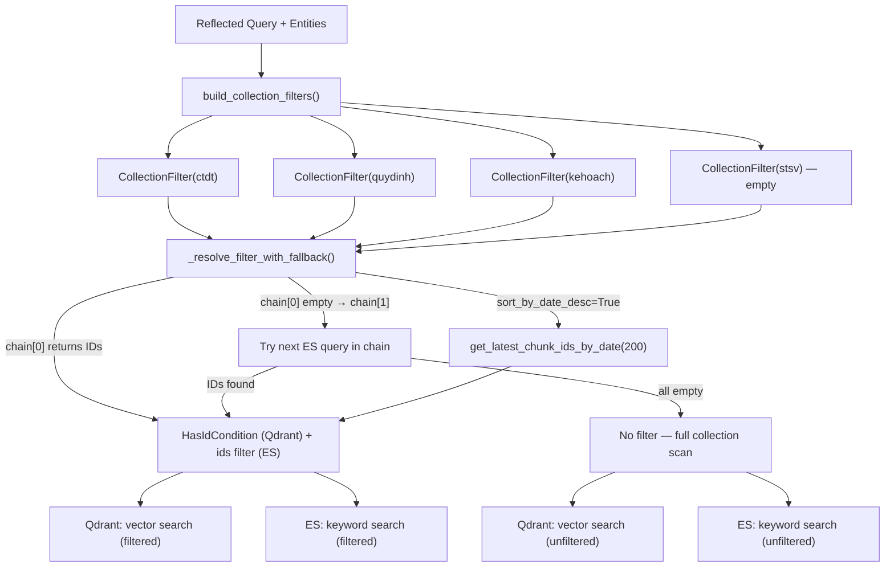
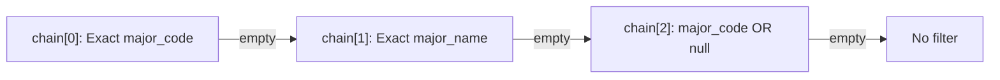
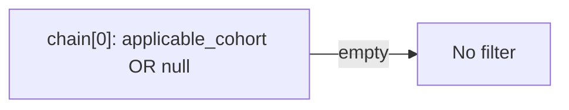
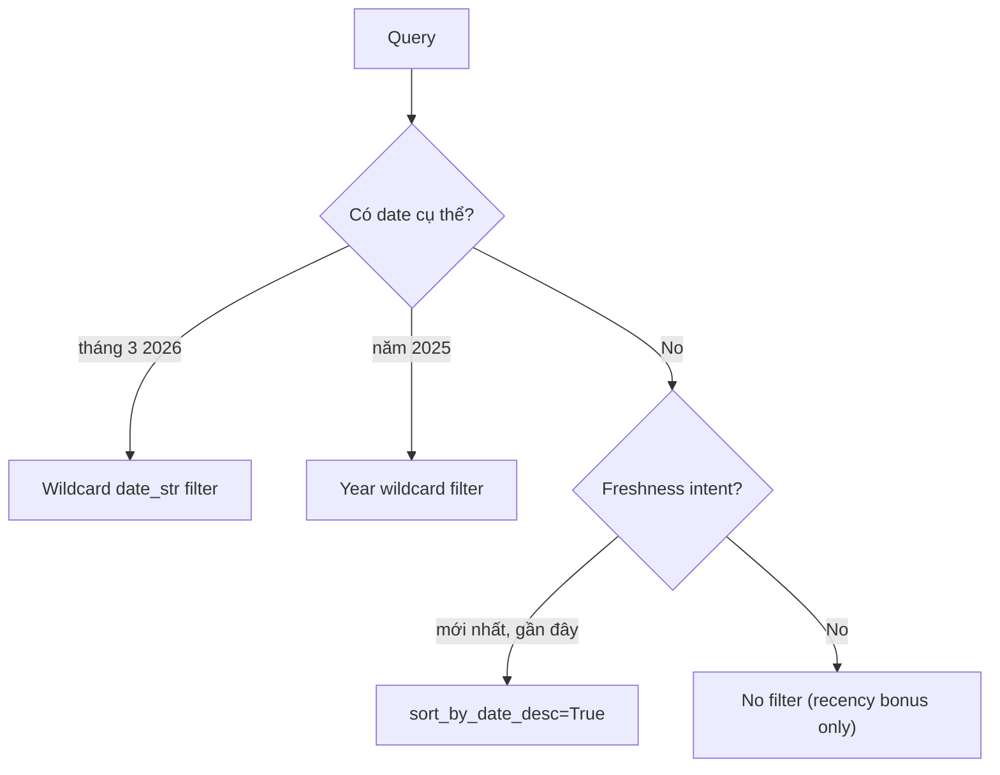
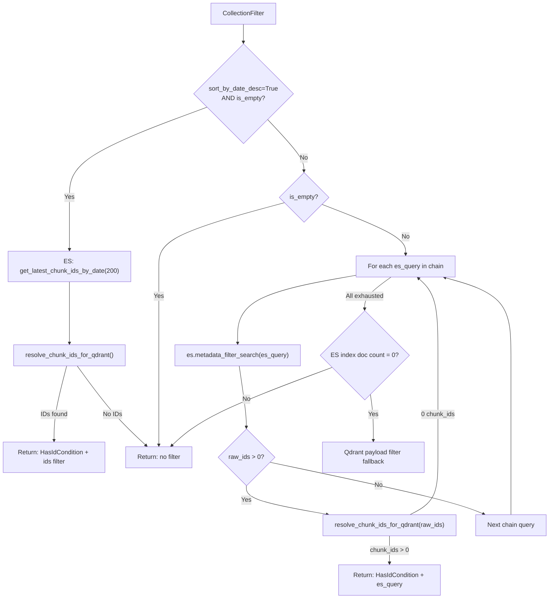
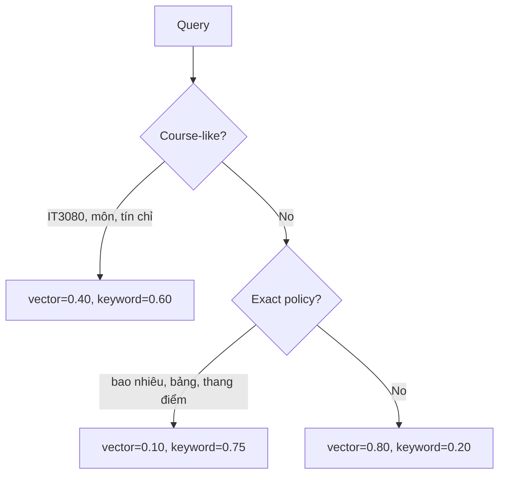

# CHI TIẾT HỆ THỐNG BỘ LỌC SIÊU DỮ LIỆU (METADATA FILTERS) — RAG V2

Tài liệu này mô tả chi tiết và đầy đủ toàn bộ cơ chế lọc siêu dữ liệu trước truy xuất (pre-retrieval metadata filtering), lọc từ khóa (keyword search), và lọc loại trừ (exclusion filter) trong hệ thống GR RAG v2.

> **Source files tham chiếu chính:**
> - [metadata_filters.py](file:///d:/GR/src/RAG_v2/retrieval/metadata_filters.py)
> - [multi_collection_search.py](file:///d:/GR/src/RAG_v2/retrieval/multi_collection_search.py)
> - [elasticsearch_store.py](file:///d:/GR/src/RAG_v2/retrieval/elasticsearch_store.py)
> - [structured_query.py](file:///d:/GR/src/RAG_v2/query/structured_query.py)
> - [signals.py](file:///d:/GR/src/RAG_v2/query/signals.py)

---

## 1. TỔNG QUAN KIẾN TRÚC PRE-FILTERING

### Mục đích
Pre-filtering thu hẹp không gian tìm kiếm **trước** khi chạy hybrid search (vector + BM25), giúp:
- Tránh trả về kết quả sai ngành/sai khóa khi query chỉ định ngành/khóa cụ thể.
- Đảm bảo freshness cho query hỏi "mới nhất" bằng cách khóa cứng IDs.
- Giảm noise khi vector search bị lẫn kết quả cross-domain.

### Luồng thực thi



---

## 2. CẤU TRÚC DỮ LIỆU — `CollectionFilter`

```python
@dataclass
class CollectionFilter:
    metadata_es_queries: List[Dict[str, Any]]  # Ordered fallback chain
    sort_by_date_desc: bool = False              # Freshness mode

    @property
    def is_empty(self) -> bool:
        return not self.metadata_es_queries
```

| Trạng thái | Ý nghĩa |
|:-----------|:--------|
| `is_empty=True, sort_by_date_desc=False` | Không pre-filter → full collection scan |
| `is_empty=True, sort_by_date_desc=True` | Freshness mode → fetch 200 IDs mới nhất |
| `is_empty=False` | Chạy fallback chain → first match wins |

---

## 3. CHI TIẾT BỘ LỌC TỪNG COLLECTION

### 3.1. `ctdt` — Chương trình đào tạo (`CtdtFilterExtractor`)

**Mục đích:** Lọc theo ngành học (major) để query "CTĐT ngành IT-E10" chỉ trả về tài liệu đúng ngành.

**Fallback chain (3 bậc → no filter):**



#### Chain[0] — Exact `major_code` Match
```json
{
  "bool": {
    "should": [
      {"term": {"major_code": "IT-E10"}},
      {"term": {"major_code.keyword": "IT-E10"}}
    ],
    "minimum_should_match": 1
  }
}
```
- Trường `major_code` là **keyword** field → exact match.
- Hỗ trợ cả direct field và `.keyword` subfield để tương thích nhiều mapping variants.
- **Dùng hàm:** `_term_any_mapping("major_code", major_code)`

#### Chain[1] — Exact `major_name` Match
```json
{
  "bool": {
    "should": [
      {"term": {"major_name": "Khoa học Dữ liệu và Trí tuệ Nhân tạo"}},
      {"term": {"major_name.keyword": "Khoa học Dữ liệu và Trí tuệ Nhân tạo"}}
    ],
    "minimum_should_match": 1
  }
}
```
- **KHÔNG** dùng fuzzy/analyzed match — chỉ exact term.
- Lý do: fuzzy match gây collision giữa các ngành tên gần giống nhau (ví dụ: *"Kỹ thuật điện"* vs *"Kỹ thuật điện tử"*, *"CNTT"* vs *"CNTT Việt Nhật"*).
- **Dùng hàm:** `_term_any_mapping("major_name", major_name)`
- `major_name` được resolve từ `MAJOR_CODE_TO_NAME` dictionary (70+ ngành).

#### Chain[2] — Generic Fallback (major OR null)
```json
{
  "bool": {
    "should": [
      {"bool": {"should": [
        {"term": {"major_code": "IT-E10"}},
        {"term": {"major_code.keyword": "IT-E10"}}
      ]}},
      {"bool": {"must_not": {"exists": {"field": "major_code"}}}}
    ],
    "minimum_should_match": 1
  }
}
```
- Match docs có đúng major_code **HOẶC** docs không có field `major_code` (quy định chung, không gắn nhãn ngành).
- **Dùng hàm:** `_null_or_term("major_code", major_code)`
- Mục đích: Bắt cả tài liệu quy định chung áp dụng cho tất cả ngành.

#### Chain[3] — No Filter (implicit)
- Nếu cả 3 chain trên đều trả 0 kết quả → search toàn bộ collection `ctdt`.

#### Major Code Resolution Priority
```
resolved_major (profile/history) → major_code direct lookup
    → canonicalize_major_name() → alias mapping
    → _MAJOR_NAME_TO_CODE reverse lookup
    → MAJOR_PATTERNS regex (80+ patterns)
    → _extract_major_code(query) — regex trên query text
    → None (no filter)
```

---

### 3.2. `quydinh` — Quy chế, quy định học vụ (`QuyDinhFilterExtractor`)

**Mục đích:** Lọc theo khóa sinh viên (cohort) để query "quy định K70" chỉ trả về quy chế áp dụng cho K70.

**Fallback chain (1 bậc → no filter):**



#### Chain[0] — Cohort Match OR Generic
```json
{
  "bool": {
    "should": [
      {"bool": {"should": [
        {"term": {"applicable_cohort": "K70"}},
        {"term": {"applicable_cohort.keyword": "K70"}}
      ]}},
      {"bool": {"must_not": {"exists": {"field": "applicable_cohort"}}}}
    ],
    "minimum_should_match": 1
  }
}
```
- Trường `applicable_cohort` lưu dạng **list** trong ES (ví dụ: `["K63", "K64", "K65"]`).
- ES `term` query tự nhiên match khi bất kỳ phần tử nào trong list khớp.
- Đồng thời bắt cả docs không có field `applicable_cohort` (quy định áp dụng cho tất cả khóa).
- **Dùng hàm:** `_null_or_terms("applicable_cohort", cohort_codes)`

#### Multi-cohort Support
- Nếu query chứa nhiều cohort (ví dụ: *"K70 và K67"*):
  ```json
  {"term": {"applicable_cohort": "K70"}},
  {"term": {"applicable_cohort": "K67"}},
  {"term": {"applicable_cohort.keyword": "K70"}},
  {"term": {"applicable_cohort.keyword": "K67"}}
  ```
- Tất cả nằm trong `should` → match any.

#### Cohort Resolution Priority
```
extract_cohort_codes(query)        — regex trên query text
    → _extract_cohort_codes_from_hint(resolved_cohort)  — từ profile
    → _extract_cohort_codes_from_hint(resolved_major)   — từ major context
    → empty → no filter
```

#### Cohort Regex Pattern
```python
_COHORT_RE = re.compile(
    r"\bk\s*(\d{2,3})\b|kh[oó]a\s*k?\s*(\d{2,3})",
    re.IGNORECASE,
)
```
Match: `K70`, `k 70`, `khóa 70`, `Khoa K65`, `k65` → normalize thành `K70`, `K65`.

---

### 3.3. `kehoach` — Kế hoạch, thông báo (`KeHoachFilterExtractor`)

**Mục đích:** Lọc theo thời gian (date) hoặc freshness intent để query thời sự trả kết quả mới nhất.

**Decision tree (3 nhánh):**



#### Nhánh 1 — Explicit Month+Year Date Filter
**Trigger:** *"lịch đăng ký tháng 3 2026"*, *"thông báo tháng 3/2026"*, *"3/2026"*

```json
{
  "bool": {
    "should": [
      {"wildcard": {"date_str": "*/3/2026"}},
      {"wildcard": {"date_str.keyword": "*/3/2026"}}
    ],
    "minimum_should_match": 1
  }
}
```
- Trường `date_str` lưu dạng `"D/M/YYYY"` (keyword field, ví dụ: `"11/3/2026"`).
- Wildcard `*/3/2026` match tất cả ngày trong tháng 3/2026.
- **Dùng hàm:** `_wildcard_any_mapping("date_str", f"*/{month}/{year}")`

**Date Regex:**
```python
# Month + year: "tháng 3 2026", "thang 3 nam 2026", "3/2026", "03/2026"
r"th[aá]ng\s*(\d{1,2})(?:\s+n[aă]m\s*|\s*/\s*)(\d{4})"
r"|(\d{1,2})\s*/\s*(20\d{2})"
```

#### Nhánh 2 — Year-Only Filter
**Trigger:** *"năm 2025"*, *"nam 2025"*, bare *"2025"*

```json
{
  "bool": {
    "should": [
      {"wildcard": {"date_str": "*/2025"}},
      {"wildcard": {"date_str.keyword": "*/2025"}}
    ],
    "minimum_should_match": 1
  }
}
```

**Quan trọng — School year exclusion:**
Trước khi parse date, hàm `_build_date_query` loại bỏ:
- Năm học compound: *"năm học 2025-2026"*, *"2025/2026"*, *"2025-2026"*
- Semester codes: *"20252"*, *"2025.1"*

→ Tránh nhầm *"năm học 2025-2026"* thành *"năm 2026"*.

#### Nhánh 3 — Freshness Sort (No Explicit Date)
**Trigger:** *"mới nhất"*, *"gần đây"*, *"hiện tại"*, *"học kỳ mới"*, *"thông báo mới"*, *"latest"*

**Freshness Intent Regex (áp dụng trên text đã bỏ dấu):**
```python
_FRESHNESS_INTENT_RE = re.compile(
    r"\b(?:moi\s+nhat|gan\s+day|hien\s+tai|"
    r"ky\s+nay|ki\s+nay|hoc\s+ky\s+moi|hoc\s+ki\s+moi|"
    r"hoc\s+ky\s+toi|hoc\s+ki\s+toi|thong\s+bao\s+moi|"
    r"latest|recent|newest|current\s+semester)\b",
    re.IGNORECASE,
)
```

**Execution flow khi `sort_by_date_desc=True`:**
1. Gọi `es.get_latest_chunk_ids_by_date(max_n=200)`.
2. ES fetch lên tới 1000 docs có trường `date_str`.
3. Parse `"D/M/YYYY"` bằng Python, sort descending.
4. Lấy top 200 `_id`.
5. Map sang Qdrant chunk IDs qua `resolve_chunk_ids_for_qdrant()`.
6. Áp dụng `HasIdCondition` (Qdrant) + `ids` filter (ES).

→ Đảm bảo chỉ top 200 tài liệu mới nhất được search.

#### Nhánh 4 — No Filter
- Không phát hiện date cụ thể, không có freshness intent.
- Hệ thống vẫn áp dụng **recency bonus** (+0.05 max) sau fusion.

---

### 3.4. `stsv` — Hỗ trợ sinh viên

**Không áp dụng pre-filter.** Collection `stsv` không có extractor trong registry:
```python
_COLLECTION_FILTER_REGISTRY = {
    "ctdt": CtdtFilterExtractor(),
    "quydinh": QuyDinhFilterExtractor(),
    "kehoach": KeHoachFilterExtractor(),
    # "stsv" intentionally omitted — no metadata filter defined
}
```
→ Tìm kiếm lai toàn diện trên toàn bộ collection.

---

### 3.5. Cross-collection Freshness Extension

Nếu query có freshness intent VÀ collection nằm trong `_DATE_STR_FRESHNESS_COLLECTIONS = {"kehoach", "quydinh"}` VÀ extractor trả về empty filter:

```python
if freshness_intent and col in _DATE_STR_FRESHNESS_COLLECTIONS and cf.is_empty:
    cf = CollectionFilter(sort_by_date_desc=True)
```

→ Collection `quydinh` cũng được freshness-sort khi user hỏi "quy định mới nhất" dù `QuyDinhFilterExtractor` chỉ lọc cohort.

---

## 4. CƠ CHẾ RESOLVE FILTER — FALLBACK CHAIN

### `_resolve_filter_with_fallback()` in `MultiCollectionSearch`



### ES Metadata Filter Search (`metadata_filter_search`)
```python
resp = self.client.search(
    index=self.index_name,
    size=1000,           # max 1000 IDs
    query={"bool": {"filter": [es_filter]}},
    source=False,        # chỉ lấy _id, không lấy document body
)
return [hit["_id"] for hit in resp["hits"]["hits"]]
```

### Qdrant Payload Filter Fallback
Khi ES index rỗng (doc count = 0) nhưng Qdrant có dữ liệu:
- Translate ES term queries sang Qdrant `FieldCondition`.
- Chỉ hỗ trợ exact term/terms cho các field: `major_code`, `applicable_cohort`, `applicable_major`, `date_str`, `course_code`.

---

## 5. BỘ LỌC KEYWORD SEARCH — TWO-PASS BM25

### 5.1. Pass 1 — Exact/Phrase Match (Primary)

```python
must = [{
    "multi_match": {
        "query": query,
        "fields": _KEYWORD_SEARCH_FIELDS,
        "type": "best_fields",
        "operator": "or",
    }
}]
```

**Keyword Search Fields (with boost weights):**

| Field | Boost | Loại | Mô tả |
|:------|:------|:-----|:------|
| `search_text` | `3.0` | text | Composite field = text + all metadata text |
| `title` | `2.0` | text+keyword | Tiêu đề chunk |
| `doc_title` | `1.8` | text+keyword | Tiêu đề văn bản gốc |
| `text` | `1.6` | text | Nội dung chunk |
| `hierarchy_path` | `1.5` | text+keyword | Đường dẫn cấu trúc |
| `section_h1` | `1.4` | text+keyword | Heading cấp 1 |
| `section_h2` | `1.4` | text+keyword | Heading cấp 2 |
| `section_h3` | `1.3` | text+keyword | Heading cấp 3 |
| `section_h4` | `1.1` | text+keyword | Heading cấp 4 |
| `course_name` | `1.8` | text+keyword | Tên môn học |
| `major_name` | `1.2` | text+keyword | Tên ngành |
| `semester` | `1.2` | text+keyword | Học kỳ |
| `section_context` | `1.0` | text+keyword | Context heading chain |
| `item_label` | `1.0` | keyword | Nhãn mục |

#### Key Phrase Boosting (`match_phrase`)
Hàm `extract_key_phrases(query)` trích các cụm từ khóa quan trọng từ query, sau đó tạo `match_phrase` clauses:

```python
for phrase in key_phrases:
    boost = 1.5 if _is_generic_policy_phrase(phrase) else (10.0 if idx < 3 else 5.0)
    for field, field_boost in [
        ("search_text", boost * 1.1),
        ("text", boost),
        ("title", boost * 0.8),
        ("doc_title", boost * 0.8),
        ("hierarchy_path", boost * 0.6),
        ("section_h1", boost * 0.6),
        ("section_h2", boost * 0.6),
        ("section_h3", boost * 0.5),
        ("section_h4", boost * 0.4),
    ]:
        should.append({"match_phrase": {field: {"query": phrase, "boost": field_boost}}})
```

**Generic policy phrases** (boost thấp `1.5` vì quá phổ biến):
`"diem ren luyen"`, `"tin chi"`, `"hoc phi"`, `"dieu kien"`, `"tot nghiep"`, `"hoc bong"`, `"quy dinh"`, `"chuong trinh dao tao"`, `"ctdt"`, `"hoc phan"`, `"mon hoc"`

**Non-generic phrases** (boost cao `10.0`/`5.0`):
Mọi cụm khác → ưu tiên cao vì chúng cụ thể hơn.

#### Course Code Exact Match
```python
if structured.course_codes:
    should.append({"terms": {"course_code": ["IT3080", "MI1110"], "boost": 8.0}})
```
- `course_code` là keyword field → không match qua free-text multi_match.
- Cần dedicated `terms` clause với boost `8.0`.

#### Vietnamese Segmented Query Boost
Khi ES không có CocCoc vi_tokenizer plugin:
```python
if segmented_query != query:
    should.append({
        "multi_match": {
            "query": segmented_query,
            "fields": _KEYWORD_SEARCH_FIELDS,
            "type": "best_fields",
            "boost": 1.5,
        }
    })
```

### 5.2. Pass 2 — Fuzzy Fallback

**Trigger conditions:**
```python
should_fallback = (
    (not exact_results)                                    # Không có kết quả exact
    or (not exact_mode and len(exact_results) < top_k)     # Ít hơn top_k (trừ exact_policy)
)
```

**Query:**
```python
fuzzy_must = [{
    "multi_match": {
        "query": query,
        "fields": _KEYWORD_SEARCH_FIELDS,
        "type": "best_fields",
        "fuzziness": "AUTO",    # Tự động: 0→3 chars=exact, 3→5=1 edit, 5+=2 edits
    }
}]
```

- `fuzziness: "AUTO"` — ES tự chọn edit distance dựa trên độ dài term:
  - 0-2 ký tự: exact match
  - 3-5 ký tự: 1 edit distance
  - >5 ký tự: 2 edit distances
- Giúp sửa lỗi chính tả: *"mạn máy tính"* → *"mạng máy tính"*

### 5.3. Merge Two Passes

```python
return self._merge_keyword_results(exact_results, fuzzy_results, top_k)
```
- Dedup by `_id`.
- Exact results luôn được ưu tiên (đứng trước).
- Fuzzy results bổ sung nếu chưa đủ `top_k`.

---

## 6. BỘ LỌC LOẠI TRỪ — STRUCTURED EXCLUSION

### 6.1. Negation Extraction (`structured_query.py`)

**Regex phát hiện phủ định tiếng Việt:**
```python
_NEGATION_RE = re.compile(
    r"\b(?:khong\s+(?:bao\s+gom|gom|tinh|lay|xet)|"
    r"ngoai\s+tru|loai\s+tru|tru)\s+(?P<term>[^,.;?!]+)",
    re.IGNORECASE,
)
```

**Trigger patterns:**
| Pattern | Ví dụ |
|:--------|:------|
| `không bao gồm X` | *"học bổng không bao gồm tín chỉ"* |
| `không gồm X` | *"quy định không gồm ngoại ngữ"* |
| `không tính X` | *"điểm không tính thể dục"* |
| `không lấy X` | *"danh sách không lấy kỳ hè"* |
| `không xét X` | *"xét tốt nghiệp không xét GDQP"* |
| `ngoại trừ X` | *"tất cả môn ngoại trừ thể dục"* |
| `loại trừ X` | *"loại trừ môn tự chọn"* |
| `trừ X` | *"trừ học phần tiên quyết"* |

### 6.2. Term Cleaning

```python
def _clean_exclude_term(raw: str) -> str:
    text = strip_diacritics(raw)           # Bỏ dấu
    text = _TERM_STOP_RE.split(text)[0]    # Cắt tại stop words
    text = re.sub(r"\s{2,}", " ", text)
    text = _LEADING_TERM_NOISE_RE.sub("", text)  # Bỏ "các", "những", "một"
    # Giới hạn 5 từ
```

### 6.3. ES must_not Clauses

```python
def build_es_must_not_clauses(exclude_terms: List[str]) -> List[Dict]:
    clauses = []
    for term in exclude_terms:
        for field in ("text", "title", "course_code"):
            clauses.append({"match_phrase": {field: term}})
    return clauses
```

### 6.4. Qdrant Post-filtering

Sau khi nhận kết quả vector từ Qdrant:
```python
if exclude_terms:
    all_vector = self._filter_excluded_results(all_vector, exclude_terms)
    all_keyword = self._filter_excluded_results(all_keyword, exclude_terms)
```
- Kiểm tra `text`, `title`, `course_code` fields trong payload.
- Loại bỏ docs chứa bất kỳ exclude term nào.

---

## 7. QUERY SIGNALS — ADAPTIVE FILTERING

### 7.1. Signal Types (`QuerySignals`)

| Signal | Patterns | Ảnh hưởng đến retrieval |
|:-------|:---------|:------------------------|
| `exact_policy_lookup` | *"bao nhiêu"*, *"mức nào"*, *"điểm rèn luyện"*, *"tín chỉ"*, *"học phí"* | `keyword_top_k` tăng lên max(`keyword_top_k`, 120), `keyword_pool_k` max(80) |
| `table_lookup` | *"bảng"*, *"khung"*, *"phụ lục"*, *"thang điểm"*, *"quy đổi"*, *"xếp loại"* | Giống `exact_policy_lookup` + `_keyword_table_lookup_hit` pinning |
| `procedural_support` | *"chưa nhận"*, *"xác nhận"*, *"biểu mẫu"*, *"khiếu nại"* | `_ensure_collection_evidence("stsv")` — đảm bảo có docs stsv |
| `freshness` | *"mới nhất"*, *"gần đây"*, *"hôm nay"*, *"sắp tới"* | Freshness sort / Tavily trigger |
| `schedule_intent` | *"lịch thi"*, *"lịch đăng ký"*, *"thời khóa biểu"*, *"đợt mở lớp"* | Kehoach route lock |
| `curriculum_semester_intent` | *"môn X học kỳ mấy"* | Route to ctdt (not kehoach) |
| `multi_domain` | eligibility + program, procedural + exact, graduation_rule | Tier-2 LLM judge activation |

### 7.2. Adaptive Fusion Weight Override



**Course-like detection:**
```python
_COURSE_CODE_RE = re.compile(
    r"\b(?:IT|MI|EE|ET|ME|CH|PH|MA|TL|FL|PE|ED)\d{4}[A-Z]?\b",
    re.IGNORECASE,
)
_KEYWORD_BIAS_HINTS = (
    "môn ", "môn học", "mon ", "học phần", "hoc phan",
    "tín chỉ", "tin chi", "tiên quyết", "tien quyet",
    "song hành", "song hanh", "khối lượng", "khoi luong",
)
```

**Exact policy mode (stacks with course bias):**
```python
if exact_policy_mode and mode != "rrf":
    fusion_vector_weight = min(fusion_vector_weight, 0.1)
    fusion_keyword_weight = max(fusion_keyword_weight, 0.75)
```

---

## 8. ELASTICSEARCH INDEX SCHEMA

### 8.1. Text Fields (analyzed, dùng cho BM25 scoring)

| Field | Analyzer | Keyword subfield | BM25 Similarity |
|:------|:---------|:-----------------|:----------------|
| `search_text` | `vietnamese_analyzer` | ✗ | `k1=1.5, b=0.5` |
| `text` | `vietnamese_analyzer` | ✗ | `k1=1.5, b=0.5` |
| `title` | `vietnamese_analyzer` | ✓ | `k1=1.5, b=0.5` |
| `doc_title` | `vietnamese_analyzer` | ✓ | `k1=1.5, b=0.5` |
| `hierarchy_path` | `vietnamese_analyzer` | ✓ | `k1=1.5, b=0.5` |
| `section_h1`–`h4` | `vietnamese_analyzer` | ✓ | `k1=1.5, b=0.5` |
| `course_name` | `vietnamese_analyzer` | ✓ | `k1=1.5, b=0.5` |
| `major_name` | `vietnamese_analyzer` | ✓ | `k1=1.5, b=0.5` |
| `semester` | `vietnamese_analyzer` | ✓ | `k1=1.5, b=0.5` |
| `section_context` | `vietnamese_analyzer` | ✓ | `k1=1.5, b=0.5` |

### 8.2. Keyword Fields (exact match, dùng cho metadata filtering)

| Field | Type | Mô tả |
|:------|:-----|:------|
| `major_code` | keyword | Mã ngành (IT-E10, ME1, …) |
| `applicable_cohort` | keyword | Khóa áp dụng (K70, K65, …) — list-valued |
| `applicable_major` | keyword | Ngành áp dụng |
| `date_str` | keyword | Ngày đăng (D/M/YYYY) |
| `course_code` | keyword | Mã môn (IT3080, MI1110, …) |
| `document_type` | keyword | Loại văn bản |
| `type_doc` | keyword | Loại doc |
| `level` | keyword | `"child"` / `"parent"` |
| `chunk_id` | keyword | ID chunk |
| `parent_id` | keyword | ID parent chunk |
| `collection` | keyword | Tên collection |
| `source_file` | keyword | Tên file gốc |
| `readable_id` | keyword | Human-readable ID |
| `item_label` | keyword | Nhãn mục |

### 8.3. Boolean Fields

| Field | Mô tả |
|:------|:------|
| `has_table` | Doc chứa bảng biểu |
| `has_links` | Doc chứa hyperlinks |

### 8.4. Vietnamese Analyzer Pipeline

```
[Input text]
    → vi_tokenizer (CocCoc plugin) / standard (fallback)
    → lowercase
    → vietnamese_synonym (CTDT↔chương trình đào tạo, TC↔tín chỉ, ...)
    → vietnamese_stop (và, hoặc, của, trong, ...)
    → vietnamese_ascii_folding (preserve_original=True)
```

**Vietnamese Synonyms (built-in):**
```
CTDT ↔ ctdt ↔ chương trình đào tạo
SV ↔ sv ↔ sinh viên
TC ↔ tc ↔ tín chỉ ↔ tin chi
GPA ↔ gpa ↔ điểm trung bình tích lũy
KLTN ↔ kltn ↔ khóa luận tốt nghiệp
ĐRL ↔ đrl ↔ drl ↔ điểm rèn luyện
... (15 synonym groups)
```

---

## 9. KEYWORD PINNING & TABLE BOOST

### 9.1. Keyword Table Lookup Hit Pinning

Khi `exact_policy_mode=True`:
```python
keyword_pool, pinned_count = self._pin_keyword_hits(all_keyword, keyword_pool, k)
```
- Docs có metadata `_keyword_table_lookup_hit=True` được **ghim cứng** vào keyword pool.
- Đảm bảo docs chứa bảng biểu chính xác không bị loại dù BM25 score thấp (do tài liệu ngắn).

### 9.2. Parent Chunk Exclusion

Mọi search (cả vector lẫn keyword) đều loại trừ parent chunks:
```python
# Qdrant
must_not = [FieldCondition(key="level", match=MatchValue(value="parent"))]

# ES
must_not_clauses.append({"term": {"level": "parent"}})
```
→ Chỉ search trên child chunks. Parent chunks được fetch sau tại bước Parent Context Expansion (C5).

---

## 10. MAJOR ENRICHMENT & STRIPPING

### 10.1. Major Stripping for Retrieval
**Khi nào:** Sau khi đã resolve major_code → metadata filter đã được áp dụng.

```
"môn mạng máy tính của ngành IT-E7"
    → metadata filter: major_code=IT-E7
    → retrieval query: "môn mạng máy tính"
```

**Logic:** Loại bỏ tất cả labels/aliases của major khỏi query text:
```python
phrase_patterns = [
    r"\b(?:trong|thuộc|cho|của)\s+ngành\s+(?:{labels})\b",
    r"\bngành\s+(?:{labels})\b",
    r"\bchuyên\s+ngành\s+(?:{labels})\b",
    r"\bchương\s+trình(?:\s+đào\s+tạo)?(?:\s+ngành)?\s+(?:{labels})\b",
    r"\((?:{labels})\)",
    r"\b(?:{labels})\b",
]
```

**Safety:** Nếu stripped query < 2 từ hoặc chỉ còn generic words → giữ query gốc.

### 10.2. Major Enrichment for Reranking
```
"CTĐT IT1" → "CTĐT CNTT: Khoa học Máy tính"
```
- Replace major codes bằng full names → reranker (cross-encoder) đánh score tốt hơn vì nó trained trên general text.

### 10.3. Major Enrichment for Retrieval Query
```
"IT1" → "IT1 (CNTT: Khoa học Máy tính)"
"Khoa học máy tính" → "Khoa học máy tính (IT1)"
```
- Append code/name pairs → cải thiện cả vector lẫn keyword recall.
- Có negative lookahead cho course titles: *"Hóa học 1"*, *"Vật lý đại cương"* KHÔNG bị enrich thành major.

---

## 11. COMPARISON DECOMPOSITION

### 11.1. Major Comparison
**Trigger:** ≥2 major codes + comparison hint (*"so sánh"*, *"khác nhau"*, *"đối chiếu"*)

```
"môn lập trình mạng của ngành IT-E7 và IT-E6 có gì khác nhau"
→ [
    ("môn lập trình mạng của ngành IT-E7", "IT-E7"),
    ("môn lập trình mạng của ngành IT-E6", "IT-E6"),
  ]
```
- Mỗi sub-query search riêng với major filter riêng → merge kết quả.
- `max_subqueries = 3`

### 11.2. Cohort Comparison
**Trigger:** ≥2 cohort codes + comparison hint

```
"so sánh quy định ngoại ngữ của K70 và K67"
→ ["quy định ngoại ngữ cho K70", "quy định ngoại ngữ cho K67"]
```
- `max_subqueries = 3`

### 11.3. Scaffold Stripping
Comparison decomposition tạo rerank query bằng cách strip comparison scaffold:
```python
cleaned = _COMPARE_HINT_RE.sub(" ", raw_query)     # Bỏ "so sánh", "khác nhau"
cleaned = _COHORT_MENTION_RE.sub(" ", cleaned)       # Bỏ "K70", "K67"
cleaned = _COMPARE_CONNECTOR_RE.sub(" ", cleaned)   # Bỏ "giữa", "và", "với"
```
→ Reranker đánh giá trên topic thuần (ví dụ: *"quy định ngoại ngữ"*) → công bằng hơn.

---

## 12. BẢNG TỔNG HỢP TẤT CẢ ES QUERY TYPES ĐƯỢC SỬ DỤNG

| Query Type | Hàm tạo | Trường áp dụng | Mô tả |
|:-----------|:---------|:---------------|:------|
| `term` | `_term_any_mapping()` | `major_code`, `major_name`, `applicable_cohort` | Exact match (cả field và .keyword) |
| `terms` | `_term_any_mapping_multi()` | `applicable_cohort` | Multi-value exact match |
| `wildcard` | `_wildcard_any_mapping()` | `date_str` | Pattern match (*"*/3/2026"*) |
| `exists` / `must_not exists` | `_null_clause()` | `major_code`, `applicable_cohort` | Docs không có field (generic docs) |
| `term OR null` | `_null_or_term()` | `major_code` | Exact match HOẶC field absent |
| `terms OR null` | `_null_or_terms()` | `applicable_cohort` | Multi-value exact OR absent |
| `multi_match` | inline | `_KEYWORD_SEARCH_FIELDS` | BM25 free-text search |
| `match_phrase` | inline | `text`, `title`, `search_text`, … | Exact phrase boost |
| `multi_match + fuzziness` | inline | `_KEYWORD_SEARCH_FIELDS` | Fuzzy fallback search |
| `ids` | inline | — | Filter by document IDs (freshness) |
| `bool.must_not.match_phrase` | `build_es_must_not_clauses()` | `text`, `title`, `course_code` | Negation exclusion |
| `bool.must_not.term` | inline | `level` | Exclude parent chunks |
