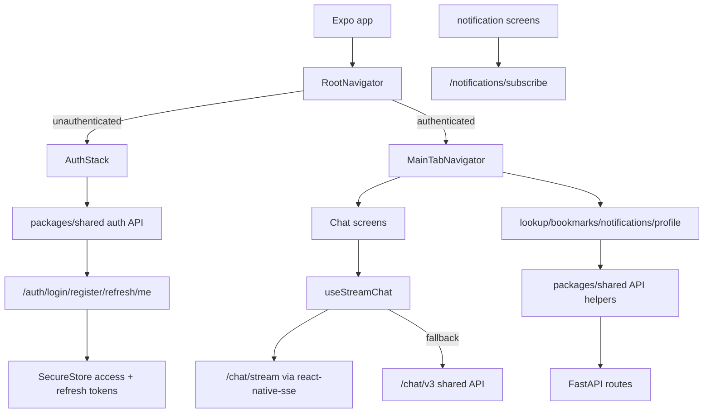

# Module: `mobile`

Source-verified: 2026-06-02 from `mobile/src/**`, `mobile/package.json`, `packages/shared`, and mobile API contract queries.

## Purpose

`mobile` is the Expo/React Native app. It uses the shared TypeScript package for API clients/types/stores and adds native mobile UX for chat, lookup, bookmarks, notifications, and profile.

## Stack

- Expo SDK 54
- React Native 0.81
- React 19
- React Navigation bottom tabs/native stacks
- TanStack Query
- Zustand
- SecureStore for token storage
- MMKV for non-sensitive offline cache when native runtime supports it
- `react-native-sse` for `/chat/stream`
- NativeWind/Tailwind-style styling

## Source Map

```text
mobile/src/
  navigation/       Root auth/main navigation, tabs, nested stacks.
  screens/          Auth, chat, session list, lookup, bookmarks, notifications, profile.
  components/chat/  Chat input, bubbles, markdown, actions, sources bottom sheet.
  components/common/ Empty/loading/network/error UI.
  hooks/            Auth/profile/streaming hooks.
  services/         Axios client, SecureStore, offline cache.
  stores/           Mobile auth/chat store wrappers.
  utils/            Constants and API base URL resolution.
```

## Navigation

`RootNavigator` switches between:

- `AuthStack`
- `MainTabNavigator`

Main tabs:

- Chat
- Lookup
- Bookmarks
- Notifications
- Profile

Nested stacks hide the tab bar on detail/edit/chat screens where needed.

## API Contract

`mobile/src/services/api.ts` creates the app Axios client with token injection
from the mobile auth store and a single-flight refresh flow. On a 401 response,
the client posts the SecureStore refresh token to `/auth/refresh`, stores the
rotated tokens, and retries the original request once.

`mobile/src/hooks/useStreamChat.ts` ensures an access token is available before
opening the stream. If auth fails before the first token, it refreshes and
retries the stream once before falling back.

It sends POST requests to:

```text
/chat/stream
```

and uses native EventSource events. If streaming fails before the first token, UI code can fall back to non-streaming `/chat/v3` through shared API helpers.

`EXPO_PUBLIC_API_BASE_URL` is the preferred mobile API base. Fallback defaults are handled in `mobile/src/utils/constants.ts`.

Notifications use authenticated `/notifications*` routes and Expo push
subscriptions through `/notifications/subscribe` and
`/notifications/unsubscribe`. The backend stores Expo push tokens in
`notification_subscriptions` and sends push messages best-effort.

## Module Flow



External module boundaries:

- Mobile owns native navigation/storage/UX; API paths, normalized types, and store factories come from `packages/shared`.
- Backend refresh-token rotation is authoritative; failed refresh clears SecureStore/auth state.
- Streaming metadata and fallback responses must remain compatible with `schemas/chat.py` and shared normalizers.

## Storage

- Sensitive access and refresh tokens: SecureStore.
- Non-sensitive offline cache: MMKV when available.
- Expo Go can fall back to in-memory cache because MMKV/NitroModules require a native build/dev client.

## Maintenance Notes

- Mobile login/register follow-up calls must send `client_type="mobile"` to
  receive the JSON refresh token.
- On restore, validate the stored access token first, then refresh with the
  stored refresh token before clearing auth.
- On refresh failure or refresh-token reuse/expiry, clear SecureStore and auth
  state.
- Keep `@rag/shared` types and API paths aligned with backend contracts.
- Avoid storing sensitive data in MMKV/offline cache.

## Useful Checks

```bash
npm run typecheck --workspace=mobile
npm run start --workspace=mobile
```
