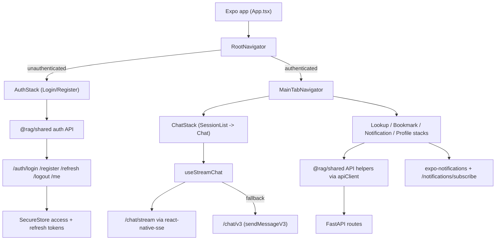

# Module: `mobile`

Source-verified: 2026-06-05 from `mobile/App.tsx`, `mobile/index.ts`, `mobile/package.json`, `mobile/app.json`, `mobile/babel.config.js`, `mobile/tailwind.config.ts`, and `mobile/src/**` (navigation, screens, components, hooks, services, stores, theme, utils).

## Purpose

`mobile` is the Expo/React Native app. It consumes the shared `@rag/shared` TypeScript package for API clients, types, and store factories, and adds native mobile UX for chat, lookup, bookmarks, notifications, and profile.

## Stack

- Expo SDK ~54 (`newArchEnabled`), React Native 0.81, React 19
- React Navigation: native-stack + bottom-tabs
- TanStack Query (`QueryClientProvider` in `App.tsx`)
- Zustand stores via `@rag/shared` factories
- `expo-secure-store` for tokens/profile; `react-native-mmkv` for non-sensitive offline cache
- `react-native-sse` for `/chat/stream`; Axios (via `@rag/shared` `createApiClient`) for REST
- `expo-notifications` for Expo push; `expo-haptics`; `react-native-toast-message`
- Styling: React Native `StyleSheet` + a custom theme context (`src/theme/theme.tsx`). NativeWind is not used: there is no `className` styling, no `nativewind` dependency, and no Tailwind config (the previously-inert `tailwind.config.ts` has been removed).

## File Map

```text
mobile/
  App.tsx              Root component: providers (GestureHandler, SafeArea, Query, Theme), ErrorBoundary, NetworkBanner, Toast, RootNavigator.
  index.ts             registerRootComponent(App) entry point.
  app.json             Expo config (icons, splash, plugins: expo-secure-store, expo-notifications).
  package.json         Dependencies/scripts (start, android, ios, web, typecheck).
  babel.config.js      babel-preset-expo + react-native-worklets plugin.
  tsconfig.json        TypeScript config.
  .env.example         Documents EXPO_PUBLIC_API_BASE_URL.
  MOBILE_PLAN.md       Planning notes (non-runtime).
  assets/              App icon, adaptive icon, splash, favicon.
  src/
    navigation/        RootNavigator (auth gate), MainTabNavigator, and 5 native stacks (Auth/Chat/Lookup/Bookmark/Notification/Profile).
    screens/           auth (Login/Register), chat (SessionList/Chat), lookup, bookmarks (List/Detail), notifications (List/Detail), profile (Profile/EditProfile).
    components/chat/    ChatInput, MessageBubble, MessageActions, MarkdownDisplay, StreamingText, TypingIndicator, SourceBottomSheet.
    components/common/  ErrorBoundary, EmptyState, LoadingSpinner, NetworkBanner.
    hooks/             useAuth, useProfile, useStreamChat.
    services/          api (Axios client + refresh), secureStorage (SecureStore), offlineCache (MMKV/in-memory), pushNotifications (Expo push).
    stores/            authStore, chatStore — Zustand stores from @rag/shared factories with mobile persistence.
    theme/             theme.tsx — theme context, colors, light/dark, navigation theme.
    utils/             constants (API_BASE_URL resolution), haptics.
```

## Navigation

`RootNavigator` reads `useAuth()`; it shows a loading spinner while restoring the
session, then renders `AuthStack` (unauthenticated) or `MainTabNavigator`
(authenticated) inside a `NavigationContainer`.

`MainTabNavigator` bottom tabs (labels are Vietnamese):

- `ChatTab` → `ChatStack` (Chat)
- `LookupTab` → `LookupStack` (Tra cứu)
- `BookmarkTab` → `BookmarkStack` (Đã lưu)
- `NotificationTab` → `NotificationStack` (Thông báo) — shows an unread badge from `getUnreadCount`
- `ProfileTab` → `ProfileStack` (Hồ sơ)

Each tab is a `createNativeStackNavigator`. The tab bar is hidden on focused
detail screens via `getFocusedRouteNameFromRoute` (e.g. `Chat` inside ChatTab,
`EditProfile` inside ProfileTab). `ChatStack` uses `SessionList` as its initial
route and `Chat` as the detail route (`{ sessionId? }`). `AuthStack` is
Login → Register.

## API Contract

`mobile/src/services/api.ts` builds `apiClient` via `@rag/shared` `createApiClient`
(base URL + `getToken` from SecureStore). A response interceptor handles 401s with
a single-flight `refreshAccessToken`: it POSTs the SecureStore refresh token to
`/auth/refresh` with `client_type: 'mobile'`, persists rotated tokens, updates the
auth store, and retries the original request once. If refresh fails, or the failing
request was itself `/auth/refresh`, it clears SecureStore + auth state.

`mobile/src/hooks/useAuth.ts` restores sessions on boot: validate access token via
`getMe`, fall back to cached profile on network error, else `refreshAccessToken`,
else clear auth. `login` calls shared `loginUser` with `client_type: 'mobile'`;
`logout` POSTs `/auth/logout` (best-effort) then clears.

`mobile/src/hooks/useStreamChat.ts` opens `POST /chat/stream` with `react-native-sse`,
attaching a bearer token (refreshing first if missing). It parses typed SSE events
(`session` / `token` / `metadata` / `done` / `error`) and normalizes metadata via
shared `normalizeV3Response`. Before the first token, an auth/connection error
triggers one `refreshAccessToken` + stream retry, then falls back to non-streaming
`sendMessageV3` (`/chat/v3`).

`EXPO_PUBLIC_API_BASE_URL` is the preferred base URL. `mobile/src/utils/constants.ts`
falls back to `http://10.0.2.2:8000` (Android) or `http://localhost:8000` otherwise.

Notifications use authenticated `/notifications*` routes plus Expo push registration.
`src/services/pushNotifications.ts` registers a device (Android channel, permission
prompt, `getExpoPushTokenAsync` with EAS project id), caches the token/enabled flag,
and is unsupported on web and Android Expo Go (`PushNotificationsUnavailableError`).

## Module Flow



External module boundaries:

- Mobile owns native navigation/storage/UX/theme; API paths, normalized types, and
  store factories come from `@rag/shared`.
- Backend refresh-token rotation is authoritative; failed refresh clears
  SecureStore/auth state.
- Streaming metadata and fallback responses must stay compatible with the backend
  chat schemas and shared normalizers.

## Storage

- Sensitive access/refresh tokens and the user profile: `expo-secure-store`
  (`src/services/secureStorage.ts`).
- Non-sensitive offline cache: `react-native-mmkv` (`src/services/offlineCache.ts`),
  with cache keys for bookmarks/sessions/suggestions and push-token state.
- In Expo Go (`StoreClient`), MMKV is skipped and an in-memory `Map` cache is used;
  MMKV creation failures also fall back to in-memory.

## Maintenance Notes

- Mobile login/register/refresh/logout calls must send `client_type: 'mobile'` to
  receive the JSON refresh token.
- On restore, validate the stored access token first, then refresh before clearing
  auth; keep the cached profile on offline (no-response) errors.
- On refresh failure or refresh-token reuse/expiry, clear SecureStore and auth state.
- Keep `@rag/shared` types and API paths aligned with backend contracts.
- Avoid storing sensitive data in MMKV/offline cache.
- Styling is StyleSheet + theme context only. If Tailwind/NativeWind styling is
  desired later, install `nativewind`, add a `tailwind.config.js`, and wire its
  babel plugin.

## Useful Checks

```bash
npm run typecheck --workspace=mobile
npm run start --workspace=mobile
```
