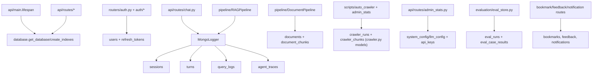

# Module: `models`

Source-verified: 2026-06-05 from `models/__init__.py`, `models/database.py`, `models/mongo_logger.py`, `models/user.py`, `models/document.py`, `models/document_chunk.py`, `models/crawler.py`, `models/system_config.py`, plus consumer usage in `api/routes/*.py`, `pipeline/*.py`, `auth/*.py`, `routers/auth.py`, `scripts/auto_crawler.py`, and `evaluation/eval_store.py`.

## Purpose

`models` owns MongoDB access, durable chat logging, user/document/crawler Pydantic models, and admin upload + crawler review document shapes. It is the persistence boundary for FastAPI routes and pipeline logging.

There are two MongoDB access styles:

- Async Motor access in `database.py` for FastAPI dependencies/routes (and `system_config.py` helpers).
- Sync PyMongo logging in `mongo_logger.py` for sessions, turns, query logs, agent traces, and eval index bootstrap.

## File Map

```text
models/
  __init__.py        Empty package marker.
  database.py        Motor singleton, async get_database dependency, collection name constants, create_indexes().
  mongo_logger.py    Sync MongoLogger for sessions/turns/query_logs/agent_traces (+ eval index bootstrap).
  user.py            PyObjectId helper and UserDocument model.
  document.py        DocumentRecord and embedded AuditEntry for the admin upload pipeline.
  document_chunk.py  DocumentChunk review/indexing model.
  crawler.py         CrawlerRun and CrawlerChunk staged-review models + status constants.
  system_config.py   Single-document Mongo LLM config overrides and managed API key registry helpers.
```

## Mongo Collections

Name constants live in `database.py`. Main collections:

| Collection | Owner | Purpose |
| --- | --- | --- |
| `users` | `auth/*`, `routers/auth.py` | Accounts, role, profile, HUST metadata. |
| `refresh_tokens` | `auth/refresh_tokens.py`, `routers/auth.py` | Hashed refresh-token sessions, rotation families, TTL expiry. |
| `sessions` | `MongoLogger`, `api/routes/session.py` | Chat session metadata. |
| `turns` | `MongoLogger` | User/assistant turns with sources/routing/debug metadata. |
| `query_logs` | `MongoLogger` | Flat analytics log per turn. |
| `agent_traces` | `MongoLogger` | LangGraph/agent traces. |
| `eval_runs` | `evaluation/eval_store.py` (indexed in `database.py` + `MongoLogger`) | Evaluation run summaries. |
| `eval_case_results` | `evaluation/eval_store.py` (indexed in `database.py` + `MongoLogger`) | Per-case evaluation results. |
| `documents` | `pipeline/document_pipeline.py`, `api/routes/upload.py` | Admin-uploaded document records. |
| `document_chunks` | `pipeline/document_pipeline.py`, `api/routes/upload.py` | Reviewable chunks before/after indexing. |
| `bookmarks` | `api/routes/bookmark.py` | Saved answer snapshots. |
| `bookmark_folders` | `api/routes/bookmark.py` | User bookmark folders. |
| `feedback` | `api/routes/feedback.py` | Answer ratings/comments. |
| `notifications` | `api/routes/notification.py` | User notification inbox. |
| `notification_subscriptions` | `api/routes/notification.py` | Expo push token/topic subscriptions. |
| `system_config` | `models/system_config.py`, `api/routes/admin_stats.py` | Fixed `_id=llm_config` overrides + `api_keys` registry. |
| `crawler_runs` | `models/crawler.py`, `scripts/auto_crawler.py`, `api/routes/admin_stats.py` | Staged crawler run review metadata. |
| `crawler_chunks` | `models/crawler.py`, `scripts/auto_crawler.py`, `api/routes/admin_stats.py` | Reviewable/editable crawler chunk content + per-chunk index status. |

## `database.py`

Responsibilities:

- Read Mongo URI/database from `MONGODB_URI` / `MONGODB_DATABASE` env vars (defaults `mongodb://localhost:27017`, `rag_chatbot`).
- Keep a process-wide `AsyncIOMotorClient` singleton (`get_motor_client`); `close_motor_client()` on shutdown.
- Provide `get_database()` FastAPI dependency yielding the database handle.
- Export collection-name constants used throughout the codebase.
- `create_indexes()` builds indexes for users (sparse-unique email/microsoft_id/username), sessions, turns, query_logs, eval collections, documents, document_chunks, mobile collections (bookmarks/feedback/notifications/subscriptions), refresh_tokens (incl. TTL on `expires_at`), and crawler review collections. Each index is created via a `safe_create` helper that warns instead of aborting on `OperationFailure` code 85; stale user indexes are dropped first via `drop_if_exists`.

Use this module for async route-level DB work.

## `system_config.py`

Async helpers over the single `system_config/llm_config` document.

- `PERSISTABLE_LLM_FIELDS` whitelists model/tuning fields: `llm_provider`, `chat_model`, `chat_temperature`, `chat_max_tokens`, `agent_model`, `reflection_model`. `filter_llm_config_updates` drops anything else and empty strings.
- `get_llm_config` / `upsert_llm_config` read/upsert the document; `merge_llm_config_into_settings` applies non-empty DB values onto a `Settings`-like object at startup.
- Managed API keys are stored as a list under `api_keys` (providers `deepseek`, `google`, `tavily`). Helpers: `list_api_keys`, `create_api_key`, `activate_api_key`, `get_api_key_record`, `public_api_key_record`, `fingerprint_api_key`. Legacy per-field secrets (`deepseek_api_key`, etc.) are migrated into the registry on read. Public responses expose `fingerprint` + `status`, never raw secrets. Invalid mutations raise `ApiKeyRegistryError`.

## `mongo_logger.py`

Sync `MongoLogger(uri, database, history_cache=None)` over its own `MongoClient`. Ensures indexes for `sessions`, `turns`, `query_logs`, `agent_traces`, `eval_runs`, `eval_case_results` on init.

Public API:

- `new_session(user_id=None)` / `get_session(session_id)` / `list_sessions(user_id, limit=50)`
- `delete_session(session_id)` (cascades turns/query_logs/agent_traces + cached history)
- `update_session_title(session_id, title)`
- `log_turn(session_id, question, result, *, reflected_question=None, latency_ms=0, timings_ms=None)` → 1-based `turn_id`
- `get_turns(session_id, limit=100)` / `get_history(session_id, max_turns=10)`
- `log_agent_trace(session_id, trace_dict)` (best-effort) / `get_agent_stats(limit=100)`

`log_turn()` atomically increments `turn_count`, auto-titles from the first question, writes a turn doc and a flat query_log, and persists optional fields when present: `sources`, `collection_scores`, `target_collections`, `mode`, `route`, `iterations`, `tools_used`, `tool_calls`, `agent_error`, `error`, `agent_trace`, `routing_probabilities`, `applied_filters`, `collection_results`, plus debug fields (`context_trace`, `rerank_trace`, `answer_quality_gate`, `fusion_weights`, `answer_status`, and hashed/previewed `llm_prompt`/`reflection_prompt`). It also syncs the attached history cache.

## User Model

`UserDocument` (Pydantic v2, `populate_by_name`, `id` aliases `_id`) holds auth/profile fields used across auth, chat, and mobile:

- Identity: `id`, `microsoft_id`, `username`, `password_hash`
- Contact: `email` (all of the above Optional)
- Profile: `full_name`, `student_id`, `cohort`, `major` (default `"CNTT Việt Nhật"`), `major_code`, `avatar_url`
- Role/status: `role` (`student | admin`), `is_profile_complete`, `is_active`
- Timestamps (UTC): `created_at`, `updated_at`, `last_login_at`

`PyObjectId` is a `str` subclass validating/serialising ObjectIds (Pydantic v1 `__get_validators__` shim + v2 core schema).

## Document Models

`DocumentRecord` tracks the admin upload lifecycle:

```text
uploaded -> converting -> converted -> cleaning -> cleaned
-> chunking -> chunked -> embedding -> indexed   (or failed)
```

Key fields: `filename`, `file_size`, `file_path`, `collection` (`ctdt | quydinh | kehoach | stsv`), `status`, `uploaded_by`, `uploaded_at`, artifact paths (`markdown_path`, `cleaned_path`), `chunk_count`/`chunk_ids`/`chunking_strategy`, `converter` (`pymupdf4llm | docling`), review flags (`markdown_reviewed`, `cleaned_reviewed`, `chunks_reviewed`), `metadata_overrides`, `error_message`, step timestamps, and `audit_log` (list of `AuditEntry`: `action`, `user_id`, `timestamp`, `details`). `from_mongo` builds from a raw dict.

`DocumentChunk` stores `document_id` (FK to documents), `chunk_index`, `content`, `metadata`. Embedding vectors are NOT stored here (they live in Qdrant/ES only).

## Crawler Models

`crawler.py` defines staged crawler-review models with status constants `pending_review`, `indexing`, `indexed`, `index_failed` (plus `CRAWLER_EDITABLE_STATUSES` / `CRAWLER_INDEXABLE_STATUSES` sets).

`CrawlerRun`: `id`, `run_id`, `pipeline`, `collection`, `status` (default `pending_review`), `source_label`, `output_file`, `chunks_file`, counters (`new_articles`, `new_chunks`, `indexed`, `expired_removed`), timestamps (`created_at`, `updated_at`, `indexed_at`), `error_message`, `summary` dict.

`CrawlerChunk`: `id`, `run_id`, `chunk_id`, `chunk_index`, `content`, `original_content`, `metadata`, `edited` flag, `index_status` (default `pending`), timestamps. Both expose `from_mongo`.

## Module Flow



External module boundaries:

- Async route-level reads/writes use `database.py`; sync durable chat/session logging uses `MongoLogger`.
- `models` define persistence shape but should not own chat routing, retrieval, generation, or frontend normalization.
- Schema-facing changes must update `schemas`, `api` routes, web/mobile/shared TypeScript types, and tests.

## Maintenance Notes

- Keep Mongo index names/fields aligned with route query patterns. Eval indexes are created in both `database.py` and `MongoLogger._ensure_indexes` — keep them consistent.
- Refresh tokens and API key secrets are sensitive: store only hashes/secrets server-side and expose fingerprints, never raw values, in admin responses.
- Do not use `MongoLogger` for async FastAPI dependency reads.
- For chat/session contract changes, update `cache/session_store.py`, `api/routes/session.py`, and shared frontend/mobile types.
- For document status changes, update `schemas/document.py`, `api/routes/upload.py`, and `pipeline/document_pipeline.py`.
- For crawler review changes, update `scripts/auto_crawler.py` and `api/routes/admin_stats.py`.

## Useful Checks

```bash
python -m py_compile models/*.py
python -m pytest tests/test_mongo.py tests/test_week4_mongo_logger.py tests/test_storage.py tests/test_crawler_review.py tests/test_admin_llm_config.py -q -m "not integration"
```
