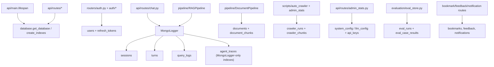

# Module: `models`

Source-verified: 2026-06-24 from `models/__init__.py`, `models/database.py`, `models/mongo_logger.py`, `models/user.py`, `models/document.py`, `models/document_chunk.py`, `models/crawler.py`, `models/exam_schedule.py`, `models/system_config.py`.

## Purpose

`models` owns MongoDB access, durable chat logging, user/document/crawler Pydantic models, and admin upload + crawler review document shapes. It is the persistence boundary for FastAPI routes and pipeline logging.

Two MongoDB access styles co-exist:

- **Async Motor** (`database.py`) — for FastAPI dependency injection in routes and `system_config.py` helpers.
- **Sync PyMongo** (`mongo_logger.py`) — for sessions, turns, query_logs, agent_traces, and eval index bootstrap. Called from pipeline/chat code that runs in a thread pool.

## File Map

```text
models/
  __init__.py        Empty package marker (one comment line).
  database.py        Motor singleton, get_database() dependency, collection name constants, create_indexes().
  mongo_logger.py    Sync MongoLogger for sessions/turns/query_logs/agent_traces (+ eval index bootstrap).
  user.py            PyObjectId helper and UserDocument Pydantic model.
  document.py        DocumentRecord and embedded AuditEntry for the admin upload pipeline.
  document_chunk.py  DocumentChunk review/indexing model.
  crawler.py         CrawlerRun and CrawlerChunk staged-review models + status constants.
  exam_schedule.py   ExamScheduleRecord parsed row model for tabular ingestion.
  system_config.py   Single-document Mongo LLM config overrides and managed API key registry helpers.
```

## Mongo Collections

Collection name constants are all defined in `database.py`. Main collections:

| Collection | Owner | Purpose |
| --- | --- | --- |
| `users` | `auth/*`, `routers/auth.py` | Accounts, role, profile, HUST metadata. |
| `refresh_tokens` | `auth/refresh_tokens.py`, `routers/auth.py` | Hashed refresh-token sessions, rotation families, TTL expiry. |
| `sessions` | `MongoLogger`, `api/routes/session.py` | Chat session metadata. |
| `turns` | `MongoLogger` | User/assistant turns with sources/routing/debug metadata. |
| `query_logs` | `MongoLogger` | Flat analytics log per turn. |
| `agent_traces` | `MongoLogger` | LangGraph/agent traces (indexes created by `MongoLogger._ensure_indexes` only, **not** by `database.create_indexes`). |
| `eval_runs` | `evaluation/eval_store.py` | Evaluation run summaries. Indexed by both `database.create_indexes` and `MongoLogger._ensure_indexes`. |
| `eval_case_results` | `evaluation/eval_store.py` | Per-case evaluation results. Indexed by both. |
| `documents` | `pipeline/document_pipeline.py`, `api/routes/upload.py` | Admin-uploaded document records. |
| `document_chunks` | `pipeline/document_pipeline.py`, `api/routes/upload.py` | Reviewable chunks before/after indexing. |
| `bookmarks` | `api/routes/bookmark.py` | Saved answer snapshots. |
| `bookmark_folders` | `api/routes/bookmark.py` | User bookmark folders. |
| `feedback` | `api/routes/feedback.py` | Answer ratings/comments. |
| `notifications` | `api/routes/notification.py` | User notification inbox. |
| `notification_subscriptions` | `api/routes/notification.py` | Expo push token/topic subscriptions. |
| `system_config` | `models/system_config.py`, `api/routes/admin_stats.py` | Fixed `_id=llm_config` doc: LLM overrides + `api_keys` registry. |
| `crawler_runs` | `models/crawler.py`, `scripts/auto_crawler.py`, `api/routes/admin_stats.py` | Staged crawler run review metadata. |
| `crawler_chunks` | `models/crawler.py`, `scripts/auto_crawler.py`, `api/routes/admin_stats.py` | Reviewable/editable crawler chunk content + per-chunk index status. |
| `exam_schedules` | `api/routes/exam_schedules.py` | Tabular rows from uploaded PDF/Excel exam schedules. |

## `database.py`

Responsibilities:

- Reads `MONGODB_URI` (default `mongodb://localhost:27017`) and `MONGODB_DATABASE` (default `rag_chatbot`) from environment via `_get_settings()`.
- Maintains a module-level lazily-created `AsyncIOMotorClient` singleton (`get_motor_client()`); `close_motor_client()` releases it on shutdown.
- Provides `get_database() -> AsyncGenerator[AsyncIOMotorDatabase, None]` as a FastAPI `Depends` target.
- Exports 18 collection-name string constants (see table above).
- `create_indexes()` builds all indexes at startup. Uses a `safe_create` inner helper that catches `OperationFailure` code 85 (IndexOptionsConflict) with a warning instead of aborting. Uses `drop_if_exists` to remove old non-sparse indexes before recreating sparse ones.

Indexes created by `create_indexes()` (notable ones):

| Collection | Index(es) |
| --- | --- |
| `users` | sparse-unique `email_unique`, `microsoft_id_unique`, `username_unique` (old non-sparse versions dropped first) |
| `sessions` | `user_id_asc`, `updated_at_desc` |
| `turns` | `session_id_asc` |
| `query_logs` | `session_id_asc` |
| `eval_runs` | compound `(eval_suite ASC, finished_at DESC)`, `status_asc` |
| `eval_case_results` | `run_id_asc`, compound `(eval_suite, passed)`, `case_id_asc` |
| `documents` | `uploaded_by_asc`, `status_asc`, `collection_asc` |
| `document_chunks` | `document_id_asc`, compound `(document_id, chunk_index)` |
| `bookmarks` | `(user_id, folder)`, `(user_id, created_at DESC)`, unique `(user_id, session_id, turn_id)`, text `(question, answer_preview)` |
| `bookmark_folders` | unique `(user_id, name)` |
| `feedback` | `created_at_desc`, `rating_asc`, `category_asc`, unique `(user_id, session_id, turn_id)` |
| `notifications` | `(user_id, read, created_at DESC)` |
| `notification_subscriptions` | unique `(user_id, expo_push_token)`, `topics_asc` |
| `refresh_tokens` | unique `token_hash_unique`, `user_id_asc`, `family_id_asc`, TTL `expires_at_ttl` (`expireAfterSeconds=0`) |
| `crawler_runs` | unique `run_id_unique`, compound `(status, created_at DESC)` |
| `crawler_chunks` | unique `(run_id, chunk_id)`, `(run_id, chunk_index)` |

**Note:** `database.create_indexes()` does NOT create indexes on `agent_traces`. Those are handled exclusively by `MongoLogger._ensure_indexes()`.

## `mongo_logger.py`

Sync `MongoLogger(uri, database, history_cache=None)` backed by a dedicated `MongoClient`. Calls `_ensure_indexes()` on construction.

### `_ensure_indexes()`

Creates (non-conflicting, no `safe_create` wrapper — raw `create_index`):

- `sessions`: unique `session_id`; compound `(user_id ASC, updated_at DESC)`
- `turns`: unique compound `(session_id ASC, turn_id ASC)`; compound `(session_id ASC, timestamp ASC)`
- `query_logs`: `session_id`, `timestamp`, `user_id`
- `agent_traces`: `session_id`, `created_at DESC`, `tool_names_sequence`
- `eval_runs`: compound `(eval_suite ASC, finished_at DESC)`, `status`
- `eval_case_results`: `run_id`, compound `(eval_suite, passed)`, `case_id`

### Session API

```python
new_session(user_id: Optional[str] = None) -> str              # returns new session_id (UUID4)
get_session(session_id: str) -> Optional[Dict[str, Any]]       # returns doc without _id, or None
list_sessions(user_id: str, limit: int = 50) -> List[Dict]     # newest-first
delete_session(session_id: str) -> bool                        # cascades turns/query_logs/agent_traces + history cache
update_session_title(session_id: str, title: str) -> bool
```

Session document shape: `session_id`, `user_id`, `title` (None until first turn), `created_at`, `updated_at`, `turn_count`.

### Turn API

```python
log_turn(
    session_id: str,
    question: str,
    result: Dict[str, Any],
    *,
    reflected_question: Optional[str] = None,
    latency_ms: int = 0,
    timings_ms: Optional[Dict[str, float]] = None,
) -> int  # 1-based turn_id
```

`log_turn()` atomically increments `turn_count` via `find_one_and_update`, auto-titles the session from the first question (truncated to 80 chars + `…`). It writes both a turn document and a flat `query_log` entry. Session title is set only on `turn_id == 1`.

**Always-present turn doc fields:** `session_id`, `turn_id`, `question`, `answer`, `intent` (default `"rag"`), `reflected_question`, `num_sources`, `model_name`, `latency_ms`, `timestamp`.

**Conditionally-present turn doc fields** (included only when non-empty/non-None in `result`):

- Retrieval: `sources` (list of `{rank, content, score, metadata}`), `collection_scores`, `target_collections`
- Routing: `mode`, `route`, `iterations`, `tools_used`, `tool_calls`, `routing_probabilities`, `applied_filters`, `collection_results`
- Errors: `agent_error`, `error`, `agent_trace`
- Debug (via `_copy_debug_fields`): `context_trace`, `rerank_trace`, `answer_quality_gate`, `fusion_weights`, `answer_status`
- Prompts: `llm_prompt_hash` + `llm_prompt_preview` (SHA-256 + first 4000 chars), `reflection_prompt_hash` + `reflection_prompt_preview`
- Timing: `timings_ms`

Query log entries mirror the same scalar fields but omit `sources` / `tool_calls` / `agent_trace`.

Also syncs `history_cache` via `add_message(session_id, role, content)` after insert.

```python
get_turns(session_id: str, limit: int = 100) -> List[Dict]   # oldest-first
get_history(session_id: str, max_turns: int = 10) -> List[Dict[str, str]]
# returns [{"role": "user"|"assistant", "content": ...}]
# checks history_cache first; falls back to aggregation pipeline; warms cache afterward
```

### Agent Trace API

```python
log_agent_trace(session_id: str, trace_dict: Dict[str, Any]) -> None  # best-effort, swallows DB errors
get_agent_stats(limit: int = 100) -> Dict[str, Any]
# returns: total_traces, avg_iterations, tool_frequency (from tool_names_sequence), error_rate
```

## `user.py`

### `PyObjectId`

`str` subclass that validates and serialises MongoDB `ObjectId` values. Dual-mode: Pydantic v1 `__get_validators__` shim + Pydantic v2 `__get_pydantic_core_schema__` (uses `core_schema.no_info_plain_validator_function`). Accepts `ObjectId` instances or valid 24-char hex strings; raises `ValueError` otherwise.

### `UserDocument`

Pydantic v2 model (`populate_by_name=True`, `arbitrary_types_allowed=True`, `json_encoders={ObjectId: str}`). Maps `id` → `_id`.

**Required fields (no default, no Optional):** `full_name: str`, `student_id: str`, `cohort: str`.

**Optional identity:** `id` (alias `_id`), `microsoft_id`, `username`, `password_hash`, `email` — all `Optional[str]` defaulting `None`.

**Profile:** `major` (default `"CNTT Việt Nhật"`), `major_code` (default `""`), `avatar_url` (`Optional[str]`).

**Role/status:** `role` (default `"student"`, description `"student | admin"`), `is_profile_complete` (default `False`), `is_active` (default `True`).

**Timestamps:** `created_at`, `updated_at`, `last_login_at` — all `datetime`, UTC, default via `lambda: datetime.now(timezone.utc)`.

**Gotcha:** `full_name`, `student_id`, `cohort` are required fields with no default. Constructing `UserDocument` without them raises a `ValidationError`.

## `document.py`

### `AuditEntry`

Embedded Pydantic model in `DocumentRecord.audit_log`. Fields: `action: str`, `user_id: str`, `timestamp: datetime` (UTC default), `details: Optional[dict]`.

Common `action` values (from docstring): `upload`, `convert`, `edit_markdown`, `approve_markdown`, and similar pipeline step names.

### `DocumentRecord`

Tracks admin upload lifecycle in the `documents` collection. `model_validate` via `from_mongo(doc)` classmethod.

Pipeline status progression:
```
uploaded → converting → converted → cleaning → cleaned
         → chunking → chunked → embedding → indexed   (or failed)
```

Key fields:

| Field | Type | Notes |
| --- | --- | --- |
| `id` / `_id` | `Optional[PyObjectId]` | MongoDB ObjectId |
| `filename` | `str` | required |
| `file_size` | `int` | required |
| `file_path` | `str` | relative path in `uploads/` |
| `collection` | `str` | `ctdt \| quydinh \| kehoach \| stsv` |
| `status` | `str` | default `"uploaded"` |
| `uploaded_by` | `PyObjectId` | required |
| `uploaded_at` | `datetime` | UTC default |
| `markdown_path` | `Optional[str]` | artifact path |
| `cleaned_path` | `Optional[str]` | artifact path |
| `chunk_count` | `Optional[int]` | |
| `chunk_ids` | `Optional[List[str]]` | |
| `chunking_strategy` | `Optional[str]` | |
| `converter` | `Optional[str]` | `pymupdf4llm \| docling` |
| `markdown_reviewed` | `bool` | default `False` |
| `cleaned_reviewed` | `bool` | default `False` |
| `chunks_reviewed` | `bool` | default `False` |
| `metadata_overrides` | `dict` | default `{}` |
| `error_message` | `Optional[str]` | |
| `converted_at`, `cleaned_at`, `chunked_at`, `indexed_at` | `Optional[datetime]` | step timestamps |
| `audit_log` | `List[AuditEntry]` | default `[]` |

## `document_chunk.py`

### `DocumentChunk`

Single chunk in the `document_chunks` collection. Fields: `id` / `_id` (`Optional[PyObjectId]`), `document_id: PyObjectId` (FK to `documents`), `chunk_index: int`, `content: str`, `metadata: dict` (default `{}`). `from_mongo(doc)` classmethod. **Embedding vectors are NOT stored here** — they live in Qdrant/ES only.

## `crawler.py`

### Status constants

```python
CRAWLER_STATUS_PENDING_REVIEW = "pending_review"
CRAWLER_STATUS_INDEXING       = "indexing"
CRAWLER_STATUS_INDEXED        = "indexed"
CRAWLER_STATUS_INDEX_FAILED   = "index_failed"

CRAWLER_EDITABLE_STATUSES   = {"pending_review", "index_failed"}
CRAWLER_INDEXABLE_STATUSES  = {"pending_review", "index_failed"}
```

### `CrawlerRun`

Run-level metadata in `crawler_runs`. Fields: `id`/`_id`, `run_id: str`, `pipeline: str`, `collection: str`, `status` (default `"pending_review"`), `source_label: str`, `output_file: str`, `chunks_file: str`, counters `new_articles`, `new_chunks`, `indexed`, `expired_removed` (all `int`, default `0`), `created_at`, `updated_at`, `indexed_at: Optional[datetime]`, `error_message: Optional[str]`, `summary: dict`. `from_mongo(doc)` classmethod.

### `CrawlerChunk`

Per-chunk content in `crawler_chunks`. Fields: `id`/`_id`, `run_id: str`, `chunk_id: str`, `chunk_index: int`, `content: str`, `original_content: str`, `metadata: dict` (default `{}`), `edited: bool` (default `False`), `index_status: str` (default **`"pending"`** — distinct from run-level `"pending_review"`), `created_at`, `updated_at`. `from_mongo(doc)` classmethod.

## `exam_schedule.py`

### `ExamScheduleRecord`

One parsed row of a HUST exam schedule, stored in `exam_schedules` collection and Elasticsearch. Pure data + transform model without I/O.
**Fields**: `source_file`, `source_doc_id`, `row_index`, `subject_code`, `subject_name`, `mgmt_class_code`, `exam_class_code`, `note`, `exam_type` (`"giua_ky" | "cuoi_ky" | None`), `group`, `cohort`, `exam_week`, `weekday`, `exam_date`, `exam_date_str`, `exam_session`, `start_time`, `exam_room`, `student_count`, `exam_batch`, `raw`, `uploaded_by`, `created_at`, `updated_at`.
**Methods**: `from_parsed_row(fields, ...)`, `to_mongo()`, `to_es()`.

## `system_config.py`

Async helpers over the single `system_config` collection document with `_id = "llm_config"`.

### Constants

- `LLM_CONFIG_DOCUMENT_ID = "llm_config"` — the fixed document `_id`.
- `API_KEYS_FIELD = "api_keys"` — list field in that document.
- `API_KEY_SETTING_FIELDS` — maps supported providers to `Settings` attribute names:
  - `"deepseek"` → `"deepseek_api_key"`
  - `"google"` → `"google_api_key"`
  - `"tavily"` → `"tavily_api_key"`
- `PERSISTABLE_LLM_FIELDS` — frozenset of 9 safe-to-persist LLM override fields:
  `llm_provider`, `chat_model`, `chat_temperature`, `chat_max_tokens`, `agent_model`,
  `agent_synthesis_provider`, `agent_synthesis_model`, `reflection_model`, `reflection_provider`.

### LLM config helpers

```python
filter_llm_config_updates(updates: Mapping[str, Any]) -> dict[str, Any]
# Drops fields not in PERSISTABLE_LLM_FIELDS, None values, and empty strings.

async get_llm_config(db: AsyncIOMotorDatabase) -> dict[str, Any] | None
# Reads the llm_config doc; auto-migrates legacy per-field API keys into the registry on read.

async upsert_llm_config(db: AsyncIOMotorDatabase, updates: Mapping[str, Any]) -> dict[str, Any]
# Persists filtered LLM overrides; raises ValueError if nothing to persist.

def merge_llm_config_into_settings(settings: Any, db_config: Mapping[str, Any] | None) -> list[str]
# Applies non-empty LLM overrides onto a Settings object; also applies active API key secrets
# from the registry (and falls back to legacy per-field secrets if no registry records exist).
# Returns list of applied field names.
```

### API key registry

Each key record shape: `id` (UUID4 str), `provider`, `name`, `secret`, `status` (`"active"` | `"inactive"`), `created_at`, `updated_at`, `activated_at`.

```python
async list_api_keys(db) -> list[dict]         # secret-free public records, sorted active-first then newest
async create_api_key(db, provider, name, secret) -> dict  # creates + activates; deactivates prior active key for same provider
async activate_api_key(db, key_id) -> dict    # sets one key active, marks siblings inactive
async get_api_key_record(db, key_id) -> dict | None  # internal record INCLUDING secret (for runtime use)
def public_api_key_record(record) -> dict     # strips secret, adds fingerprint
def fingerprint_api_key(secret: str) -> str  # first4 + "***" + last4; "***" for short secrets
```

**`ApiKeyRegistryError(ValueError)`** — raised for unsupported provider, missing name/secret, duplicate key, or key not found.

**Legacy migration:** `_import_legacy_api_keys` promotes per-field secrets (`deepseek_api_key`, etc.) from the `llm_config` document into the `api_keys` list on first read if no registry record exists for that provider. Runs automatically inside `get_llm_config`.

## Module Flow



External boundaries:

- Async route-level reads/writes use `database.py`; sync durable chat/session logging uses `MongoLogger`.
- `models` define persistence shape but do not own chat routing, retrieval, generation, or frontend normalization.
- Schema-facing changes must update `schemas`, `api` routes, web/mobile/shared TypeScript types, and tests.

## Maintenance Notes

- **`create_indexes` coverage gap:** `agent_traces` indexes are only created by `MongoLogger._ensure_indexes()`. If `MongoLogger` is never instantiated (e.g., in a test-only Motor environment), those indexes won't exist.
- **Eval index duplication:** `eval_runs` and `eval_case_results` indexes are created in both `database.create_indexes()` and `MongoLogger._ensure_indexes()`. Keep them consistent.
- **`PERSISTABLE_LLM_FIELDS` drift risk:** the set of 9 fields must stay aligned with the admin LLM config form in `api/routes/admin_stats.py` and any frontend `SystemTab`.
- Refresh token TTL index uses `expireAfterSeconds=0` — MongoDB's background TTL thread deletes documents only after `expires_at` is in the past; there can be up to a 60-second delay.
- API key secrets and refresh token hashes are sensitive. `public_api_key_record` and `fingerprint_api_key` must be the only exposure paths in admin responses.
- `UserDocument.full_name`, `student_id`, `cohort` are required fields — constructing the model without them raises `ValidationError`. Keep this in mind when building test fixtures.
- Do not use `MongoLogger` from async FastAPI routes — it is sync PyMongo.
- For chat/session contract changes, update `cache/session_store.py`, `api/routes/session.py`, and shared frontend/mobile types.
- For document status changes, update `schemas/document.py`, `api/routes/upload.py`, and `pipeline/document_pipeline.py`.

## Useful Checks

```bash
python -m py_compile models/database.py models/mongo_logger.py models/user.py models/document.py models/document_chunk.py models/crawler.py models/system_config.py

python -m pytest tests/test_mongo.py tests/test_week4_mongo_logger.py tests/test_storage.py tests/test_crawler_review.py tests/test_admin_llm_config.py -q -m "not integration"
```
