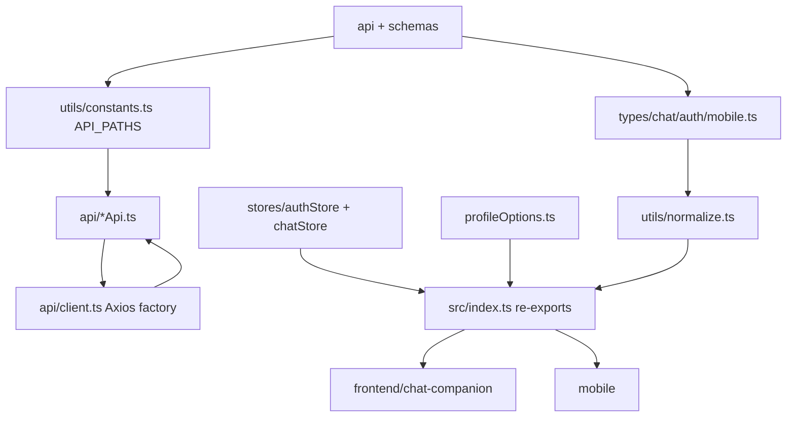

# Module: `packages`

Source-verified: 2026-06-12 from `packages/shared/package.json`, `packages/shared/src/index.ts`, `packages/shared/src/api/**`, `packages/shared/src/types/**`, `packages/shared/src/stores/**`, `packages/shared/src/utils/**`, `packages/shared/src/profileOptions.ts`.

## Purpose

`packages` contains workspace packages shared by the web (`frontend/chat-companion`) and mobile (`mobile`) clients. The only package is `@rag/shared`, a platform-agnostic TypeScript library of types, Axios API helpers, Zustand store factories, normalizers, and profile option lists. It contains no UI; apps own base URLs, token storage, and SSE streaming.

## Workspace Contract

Root `package.json` workspaces:

```json
["packages/*", "frontend/chat-companion", "mobile"]
```

`@rag/shared` (`name: "@rag/shared"`, `main`/`types` point at `src/index.ts`, no build step) is consumed by `mobile` and available to the web app. Dependencies: `axios ^1.13.2`, `zustand ^5.0.0`, `zod ^3.25.0`.

## File Map

```text
packages/shared/
  package.json           Package manifest — name, version, main/types entry, typecheck script.
  tsconfig.json          TypeScript config for the package.
  src/
    index.ts             Public barrel — re-exports all types, API fns, utils, stores, profile options.
    profileOptions.ts    MAJOR_OPTIONS (68 HUST majors), COHORT_OPTIONS (K62–K70), findMajorOptionByCode(), MajorOption type.
    api/
      index.ts           API barrel re-exporting all *Api helpers + createApiClient/ApiClientConfig/ResolvedChatIdentity.
      client.ts          createApiClient(): Axios factory. Bearer token injection + single 401 refresh retry. Exports ApiClientConfig.
      chatApi.ts         sendMessageV3 (POST /chat/v3, explicit mode), sendMessage (convenience wrapper, mode='auto'),
                         checkHealth (GET /health), resolveChatIdentity(). No SSE (per-platform).
      authApi.ts         registerUser, loginUser, getMe (/auth/register, /auth/login, /auth/me); applies normalizeUser.
      sessionApi.ts      getSessions, getMySessions, getSession, createSession (/sessions, /sessions/me, /session/:id, POST /session).
      bookmarkApi.ts     Bookmark + folder CRUD (/bookmarks, /bookmark-folders) incl. getBookmarkByTurn.
      feedbackApi.ts     submitFeedback, getFeedback, getFeedbackStats, listAllFeedback (/feedback, /feedback/stats, /feedback/list).
      lookupApi.ts       lookupCTDT, lookupRegulations, lookupCalendar, lookupCompare, getSuggestedQuestions.
      notificationApi.ts listNotifications, getUnreadCount, markNotificationRead, markAllNotificationsRead,
                         deleteNotification, subscribeNotifications, unsubscribeNotifications.
    types/
      index.ts           Type barrel: re-exports all chat/auth/mobile types; also exports normalizeUser() as a value.
      chat.ts            Message, UserContext, ChatRequest/Response, ChatV3Response, Session, Turn,
                         RetrievedDocument (w/ hybrid/rerank/vector/keyword scores), CollectionScore,
                         FilterInfo, CollectionResult, AgentToolCall, AgentTracePayload.
      auth.ts            RegisterRequest, UserPublic, LoginRequest, TokenResponse; normalizeUser() (canonical id from _id/id).
      mobile.ts          Bookmark, BookmarkFolder, BookmarkCreateRequest, BookmarkUpdateRequest,
                         BookmarkFolderRenameRequest, FeedbackCreateRequest, FeedbackResponse, FeedbackStats,
                         LookupDocument, SuggestedQuestion, NotificationItem, NotificationSubscribeRequest,
                         NotificationUnsubscribeRequest, NotificationUnreadCount.
    stores/
      index.ts           Store barrel re-exporting both factories + their state/store types.
      authStore.ts       createAuthStore(): vanilla Zustand store.
                         State: isAuthenticated, accessToken, refreshToken, user.
                         Actions: setAuth, clearAuth, setUser.
      chatStore.ts       createChatStore(): vanilla Zustand store.
                         State: messages, activeSessionId, chatPhase (idle/thinking/streaming).
                         Actions: addMessage, updateMessage, appendToMessage, setMessages,
                                  setActiveSessionId, setChatPhase, reset.
    utils/
      index.ts           Utils barrel re-exporting sanitize, normalize, constants.
      constants.ts       API_PATHS map + CLARIFY_SENTINEL ('[CLARIFY]').
      normalize.ts       normalizeV3Response, mapSourceToRetrieved, normalizeRetrievedDocuments.
      sanitize.ts        cleanText, sanitizeUserContext.
```

## API Path Contract

`utils/constants.ts` defines the `API_PATHS` map consumed by all API helpers:

| Key | Path |
|-----|------|
| `CHAT` | `/chat` |
| `CHAT_V3` | `/chat/v3` |
| `CHAT_STREAM` | `/chat/stream` |
| `HEALTH` | `/health` |
| `AUTH_LOGIN` | `/auth/login` |
| `AUTH_REGISTER` | `/auth/register` |
| `AUTH_ME` | `/auth/me` |
| `AUTH_REFRESH` | `/auth/refresh` |
| `SESSIONS` | `/sessions` |
| `SESSIONS_ME` | `/sessions/me` |
| `SESSION` | `/session` |
| `BOOKMARKS` | `/bookmarks` |
| `BOOKMARK_FOLDERS` | `/bookmark-folders` |
| `FEEDBACK` | `/feedback` |
| `LOOKUP_CTDT` | `/lookup/ctdt` |
| `LOOKUP_REGULATIONS` | `/lookup/regulations` |
| `LOOKUP_CALENDAR` | `/lookup/calendar` |
| `LOOKUP_COMPARE` | `/lookup/compare` |
| `CHAT_SUGGEST` | `/chat/suggest` |
| `NOTIFICATIONS` | `/notifications` |
| `NOTIFICATION_SUBSCRIBE` | `/notifications/subscribe` |

Sub-paths such as `/feedback/stats`, `/feedback/list`, `/notifications/unread-count`, `/notifications/{id}/read`, `/notifications/read-all`, and `/notifications/unsubscribe` are built inline from these constants in the API helpers. Keep these aligned with FastAPI routes.

## Normalization Contract

`utils/normalize.ts` converts raw backend `/chat/v3` (or stream metadata) payloads into a typed `ChatV3Response`. It tolerates `retrieved_documents` or `sources`, derives `model_name`/`intent` fallbacks from `mode`/`route`, and back-fills `tool_calls`/`tools_used` from `agent_trace` when absent at top level.

If backend chat metadata changes, update:

- `packages/shared/src/types/chat.ts`
- `packages/shared/src/utils/normalize.ts`
- web local `services/chatApi.ts` (if still present)
- mobile chat UI

## Module Flow



External module boundaries:

- `packages/shared` is client-side contract glue; it must not contain app-specific UI.
- Backend route/schema changes require synchronized updates here plus web/mobile local services where they still exist.
- Apps own token storage and base URLs; shared clients accept callbacks (`getToken`, `refreshAuth`, `onUnauthorized`). SSE streaming is implemented per platform (web `ReadableStream`, mobile `react-native-sse`).

## Maintenance Notes

- Avoid app-specific UI code in the shared package.
- `createApiClient` accepts `ApiClientConfig` with `baseURL` (required), `getToken`, `refreshAuth`, `onUnauthorized`, `withCredentials`, and `timeout` (default `120_000` ms). Refresh is attempted once per 401 before calling `onUnauthorized`.
- Stores use `zustand/vanilla` (`createStore`); each platform wraps them with React bindings (`useStore`).
- `UserPublic` normalization (`normalizeUser`) keeps canonical `id` from backend `_id`/`id`. Exported as a value from `types/index.ts` (not type-only).
- `TokenResponse` includes `expires_in`; `refresh_token` is optional — web receives refresh credentials via HttpOnly cookie, mobile receives JSON.
- `profileOptions.ts` is the canonical list of HUST majors/cohorts (68 majors, K62–K70); keep `MAJOR_OPTIONS` codes aligned with backend `major_code` values.
- `types/mobile.ts` holds all non-chat/auth types including full Bookmark CRUD request shapes — the name is a misnomer, these types are used by both web and mobile.
- `sendMessage` is a thin wrapper around `sendMessageV3` with `mode='auto'`; prefer `sendMessageV3` when callers need explicit mode control.

## Useful Checks

```bash
npm run typecheck --workspace=@rag/shared
```
